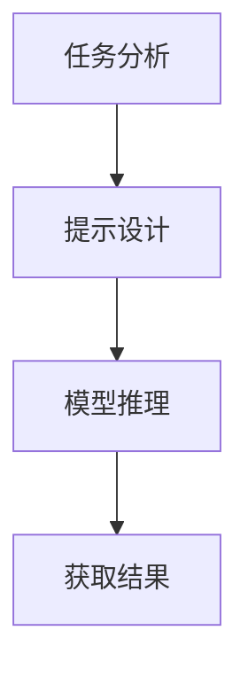

# 大语言模型原理与工程实践：思维链提示

## 1.背景介绍

大语言模型（Large Language Model, LLM）是近年来人工智能领域的一个重要突破。它们通过大量的文本数据进行训练，能够生成高质量的自然语言文本，完成各种复杂的语言任务，如翻译、问答、文本生成等。思维链提示（Chain-of-Thought Prompting, CoT）是一种新兴的技术，通过引导模型逐步推理，显著提升了模型在复杂任务中的表现。

## 2.核心概念与联系

### 2.1 大语言模型

大语言模型是基于深度学习的自然语言处理模型，通常采用Transformer架构。它们通过大量的文本数据进行预训练，学习语言的语法、语义和上下文关系。

### 2.2 思维链提示

思维链提示是一种引导模型逐步推理的方法。通过在提示中加入推理步骤，模型能够更好地理解复杂问题，并给出更准确的答案。

### 2.3 二者的联系

思维链提示可以看作是对大语言模型的一种增强技术。通过在提示中加入推理步骤，能够显著提升大语言模型在复杂任务中的表现。

## 3.核心算法原理具体操作步骤

### 3.1 大语言模型的训练

大语言模型的训练通常分为两个阶段：预训练和微调。预训练阶段，模型通过大量的无监督文本数据进行训练，学习语言的基本结构和语义。微调阶段，模型通过少量的有监督数据进行训练，适应特定任务。

### 3.2 思维链提示的实现

思维链提示的实现主要包括以下步骤：

1. **任务分析**：分析任务的复杂性，确定需要的推理步骤。
2. **提示设计**：设计包含推理步骤的提示，引导模型逐步推理。
3. **模型推理**：将设计好的提示输入模型，获取模型的推理结果。

以下是一个简单的Mermaid流程图，展示了思维链提示的实现过程：



## 4.数学模型和公式详细讲解举例说明

### 4.1 语言模型的数学基础

语言模型的核心是概率论。给定一个词序列 $w_1, w_2, ..., w_n$，语言模型的目标是计算该序列的概率 $P(w_1, w_2, ..., w_n)$。根据链式法则，这个概率可以分解为：

$$
P(w_1, w_2, ..., w_n) = P(w_1) \cdot P(w_2|w_1) \cdot P(w_3|w_1, w_2) \cdot ... \cdot P(w_n|w_1, w_2, ..., w_{n-1})
$$

### 4.2 Transformer模型

Transformer模型通过自注意力机制（Self-Attention）来捕捉词与词之间的关系。自注意力机制的核心公式为：

$$
\text{Attention}(Q, K, V) = \text{softmax}\left(\frac{QK^T}{\sqrt{d_k}}\right)V
$$

其中，$Q$、$K$、$V$分别表示查询（Query）、键（Key）和值（Value）矩阵，$d_k$是键的维度。

### 4.3 思维链提示的数学描述

思维链提示可以看作是对输入序列的扩展。假设原始输入为 $X$，思维链提示后的输入为 $X' = [X, S_1, S_2, ..., S_m]$，其中 $S_i$ 表示第 $i$ 个推理步骤。模型的目标是通过 $X'$ 生成更准确的输出 $Y$。

## 5.项目实践：代码实例和详细解释说明

### 5.1 环境准备

首先，我们需要安装必要的库：

```bash
pip install transformers torch
```

### 5.2 代码实例

以下是一个简单的代码实例，展示了如何使用思维链提示来提升大语言模型的推理能力：

```python
from transformers import GPT2LMHeadModel, GPT2Tokenizer

# 加载预训练模型和分词器
model_name = 'gpt2'
model = GPT2LMHeadModel.from_pretrained(model_name)
tokenizer = GPT2Tokenizer.from_pretrained(model_name)

# 定义思维链提示
prompt = "问题：2 + 2 等于多少？\n思维链：首先，我们需要将2和2相加。2加2等于4。\n答案："

# 编码输入
inputs = tokenizer(prompt, return_tensors='pt')

# 模型推理
outputs = model.generate(inputs['input_ids'], max_length=50)

# 解码输出
result = tokenizer.decode(outputs[0], skip_special_tokens=True)
print(result)
```

### 5.3 详细解释

1. **加载预训练模型和分词器**：我们使用GPT-2模型和对应的分词器。
2. **定义思维链提示**：在提示中加入推理步骤，引导模型逐步推理。
3. **编码输入**：将提示编码为模型可接受的格式。
4. **模型推理**：通过模型生成输出。
5. **解码输出**：将模型输出解码为可读文本。

## 6.实际应用场景

### 6.1 教育领域

在教育领域，思维链提示可以用于自动生成详细的解题步骤，帮助学生更好地理解复杂问题。

### 6.2 医疗领域

在医疗领域，思维链提示可以用于生成详细的诊断步骤，辅助医生进行诊断。

### 6.3 法律领域

在法律领域，思维链提示可以用于生成详细的法律推理过程，辅助律师进行案件分析。

## 7.工具和资源推荐

### 7.1 工具

1. **Transformers库**：一个强大的自然语言处理库，支持多种预训练模型。
2. **PyTorch**：一个流行的深度学习框架，支持动态计算图。

### 7.2 资源

1. **OpenAI GPT-3**：一个强大的大语言模型，支持多种语言任务。
2. **Hugging Face Model Hub**：一个预训练模型的集合，包含多种大语言模型。

## 8.总结：未来发展趋势与挑战

### 8.1 未来发展趋势

1. **更大规模的模型**：随着计算能力的提升，未来的大语言模型将会更加庞大，能够处理更复杂的任务。
2. **多模态模型**：未来的模型将不仅限于文本，还能够处理图像、音频等多种模态的数据。

### 8.2 挑战

1. **计算资源**：训练和部署大语言模型需要大量的计算资源，这是一个重要的挑战。
2. **数据隐私**：大语言模型需要大量的数据进行训练，如何保护数据隐私是一个重要的问题。

## 9.附录：常见问题与解答

### 9.1 什么是大语言模型？

大语言模型是基于深度学习的自然语言处理模型，能够生成高质量的自然语言文本，完成各种复杂的语言任务。

### 9.2 什么是思维链提示？

思维链提示是一种引导模型逐步推理的方法，通过在提示中加入推理步骤，显著提升了模型在复杂任务中的表现。

### 9.3 如何实现思维链提示？

实现思维链提示的主要步骤包括任务分析、提示设计和模型推理。

### 9.4 思维链提示的应用场景有哪些？

思维链提示在教育、医疗、法律等多个领域都有广泛的应用。

### 9.5 未来大语言模型的发展趋势是什么？

未来大语言模型将会更加庞大，能够处理更复杂的任务，并且将支持多模态数据。

---

作者：禅与计算机程序设计艺术 / Zen and the Art of Computer Programming