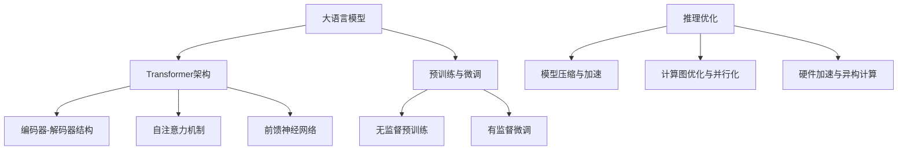

# 大语言模型原理基础与前沿 推理优化

## 1.背景介绍
### 1.1 大语言模型的发展历程
#### 1.1.1 早期的语言模型
#### 1.1.2 神经网络语言模型的崛起
#### 1.1.3 Transformer的革命性突破

### 1.2 大语言模型的应用现状
#### 1.2.1 自然语言处理领域的广泛应用
#### 1.2.2 跨领域的拓展与创新
#### 1.2.3 大语言模型的局限性与挑战

### 1.3 推理优化的重要意义
#### 1.3.1 提升模型推理效率的必要性
#### 1.3.2 降低计算资源消耗的迫切需求
#### 1.3.3 推理优化在实际应用中的价值

## 2.核心概念与联系
### 2.1 大语言模型的基本架构
#### 2.1.1 Transformer的编码器-解码器结构
#### 2.1.2 自注意力机制与前馈神经网络
#### 2.1.3 位置编码与残差连接

### 2.2 预训练与微调
#### 2.2.1 无监督预训练的思想与方法
#### 2.2.2 有监督微调的流程与技巧
#### 2.2.3 预训练与微调的联系与区别

### 2.3 推理优化的核心思路
#### 2.3.1 模型压缩与加速
#### 2.3.2 计算图优化与并行化
#### 2.3.3 硬件加速与异构计算



## 3.核心算法原理具体操作步骤
### 3.1 Transformer的编码器
#### 3.1.1 输入嵌入与位置编码
#### 3.1.2 多头自注意力机制
#### 3.1.3 前馈神经网络与残差连接

### 3.2 Transformer的解码器
#### 3.2.1 自回归生成与因果掩码
#### 3.2.2 编码器-解码器注意力机制
#### 3.2.3 解码器的自注意力与前馈神经网络

### 3.3 预训练的具体实现
#### 3.3.1 Masked Language Model(MLM)
#### 3.3.2 Next Sentence Prediction(NSP)
#### 3.3.3 预训练数据的准备与处理

### 3.4 微调的具体实现
#### 3.4.1 下游任务的数据准备
#### 3.4.2 微调的超参数设置
#### 3.4.3 微调的训练过程与评估

## 4.数学模型和公式详细讲解举例说明
### 4.1 自注意力机制的数学表示
#### 4.1.1 查询、键、值的计算
$$Attention(Q,K,V) = softmax(\frac{QK^T}{\sqrt{d_k}})V$$
其中，$Q$、$K$、$V$ 分别表示查询、键、值，$d_k$ 表示键的维度。

#### 4.1.2 多头自注意力的并行计算
$$MultiHead(Q,K,V) = Concat(head_1,...,head_h)W^O$$
$$head_i = Attention(QW_i^Q, KW_i^K, VW_i^V)$$
其中，$W_i^Q$、$W_i^K$、$W_i^V$ 表示第 $i$ 个头的权重矩阵，$W^O$ 表示输出的线性变换矩阵。

### 4.2 前馈神经网络的数学表示
$$FFN(x) = max(0, xW_1 + b_1)W_2 + b_2$$
其中，$W_1$、$W_2$ 表示权重矩阵，$b_1$、$b_2$ 表示偏置项。

### 4.3 残差连接与层归一化的数学表示
$$x + Sublayer(LayerNorm(x))$$
其中，$Sublayer$ 表示子层（如自注意力层或前馈神经网络层），$LayerNorm$ 表示层归一化操作。

## 5.项目实践：代码实例和详细解释说明
### 5.1 使用PyTorch实现Transformer
#### 5.1.1 编码器的代码实现
```python
class TransformerEncoder(nn.Module):
    def __init__(self, num_layers, d_model, num_heads, d_ff, dropout):
        super(TransformerEncoder, self).__init__()
        self.layers = nn.ModuleList([EncoderLayer(d_model, num_heads, d_ff, dropout) for _ in range(num_layers)])
        self.norm = nn.LayerNorm(d_model)
        
    def forward(self, x, mask):
        for layer in self.layers:
            x = layer(x, mask)
        return self.norm(x)
```

#### 5.1.2 解码器的代码实现
```python
class TransformerDecoder(nn.Module):
    def __init__(self, num_layers, d_model, num_heads, d_ff, dropout):
        super(TransformerDecoder, self).__init__()
        self.layers = nn.ModuleList([DecoderLayer(d_model, num_heads, d_ff, dropout) for _ in range(num_layers)])
        self.norm = nn.LayerNorm(d_model)
        
    def forward(self, x, enc_output, src_mask, tgt_mask):
        for layer in self.layers:
            x = layer(x, enc_output, src_mask, tgt_mask)
        return self.norm(x)
```

### 5.2 使用TensorFlow实现BERT预训练
#### 5.2.1 MLM的代码实现
```python
def masked_lm_loss(logits, labels, mask):
    vocab_size = tf.shape(logits)[-1]
    logits = tf.boolean_mask(logits, mask)
    labels = tf.boolean_mask(labels, mask)
    one_hot_labels = tf.one_hot(labels, depth=vocab_size, dtype=tf.float32)
    log_probs = tf.nn.log_softmax(logits, axis=-1)
    loss = -tf.reduce_sum(log_probs * one_hot_labels, axis=-1)
    return tf.reduce_mean(loss)
```

#### 5.2.2 NSP的代码实现
```python
def next_sentence_prediction_loss(logits, labels):
    log_probs = tf.nn.log_softmax(logits, axis=-1)
    one_hot_labels = tf.one_hot(labels, depth=2, dtype=tf.float32)
    loss = -tf.reduce_sum(one_hot_labels * log_probs, axis=-1)
    return tf.reduce_mean(loss)
```

## 6.实际应用场景
### 6.1 机器翻译
#### 6.1.1 使用Transformer进行神经机器翻译
#### 6.1.2 预训练模型在机器翻译中的应用

### 6.2 文本摘要
#### 6.2.1 基于Transformer的抽取式摘要
#### 6.2.2 基于Transformer的生成式摘要

### 6.3 问答系统
#### 6.3.1 基于BERT的阅读理解式问答
#### 6.3.2 基于GPT的开放域问答

### 6.4 情感分析
#### 6.4.1 使用BERT进行情感分类
#### 6.4.2 使用预训练模型进行情感分析

## 7.工具和资源推荐
### 7.1 开源框架与库
#### 7.1.1 PyTorch与Transformers库
#### 7.1.2 TensorFlow与Keras库
#### 7.1.3 Hugging Face的Transformers库

### 7.2 预训练模型资源
#### 7.2.1 BERT及其变体
#### 7.2.2 GPT系列模型
#### 7.2.3 其他主流预训练模型

### 7.3 数据集资源
#### 7.3.1 自然语言处理常用数据集
#### 7.3.2 跨领域数据集
#### 7.3.3 多语言数据集

## 8.总结：未来发展趋势与挑战
### 8.1 大语言模型的发展趋势
#### 8.1.1 模型规模的持续增长
#### 8.1.2 多模态融合与跨领域迁移
#### 8.1.3 低资源语言与多语言建模

### 8.2 推理优化的研究方向
#### 8.2.1 模型压缩与知识蒸馏
#### 8.2.2 稀疏化与剪枝技术
#### 8.2.3 专用硬件与异构计算平台

### 8.3 大语言模型面临的挑战
#### 8.3.1 数据隐私与安全问题
#### 8.3.2 模型解释性与可控性
#### 8.3.3 公平性与伦理考量

## 9.附录：常见问题与解答
### 9.1 如何选择合适的预训练模型？
### 9.2 微调过程中出现过拟合怎么办？
### 9.3 推理优化的常见技巧有哪些？
### 9.4 如何处理低资源语言的建模问题？
### 9.5 大语言模型在垂直领域的应用有哪些注意事项？

作者：禅与计算机程序设计艺术 / Zen and the Art of Computer Programming