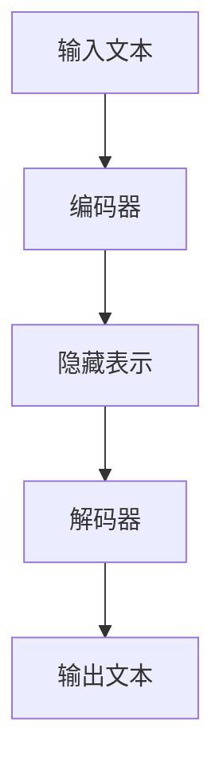

# 大语言模型原理基础与前沿 推理优化

## 1.背景介绍

大语言模型（Large Language Models, LLMs）是近年来人工智能领域的一个重要突破。它们通过训练在大量文本数据上，能够生成高质量的自然语言文本，完成翻译、问答、文本生成等任务。随着计算能力和数据量的增加，LLMs的性能不断提升，成为了自然语言处理（NLP）领域的核心技术之一。

然而，尽管LLMs在许多任务中表现出色，但它们的推理过程仍然存在一些挑战。推理优化是提高LLMs性能和效率的关键。本文将深入探讨大语言模型的原理基础与前沿推理优化技术，帮助读者理解并应用这些技术。

## 2.核心概念与联系

### 2.1 大语言模型的基本结构

大语言模型通常基于Transformer架构。Transformer由编码器和解码器组成，编码器负责将输入文本转换为隐藏表示，解码器则根据隐藏表示生成输出文本。以下是一个简化的Transformer架构图：



### 2.2 预训练与微调

大语言模型的训练过程分为两个阶段：预训练和微调。预训练阶段，模型在大规模无监督数据上进行训练，学习语言的基本结构和语义。微调阶段，模型在特定任务的数据上进行有监督训练，以适应具体任务的需求。

### 2.3 推理优化的必要性

推理优化旨在提高模型在推理过程中的效率和性能。推理过程是指模型在给定输入后生成输出的过程。优化推理过程可以减少计算资源的消耗，提高响应速度，并在某些情况下提高生成文本的质量。

## 3.核心算法原理具体操作步骤

### 3.1 注意力机制

注意力机制是Transformer架构的核心。它允许模型在生成每个词时关注输入文本的不同部分，从而捕捉到更丰富的上下文信息。注意力机制的计算步骤如下：

1. 计算查询（Query）、键（Key）和值（Value）向量。
2. 计算查询和键的点积，得到注意力得分。
3. 对注意力得分进行归一化，得到注意力权重。
4. 使用注意力权重对值向量进行加权求和，得到输出向量。

### 3.2 多头注意力

多头注意力机制通过并行计算多个注意力头，捕捉不同的上下文信息。每个注意力头独立计算注意力得分和输出向量，最后将所有头的输出拼接在一起。

### 3.3 残差连接与层归一化

残差连接和层归一化是Transformer中的两个重要技术。残差连接通过在每个子层后添加输入，缓解了深层网络中的梯度消失问题。层归一化则通过对每个子层的输出进行归一化，稳定了训练过程。

## 4.数学模型和公式详细讲解举例说明

### 4.1 注意力机制公式

注意力机制的核心公式如下：

$$
\text{Attention}(Q, K, V) = \text{softmax}\left(\frac{QK^T}{\sqrt{d_k}}\right)V
$$

其中，$Q$ 是查询向量，$K$ 是键向量，$V$ 是值向量，$d_k$ 是键向量的维度。

### 4.2 多头注意力公式

多头注意力的计算公式如下：

$$
\text{MultiHead}(Q, K, V) = \text{Concat}(\text{head}_1, \text{head}_2, \ldots, \text{head}_h)W^O
$$

其中，每个注意力头的计算公式为：

$$
\text{head}_i = \text{Attention}(QW_i^Q, KW_i^K, VW_i^V)
$$

$W_i^Q, W_i^K, W_i^V$ 是查询、键、值向量的线性变换矩阵，$W^O$ 是输出的线性变换矩阵。

### 4.3 残差连接与层归一化公式

残差连接和层归一化的公式如下：

$$
\text{Output} = \text{LayerNorm}(x + \text{SubLayer}(x))
$$

其中，$x$ 是输入向量，$\text{SubLayer}(x)$ 是子层的输出。

## 5.项目实践：代码实例和详细解释说明

### 5.1 基于PyTorch实现Transformer

以下是一个基于PyTorch实现Transformer的示例代码：

```python
import torch
import torch.nn as nn
import torch.nn.functional as F

class MultiHeadAttention(nn.Module):
    def __init__(self, d_model, num_heads):
        super(MultiHeadAttention, self).__init__()
        self.num_heads = num_heads
        self.d_model = d_model

        self.query = nn.Linear(d_model, d_model)
        self.key = nn.Linear(d_model, d_model)
        self.value = nn.Linear(d_model, d_model)
        self.out = nn.Linear(d_model, d_model)

    def forward(self, q, k, v):
        batch_size = q.size(0)

        # 线性变换
        q = self.query(q)
        k = self.key(k)
        v = self.value(v)

        # 分割成多个头
        q = q.view(batch_size, -1, self.num_heads, self.d_model // self.num_heads)
        k = k.view(batch_size, -1, self.num_heads, self.d_model // self.num_heads)
        v = v.view(batch_size, -1, self.num_heads, self.d_model // self.num_heads)

        # 计算注意力得分
        scores = torch.matmul(q, k.transpose(-2, -1)) / torch.sqrt(torch.tensor(self.d_model // self.num_heads, dtype=torch.float32))
        attn = F.softmax(scores, dim=-1)

        # 加权求和
        context = torch.matmul(attn, v)
        context = context.view(batch_size, -1, self.d_model)

        # 输出线性变换
        out = self.out(context)
        return out

class Transformer(nn.Module):
    def __init__(self, d_model, num_heads, num_layers):
        super(Transformer, self).__init__()
        self.layers = nn.ModuleList([MultiHeadAttention(d_model, num_heads) for _ in range(num_layers)])
        self.norm = nn.LayerNorm(d_model)

    def forward(self, x):
        for layer in self.layers:
            x = self.norm(x + layer(x, x, x))
        return x

# 示例使用
d_model = 512
num_heads = 8
num_layers = 6
model = Transformer(d_model, num_heads, num_layers)
input_tensor = torch.rand(10, 20, d_model)  # (batch_size, seq_length, d_model)
output = model(input_tensor)
print(output.shape)
```

### 5.2 代码解释

上述代码实现了一个简单的Transformer模型。`MultiHeadAttention`类实现了多头注意力机制，`Transformer`类则堆叠了多个多头注意力层，并在每层后添加了层归一化。

## 6.实际应用场景

### 6.1 机器翻译

大语言模型在机器翻译任务中表现出色。通过预训练和微调，模型能够在不同语言之间进行高质量的翻译。

### 6.2 文本生成

大语言模型可以用于生成高质量的自然语言文本，如新闻报道、小说、技术文档等。通过控制生成过程中的参数，模型可以生成不同风格和主题的文本。

### 6.3 问答系统

大语言模型在问答系统中也有广泛应用。通过训练在大量问答数据上，模型能够理解用户的问题并生成准确的答案。

## 7.工具和资源推荐

### 7.1 PyTorch

PyTorch是一个流行的深度学习框架，提供了丰富的工具和库，方便实现和训练大语言模型。

### 7.2 Hugging Face Transformers

Hugging Face Transformers是一个开源库，提供了大量预训练的大语言模型和工具，方便进行模型的微调和应用。

### 7.3 TensorFlow

TensorFlow是另一个流行的深度学习框架，提供了强大的工具和库，支持大规模分布式训练和推理。

## 8.总结：未来发展趋势与挑战

大语言模型在自然语言处理领域取得了显著的进展，但仍然面临一些挑战。未来的发展趋势包括：

1. **模型压缩与加速**：通过模型剪枝、量化等技术，减少模型的计算资源消耗，提高推理速度。
2. **多模态学习**：结合图像、音频等多模态数据，提升模型的理解和生成能力。
3. **可解释性**：提高模型的可解释性，帮助用户理解模型的决策过程。
4. **伦理与安全**：解决模型在生成有害内容、隐私泄露等方面的问题，确保模型的安全和伦理性。

## 9.附录：常见问题与解答

### 9.1 大语言模型的训练需要多长时间？

大语言模型的训练时间取决于模型的规模、数据量和计算资源。通常需要数周甚至数月的时间。

### 9.2 如何选择合适的预训练模型？

选择预训练模型时，可以根据任务的需求和数据的特点选择合适的模型。Hugging Face Transformers库提供了大量预训练模型，可以根据任务进行微调。

### 9.3 如何提高模型的推理速度？

可以通过模型剪枝、量化、蒸馏等技术，减少模型的计算资源消耗，提高推理速度。

### 9.4 大语言模型在实际应用中有哪些限制？

大语言模型在实际应用中可能面临计算资源消耗大、生成有害内容、隐私泄露等问题。需要在应用中进行适当的优化和控制。

---

作者：禅与计算机程序设计艺术 / Zen and the Art of Computer Programming