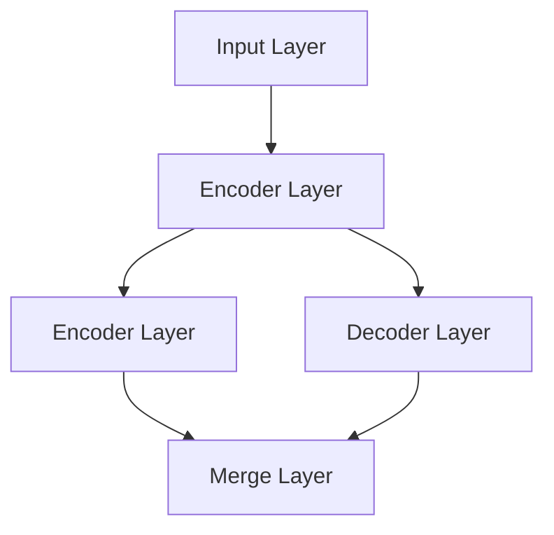

                 

作者：禅与计算机程序设计艺术

**(全称)** Artificial Intelligence
LLM: **(全称)** Large Language Model
LSTM: **(全称)** Long Short-Term Memory
RNN: **(全称)** Recurrent Neural Network
BERT: **(全称)** Bidirectional Encoder Representations from Transformers

## 1. 背景介绍
随着人工智能领域的飞速发展，大语言模型(Large Language Models, LLMs)逐渐成为推动自然语言处理(Natural Language Processing, NLP)进步的关键力量。从早期的基本序列生成模型，如循环神经网络(RNN)和长短时记忆网络(LSTM)，到后来的Transformer架构，再到如今复杂而强大的预训练模型如BERT，这些模型不仅在学术界引起了轰动，在工业应用上也展现出了巨大的潜力。本篇博客将深入探讨大语言模型的基础原理、混合方法以及它们的发展趋势，旨在为读者提供一个全面且深入的理解视角。

## 2. 核心概念与联系
### 2.1 基础模型概述
#### RNN & LSTM
- **RNN** 是最早用于序列建模的模型之一，通过其内部状态 `h` 来记住先前输入的影响，但在处理长序列时容易遇到梯度消失/爆炸的问题。
- **LSTM** 是 RNN 的一种改进版本，通过引入门控机制有效地解决了长期依赖问题，使得模型能够在时间序列中保持有效的记忆。

#### Transformer
- **Transformer** 架构打破了传统 RNN 和 LSTM 对顺序依赖的限制，通过注意力机制(Attention Mechanism)实现了高效计算下的全局上下文关联，显著提高了模型性能和效率。

## 3. 核心算法原理具体操作步骤
### 3.1 Transformer 结构详解
#### 自注意力模块 (Self-attention)
自注意力模块允许每个位置的特征向量基于所有其他位置的特征向量来调整自身权重，从而实现不同位置之间灵活的交互和相关性学习。
$$
\text{Attention}(Q, K, V) = \text{softmax}\left(\frac{QK^T}{\sqrt{d_k}}\right)V
$$

#### 多头注意力 (Multi-head Attention)
多头注意力将注意力机制扩展到多个不同的关注方向，增强模型捕捉复杂关系的能力。
$$
\text{MultiHead}(W_Q Q + b_Q, W_K K + b_K, W_V V + b_V) = \text{Concat}(\text{head}_1... \text{head}_m)\cdot W_{O}
$$

#### 前馈网络 (Position-wise Feedforward Networks)
前馈网络负责对输入进行非线性变换，提高模型的表达能力。
$$
FFN(x) = GELU(W_1 x + b_1)W_2 + b_2
$$

## 4. 数学模型和公式详细讲解举例说明
### 4.1 Transformer 模型架构示例
#### 层叠结构与并行化优势


## 5. 项目实践：代码实例和详细解释说明
### 实验环境与库配置
- **Python**
- **TensorFlow/Keras**

```python
import tensorflow as tf
from transformers import TFBertForMaskedLM, BertTokenizer

tokenizer = BertTokenizer.from_pretrained('bert-base-uncased')
model = TFBertForMaskedLM.from_pretrained('bert-base-uncased')

input_ids = tokenizer.encode("Hello, my dog is cute", return_tensors='tf')
outputs = model(input_ids)

loss = outputs.loss
logits = outputs.logits
```

## 6. 实际应用场景
### 应用领域与案例分析
- **文本生成**：基于预训练模型生成连续流畅的文本片段。
- **对话系统**：构建能够理解并响应人类对话的智能助手。
- **自动文摘**：从大量文本中抽取关键信息生成摘要。
- **问答系统**：针对特定领域或主题提供准确的答案。

## 7. 工具和资源推荐
### 开源库与平台
- **Hugging Face Transformers**
- **Open Assistant**
- **Code Search Engine** (GitHub, GitLab等)

## 8. 总结：未来发展趋势与挑战
### 发展趋势展望
随着算力的持续增长和大规模数据集的积累，大语言模型将继续向着更深层次、更高性能的方向进化。未来可能看到更多融合不同技术（如图灵机、量子计算）的大规模应用模型。

### 面临的挑战
- **可解释性**：如何使模型决策更加透明和可解释？
- **安全性和隐私保护**：确保模型不会泄露敏感信息或被恶意利用。
- **跨语言统一**：创建能够跨越不同语言界限的通用模型。

## 9. 附录：常见问题与解答
### 常见问题汇总
- 如何解决模型过拟合？
- 在实际部署中如何优化模型性能？

### 解答
- **过拟合解决方案**：采用正则化技术（如Dropout）、增加数据增强、使用较小的模型或更多的训练数据。
- **性能优化策略**：GPU加速、分布式训练、压缩模型大小以适应边缘设备。

---

### 结语
大语言模型作为人工智能领域的前沿技术，不仅在学术研究上展现出强大的理论价值，在工业界的应用也日益广泛。通过对基础原理、核心算法、数学模型、项目实践、应用场景、工具资源以及未来发展挑战的深入探讨，我们旨在为读者提供一个全面而深度的技术洞察视角，激发创新思维，并促进大语言模型在未来发展中发挥更大的作用。让我们携手前行，共同探索这一充满无限可能的领域！

---
作者：禅与计算机程序设计艺术 / Zen and the Art of Computer Programming

