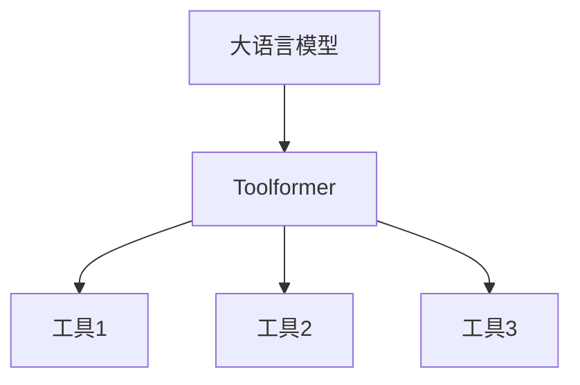

# 大语言模型应用指南：Toolformer

## 1. 背景介绍

### 1.1 大语言模型的发展历程

#### 1.1.1 早期的语言模型
#### 1.1.2 Transformer的出现
#### 1.1.3 预训练语言模型的兴起

### 1.2 大语言模型的应用现状

#### 1.2.1 自然语言处理领域的应用
#### 1.2.2 跨领域应用的拓展
#### 1.2.3 工具化应用的探索

### 1.3 Toolformer的提出背景

#### 1.3.1 大语言模型工具化应用的需求
#### 1.3.2 现有方案的局限性
#### 1.3.3 Toolformer的创新之处

## 2. 核心概念与联系

### 2.1 大语言模型

#### 2.1.1 定义与特点
#### 2.1.2 训练方法与数据
#### 2.1.3 表示能力与泛化能力

### 2.2 Toolformer

#### 2.2.1 定义与特点 
#### 2.2.2 与传统大语言模型的区别
#### 2.2.3 核心组件与架构

### 2.3 Toolformer与大语言模型的关系

#### 2.3.1 基于大语言模型的扩展
#### 2.3.2 工具化应用的实现路径
#### 2.3.3 互补与协同效应



## 3. 核心算法原理具体操作步骤

### 3.1 Toolformer的训练过程

#### 3.1.1 预训练阶段
#### 3.1.2 微调阶段
#### 3.1.3 工具适配阶段

### 3.2 Toolformer的推理过程

#### 3.2.1 输入编码
#### 3.2.2 工具选择与执行
#### 3.2.3 输出解码

### 3.3 Toolformer的优化技巧

#### 3.3.1 模型压缩
#### 3.3.2 推理加速
#### 3.3.3 Few-shot学习

## 4. 数学模型和公式详细讲解举例说明

### 4.1 Transformer模型

#### 4.1.1 自注意力机制
$$
Attention(Q,K,V) = softmax(\frac{QK^T}{\sqrt{d_k}})V
$$
其中，$Q$,$K$,$V$分别表示查询、键、值向量，$d_k$为向量维度。

#### 4.1.2 多头注意力机制
$$
MultiHead(Q,K,V) = Concat(head_1,...,head_h)W^O \\
head_i = Attention(QW_i^Q, KW_i^K, VW_i^V)
$$
其中，$W_i^Q$,$W_i^K$,$W_i^V$,$W^O$为可学习的权重矩阵。

#### 4.1.3 前馈神经网络
$$
FFN(x) = max(0, xW_1 + b_1)W_2 + b_2
$$

### 4.2 Toolformer的数学建模

#### 4.2.1 工具选择模块
$p(z|x) = softmax(f_{\theta}(x))$
其中，$z$为工具类别，$x$为输入，$f_{\theta}$为参数化函数。

#### 4.2.2 工具执行模块
$y = g_{\phi}(x,z)$
其中，$y$为输出，$g_{\phi}$为工具执行函数。

#### 4.2.3 端到端训练目标
$$
\mathcal{L} = -\sum_{i=1}^{N}log p(y_i|x_i) \\
= -\sum_{i=1}^{N}log \sum_{z}p(y_i|x_i,z)p(z|x_i)
$$
其中，$\mathcal{L}$为负对数似然损失函数，$N$为训练样本数。

## 5. 项目实践：代码实例和详细解释说明

### 5.1 环境配置

#### 5.1.1 硬件要求
#### 5.1.2 软件依赖
#### 5.1.3 数据准备

### 5.2 模型训练

#### 5.2.1 预训练示例代码
```python
# 预训练示例代码
import torch
from transformers import AutoModelForCausalLM, AutoTokenizer

model = AutoModelForCausalLM.from_pretrained("gpt2")
tokenizer = AutoTokenizer.from_pretrained("gpt2")

# 加载预训练数据
train_data = ...

# 训练循环
for epoch in range(num_epochs):
    for batch in train_data:
        inputs = tokenizer(batch, return_tensors="pt", padding=True)
        outputs = model(**inputs, labels=inputs["input_ids"])
        loss = outputs.loss
        loss.backward()
        optimizer.step()
        optimizer.zero_grad()
```

#### 5.2.2 微调示例代码
```python
# 微调示例代码
from transformers import Trainer, TrainingArguments

# 加载微调数据
train_data = ...
eval_data = ...

# 定义训练参数
training_args = TrainingArguments(
    output_dir='./results',
    num_train_epochs=3,
    per_device_train_batch_size=8,
    per_device_eval_batch_size=8,
    warmup_steps=500,
    weight_decay=0.01,
    logging_dir='./logs',
)

# 定义Trainer
trainer = Trainer(
    model=model,
    args=training_args,
    train_dataset=train_data,
    eval_dataset=eval_data,
)

# 开始微调
trainer.train()
```

#### 5.2.3 工具适配示例代码
```python
# 工具适配示例代码
from transformers import AutoModelForSeq2SeqLM

# 加载预微调模型
model = AutoModelForSeq2SeqLM.from_pretrained("t5-base")

# 定义工具适配数据
tool_data = ...

# 工具适配训练循环
for epoch in range(num_epochs):
    for batch in tool_data:
        inputs = tokenizer(batch["input"], return_tensors="pt", padding=True)
        labels = tokenizer(batch["output"], return_tensors="pt", padding=True)
        outputs = model(**inputs, labels=labels["input_ids"])
        loss = outputs.loss
        loss.backward()
        optimizer.step()
        optimizer.zero_grad()
```

### 5.3 模型推理

#### 5.3.1 工具选择示例代码
```python
# 工具选择示例代码
def select_tool(input_text):
    inputs = tokenizer(input_text, return_tensors="pt")
    outputs = tool_selector(**inputs)
    tool_id = outputs.logits.argmax(dim=-1)
    return tool_id.item()
```

#### 5.3.2 工具执行示例代码
```python
# 工具执行示例代码
def execute_tool(input_text, tool_id):
    inputs = tokenizer(input_text, return_tensors="pt")
    tool_inputs = tool_tokenizer(tool_id, return_tensors="pt")
    outputs = tool_executor(**inputs, **tool_inputs)
    output_text = tool_tokenizer.decode(outputs.logits.argmax(dim=-1))
    return output_text
```

#### 5.3.3 端到端推理示例代码
```python
# 端到端推理示例代码
def infer(input_text):
    tool_id = select_tool(input_text)
    output_text = execute_tool(input_text, tool_id)
    return output_text
```

## 6. 实际应用场景

### 6.1 智能客服

#### 6.1.1 客户意图理解
#### 6.1.2 问题自动应答
#### 6.1.3 多轮对话管理

### 6.2 智能写作助手

#### 6.2.1 写作素材推荐
#### 6.2.2 文章自动生成
#### 6.2.3 文本风格转换

### 6.3 知识图谱构建

#### 6.3.1 实体关系抽取
#### 6.3.2 知识融合与推理
#### 6.3.3 知识图谱可视化

## 7. 工具和资源推荐

### 7.1 开源工具包

#### 7.1.1 Hugging Face Transformers
#### 7.1.2 OpenAI GPT-3 API
#### 7.1.3 Google BERT

### 7.2 预训练模型

#### 7.2.1 BERT
#### 7.2.2 GPT-2/GPT-3
#### 7.2.3 T5

### 7.3 数据集

#### 7.3.1 Wikipedia
#### 7.3.2 BookCorpus
#### 7.3.3 Common Crawl

## 8. 总结：未来发展趋势与挑战

### 8.1 大语言模型的发展趋势

#### 8.1.1 模型规模的扩大
#### 8.1.2 训练范式的创新
#### 8.1.3 多模态学习的融合

### 8.2 Toolformer的发展方向

#### 8.2.1 工具库的丰富
#### 8.2.2 适应领域的拓展 
#### 8.2.3 人机交互的优化

### 8.3 面临的挑战

#### 8.3.1 计算资源的瓶颈
#### 8.3.2 数据质量的要求
#### 8.3.3 可解释性与可控性

## 9. 附录：常见问题与解答

### 9.1 如何选择合适的预训练模型？
根据任务类型、数据规模、计算资源等因素综合考虑，尝试不同的预训练模型，通过实验对比选择最优模型。

### 9.2 微调过程中出现过拟合怎么办？
可以采取以下措施：增大数据规模、调整超参数（如学习率、批量大小）、引入正则化技术（如权重衰减、dropout）等。

### 9.3 推理速度慢怎么办？
可以考虑以下优化措施：使用模型压缩技术（如量化、剪枝）、采用更高效的推理引擎、利用硬件加速（如GPU、TPU）等。

### 9.4 如何处理Few-shot学习场景？
可以利用Prompt engineering技术，设计合适的Prompt模板，引导模型进行Few-shot学习；也可以利用元学习等算法，提高模型的快速适应能力。

### 9.5 Toolformer能否支持更多任务类型？
理论上Toolformer可以支持各种任务类型，只需要针对特定任务开发相应的工具模块，并进行工具适配训练。未来可以不断丰富工具库，拓展Toolformer的应用范围。

作者：禅与计算机程序设计艺术 / Zen and the Art of Computer Programming