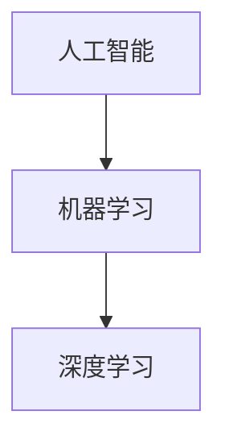
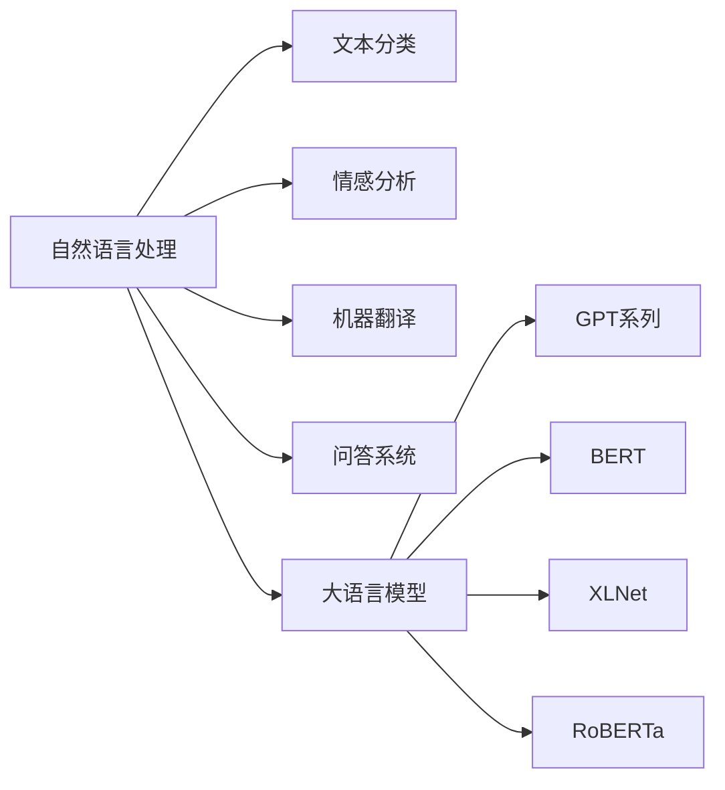

# 大语言模型应用指南：从人工智能的起源到大语言模型

## 1. 背景介绍
### 1.1 人工智能的起源与发展
#### 1.1.1 人工智能的定义
人工智能（Artificial Intelligence，简称AI）是计算机科学的一个分支，旨在研究如何创造出能够模拟人类智能行为的机器。它涉及计算机视觉、自然语言处理、知识表示、机器学习等多个领域。

#### 1.1.2 人工智能发展历程
人工智能的发展可以追溯到20世纪50年代初。1956年，约翰·麦卡锡等科学家在达特茅斯学院召开了一次会议，正式提出了"人工智能"这个概念。此后，人工智能经历了几次起起伏伏的发展历程：

- 1956-1974年：早期人工智能阶段，主要研究符号主义方法。
- 1974-1980年：人工智能的第一次低谷期，由于当时计算机硬件和算法的限制，很多人工智能项目未能取得预期的成果。 
- 1980-1987年：专家系统兴起，人工智能再次引起广泛关注。
- 1987-1993年：第二次低谷期，专家系统遇到瓶颈。
- 1993年至今：机器学习，尤其是深度学习的崛起，人工智能进入新的繁荣期。

### 1.2 自然语言处理与大语言模型
#### 1.2.1 自然语言处理概述
自然语言处理（Natural Language Processing，简称NLP）是人工智能的一个重要分支，旨在研究如何让计算机理解、生成和处理人类语言。它包括语音识别、语义理解、机器翻译、文本分类、情感分析、问答系统等多个方向。

#### 1.2.2 大语言模型的兴起
近年来，随着深度学习技术的发展，以及计算资源和训练数据的增加，大语言模型（Large Language Model，简称LLM）逐渐成为自然语言处理领域的研究热点。大语言模型通过在海量文本数据上进行预训练，可以学习到丰富的语言知识，在许多自然语言处理任务上取得了显著的性能提升。

一些著名的大语言模型包括：
- GPT系列（Generative Pre-trained Transformer）：由OpenAI开发，代表模型有GPT-2、GPT-3等。
- BERT（Bidirectional Encoder Representations from Transformers）：由Google提出，引入了双向Transformer结构。
- XLNet：由Google和CMU联合提出，结合了自回归语言模型和自编码语言模型的优点。
- RoBERTa（A Robustly Optimized BERT Pretraining Approach）：由Facebook AI研究院提出，对BERT进行了优化改进。

## 2. 核心概念与联系
### 2.1 人工智能、机器学习与深度学习
人工智能、机器学习和深度学习是当前计算机科学领域的三个重要概念，它们之间存在着包含与被包含的关系。



- 人工智能：是计算机科学的一个分支，旨在研究如何创造出能够模拟人类智能行为的机器。
- 机器学习：是实现人工智能的一种方法，通过学习算法，让计算机从数据中自动学习和改进，而无需显式编程。
- 深度学习：是机器学习的一个子集，基于人工神经网络，通过多层次的特征学习和抽象，实现对复杂模式的识别。

### 2.2 自然语言处理与大语言模型
自然语言处理是人工智能的一个重要应用方向，旨在让计算机理解、生成和处理人类语言。大语言模型则是近年来自然语言处理领域的一个重要突破，通过在海量文本数据上进行预训练，可以学习到丰富的语言知识，极大地提升了各种自然语言处理任务的性能。



## 3. 核心算法原理具体操作步骤
### 3.1 Transformer模型
Transformer是大语言模型的核心架构，由Vaswani等人在2017年提出。相比传统的循环神经网络（RNN）和卷积神经网络（CNN），Transformer完全基于注意力机制（Attention Mechanism），通过自注意力（Self-Attention）和多头注意力（Multi-Head Attention）等技术，可以更好地捕捉文本中的长距离依赖关系。

Transformer的具体操作步骤如下：

1. 输入嵌入（Input Embedding）：将输入文本转换为词向量表示。
2. 位置编码（Positional Encoding）：为每个词向量添加位置信息，使模型能够捕捉词序关系。
3. 多头自注意力（Multi-Head Self-Attention）：通过多个注意力头并行计算，捕捉词与词之间的依赖关系。
4. 前馈神经网络（Feed-Forward Neural Network）：对自注意力的输出进行非线性变换。
5. 残差连接与层归一化（Residual Connection and Layer Normalization）：将前一层的输出与当前层的输出相加，并进行归一化，有助于模型的训练和收敛。
6. 解码器（Decoder）：与编码器类似，但在自注意力层之前增加了一个交叉注意力（Cross-Attention）层，用于捕捉编码器和解码器之间的依赖关系。

### 3.2 预训练与微调
大语言模型通常采用预训练（Pre-training）和微调（Fine-tuning）两个阶段来训练：

1. 预训练阶段：在大规模无标注文本数据上进行自监督学习，让模型学习到通用的语言知识和表示。常见的预训练任务包括：
   - 语言模型任务：预测下一个词或被掩盖的词。
   - 句子连贯性判断：判断两个句子是否连贯。
   - 句子顺序预测：预测句子的正确顺序。

2. 微调阶段：在特定任务的有标注数据上对预训练模型进行微调，使其适应具体的下游任务。常见的微调任务包括：
   - 文本分类：将文本分类到预定义的类别中。
   - 序列标注：对文本中的每个词进行标注，如命名实体识别、词性标注等。
   - 问答系统：根据给定的问题和上下文，生成相应的答案。

通过预训练和微调两个阶段，大语言模型可以在各种自然语言处理任务上取得优异的性能。

## 4. 数学模型和公式详细讲解举例说明
### 4.1 注意力机制
注意力机制是Transformer模型的核心组件，它允许模型在处理当前词时，选择性地关注输入序列中的其他位置。注意力函数可以表示为：

$$
Attention(Q, K, V) = softmax(\frac{QK^T}{\sqrt{d_k}})V
$$

其中，$Q$（Query）、$K$（Key）、$V$（Value）分别表示查询向量、键向量和值向量，$d_k$表示键向量的维度。

举例说明：假设我们有一个句子"The cat sat on the mat"，当模型处理单词"sat"时，通过注意力机制，它可以关注到与"sat"相关的其他词，如"cat"和"mat"，从而更好地理解句子的语义。

### 4.2 多头注意力
多头注意力是将注意力机制扩展到多个子空间，每个子空间称为一个头（Head）。多头注意力可以表示为：

$$
MultiHead(Q, K, V) = Concat(head_1, ..., head_h)W^O \\
head_i = Attention(QW_i^Q, KW_i^K, VW_i^V)
$$

其中，$W_i^Q$、$W_i^K$、$W_i^V$分别表示第$i$个头的查询、键、值的线性变换矩阵，$W^O$表示最终输出的线性变换矩阵。

举例说明：在处理句子"The cat sat on the mat"时，不同的注意力头可以关注不同的语言特征，如语法关系、语义角色等，从而捕捉更丰富的语言信息。

## 5. 项目实践：代码实例和详细解释说明
下面是一个使用PyTorch实现Transformer编码器的简化版代码示例：

```python
import torch
import torch.nn as nn

class TransformerEncoder(nn.Module):
    def __init__(self, d_model, nhead, dim_feedforward, num_layers):
        super(TransformerEncoder, self).__init__()
        self.layers = nn.ModuleList([
            nn.TransformerEncoderLayer(d_model, nhead, dim_feedforward)
            for _ in range(num_layers)
        ])
        self.norm = nn.LayerNorm(d_model)

    def forward(self, src):
        for layer in self.layers:
            src = layer(src)
        return self.norm(src)

# 示例用法
d_model = 512
nhead = 8
dim_feedforward = 2048
num_layers = 6

model = TransformerEncoder(d_model, nhead, dim_feedforward, num_layers)
input_seq = torch.randn(10, 32, d_model)  # (seq_len, batch_size, d_model)
output = model(input_seq)
```

代码解释：
1. 定义了一个`TransformerEncoder`类，继承自`nn.Module`，表示Transformer编码器。
2. 在构造函数中，根据给定的参数创建了多个`TransformerEncoderLayer`，并将它们存储在`nn.ModuleList`中。
3. 在前向传播函数`forward`中，将输入序列`src`依次传递给每个编码器层，并在最后应用层归一化。
4. 示例用法展示了如何创建一个具有6层、512维度、8个注意力头的Transformer编码器，并对一个随机输入序列进行前向传播。

这只是一个简化版的示例，实际应用中还需要考虑位置编码、词嵌入等细节。此外，完整的Transformer模型还包括解码器部分，用于生成或预测输出序列。

## 6. 实际应用场景
大语言模型在许多自然语言处理任务中得到了广泛应用，下面是一些典型的应用场景：

### 6.1 文本分类
大语言模型可以用于文本分类任务，如情感分析、新闻分类、垃圾邮件检测等。通过在大规模文本数据上预训练，模型可以学习到丰富的语言特征，然后在特定领域的标注数据上进行微调，以适应具体的分类任务。

### 6.2 命名实体识别
命名实体识别旨在从文本中识别出人名、地名、组织机构名等命名实体。大语言模型可以通过微调在命名实体识别数据集上，学习识别不同类型的命名实体，提高识别的准确性。

### 6.3 机器翻译
大语言模型可以用于构建高质量的机器翻译系统。通过在大规模双语语料上预训练，模型可以学习到语言之间的对应关系，然后在特定语言对的平行语料上进行微调，以生成流畅、准确的翻译结果。

### 6.4 问答系统
大语言模型可以用于构建智能问答系统，根据用户的问题和给定的上下文，生成相应的答案。通过在大规模问答数据集上预训练，模型可以学习到丰富的知识和推理能力，然后在特定领域的问答数据上进行微调，以提供准确、相关的答案。

### 6.5 文本生成
大语言模型强大的语言生成能力可以应用于各种文本生成任务，如对话生成、故事生成、诗歌创作等。通过在大规模文本数据上预训练，模型可以学习到语言的结构和风格，然后根据给定的提示或上下文，生成连贯、富有创意的文本。

## 7. 工具和资源推荐
### 7.1 开源工具包
- Hugging Face Transformers：包含了多种预训练语言模型的Python库，如BERT、GPT、XLNet等，支持快速微调和部署。
- OpenAI GPT-3 API：提供了基于GPT-3模型的API服务，可以用于各种自然语言处理任务。
- Google BERT：Google官方提供的BERT预训练模型和微调代码。
-