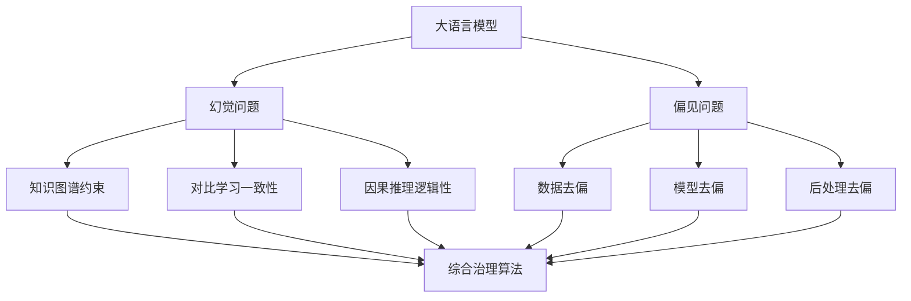

# 大语言模型应用指南：幻觉和偏见问题

## 1. 背景介绍
### 1.1 大语言模型的发展历程
#### 1.1.1 早期的语言模型
#### 1.1.2 Transformer架构的出现
#### 1.1.3 预训练语言模型的崛起

### 1.2 大语言模型的应用现状
#### 1.2.1 自然语言处理领域的应用
#### 1.2.2 知识图谱构建与问答系统
#### 1.2.3 文本生成与创意写作

### 1.3 大语言模型面临的挑战
#### 1.3.1 幻觉问题的定义与表现
#### 1.3.2 偏见问题的定义与表现
#### 1.3.3 应对幻觉和偏见问题的必要性

## 2. 核心概念与联系
### 2.1 大语言模型的基本原理
#### 2.1.1 语言模型的定义与作用
#### 2.1.2 基于Transformer的语言模型架构
#### 2.1.3 预训练与微调的过程

### 2.2 幻觉问题的成因与表现
#### 2.2.1 训练数据的局限性
#### 2.2.2 模型泛化能力的不足
#### 2.2.3 幻觉问题的具体案例分析

### 2.3 偏见问题的成因与表现  
#### 2.3.1 训练数据中的偏见
#### 2.3.2 模型架构与训练方式的影响
#### 2.3.3 偏见问题的具体案例分析

### 2.4 幻觉与偏见问题的关联
#### 2.4.1 两类问题的共同成因
#### 2.4.2 两类问题的相互影响
#### 2.4.3 综合治理的必要性

## 3. 核心算法原理与具体操作步骤
### 3.1 应对幻觉问题的算法
#### 3.1.1 基于知识图谱的语义约束
##### 3.1.1.1 知识图谱的构建
##### 3.1.1.2 知识图谱与语言模型的融合
##### 3.1.1.3 基于知识的语义约束算法
#### 3.1.2 基于对比学习的一致性优化
##### 3.1.2.1 对比学习的基本原理
##### 3.1.2.2 对比学习在语言模型中的应用
##### 3.1.2.3 基于对比学习的一致性优化算法
#### 3.1.3 基于因果推理的逻辑一致性保证
##### 3.1.3.1 因果推理的基本原理
##### 3.1.3.2 因果推理在语言模型中的应用
##### 3.1.3.3 基于因果推理的逻辑一致性保证算法

### 3.2 应对偏见问题的算法 
#### 3.2.1 数据去偏方法
##### 3.2.1.1 数据平衡与重采样
##### 3.2.1.2 对抗去偏
##### 3.2.1.3 因果去偏
#### 3.2.2 模型去偏方法  
##### 3.2.2.1 对抗训练
##### 3.2.2.2 因果建模
##### 3.2.2.3 公平正则化
#### 3.2.3 后处理去偏方法
##### 3.2.3.1 阈值调整
##### 3.2.3.2 校准
##### 3.2.3.3 重排序

### 3.3 综合治理算法
#### 3.3.1 多任务学习框架
#### 3.3.2 联合优化目标函数设计
#### 3.3.3 端到端去偏与防幻觉模型



## 4. 数学模型和公式详细讲解举例说明
### 4.1 对比学习的数学模型
对比学习的目标是最大化正样本对之间的相似度，最小化负样本对之间的相似度。假设编码器为$f_\theta$，温度参数为$\tau$，对于一个正样本对$(x_i,x_i^+)$，其损失函数定义为：

$$
\mathcal{L}_{i}=-\log \frac{\exp \left(\operatorname{sim}\left(f_{\theta}\left(x_{i}\right), f_{\theta}\left(x_{i}^{+}\right)\right) / \tau\right)}{\sum_{j=1}^{N} \mathbf{1}_{j \neq i} \exp \left(\operatorname{sim}\left(f_{\theta}\left(x_{i}\right), f_{\theta}\left(x_{j}\right)\right) / \tau\right)}
$$

其中$\operatorname{sim}(u,v)=u^{\top}v/(\|u\|\|v\|)$表示余弦相似度，$\mathbf{1}_{j\neq i}\in\{0,1\}$为指示函数，当$j\neq i$时取1，否则取0。直观上，该损失函数鼓励正样本对的相似度尽可能大，负样本对的相似度尽可能小。

### 4.2 因果推理的数学模型
因果推理旨在建模变量之间的因果关系，从而实现更可靠的推理。假设有两个变量$X$和$Y$，我们感兴趣的是它们之间的因果效应$P(Y|do(X))$。根据因果计算理论，该因果效应可以表示为：

$$
P(Y|do(X))=\sum_{Z}P(Y|X,Z)P(Z)
$$

其中$Z$为所有可能的中间变量集合。这个公式表明，$X$对$Y$的因果效应是在所有可能的中间变量取值下，$Y$在给定$X$时的条件概率的加权平均。通过引入反事实推理和do算子，因果推理可以避免许多统计推断中的陷阱，如混淆偏差和选择偏差。

### 4.3 偏见问题的数学建模
偏见问题可以形式化地定义为模型预测结果在不同人口统计学群体上的差异。假设有K个群体，第k个群体的样本数为$n_k$，模型$f$在第$i$个样本上的预测为$\hat{y}_i$，ground truth为$y_i$，则群体$k$上的模型性能可以表示为：

$$
P_k=\frac{1}{n_k}\sum_{i:z_i=k}\mathcal{M}(\hat{y}_i,y_i)
$$

其中$\mathcal{M}$为评估指标，如准确率、F1值等。定义群体$j$和$k$之间的unfairness为：

$$
\Delta_{j,k}=|P_j-P_k| 
$$

模型的目标是最小化整体的unfairness：

$$
\min_f\max_{j,k}\Delta_{j,k}
$$

这表明，我们希望找到一个模型，使得所有群体上的性能差异尽可能小，从而达到公平性的要求。

## 5. 项目实践：代码实例和详细解释说明
下面我们通过一个简单的示例来说明如何使用PyTorch实现对比学习。首先定义编码器和投影头：

```python
class Encoder(nn.Module):
    def __init__(self, input_dim, hidden_dim, output_dim):
        super().__init__()
        self.encoder = nn.Sequential(
            nn.Linear(input_dim, hidden_dim),
            nn.ReLU(),
            nn.Linear(hidden_dim, output_dim)
        )
    
    def forward(self, x):
        return self.encoder(x)

class ProjectionHead(nn.Module):
    def __init__(self, input_dim, hidden_dim, output_dim):
        super().__init__()
        self.projection = nn.Sequential(
            nn.Linear(input_dim, hidden_dim),
            nn.ReLU(),
            nn.Linear(hidden_dim, output_dim)
        )
    
    def forward(self, x):
        return self.projection(x)
```

编码器负责将输入数据映射到表示空间，投影头则将表示进一步映射到对比学习的空间。接下来定义对比损失函数：

```python
class ContrastiveLoss(nn.Module):
    def __init__(self, temperature=0.5):
        super().__init__()
        self.temperature = temperature
    
    def forward(self, features):
        batch_size = features.shape[0]
        features = F.normalize(features, dim=1)
        
        similarity_matrix = torch.matmul(features, features.T)
        mask = torch.eye(batch_size, dtype=torch.bool).to(similarity_matrix.device)
        similarity_matrix = similarity_matrix[~mask].view(batch_size, -1)
        
        positives = torch.exp(torch.sum(features * features, dim=-1) / self.temperature)
        negatives = torch.sum(torch.exp(similarity_matrix / self.temperature), dim=1)
        
        loss = -torch.log(positives / (positives + negatives))
        
        return loss.mean()
```

对比损失函数首先对特征进行L2归一化，然后计算特征之间的相似度矩阵。对角线上的元素对应正样本对，非对角元素对应负样本对。我们使用指数函数计算正负样本的相似度，并计算最终的对比损失。

在训练过程中，我们从数据集中采样正负样本对，并使用对比损失函数优化编码器和投影头的参数：

```python
encoder = Encoder(input_dim, hidden_dim, output_dim)
projection = ProjectionHead(output_dim, hidden_dim, output_dim)
criterion = ContrastiveLoss()

for x, _ in dataloader:
    x = x.to(device)
    
    # 数据增强生成正样本
    x_aug = augment(x)  
    
    # 编码和投影
    z = encoder(x)
    z_proj = projection(z) 
    z_aug = encoder(x_aug)
    z_aug_proj = projection(z_aug)
    
    # 计算对比损失
    features = torch.cat([z_proj, z_aug_proj], dim=0)
    loss = criterion(features)
    
    # 反向传播和优化
    optimizer.zero_grad()
    loss.backward()
    optimizer.step()
```

通过这种方式，我们可以训练一个鲁棒的编码器，使其能够学习到数据的高级语义特征，从而缓解幻觉问题。

## 6. 实际应用场景
大语言模型在许多实际场景中都有广泛应用，下面列举几个典型的应用案例：

### 6.1 智能客服
大语言模型可以用于构建智能客服系统，自动回答用户的常见问题，提供个性化的服务。然而，由于幻觉和偏见问题的存在，智能客服可能给出错误或不恰当的回复，影响用户体验。因此，需要在数据和模型层面采取措施，如数据清洗、对抗训练等，提高系统的稳健性。

### 6.2 内容生成
大语言模型强大的文本生成能力可以应用于新闻写作、文案创作、小说创作等内容生成场景。但是，由于训练数据的局限性和模型泛化能力的不足，生成的内容可能出现逻辑错误、自相矛盾等幻觉问题，以及性别歧视、种族歧视等偏见问题。因此，需要引入外部知识进行约束，并采用对比学习等技术提高生成内容的一致性。

### 6.3 知识问答
大语言模型可以作为知识库的查询接口，回答用户的自然语言问题。但是，当问题涉及复杂的推理链条时，模型可能产生幻觉，给出错误的答案。同时，模型还可能展现出偏见，对不同群体给出不公平的答案。因此，需要引入因果推理等技术提高模型的逻辑推理能力，并采用数据和模型去偏方法消除偏见。

### 6.4 机器翻译
大语言模型可以用于构建高质量的机器翻译系统，实现不同语言之间的转换。然而，由于语言和文化差异，模型可能产生幻觉，生成不符合目标语言习惯的译文。同时，模型还可能展现出性别偏见等问题，如将中性词翻译为带有性别色彩的词。因此，需要在训练数据中引入更多样化的语料，并采用对抗去偏等技术消除偏见。

## 7. 工具和资源推荐
为了帮助研究者和开发者更好地解决大语言模型的幻觉和偏见问题，下面推荐一些常用的工具和资源：

### 7.1 数据集
- Wikipedia: 大规模的多语言百科全书数据集，可用于训练无偏见的语言模型。
- BookCorpus: 大规模