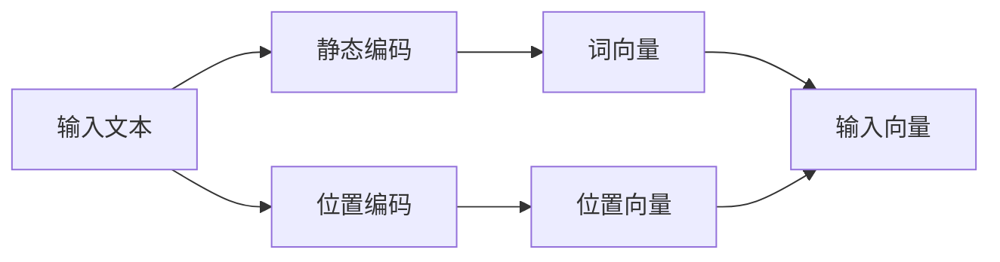

# 大语言模型应用指南：静态编码和位置编码

## 1. 背景介绍

近年来，大语言模型(Large Language Models, LLMs)在自然语言处理(Natural Language Processing, NLP)领域取得了令人瞩目的成就。从GPT-3到ChatGPT，这些模型展示了在各种自然语言任务上的出色表现，如文本生成、问答、摘要等。LLMs的成功很大程度上归功于其强大的编码能力，即将输入的文本转化为高维向量表示。在这其中，静态编码(Static Encoding)和位置编码(Positional Encoding)扮演着至关重要的角色。

本文将深入探讨静态编码和位置编码在大语言模型中的应用，阐述其核心概念、算法原理、数学模型，并提供实践代码示例。通过本文，读者将全面了解这两种编码方式的工作原理，以及如何在实际项目中加以运用，从而更好地掌握和应用大语言模型。

## 2. 核心概念与联系

### 2.1 静态编码

静态编码，也称为词嵌入(Word Embedding)，是将词汇表中的每个单词映射为一个固定维度的稠密向量。这些向量捕捉了单词之间的语义关系，使得语义相似的单词在向量空间中更接近。常见的静态编码方法包括Word2Vec、GloVe等。

### 2.2 位置编码 

位置编码是为了让模型能够捕捉输入序列中单词的位置信息。与循环神经网络(RNN)不同，Transformer架构中的自注意力机制(Self-Attention)本身并不记录位置信息。因此，需要显式地将位置信息编码到输入向量中。常见的位置编码方法有正弦位置编码(Sinusoidal Positional Encoding)和可学习位置编码(Learnable Positional Encoding)。

### 2.3 静态编码与位置编码的关系

静态编码和位置编码在大语言模型中协同工作，共同构建输入序列的向量表示:



静态编码负责将每个单词转化为语义向量，位置编码负责将位置信息注入到这些向量中。两者相加，得到最终的输入向量，供后续的自注意力层处理。

## 3. 核心算法原理具体操作步骤

### 3.1 静态编码算法

以Word2Vec为例，其核心思想是利用单词的上下文信息来学习词向量。具体步骤如下:

1. 构建训练语料，将文本划分为固定长度的上下文窗口。
2. 对每个上下文窗口，选择中心词和上下文词。
3. 使用中心词来预测上下文词(Skip-gram)，或使用上下文词来预测中心词(CBOW)。
4. 通过最小化预测误差来更新词向量。
5. 重复步骤2-4，直到收敛。

### 3.2 位置编码算法

以正弦位置编码为例，其思路是使用正弦函数和余弦函数来表示位置信息。对于位置$pos$和维度$i$，位置编码向量$PE(pos,i)$的计算公式为:

$$
PE(pos,2i) = sin(pos/10000^{2i/d_{model}})
$$
$$
PE(pos,2i+1) = cos(pos/10000^{2i/d_{model}})
$$

其中，$d_{model}$是词向量的维度。这种编码方式具有以下优点:

1. 可以表示任意长度的序列。
2. 相对位置信息被编码到了不同频率的正弦波中。
3. 容易通过线性变换进行位置信息的推理。

## 4. 数学模型和公式详细讲解举例说明

### 4.1 Word2Vec的数学模型

Word2Vec的目标是最大化单词$w$在给定上下文$c$下的条件概率$P(w|c)$。对于Skip-gram模型，其目标函数为:

$$
J(\theta) = \frac{1}{T}\sum_{t=1}^{T}\sum_{-m \leq j \leq m, j \neq 0} \log P(w_{t+j}|w_t)
$$

其中，$T$是语料库的长度，$m$是上下文窗口的大小，$\theta$是模型参数(即词向量)。$P(w_{t+j}|w_t)$通常使用softmax函数来计算:

$$
P(w_O|w_I) = \frac{\exp(v'_{w_O}{}^T v_{w_I})}{\sum_{w=1}^{V} \exp(v'_w{}^T v_{w_I})}
$$

其中，$v_w$和$v'_w$分别是单词$w$的输入和输出词向量，$V$是词汇表的大小。

### 4.2 位置编码的数学解释

正弦位置编码的数学直觉在于，通过使用不同频率的正弦函数，可以唯一地标识每个位置。对于任意两个位置$pos_1$和$pos_2$，它们在维度$i$上的位置编码满足:

$$
PE(pos_1,i) = PE(pos_2,i) \Leftrightarrow pos_1 = pos_2
$$

这保证了每个位置都有一个独特的编码。此外，对于任意固定的偏移量$k$，位置$pos+k$的编码可以表示为位置$pos$编码的线性函数:

$$
PE(pos+k,i) = \alpha \cdot PE(pos,i)
$$

其中，$\alpha$是一个常数。这种线性关系使得模型能够轻松地学习相对位置信息。

## 5. 项目实践：代码实例和详细解释说明

下面是使用PyTorch实现静态编码(Word2Vec)和位置编码的示例代码。

### 5.1 Word2Vec的实现

```python
import torch
import torch.nn as nn

class Word2Vec(nn.Module):
    def __init__(self, vocab_size, embedding_dim):
        super(Word2Vec, self).__init__()
        self.embeddings = nn.Embedding(vocab_size, embedding_dim)
        self.linear = nn.Linear(embedding_dim, vocab_size)

    def forward(self, inputs):
        embeds = self.embeddings(inputs)
        output = self.linear(embeds)
        return output

# 训练Word2Vec模型
model = Word2Vec(vocab_size=1000, embedding_dim=100)
criterion = nn.CrossEntropyLoss()
optimizer = torch.optim.Adam(model.parameters())

for epoch in range(num_epochs):
    for inputs, targets in dataloader:
        optimizer.zero_grad()
        outputs = model(inputs)
        loss = criterion(outputs, targets)
        loss.backward()
        optimizer.step()
```

这里，`nn.Embedding`层用于将单词索引映射为稠密向量，`nn.Linear`层用于根据词向量预测目标单词。通过最小化交叉熵损失函数，模型学习到了单词的语义向量表示。

### 5.2 位置编码的实现

```python
import torch
import torch.nn as nn
import math

class PositionalEncoding(nn.Module):
    def __init__(self, d_model, max_len=5000):
        super(PositionalEncoding, self).__init__()
        pe = torch.zeros(max_len, d_model)
        position = torch.arange(0, max_len, dtype=torch.float).unsqueeze(1)
        div_term = torch.exp(torch.arange(0, d_model, 2).float() * (-math.log(10000.0) / d_model))
        pe[:, 0::2] = torch.sin(position * div_term)
        pe[:, 1::2] = torch.cos(position * div_term)
        pe = pe.unsqueeze(0).transpose(0, 1)
        self.register_buffer('pe', pe)

    def forward(self, x):
        x = x + self.pe[:x.size(0), :]
        return x

# 使用位置编码
d_model = 512
max_len = 100
pos_encoder = PositionalEncoding(d_model, max_len)
input_embeddings = torch.randn(64, 20, 512) # (batch_size, seq_len, d_model)
output_embeddings = pos_encoder(input_embeddings)
```

这里，`PositionalEncoding`模块根据公式计算位置编码向量，并将其与输入的词向量相加。`register_buffer`用于注册持久化的缓冲区，以便在模型保存和加载时自动处理这些张量。

## 6. 实际应用场景

静态编码和位置编码在大语言模型的实际应用中不可或缺。以下是一些典型的应用场景:

1. 文本分类：通过静态编码将文本转化为固定长度的向量，再输入分类器进行分类。
2. 命名实体识别：使用静态编码和位置编码表示单词及其位置信息，再通过序列标注模型识别实体。
3. 机器翻译：在Transformer架构中，静态编码和位置编码用于表示源语言和目标语言序列，帮助模型学习语言间的映射关系。
4. 文本摘要：使用静态编码和位置编码表示文档和查询，通过自注意力机制生成摘要。
5. 对话系统：在对话历史和当前对话中应用静态编码和位置编码，帮助模型理解上下文信息，生成恰当的回复。

## 7. 工具和资源推荐

以下是一些用于实现和训练静态编码和位置编码的常用工具和资源:

1. PyTorch (https://pytorch.org/): 一个开源的深度学习框架，提供了易于使用的API和丰富的文档。
2. TensorFlow (https://www.tensorflow.org/): 另一个广泛使用的深度学习框架，拥有强大的生态系统和社区支持。
3. Hugging Face Transformers (https://huggingface.co/transformers/): 一个基于PyTorch和TensorFlow的自然语言处理库，提供了多种预训练模型和实用工具。
4. Gensim (https://radimrehurek.com/gensim/): 一个专门用于主题建模、文档相似度检索和词向量训练的Python库。
5. FastText (https://fasttext.cc/): 由Facebook开发的一个高效的词向量训练工具，支持文本分类和词表示学习。

## 8. 总结：未来发展趋势与挑战

静态编码和位置编码技术的发展推动了大语言模型的进步，使其在各种自然语言处理任务上取得了瞩目的成绩。未来，这些技术还将不断改进和演进:

1. 更大规模的预训练模型：训练更大的语言模型，利用更多的数据和计算资源，有望进一步提升模型的理解和生成能力。
2. 多模态编码：将文本、图像、音频等不同模态的信息编码到统一的向量空间中，实现跨模态的理解和生成。
3. 领域自适应：开发适用于特定领域的编码技术，利用领域知识和数据，提高模型在垂直领域的性能。
4. 更高效的位置编码：探索新的位置编码方案，如相对位置编码，以更高效、更灵活的方式表示序列中的位置信息。
5. 结合知识图谱：将知识图谱与语言模型相结合，利用结构化知识增强模型的理解和推理能力。

同时，这些技术的发展也面临着一些挑战:

1. 可解释性：理解和解释大语言模型的内部工作机制，增强模型的透明度和可信度。
2. 公平性和偏见：确保模型在训练和应用过程中的公平性，减少数据和算法带来的偏见。
3. 数据隐私：在利用大规模数据训练模型的同时，保护个人隐私和敏感信息。
4. 计算资源：训练和部署大型语言模型需要大量的计算资源，如何提高资源利用效率是一个持续的挑战。

## 9. 附录：常见问题与解答

1. 问：静态编码和动态编码有什么区别？
   答：静态编码是预先训练好的固定词向量，而动态编码是在特定任务中根据上下文动态生成的词向量。静态编码更通用，而动态编码更适应特定任务。

2. 问：为什么Transformer架构需要位置编码？
   答：Transformer的自注意力机制是位置不变的，无法捕捉序列中的位置信息。位置编码通过将位置信息注入到词向量中，使模型能够感知单词的顺序。

3. 问：Word2Vec和GloVe有什么区别？
   答：Word2Vec使用局部上下文窗口来学习词向量，而GloVe基于全局的词共现统计信息。GloVe在捕捉词之间的线性关系方面更有优势。

4. 问：位置编码是否