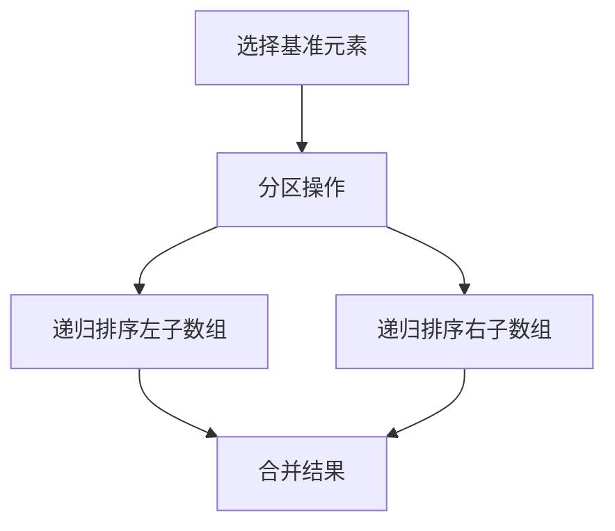
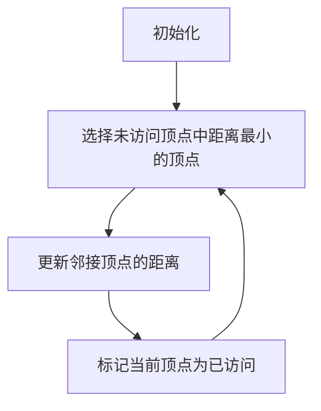

# 如何深刻理解计算机原理，具备良好的数据结构和算法基础

## 1.背景介绍

在当今信息技术飞速发展的时代，计算机科学已经成为各行各业的核心驱动力。无论是人工智能、区块链还是大数据分析，计算机原理、数据结构和算法都是这些技术的基石。理解计算机原理不仅能帮助我们更好地设计和优化系统，还能提升我们解决复杂问题的能力。本文将深入探讨如何深刻理解计算机原理，并具备良好的数据结构和算法基础。

## 2.核心概念与联系

### 2.1 计算机原理

计算机原理主要涉及计算机的基本组成部分及其工作机制。核心概念包括：

- **中央处理器（CPU）**：负责执行指令和处理数据。
- **内存（RAM）**：用于临时存储数据和指令。
- **存储设备**：如硬盘和固态硬盘，用于长期存储数据。
- **输入输出设备**：如键盘、鼠标和显示器，用于与外界交互。

### 2.2 数据结构

数据结构是指数据的组织和存储方式。常见的数据结构包括：

- **数组**：连续存储的元素集合。
- **链表**：由节点组成的线性集合，每个节点包含数据和指向下一个节点的指针。
- **栈和队列**：特殊的线性数据结构，栈遵循后进先出（LIFO），队列遵循先进先出（FIFO）。
- **树和图**：非线性数据结构，树具有层次结构，图由节点和边组成。

### 2.3 算法

算法是解决问题的步骤和方法。常见的算法包括：

- **排序算法**：如快速排序、归并排序和堆排序。
- **搜索算法**：如二分查找和深度优先搜索。
- **图算法**：如Dijkstra算法和Kruskal算法。

### 2.4 核心概念之间的联系

计算机原理、数据结构和算法是相互关联的。计算机原理提供了硬件基础，数据结构提供了数据组织方式，而算法则是操作数据的具体步骤。理解这些概念之间的联系，有助于我们更好地设计和优化系统。

## 3.核心算法原理具体操作步骤

### 3.1 快速排序算法

快速排序是一种高效的排序算法，采用分治法将数组分成较小的子数组，然后递归地排序这些子数组。其具体操作步骤如下：

1. **选择基准元素**：从数组中选择一个元素作为基准。
2. **分区操作**：将数组分成两个子数组，一个子数组中所有元素小于基准元素，另一个子数组中所有元素大于基准元素。
3. **递归排序**：对两个子数组分别进行快速排序。



### 3.2 Dijkstra算法

Dijkstra算法用于计算图中从一个顶点到其他顶点的最短路径。其具体操作步骤如下：

1. **初始化**：设置起点到自身的距离为0，其他顶点的距离为无穷大。
2. **选择未访问顶点中距离最小的顶点**。
3. **更新邻接顶点的距离**：如果通过当前顶点到达某个邻接顶点的距离小于已知最短距离，则更新该邻接顶点的距离。
4. **标记当前顶点为已访问**。
5. **重复步骤2-4，直到所有顶点都被访问**。



## 4.数学模型和公式详细讲解举例说明

### 4.1 时间复杂度分析

时间复杂度是衡量算法效率的重要指标。常见的时间复杂度包括：

- **常数时间复杂度**：$O(1)$
- **对数时间复杂度**：$O(\log n)$
- **线性时间复杂度**：$O(n)$
- **线性对数时间复杂度**：$O(n \log n)$
- **平方时间复杂度**：$O(n^2)$

### 4.2 快速排序的时间复杂度

快速排序的平均时间复杂度为$O(n \log n)$，最坏情况下为$O(n^2)$。其时间复杂度分析如下：

- **分区操作**：每次分区操作需要$O(n)$的时间。
- **递归调用**：每次递归调用将数组分成两个子数组，递归深度为$\log n$。

因此，快速排序的平均时间复杂度为$O(n \log n)$。

### 4.3 Dijkstra算法的时间复杂度

Dijkstra算法的时间复杂度取决于实现方式。使用优先队列实现时，其时间复杂度为$O((V + E) \log V)$，其中$V$是顶点数，$E$是边数。

## 5.项目实践：代码实例和详细解释说明

### 5.1 快速排序代码实例

以下是快速排序的Python实现：

```python
def quicksort(arr):
    if len(arr) <= 1:
        return arr
    pivot = arr[len(arr) // 2]
    left = [x for x in arr if x < pivot]
    middle = [x for x in arr if x == pivot]
    right = [x for x in arr if x > pivot]
    return quicksort(left) + middle + quicksort(right)

# 示例
arr = [3, 6, 8, 10, 1, 2, 1]
print(quicksort(arr))
```

### 5.2 Dijkstra算法代码实例

以下是Dijkstra算法的Python实现：

```python
import heapq

def dijkstra(graph, start):
    queue = [(0, start)]
    distances = {vertex: float('infinity') for vertex in graph}
    distances[start] = 0

    while queue:
        current_distance, current_vertex = heapq.heappop(queue)

        if current_distance > distances[current_vertex]:
            continue

        for neighbor, weight in graph[current_vertex].items():
            distance = current_distance + weight

            if distance < distances[neighbor]:
                distances[neighbor] = distance
                heapq.heappush(queue, (distance, neighbor))

    return distances

# 示例
graph = {
    'A': {'B': 1, 'C': 4},
    'B': {'A': 1, 'C': 2, 'D': 5},
    'C': {'A': 4, 'B': 2, 'D': 1},
    'D': {'B': 5, 'C': 1}
}
print(dijkstra(graph, 'A'))
```

## 6.实际应用场景

### 6.1 快速排序的应用

快速排序广泛应用于各种排序任务中，如：

- **数据库查询优化**：对查询结果进行排序。
- **搜索引擎**：对搜索结果进行排序。
- **电子商务**：对商品列表进行排序。

### 6.2 Dijkstra算法的应用

Dijkstra算法广泛应用于最短路径问题中，如：

- **导航系统**：计算最短路径。
- **网络路由**：选择最优路由。
- **物流配送**：优化配送路径。

## 7.工具和资源推荐

### 7.1 在线学习平台

- **Coursera**：提供计算机科学和算法相关的课程。
- **edX**：提供数据结构和算法的在线课程。
- **Khan Academy**：提供计算机科学基础课程。

### 7.2 编程练习平台

- **LeetCode**：提供大量算法和数据结构的练习题。
- **HackerRank**：提供编程挑战和竞赛。
- **CodeSignal**：提供编程练习和面试准备。

### 7.3 书籍推荐

- **《算法导论》**：全面介绍算法的经典书籍。
- **《数据结构与算法分析》**：深入讲解数据结构和算法。
- **《计算机系统要素》**：介绍计算机原理的经典书籍。

## 8.总结：未来发展趋势与挑战

### 8.1 未来发展趋势

随着计算机科学的发展，数据结构和算法将继续发挥重要作用。未来的发展趋势包括：

- **人工智能**：优化机器学习算法，提高模型性能。
- **大数据**：处理和分析海量数据，提高数据处理效率。
- **区块链**：优化共识算法，提高区块链性能。

### 8.2 挑战

尽管数据结构和算法在计算机科学中具有重要地位，但也面临一些挑战：

- **复杂性**：设计高效的算法和数据结构需要深入的理论知识和实践经验。
- **性能优化**：在实际应用中，算法和数据结构的性能优化是一个持续的挑战。
- **新技术的涌现**：随着新技术的不断涌现，数据结构和算法需要不断更新和改进。

## 9.附录：常见问题与解答

### 9.1 什么是时间复杂度？

时间复杂度是衡量算法执行时间随输入规模增长的变化情况。常见的时间复杂度包括$O(1)$、$O(\log n)$、$O(n)$、$O(n \log n)$和$O(n^2)$。

### 9.2 如何选择合适的数据结构？

选择合适的数据结构需要考虑以下因素：

- **数据的存储方式**：如数组、链表、树和图。
- **操作的效率**：如插入、删除和查找操作的时间复杂度。
- **内存使用**：数据结构的内存占用情况。

### 9.3 如何优化算法性能？

优化算法性能的方法包括：

- **选择合适的数据结构**：根据具体问题选择最优的数据结构。
- **减少不必要的计算**：避免重复计算，使用缓存技术。
- **并行计算**：利用多线程和多进程技术，提高计算效率。

### 9.4 什么是分治法？

分治法是一种算法设计策略，将问题分解为较小的子问题，递归地解决这些子问题，然后合并结果。快速排序和归并排序是分治法的典型应用。

### 9.5 如何学习数据结构和算法？

学习数据结构和算法的方法包括：

- **理论学习**：阅读相关书籍和文献，理解基本概念和原理。
- **编程实践**：通过编写代码和解决实际问题，巩固理论知识。
- **参加竞赛**：参加编程竞赛，提高算法设计和实现能力。

---

作者：禅与计算机程序设计艺术 / Zen and the Art of Computer Programming