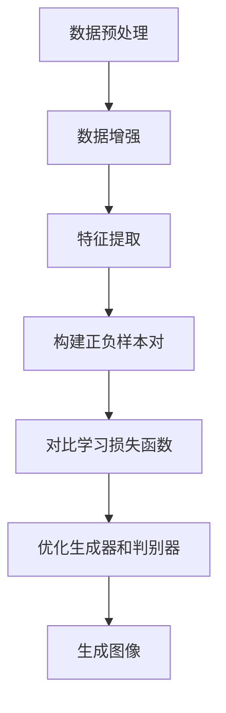

# 对比学习在图像生成中的应用

## 1.背景介绍

随着深度学习技术的不断发展,生成式对抗网络(Generative Adversarial Networks, GANs)在图像生成领域取得了巨大成功。然而,传统的GAN存在着训练不稳定、模式崩溃等问题,导致生成图像质量参差不齐。为了解决这些问题,对比学习(Contrastive Learning)被引入到图像生成任务中,取得了卓越的效果。

对比学习是一种自监督学习范式,通过最大化相似样本之间的相似度,最小化不相似样本之间的相似度,来学习数据的潜在表示。与传统的监督学习不同,对比学习不需要人工标注的数据,可以从大量未标注数据中学习有用的表示。

## 2.核心概念与联系

### 2.1 生成式对抗网络(GANs)

生成式对抗网络是一种由生成器(Generator)和判别器(Discriminator)组成的深度学习架构。生成器的目标是生成逼真的图像,而判别器的目标是区分生成的图像和真实图像。生成器和判别器相互对抗,最终达到一个纳什均衡,生成器生成的图像无法被判别器识别为假图像。

### 2.2 对比学习(Contrastive Learning)

对比学习的核心思想是学习图像的潜在表示,使得相似图像的表示更接近,不相似图像的表示更远离。具体来说,对比学习通过构建正样本对(相似图像对)和负样本对(不相似图像对),最大化正样本对的相似度,最小化负样本对的相似度,从而学习到有区分能力的图像表示。

### 2.3 对比学习与GANs的结合

将对比学习引入到GANs中,可以帮助生成器学习到更好的图像表示,从而提高生成图像的质量和多样性。具体来说,对比学习可以作用于以下几个方面:

1. 提高生成器的表示能力,使生成的图像更加逼真
2. 增强判别器的判别能力,更好地区分真实图像和生成图像
3. 引导生成器生成更多样化的图像,避免模式崩溃问题

## 3.核心算法原理具体操作步骤

对比学习在图像生成中的应用主要分为以下几个步骤:

1. **数据预处理**: 首先需要准备训练数据集,包括真实图像和生成图像。对于真实图像,可以使用公开数据集;对于生成图像,可以使用预训练的GAN模型生成。

2. **数据增强**: 为了增加训练数据的多样性,通常会对图像进行数据增强,例如随机裁剪、翻转、旋转等操作。

3. **特征提取**: 使用预训练的卷积神经网络(CNN)作为编码器,提取图像的特征表示。常用的编码器包括ResNet、VGG等。

4. **构建正负样本对**: 根据图像的特征表示,构建正样本对(相似图像对)和负样本对(不相似图像对)。常见的策略包括:
   - 正样本对: 同一图像的不同数据增强版本
   - 负样本对: 不同图像的数据增强版本

5. **对比学习损失函数**: 定义对比学习的损失函数,通常使用NT-Xent损失或InfoNCE损失。损失函数的目标是最大化正样本对的相似度,最小化负样本对的相似度。

   NT-Xent损失函数:
   $$\mathcal{L}_i = -\log\frac{\exp(\text{sim}(z_i, z_{i^+}) / \tau)}{\sum_{j=1}^{2N}\mathbb{1}_{[j\neq i]}\exp(\text{sim}(z_i, z_j) / \tau)}$$

   其中,$z_i$和$z_{i^+}$分别表示正样本对的特征表示,$\tau$是温度超参数,控制相似度分布的平滑程度。

6. **优化生成器和判别器**: 将对比学习损失函数与传统的GAN损失函数相结合,联合优化生成器和判别器的参数,提高图像生成质量。

7. **生成图像**: 使用优化后的生成器模型生成新的图像。

上述步骤可以用以下Mermaid流程图来表示:



## 4.数学模型和公式详细讲解举例说明

在对比学习中,核心的数学模型是NT-Xent损失函数(Normalized Temperature-scaled Cross Entropy Loss),用于最大化正样本对的相似度,最小化负样本对的相似度。NT-Xent损失函数的公式如下:

$$\mathcal{L}_i = -\log\frac{\exp(\text{sim}(z_i, z_{i^+}) / \tau)}{\sum_{j=1}^{2N}\mathbb{1}_{[j\neq i]}\exp(\text{sim}(z_i, z_j) / \tau)}$$

其中:

- $z_i$和$z_{i^+}$分别表示正样本对的特征表示
- $\text{sim}(u, v)$表示两个向量$u$和$v$的相似度函数,通常使用余弦相似度:$\text{sim}(u, v) = \frac{u^Tv}{\|u\|\|v\|}$
- $\tau$是温度超参数,控制相似度分布的平滑程度
- $N$是批次大小,分母中的求和项表示对所有$2N$个样本进行计算,并排除正样本对本身
- $\mathbb{1}_{[j\neq i]}$是指示函数,用于排除正样本对本身

让我们用一个具体的例子来解释NT-Xent损失函数:

假设我们有一个批次,包含4张图像$\{x_1, x_2, x_3, x_4\}$,其中$x_1$和$x_2$是一对正样本对,即相似的图像;$x_3$和$x_4$是不相似的图像。我们使用编码器提取这些图像的特征表示$\{z_1, z_2, z_3, z_4\}$。

对于正样本对$x_1$和$x_2$,我们希望它们的特征表示$z_1$和$z_2$尽可能相似,因此我们需要最大化$\text{sim}(z_1, z_2)$。同时,我们希望$z_1$和其他负样本$z_3$、$z_4$的相似度尽可能小,因此我们需要最小化$\text{sim}(z_1, z_3)$和$\text{sim}(z_1, z_4)$。

NT-Xent损失函数就是实现这个目标的数学模型。对于$x_1$,它的NT-Xent损失为:

$$\mathcal{L}_1 = -\log\frac{\exp(\text{sim}(z_1, z_2) / \tau)}{\exp(\text{sim}(z_1, z_2) / \tau) + \exp(\text{sim}(z_1, z_3) / \tau) + \exp(\text{sim}(z_1, z_4) / \tau)}$$

可以看出,分子项$\exp(\text{sim}(z_1, z_2) / \tau)$表示正样本对的相似度,分母中的其他项表示负样本对的相似度。通过最小化这个损失函数,我们可以最大化正样本对的相似度,最小化负样本对的相似度。

温度超参数$\tau$控制着相似度分布的平滑程度。当$\tau$较小时,相似度分布更加尖锐,模型更容易区分正负样本对;当$\tau$较大时,相似度分布更加平滑,模型对正负样本对的区分能力会降低。

## 5.项目实践:代码实例和详细解释说明

在本节中,我们将提供一个使用PyTorch实现对比学习的代码示例,并详细解释每一步骤。

### 5.1 导入必要的库

```python
import torch
import torch.nn as nn
import torch.nn.functional as F
from torchvision import transforms, datasets
```

### 5.2 定义数据增强和数据加载

```python
# 数据增强
data_transforms = transforms.Compose([
    transforms.RandomResizedCrop(224),
    transforms.RandomHorizontalFlip(),
    transforms.ToTensor(),
    transforms.Normalize([0.485, 0.456, 0.406], [0.229, 0.224, 0.225])
])

# 加载数据集
train_dataset = datasets.ImageFolder('path/to/dataset', transform=data_transforms)
train_loader = torch.utils.data.DataLoader(train_dataset, batch_size=256, shuffle=True, num_workers=4)
```

在这个示例中,我们使用了`torchvision`库提供的`transforms`模块进行数据增强,包括随机裁剪、随机水平翻转和标准化。然后,我们加载了一个图像文件夹数据集,并使用`DataLoader`创建了一个迭代器。

### 5.3 定义编码器网络

```python
# 编码器网络
class Encoder(nn.Module):
    def __init__(self):
        super(Encoder, self).__init__()
        self.backbone = models.resnet50(pretrained=True)
        self.backbone.fc = nn.Identity()  # 去掉最后一层全连接层

    def forward(self, x):
        x = self.backbone(x)
        return x
```

在这个示例中,我们使用了预训练的ResNet-50作为编码器网络。我们移除了最后一层全连接层,因为我们只需要提取特征表示。

### 5.4 定义对比学习损失函数

```python
# 对比学习损失函数
def contrastive_loss(features, temperature=0.5):
    batch_size, _ = features.shape
    
    # 构建正负样本对
    labels = torch.cat([torch.arange(batch_size) for _ in range(2)], dim=0)
    masks = torch.eye(batch_size, dtype=torch.bool)
    
    # 计算相似度矩阵
    similarities = torch.matmul(features, features.T)
    
    # 计算损失函数
    logits_max, _ = torch.max(similarities, dim=1, keepdim=True)
    logits = similarities - logits_max.detach()
    logits_mask = torch.scatter(torch.ones_like(logits), 1, torch.arange(batch_size).view(-1, 1), 0)
    logits = logits * logits_mask
    
    negatives = logits[~masks].view(batch_size, -1)
    positives = logits[masks].unsqueeze(1)
    
    logits = torch.cat([positives, negatives], dim=1)
    labels = torch.zeros(batch_size, dtype=torch.long)
    
    loss = F.cross_entropy(logits / temperature, labels)
    
    return loss
```

在这个示例中,我们实现了对比学习损失函数。首先,我们构建正负样本对,其中正样本对是同一图像的不同数据增强版本,负样本对是不同图像的数据增强版本。然后,我们计算特征表示之间的相似度矩阵,并使用NT-Xent损失函数进行优化。

### 5.5 训练循环

```python
# 训练循环
encoder = Encoder().to(device)
optimizer = torch.optim.Adam(encoder.parameters(), lr=0.001)

for epoch in range(num_epochs):
    for images, _ in train_loader:
        images = images.to(device)
        
        features = encoder(images)
        loss = contrastive_loss(features)
        
        optimizer.zero_grad()
        loss.backward()
        optimizer.step()
        
    print(f'Epoch {epoch+1}/{num_epochs}, Loss: {loss.item():.4f}')
```

在训练循环中,我们将图像输入编码器网络,计算对比学习损失函数,并使用Adam优化器更新网络参数。每个epoch结束后,我们打印当前的损失值。

通过上述代码示例,我们可以看到如何在PyTorch中实现对比学习,并将其应用于图像生成任务中。

## 6.实际应用场景

对比学习在图像生成领域有着广泛的应用,包括但不限于以下场景:

1. **图像去噪和超分辨率重建**: 通过对比学习学习图像的潜在表示,可以更好地捕捉图像的细节和结构信息,从而实现高质量的图像去噪和超分辨率重建。

2. **图像插值和补全**: 对比学习可以学习图像的潜在表示,从而实现图像插值和补全任务,例如人脸插值、物体移除和插入等。

3. **图像编辑和风格迁移**: 利用对比学习学习到的图像表示,可以实现图像编辑和风格迁移任务,例如改变图像的色调、纹理或风格等。

4. **图