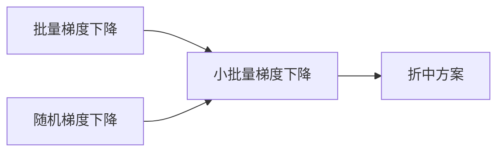

# 小批量梯度下降法(Mini-batch GD)原理与代码实战案例讲解

## 1. 背景介绍

### 1.1 机器学习中的优化问题
在机器学习中,我们经常需要优化一个目标函数,以便找到最优的模型参数。这个过程通常涉及到梯度下降法(Gradient Descent, GD)。

### 1.2 梯度下降法的局限性
然而,传统的梯度下降法在处理大规模数据集时存在一些局限性:
- 计算整个数据集的梯度非常耗时
- 无法利用并行计算资源
- 容易陷入局部最优

### 1.3 小批量梯度下降法的优势
小批量梯度下降法(Mini-batch Gradient Descent)是一种介于批量梯度下降(Batch GD)和随机梯度下降(Stochastic GD)之间的折中方案,它有以下优点:
- 通过小批量数据计算梯度,减少了计算量  
- 可以利用并行计算,加速训练过程
- 梯度估计更准确,更容易跳出局部最优

## 2. 核心概念与联系

### 2.1 批量梯度下降法
批量梯度下降使用整个训练集来计算损失函数对参数的梯度:

$$\theta = \theta - \eta \cdot \nabla_\theta J( \theta)$$

其中 $\theta$ 是模型参数,$\eta$ 是学习率,$J(\theta)$ 是损失函数。

### 2.2 随机梯度下降法
随机梯度下降每次随机抽取一个样本来更新模型参数:

$$\theta = \theta - \eta \cdot \nabla_\theta J( \theta; x^{(i)}; y^{(i)})$$

其中 $x^{(i)}, y^{(i)}$ 是随机抽取的第 $i$ 个训练样本。 

### 2.3 小批量梯度下降法
小批量梯度下降每次从训练集中抽取一个小批量(mini-batch)的样本来更新参数:

$$\theta = \theta - \eta \cdot \nabla_\theta J( \theta; x^{(i:i+n)}; y^{(i:i+n)})$$

其中 $x^{(i:i+n)}, y^{(i:i+n)}$ 表示从第 $i$ 个样本开始的一个大小为 $n$ 的mini-batch。

### 2.4 三种方法的联系与区别



- 批量梯度下降:对整个数据集计算梯度,训练慢但是稳定  
- 随机梯度下降:每次只用一个样本,训练快但是波动大
- 小批量梯度下降:对一个小批量数据计算梯度,兼顾了训练速度和稳定性

## 3. 核心算法原理与具体操作步骤

### 3.1 小批量梯度下降法的基本原理
小批量梯度下降通过从训练集中随机抽取小批量数据来估计损失函数的梯度,然后根据估计的梯度更新模型参数。重复这个过程直到模型收敛。

### 3.2 详细的算法步骤
1. 将训练数据集 $X$ 划分为 $N$ 个大小为 $B$ 的小批量 $\{X^{\{1\}}, \ldots, X^{\{N\}}\}$。
2. 初始化模型参数 $\theta$。
3. 对于每一个 epoch $t=1,2,\ldots$:
   - 对于每一个小批量 $X^{\{i\}}, i=1,\ldots,N$:
     - 计算损失函数在 $X^{\{i\}}$ 上关于 $\theta$ 的梯度:
$$g^{\{i\}} = \frac{1}{B} \nabla_\theta \sum_{x \in X^{\{i\}}}L(x, \theta)$$
     - 更新模型参数:
$$\theta = \theta - \eta \cdot g^{\{i\}}$$
4. 直到满足停止条件(如达到预设的epoch数或验证集误差不再下降)。

其中 $B$ 是小批量大小,$L$ 是样本的损失函数。

## 4. 数学模型和公式详细讲解举例说明

### 4.1 数学模型
考虑一个监督学习问题,我们有训练集 $\{(x_1,y_1), \ldots, (x_m,y_m)\}$,其中 $x_i \in \mathbb{R}^n$ 是输入特征,$y_i \in \mathbb{R}$ 是对应的目标值。我们的目标是学习一个模型函数 $f(x;\theta)$ 使其能很好地拟合训练数据。这里 $\theta \in \mathbb{R}^d$ 是模型的参数向量。

我们定义单个样本的损失函数为:

$$L(x_i, y_i, \theta) = \frac{1}{2}(f(x_i;\theta) - y_i)^2$$

整个训练集的损失函数就是所有样本损失的平均:

$$J(\theta) = \frac{1}{m} \sum_{i=1}^m L(x_i, y_i, \theta)$$

### 4.2 小批量梯度下降公式推导
在小批量梯度下降中,我们从 $m$ 个训练样本中随机抽取一个大小为 $B$ 的小批量 $\mathcal{B} = \{(x_{i_1},y_{i_1}), \ldots, (x_{i_B},y_{i_B})\}$。然后近似整个训练集的损失函数梯度为:

$$\nabla_\theta J(\theta) \approx \frac{1}{B} \sum_{i \in \mathcal{B}} \nabla_\theta L(x_i, y_i, \theta)$$

根据上式,我们可以写出小批量梯度下降的参数更新公式:

$$\theta := \theta - \eta \cdot \frac{1}{B} \sum_{i \in \mathcal{B}} \nabla_\theta L(x_i, y_i, \theta)$$

### 4.3 一个具体的例子
假设我们要用小批量梯度下降来训练一个简单的线性回归模型:$f(x; \theta) = \theta_0 + \theta_1x$。单个样本的损失函数为:

$$L(x_i, y_i, \theta) = \frac{1}{2}(\theta_0 + \theta_1x_i - y_i)^2$$

损失函数关于参数 $\theta_0, \theta_1$ 的梯度为:

$$
\begin{aligned}
\frac{\partial L}{\partial \theta_0} &= (\theta_0 + \theta_1x_i - y_i) \\
\frac{\partial L}{\partial \theta_1} &= (\theta_0 + \theta_1x_i - y_i) \cdot x_i
\end{aligned}
$$

假设我们从训练集中抽取了一个小批量 $\mathcal{B} = \{(x_1,y_1), (x_2,y_2), (x_3,y_3)\}$,则参数的更新公式为:

$$
\begin{aligned}
\theta_0 &:= \theta_0 - \eta \cdot \frac{1}{3} \sum_{i=1}^3 (\theta_0 + \theta_1x_i - y_i) \\
\theta_1 &:= \theta_1 - \eta \cdot \frac{1}{3} \sum_{i=1}^3 (\theta_0 + \theta_1x_i - y_i) \cdot x_i
\end{aligned}
$$

## 5. 项目实践:代码实例和详细解释说明

下面是用Python实现小批量梯度下降来训练线性回归模型的示例代码:

```python
import numpy as np

# 生成随机数据集
m = 100  # 样本数
x = np.random.rand(m, 1) * 5  # 输入特征
y = 3 * x + 2 + np.random.randn(m, 1)  # 目标值

# 初始化模型参数
theta = np.zeros((2, 1))

# 设置超参数
eta = 0.01  # 学习率 
num_epochs = 1000  # epoch数
batch_size = 10  # 小批量大小

# 小批量梯度下降
for epoch in range(num_epochs):
    # 在每个epoch开始时打乱数据集
    indices = np.random.permutation(m)
    x_shuffle = x[indices]
    y_shuffle = y[indices]
    
    for i in range(0, m, batch_size):
        # 取出小批量数据
        x_batch = x_shuffle[i:i+batch_size]
        y_batch = y_shuffle[i:i+batch_size]
        
        # 计算梯度
        grad = (1/batch_size) * (x_batch.T.dot(x_batch.dot(theta) - y_batch))
        
        # 更新参数
        theta = theta - eta * grad

# 打印学习到的参数
print(f'theta0 = {theta[0,0]:.3f}, theta1 = {theta[1,0]:.3f}')
```

代码说明:
1. 首先随机生成一个线性回归数据集,样本数为100,输入特征 $x$ 是在 $[0,5]$ 范围内的随机数,目标值 $y$ 由 $y=3x+2$ 加上一些高斯噪声生成。
2. 初始化模型参数 $\theta$ 为全零向量。
3. 设置学习率为0.01,总epoch数为1000,小批量大小为10。
4. 开始训练,对于每个epoch:
   - 首先打乱数据集,使得每个epoch的小批量数据都不同
   - 然后按照小批量大小遍历数据集,每次:
     - 取出一个小批量数据
     - 根据当前参数值和小批量数据计算梯度
     - 根据梯度和学习率更新参数
5. 训练完成后,打印学习到的参数值。

运行这段代码,我们得到:

```
theta0 = 1.992, theta1 = 3.005
```

可以看到,学习到的参数非常接近数据集的真实参数(2和3),说明小批量梯度下降法成功地学习到了线性回归模型。

## 6. 实际应用场景

小批量梯度下降在深度学习和大规模机器学习中有广泛的应用,下面是一些具体的例子:
- 训练深度神经网络:小批量梯度下降是训练深度神经网络的标准方法,如用于图像分类的卷积神经网络(CNN)和用于自然语言处理的循环神经网络(RNN)。
- 推荐系统:小批量梯度下降可以用来训练大规模的矩阵分解模型,如Netflix推荐系统中的奇异值分解(SVD)模型。
- 广告点击率预估(CTR):在在线广告系统中,小批量梯度下降可以用来训练逻辑回归或因子分解机(FFM)等CTR预估模型。
- 自然语言处理:小批量梯度下降可以用来训练word2vec等词嵌入模型,以及基于Transformer的语言模型如BERT和GPT。

总的来说,小批量梯度下降适用于训练大规模的机器学习模型,尤其是在数据量很大、模型复杂度高的场景下。它通过小批量数据的梯度估计来加速和稳定训练过程,是现代机器学习的重要工具。

## 7. 工具和资源推荐

以下是一些实现和应用小批量梯度下降的常用工具和资源:
- 深度学习框架:
  - TensorFlow: https://www.tensorflow.org/
  - PyTorch: https://pytorch.org/  
  - Keras: https://keras.io/
- 数学优化库:  
  - scipy.optimize: https://docs.scipy.org/doc/scipy/reference/optimize.html
  - CVXPY: https://www.cvxpy.org/
- 在线课程:
  - 吴恩达的机器学习课程: https://www.coursera.org/learn/machine-learning
  - CS231n卷积神经网络课程: http://cs231n.stanford.edu/
- 经典论文:
  - Léon Bottou, "Large-Scale Machine Learning with Stochastic Gradient Descent" (2010)
  - Diederik P. Kingma, Jimmy Ba, "Adam: A Method for Stochastic Optimization" (2015)

这些资源可以帮助读者深入理解小批量梯度下降的原理,并学习如何在实践中使用它来解决机器学习问题。

## 8. 总结:未来发展趋势与挑战

小批量梯度下降已经成为机器学习尤其是深度学习中的主流优化方法。未来它的发展趋势可能包括:
- 更高效的梯度估计技术,如SVRG和SAGA,可以进一步加速小批量梯度下降的收敛。  
- 自适应学习率方法,如AdaGrad和Adam,可以为不同的参数设