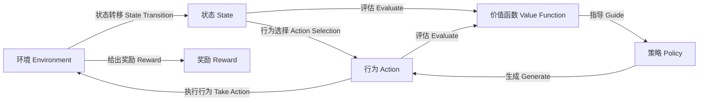

# 强化学习算法：Q-learning 原理与代码实例讲解

## 1.背景介绍

### 1.1 什么是强化学习?

强化学习(Reinforcement Learning)是机器学习的一个重要分支,它致力于研究智能体(Agent)如何在与环境(Environment)的交互过程中,通过试错学习并获得最优策略(Optimal Policy),以最大化预期的累积奖励(Cumulative Reward)。

与监督学习不同,强化学习没有提供带标签的训练数据集,智能体需要通过不断尝试并从环境反馈中学习。这种范式非常贴近现实世界,也是人类学习新事物的方式。

### 1.2 强化学习的应用场景

强化学习广泛应用于:

- 机器人控制
- 游戏AI
- 自动驾驶
- 资源管理
- 金融交易
- ...

任何需要根据环境做出决策并获取反馈的问题,都可以使用强化学习来解决。

## 2.核心概念与联系

强化学习问题由以下几个核心要素构成:

- **环境(Environment)**: 智能体与之交互的外部世界。
- **状态(State)**: 环境的当前情况。
- **奖励(Reward)**: 环境对智能体行为的反馈,指导智能体朝着正确方向学习。
- **策略(Policy)**: 智能体在每个状态下选择行为的规则或函数映射。
- **价值函数(Value Function)**: 评估一个状态的好坏或一个状态-行为对的价值。

这些要素之间的关系如下:



强化学习的目标是找到一个最优策略,使智能体在与环境交互时获得的累积奖励最大化。

## 3.核心算法原理具体操作步骤

### 3.1 Q-Learning 算法介绍

Q-Learning是强化学习中一种基于价值的、无模型的算法,由计算机科学家Chris Watkins在1989年提出。它不需要环境的转移概率模型,通过不断尝试并根据获得的奖励更新状态-行为对的价值函数Q(s,a),从而逐步获得最优策略。

Q-Learning算法的核心思想是:

**在每个状态下,选择具有最大Q值的行为,就能获得最大的预期未来奖励。**

### 3.2 Q-Learning算法步骤

1. **初始化**:对所有可能的状态-行为对,初始化其Q值,通常设为0或一个较小的值。

2. **选择行为**:在当前状态s下,根据一定的策略(如ε-贪婪策略)选择一个行为a。

3. **执行行为**:执行选择的行为a,观察环境反馈的奖励r,以及转移到的新状态s'。

4. **更新Q值**:使用下面的Bellman方程更新Q(s,a)的值:

$$Q(s, a) \leftarrow Q(s, a) + \alpha \Big(r + \gamma \max_{a'} Q(s', a') - Q(s, a)\Big)$$

其中:
- $\alpha$ 是学习率,控制学习的速度
- $\gamma$ 是折扣因子,决定未来奖励的衰减程度

5. **重复步骤2-4**,直到算法收敛或达到终止条件。

通过不断更新Q值,Q-Learning最终会收敛到最优的Q函数,从而得到最优策略。

### 3.3 Q-Learning 算法伪代码

```python
初始化 Q(s, a)
重复 (对每个回合):
    初始化状态 s
    重复 (对每个步骤同一回合):
        从 s 选择行为 a,根据策略从 Q 派生(如ε-贪婪)  
        执行行为 a,观察奖励 r 和新状态 s'
        Q(s, a) <- Q(s, a) + α[r + γ max(Q(s',a')) - Q(s,a)]
        s <- s'
    直到 s 是终止状态
```

## 4.数学模型和公式详细讲解举例说明

### 4.1 Bellman方程

Q-Learning算法的核心是利用Bellman方程来更新Q值。Bellman方程揭示了当前状态的价值与下一状态的价值之间的递推关系。

对于Q-Learning算法,Bellman方程为:

$$Q(s, a) \leftarrow Q(s, a) + \alpha \Big(r + \gamma \max_{a'} Q(s', a') - Q(s, a)\Big)$$

其中:

- $Q(s, a)$ 是当前状态s下执行行为a的Q值
- $r$ 是执行行为a后获得的即时奖励
- $\max_{a'} Q(s', a')$ 是下一状态s'下,所有可能行为a'中Q值的最大值
- $\gamma$ 是折扣因子,控制未来奖励的衰减程度,取值范围[0, 1)
- $\alpha$ 是学习率,控制Q值更新的幅度,取值范围(0, 1]

直观上,这个等式右边的第一项$r$是立即获得的奖励,第二项$\gamma \max_{a'} Q(s', a')$是根据新状态s'下所有可能行为中Q值的最大值,预测未来可能获得的奖励。

通过不断应用这个等式更新Q值,Q-Learning算法就能逐步找到最优的Q函数,从而得到最优策略。

### 4.2 Q-Learning算法收敛性证明

Q-Learning算法的收敛性已被数学证明。也就是说,只要满足适当的条件,Q-Learning算法一定会收敛到最优的Q函数。

证明的主要思路是构造一个基于Bellman方程的最优Q函数$Q^*$,并证明Q-Learning算法的Q值序列{$Q_t$}在满足以下两个条件时,一定会收敛到$Q^*$:

1. 每个状态-行为对被探索无数次
2. 学习率$\alpha_t$满足:
   - $\sum_{t=1}^{\infty} \alpha_t = \infty$ (持续学习)
   - $\sum_{t=1}^{\infty} \alpha_t^2 < \infty$ (学习率适当衰减)

这个证明结果保证了,只要环境的马尔可夫决策过程是可探索的,并且采用合理的学习率,Q-Learning算法就一定能找到最优策略。

### 4.3 Q-Learning算法收敛举例

以格子世界(Gridworld)为例,假设智能体从起点(0,0)开始,目标是到达终点(3,3),每一步行动都会获得-1的奖励,除非到达终点获得+10的奖励。

使用Q-Learning算法训练若干回合后,最终的Q值矩阵如下:

$$
Q = \begin{bmatrix}
    \begin{bmatrix}
    0&-1&-2&-3\\
    -1&-2&-3&-2\\
    -2&-3&-2&-1\\
    -3&-2&0&10
    \end{bmatrix}
    &
    \begin{bmatrix}
    -1&0&-1&-2\\
    0&-1&-2&-1\\
    -1&-2&-1&0\\
    -2&-1&10&9
    \end{bmatrix}
    \\
    \begin{bmatrix}
    -2&-1&0&-1\\
    -1&0&-1&0\\
    0&-1&0&1\\
    -1&0&9&8
    \end{bmatrix}
    &
    \begin{bmatrix}
    -3&-2&-1&0\\
    -2&-1&0&1\\
    -1&0&1&2\\
    0&1&8&7
    \end{bmatrix}
\end{bmatrix}
$$

其中每个子矩阵对应当前状态下四个可能的行为(上下左右移动)的Q值。

从Q值矩阵可以看出,Q-Learning算法已经学习到了从起点(0,0)到达终点(3,3)的最优路径,并给出了每个状态下执行不同行为的价值评估。

## 5.项目实践:代码实例和详细解释说明

下面是一个使用Python实现Q-Learning算法的简单示例,应用于格子世界环境:

```python
import numpy as np

# 格子世界环境
WORLD = np.array([
    [0, 0, 0, 1],
    [0, None, 0, -1],
    [0, 0, 0, 0]
])

# 奖励值
REWARDS = {
    0: -0.04,
    None: -1,
    1: 1
}

# 折扣因子
GAMMA = 0.9

# 学习率
ALPHA = 0.8

# 探索概率
EPSILON = 0.1

# Q值初始化为0
Q = {}
for i in range(WORLD.shape[0]):
    for j in range(WORLD.shape[1]):
        Q[(i, j)] = {
            'u': 0.,
            'd': 0.,
            'l': 0.,
            'r': 0.
        }

# 可能的行为
ACTIONS = ['u', 'd', 'l', 'r']

# 训练
for episode in range(1000):
    # 初始位置
    i, j = 2, 0
    while WORLD[i, j] != 1:
        # 选择行为
        if np.random.random() < EPSILON:
            action = np.random.choice(ACTIONS)
        else:
            values = Q[(i, j)]
            action = max(values, key=values.get)
        
        # 执行行为
        if action == 'u':
            i -= 1
        elif action == 'd':
            i += 1
        elif action == 'l':
            j -= 1
        elif action == 'r':
            j += 1
        
        # 边界处理
        i = max(0, min(WORLD.shape[0]-1, i))
        j = max(0, min(WORLD.shape[1]-1, j))
        
        # 获取奖励
        reward = REWARDS[WORLD[i, j]]
        
        # 更新Q值
        s = (i, j)
        a = action
        old_value = Q[s][a]
        next_max = max([Q[(i, j)][a] for a in ACTIONS])
        new_value = old_value + ALPHA * (reward + GAMMA * next_max - old_value)
        Q[s][a] = new_value

# 打印Q值
for i in range(WORLD.shape[0]):
    for j in range(WORLD.shape[1]):
        state = (i, j)
        print(f'{state}: {Q[state]}')
```

代码解释:

1. 首先定义了一个简单的格子世界环境WORLD,其中0表示可以通过的格子,None表示障碍物格子,1表示终点格子。
2. 定义了不同格子的奖励值REWARDS,通过格子为0时获得-0.04的小惩罚,遇到障碍物时获得-1的大惩罚,到达终点时获得+1的奖励。
3. 初始化Q值字典Q,键为状态(i,j),值为一个字典,存储当前状态下四个可能行为的Q值。
4. 开始训练,每个回合从(2,0)出发,执行下列步骤直到到达终点:
    - 根据ε-贪婪策略选择行为
    - 执行选择的行为,获取奖励
    - 根据Bellman方程更新Q值
5. 循环1000个回合后,打印出最终的Q值字典。

通过这个简单的例子,你可以更好地理解Q-Learning算法的工作原理和实现方式。在实际应用中,可以针对不同的问题构建更复杂的环境,并对算法进行优化和改进。

## 6.实际应用场景

### 6.1 游戏AI

强化学习在游戏AI领域有着广泛的应用,尤其是Q-Learning算法。DeepMind的AlphaGo就使用了强化学习和深度神经网络相结合的技术,最终战胜了人类顶尖棋手。

在经典游戏如国际象棋、围棋、扑克等领域,Q-Learning可以帮助AI从自我对弈中学习,不断提高棋力。而在视频游戏中,Q-Learning可用于控制游戏角色,学习如何通过关卡获得最高分数。

### 6.2 机器人控制

在机器人控制领域,强化学习可以帮助机器人学习如何在复杂环境中导航、操作物体等任务。Q-Learning算法可以根据机器人的动作和环境反馈,逐步学习到最优控制策略。

例如,波士顿动力公司的Atlas机器人就使用了强化学习技术,能够在崎岖的地形上行走,