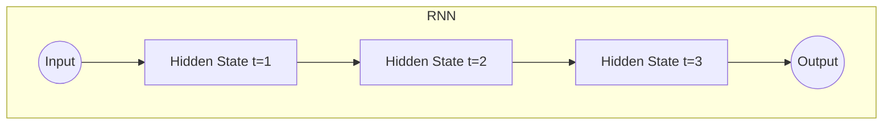

# 循环神经网络 (Recurrent Neural Network)

## 1.背景介绍

循环神经网络(Recurrent Neural Network, RNN)是一种用于处理序列数据的神经网络模型。与传统的前馈神经网络不同,RNN具有记忆能力,可以捕捉序列数据中的动态行为和时间模式。这使得RNN在自然语言处理、语音识别、时间序列预测等领域有着广泛的应用。

RNN的核心思想是在隐藏层中引入循环连接,使得网络能够将当前输入与之前的状态相结合,从而对整个序列建模。这种循环结构允许信息在序列的时间步之间传递,捕捉长期依赖关系。

## 2.核心概念与联系

### 2.1 循环神经网络结构

RNN的基本结构由输入层、隐藏层和输出层组成。隐藏层中的神经元不仅与当前时间步的输入相连,还与上一时间步的隐藏状态相连,形成了循环连接。这种结构使得RNN能够整合当前输入和过去的信息,捕捉序列数据中的动态模式。



### 2.2 长期依赖问题

尽管RNN理论上可以捕捉任意长度的序列模式,但在实践中,它们往往难以学习长期依赖关系。这是因为在反向传播过程中,梯度会随着时间步的增加而呈指数级衰减或爆炸,导致无法有效地捕捉长期依赖。这个问题被称为"梯度消失/爆炸"问题。

### 2.3 门控机制

为了解决长期依赖问题,研究人员提出了门控机制,如长短期记忆网络(LSTM)和门控循环单元(GRU)。这些变体在隐藏层中引入了门控单元,用于控制信息的流动。门控单元可以学习何时保留、更新或忘记信息,从而有效地捕捉长期依赖关系。

## 3.核心算法原理具体操作步骤

### 3.1 基本RNN前向传播

在基本RNN中,每个时间步的隐藏状态 $h_t$ 由当前输入 $x_t$ 和上一时间步的隐藏状态 $h_{t-1}$ 计算得到:

$$h_t = \tanh(W_{hh}h_{t-1} + W_{xh}x_t + b_h)$$

其中, $W_{hh}$ 和 $W_{xh}$ 分别是隐藏层与隐藏层、输入层与隐藏层之间的权重矩阵, $b_h$ 是隐藏层的偏置项。

输出 $y_t$ 由隐藏状态 $h_t$ 和输出层权重矩阵 $W_{hy}$ 计算得到:

$$y_t = W_{hy}h_t + b_y$$

其中 $b_y$ 是输出层的偏置项。

### 3.2 BPTT 算法

RNN的训练通过反向传播through时间(Backpropagation Through Time, BPTT)算法进行。BPTT将整个序列展开为一个非常深的前馈网络,并在展开的网络上应用标准的反向传播算法。

在每个时间步,误差从输出层向后传播到隐藏层,并累积到隐藏层的梯度中。隐藏层的梯度不仅依赖于当前时间步的误差,还依赖于来自后续时间步的梯度。这种递归计算方式使得BPTT能够捕捉序列中的长期依赖关系。

### 3.3 梯度剪裁

为了缓解梯度爆炸问题,通常采用梯度剪裁(Gradient Clipping)技术。梯度剪裁将梯度值限制在一个预定义的范围内,防止梯度值过大导致数值不稳定。

## 4.数学模型和公式详细讲解举例说明

### 4.1 LSTM 细胞状态更新

长短期记忆网络(LSTM)是一种特殊的RNN,它引入了细胞状态(Cell State)和门控机制来解决长期依赖问题。LSTM的核心思想是通过精心设计的门控单元来控制信息的流动,从而更好地捕捉长期依赖关系。

LSTM在每个时间步都会更新细胞状态 $c_t$,细胞状态的更新过程如下:

1. 忘记门(Forget Gate)决定了从上一时间步的细胞状态 $c_{t-1}$ 中保留多少信息:

$$f_t = \sigma(W_f[h_{t-1}, x_t] + b_f)$$

2. 输入门(Input Gate)决定了从当前输入 $x_t$ 和上一隐藏状态 $h_{t-1}$ 中获取多少新信息:

$$i_t = \sigma(W_i[h_{t-1}, x_t] + b_i)$$
$$\tilde{c}_t = \tanh(W_c[h_{t-1}, x_t] + b_c)$$

3. 细胞状态 $c_t$ 通过组合忘记门、输入门和候选细胞状态 $\tilde{c}_t$ 计算得到:

$$c_t = f_t \odot c_{t-1} + i_t \odot \tilde{c}_t$$

其中 $\odot$ 表示元素wise乘积操作。

4. 输出门(Output Gate)决定了从细胞状态中输出多少信息:

$$o_t = \sigma(W_o[h_{t-1}, x_t] + b_o)$$
$$h_t = o_t \odot \tanh(c_t)$$

通过这种精心设计的门控机制,LSTM可以有效地控制信息的流动,从而捕捉长期依赖关系。

### 4.2 GRU 更新门和重置门

门控循环单元(Gated Recurrent Unit, GRU)是另一种流行的RNN变体,它采用了更简单的门控机制。GRU在每个时间步更新隐藏状态 $h_t$ 的过程如下:

1. 更新门(Update Gate)决定了从上一时间步的隐藏状态 $h_{t-1}$ 中保留多少信息:

$$z_t = \sigma(W_z[h_{t-1}, x_t] + b_z)$$

2. 重置门(Reset Gate)决定了从上一时间步的隐藏状态 $h_{t-1}$ 中丢弃多少信息:

$$r_t = \sigma(W_r[h_{t-1}, x_t] + b_r)$$

3. 候选隐藏状态 $\tilde{h}_t$ 由当前输入 $x_t$ 和重置后的上一隐藏状态 $r_t \odot h_{t-1}$ 计算得到:

$$\tilde{h}_t = \tanh(W_h[r_t \odot h_{t-1}, x_t] + b_h)$$

4. 隐藏状态 $h_t$ 通过组合更新门、上一隐藏状态和候选隐藏状态计算得到:

$$h_t = (1 - z_t) \odot h_{t-1} + z_t \odot \tilde{h}_t$$

GRU相比LSTM具有更简单的结构,但在许多任务上也能取得相当好的性能。

## 5.项目实践:代码实例和详细解释说明

以下是使用PyTorch实现基本RNN的代码示例:

```python
import torch
import torch.nn as nn

# 定义RNN模型
class RNN(nn.Module):
    def __init__(self, input_size, hidden_size, output_size):
        super(RNN, self).__init__()
        self.hidden_size = hidden_size
        self.rnn = nn.RNN(input_size, hidden_size, batch_first=True)
        self.fc = nn.Linear(hidden_size, output_size)

    def forward(self, x):
        # 初始化隐藏状态
        h0 = torch.zeros(1, x.size(0), self.hidden_size)

        # 前向传播
        out, _ = self.rnn(x, h0)
        out = self.fc(out[:, -1, :])
        return out

# 创建模型实例
model = RNN(input_size=10, hidden_size=20, output_size=5)

# 输入数据
inputs = torch.randn(3, 5, 10)  # (batch_size, seq_len, input_size)

# 前向传播
outputs = model(inputs)
```

在这个示例中,我们定义了一个基本的RNN模型,包含一个RNN层和一个全连接层。

- `__init__`方法中,我们初始化了RNN层和全连接层。`batch_first=True`表示输入数据的形状为(batch_size, seq_len, input_size)。
- `forward`方法中,我们首先初始化隐藏状态`h0`为全零张量。然后,我们将输入数据`x`和初始隐藏状态`h0`传递给RNN层,得到输出`out`和最终隐藏状态。最后,我们将最后一个时间步的输出`out[:, -1, :]`传递给全连接层,得到最终输出。

在实际应用中,您可以根据具体任务调整RNN的结构和参数,例如使用LSTM或GRU代替基本RNN、添加dropout层等。此外,您还需要定义损失函数、优化器,并进行模型训练和评估。

## 6.实际应用场景

循环神经网络在以下领域有着广泛的应用:

1. **自然语言处理(NLP)**:RNN可以用于文本生成、机器翻译、情感分析、命名实体识别等任务。例如,在机器翻译中,RNN可以将源语言序列编码为隐藏状态,然后解码为目标语言序列。

2. **语音识别**:RNN可以处理语音信号的时间序列数据,用于自动语音识别系统。

3. **时间序列预测**:RNN可以捕捉时间序列数据中的动态模式,用于股票价格预测、天气预报等任务。

4. **手写识别**:RNN可以处理手写字符或数字的在线序列数据,用于手写识别系统。

5. **机器人控制**:RNN可以处理传感器数据的时间序列,用于机器人运动控制和规划。

6. **视频分析**:RNN可以处理视频帧序列数据,用于视频分类、行为识别等任务。

7. **音乐生成**:RNN可以捕捉音乐序列的结构和模式,用于自动作曲和音乐生成。

总的来说,任何涉及序列数据处理的领域都可以考虑使用RNN及其变体。

## 7.工具和资源推荐

以下是一些有用的工具和资源,可以帮助您进一步学习和实践循环神经网络:

1. **深度学习框架**:PyTorch、TensorFlow、Keras等深度学习框架都提供了RNN相关的模块和实现,可以方便地构建和训练RNN模型。

2. **在线课程**:Coursera、edX、Udacity等在线学习平台提供了许多关于RNN和序列建模的优质课程,包括来自顶尖大学和公司的课程。

3. **书籍**:《深度学习》(Goodfellow等著)、《模式识别与机器学习》(Christopher Bishop著)等经典书籍都包含了RNN的相关理论和实践内容。

4. **论文**:阅读相关领域的顶级会议和期刊论文,可以了解RNN的最新研究进展和前沿技术。

5. **开源项目**:GitHub上有许多优秀的开源RNN项目,如PyTorch Examples、TensorFlow Models等,可以学习和借鉴其中的代码实现。

6. **在线社区**:Stack Overflow、Reddit等在线社区是获取技术支持和交流经验的好去处。

7. **竞赛平台**:Kaggle、天池等数据科学竞赛平台提供了许多涉及序列建模的实际问题,可以锻炼和提高您的RNN建模能力。

8. **可视化工具**:TensorFlow Playground、Netron等工具可以帮助您可视化和理解RNN的结构和计算过程。

利用这些工具和资源,您可以更好地掌握RNN的理论知识,并将其应用于实际项目和问题中。

## 8.总结:未来发展趋势与挑战

循环神经网络在序列建模领域取得了巨大的成功,但仍然面临一些挑战和发展方向:

1. **长期依赖问题**:尽管LSTM和GRU在一定程度上缓解了长期依赖问题,但对于极长的序列,它们的性能仍然有限。新的架构和训练技术可能会进一步改善这一问