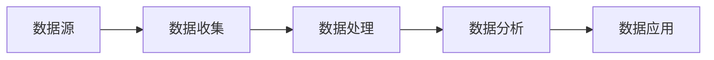

# 数据收集在餐饮业的应用

## 1. 背景介绍
### 1.1 餐饮行业数字化转型的必要性
#### 1.1.1 市场竞争日益激烈
#### 1.1.2 消费者需求不断变化  
#### 1.1.3 运营成本持续上升
### 1.2 数据收集在餐饮业数字化转型中的重要作用
#### 1.2.1 洞察消费者行为
#### 1.2.2 优化运营效率
#### 1.2.3 创新商业模式

## 2. 核心概念与联系
### 2.1 数据收集
#### 2.1.1 结构化数据
#### 2.1.2 非结构化数据
#### 2.1.3 数据源
### 2.2 数据处理
#### 2.2.1 数据清洗
#### 2.2.2 数据集成
#### 2.2.3 数据转换
### 2.3 数据分析
#### 2.3.1 描述性分析
#### 2.3.2 诊断性分析 
#### 2.3.3 预测性分析
#### 2.3.4 规范性分析



## 3. 核心算法原理具体操作步骤
### 3.1 数据预处理
#### 3.1.1 缺失值处理
#### 3.1.2 异常值检测
#### 3.1.3 数据标准化
### 3.2 关联规则挖掘
#### 3.2.1 Apriori算法
#### 3.2.2 FP-growth算法
### 3.3 聚类分析
#### 3.3.1 K-means算法
#### 3.3.2 层次聚类算法
### 3.4 分类预测
#### 3.4.1 决策树
#### 3.4.2 支持向量机
#### 3.4.3 逻辑回归

## 4. 数学模型和公式详细讲解举例说明
### 4.1 关联规则
#### 4.1.1 支持度
$Support(A \Rightarrow B) = \frac{\sigma(A \cup B)}{N}$
#### 4.1.2 置信度  
$Confidence(A \Rightarrow B) = \frac{\sigma(A \cup B)}{\sigma(A)}$
### 4.2 聚类分析
#### 4.2.1 欧氏距离
$$d(x,y)=\sqrt{\sum_{i=1}^{n}(x_i-y_i)^2}$$
#### 4.2.2 曼哈顿距离
$$d(x,y)=\sum_{i=1}^{n}|x_i-y_i|$$
### 4.3 分类预测
#### 4.3.1 信息熵
$$Entropy(D)=-\sum_{k=1}^{|y|}p_klog_2p_k$$
#### 4.3.2 信息增益
$$Gain(D,a) = Entropy(D) - \sum_{v=1}^{V}\frac{|D^v|}{|D|}Entropy(D^v)$$

## 5. 项目实践：代码实例和详细解释说明
### 5.1 数据预处理
```python
import pandas as pd

# 读取数据
data = pd.read_csv('data.csv') 

# 缺失值处理
data.fillna(data.mean(), inplace=True)

# 异常值检测
Q1 = data.quantile(0.25)
Q3 = data.quantile(0.75)
IQR = Q3 - Q1
data = data[~((data < (Q1 - 1.5 * IQR)) | (data > (Q3 + 1.5 * IQR))).any(axis=1)]

# 数据标准化
data_norm = (data - data.min()) / (data.max() - data.min())
```
### 5.2 关联规则挖掘
```python
from mlxtend.frequent_patterns import apriori
from mlxtend.frequent_patterns import association_rules

# 生成频繁项集
frequent_itemsets = apriori(data, min_support=0.05, use_colnames=True)

# 生成关联规则
rules = association_rules(frequent_itemsets, metric="lift", min_threshold=1)
```
### 5.3 聚类分析
```python
from sklearn.cluster import KMeans

# 确定最佳聚类数
scores = []
for i in range(2, 10):
    kmeans = KMeans(n_clusters=i)
    kmeans.fit(data)
    scores.append(kmeans.inertia_)

# 绘制肘部图
plt.plot(range(2, 10), scores)
plt.xlabel('Number of Clusters')
plt.ylabel('Score')
plt.show()

# 聚类
kmeans = KMeans(n_clusters=4)  
kmeans.fit(data)
```

### 5.4 分类预测
```python
from sklearn.tree import DecisionTreeClassifier
from sklearn.model_selection import train_test_split

# 划分训练集和测试集
X_train, X_test, y_train, y_test = train_test_split(X, y, test_size=0.3)

# 训练决策树模型
clf = DecisionTreeClassifier()
clf.fit(X_train, y_train)

# 模型评估
print(clf.score(X_test, y_test))
```

## 6. 实际应用场景
### 6.1 菜品推荐
#### 6.1.1 关联规则挖掘常点菜品组合
#### 6.1.2 协同过滤推荐用户可能喜欢的菜品
### 6.2 顾客分群
#### 6.2.1 基于消费行为的顾客细分
#### 6.2.2 针对不同群体制定营销策略
### 6.3 需求预测
#### 6.3.1 预测不同时段的用餐人数
#### 6.3.2 优化原料采购和库存管理
### 6.4 门店选址
#### 6.4.1 分析区域人口特征和消费能力
#### 6.4.2 选择客流量大、竞争小的优质地段

## 7. 工具和资源推荐
### 7.1 数据收集
#### 7.1.1 POS系统
#### 7.1.2 移动应用
#### 7.1.3 社交媒体
### 7.2 数据处理
#### 7.2.1 Excel
#### 7.2.2 Python（Pandas、Numpy）
#### 7.2.3 SQL
### 7.3 数据分析
#### 7.3.1 Python（Scikit-learn、Matplotlib）
#### 7.3.2 R语言
#### 7.3.3 Tableau
#### 7.3.4 PowerBI

## 8. 总结：未来发展趋势与挑战
### 8.1 个性化服务
#### 8.1.1 大数据驱动的个性化菜品推荐
#### 8.1.2 智能客服系统
### 8.2 数字化营销
#### 8.2.1 精准投放广告
#### 8.2.2 社交媒体营销
### 8.3 智慧供应链
#### 8.3.1 需求预测与智能调度
#### 8.3.2 食材溯源
### 8.4 挑战
#### 8.4.1 数据安全与隐私保护
#### 8.4.2 数据质量和一致性
#### 8.4.3 跨部门数据整合

## 9. 附录：常见问题与解答
### 9.1 如何选择合适的POS系统？
了解自身业务需求，评估系统功能、性价比，选择口碑好、服务完善的供应商。
### 9.2 数据分析需要哪些技能？ 
需要掌握统计学、机器学习算法、编程语言如Python和SQL，同时要有一定的业务理解能力。
### 9.3 如何保障数据安全？
建立完善的数据安全管理制度，对敏感信息脱敏，使用加密技术，严格控制数据访问权限。
### 9.4 数据分析的结果如何落地？
分析结果要可视化呈现，让业务部门容易理解，并转化为可执行的策略。要定期评估数据驱动决策的效果。

作者：禅与计算机程序设计艺术 / Zen and the Art of Computer Programming