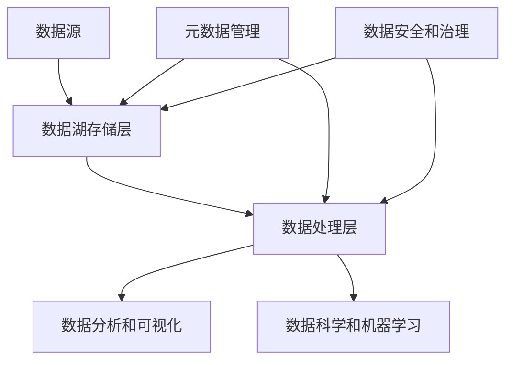

# 数据湖 原理与代码实例讲解

## 1. 背景介绍

### 1.1 数据爆炸时代

在当今的数据时代，数据正以前所未有的速度和规模产生。无论是来自社交媒体、物联网设备、电子商务平台还是企业内部系统,海量的结构化和非结构化数据不断涌现。这种数据爆炸给传统的数据管理系统带来了巨大挑战,传统数据仓库难以高效存储和处理如此庞大和多样化的数据。

### 1.2 数据湖的兴起

为了应对这一挑战,数据湖(Data Lake)的概念应运而生。数据湖是一种新型的大数据存储和处理架构,旨在提供一个集中式的数据存储库,能够存储各种类型的原始数据,包括结构化、半结构化和非结构化数据。与传统数据仓库不同,数据湖不需要预先定义数据模式,可以灵活地存储任何类型的数据,从而支持更广泛的数据分析和处理需求。

## 2. 核心概念与联系

### 2.1 数据湖的核心概念

数据湖由以下几个核心概念组成:

1. **数据存储层(Data Storage Layer)**: 这是数据湖的核心部分,通常使用分布式文件系统(如HDFS、对象存储等)来存储原始数据。

2. **数据处理层(Data Processing Layer)**: 这一层负责对存储在数据湖中的原始数据进行处理和分析,常用的技术包括Apache Spark、Apache Hive、Apache Impala等。

3. **元数据管理(Metadata Management)**: 元数据描述了数据湖中数据的结构、来源、格式等信息,是实现数据治理和数据发现的关键。常用的元数据管理工具包括Apache Atlas、Cloudera Navigator等。

4. **数据安全和治理(Data Security and Governance)**: 确保数据湖中的数据安全性、可访问性和合规性,包括访问控制、数据加密、数据审计等。

5. **数据可视化和分析(Data Visualization and Analytics)**: 通过商业智能(BI)工具和数据可视化工具,将数据湖中的数据转化为可理解的洞察和报告。

### 2.2 数据湖与传统数据仓库的关系

数据湖并非旨在完全取代传统的数据仓库,而是作为一种补充。数据仓库更适合存储经过ETL(提取、转换、加载)处理的结构化数据,用于支持业务智能和报告需求。而数据湖则专注于存储原始数据,支持更广泛的数据分析和处理需求,如数据科学、机器学习和实时分析等。

在现代数据架构中,数据湖和数据仓库可以协同工作,形成一个统一的数据平台。数据湖可以作为数据仓库的上游,为数据仓库提供原始数据源,同时也可以直接为数据科学家和分析师提供数据服务。

## 3. 核心算法原理具体操作步骤

### 3.1 数据湖架构

数据湖的典型架构如下所示:



1. **数据源**:包括各种结构化、半结构化和非结构化数据源,如关系型数据库、NoSQL数据库、日志文件、物联网设备数据等。

2. **数据湖存储层**:通常使用分布式文件系统(如HDFS)或对象存储(如AWS S3、Azure Data Lake Storage)来存储原始数据。

3. **数据处理层**:使用大数据处理框架(如Apache Spark、Apache Hive、Apache Impala)对存储在数据湖中的原始数据进行处理和分析。

4. **数据分析和可视化**:使用商业智能(BI)工具和数据可视化工具对处理后的数据进行分析和可视化展示。

5. **数据科学和机器学习**:数据科学家和机器学习工程师可以直接从数据湖中获取原始数据,进行数据探索、特征工程和模型训练等工作。

6. **元数据管理**:使用元数据管理工具(如Apache Atlas、Cloudera Navigator)来管理数据湖中数据的元数据,实现数据治理和数据发现。

7. **数据安全和治理**:通过数据安全和治理工具(如Apache Ranger、Apache Sentry)来确保数据湖中数据的安全性、可访问性和合规性。

### 3.2 数据湖构建步骤

构建数据湖的典型步骤如下:

1. **规划和设计**:确定数据湖的目标和需求,选择合适的技术栈和架构。

2. **部署基础设施**:部署分布式文件系统(如HDFS)或对象存储,以及相关的大数据处理框架(如Apache Spark、Apache Hive)。

3. **数据摄取**:从各种数据源中摄取原始数据,并存储到数据湖中。常用的数据摄取工具包括Apache Kafka、Apache NiFi等。

4. **元数据管理**:建立元数据管理系统,记录数据湖中数据的元数据信息。

5. **数据处理和分析**:使用大数据处理框架对存储在数据湖中的原始数据进行处理和分析。

6. **数据可视化和报告**:使用BI工具和数据可视化工具对处理后的数据进行可视化和报告。

7. **数据安全和治理**:实施数据安全和治理策略,确保数据湖中数据的安全性、可访问性和合规性。

8. **持续优化和维护**:根据实际需求和使用情况,持续优化和维护数据湖架构和组件。

## 4. 数学模型和公式详细讲解举例说明

在数据湖中,常用的数学模型和公式主要涉及以下几个方面:

### 4.1 数据分区和分布

为了提高数据处理的效率,数据湖中的数据通常会被划分为多个分区(Partition)并分布在不同的节点上。常用的数据分区和分布策略包括:

1. **哈希分区(Hash Partitioning)**:根据数据的哈希值将数据划分到不同的分区中。

   $$
   partition = hash(key) \% numPartitions
   $$

   其中,`key`是数据的键值,`numPartitions`是分区的总数。

2. **范围分区(Range Partitioning)**:根据数据的值范围将数据划分到不同的分区中。

   $$
   partition = \begin{cases}
   0, & \text{if }value < lower_1\\
   1, & \text{if }lower_1 \leq value < lower_2\\
   \vdots\\
   n-1, & \text{if }lower_{n-1} \leq value < upper_{n-1}\\
   n, & \text{if }value \geq upper_{n-1}
   \end{cases}
   $$

   其中,`lower_i`和`upper_i`分别表示第`i`个分区的下界和上界。

### 4.2 数据采样

在进行数据分析和建模时,常常需要从大规模数据集中抽取一个较小的数据样本。常用的数据采样方法包括:

1. **简单随机采样(Simple Random Sampling)**:从总体中随机抽取`n`个样本,每个样本被抽取的概率相等。

   $$
   P(x_i) = \frac{1}{N}
   $$

   其中,`N`是总体的大小。

2. **分层采样(Stratified Sampling)**:根据某些特征将总体划分为若干层,然后在每一层中进行简单随机采样。

   $$
   n_h = \frac{N_h}{N} \cdot n
   $$

   其中,`n_h`是第`h`层的样本量,`N_h`是第`h`层的总体量,`N`是总体的大小,`n`是期望的总样本量。

### 4.3 数据压缩

为了节省存储空间和提高数据传输效率,数据湖中的数据通常会被压缩。常用的数据压缩算法包括:

1. **Snappy**:一种快速的无损压缩算法,适用于中等压缩比的场景。

2. **Gzip**:一种流行的无损压缩算法,压缩比较高,但压缩和解压速度较慢。

3. **Bzip2**:一种无损压缩算法,压缩比高于Gzip,但压缩和解压速度更慢。

4. **LZO**:一种无损压缩算法,压缩速度快,但压缩比较低。

压缩算法的选择需要权衡压缩比、压缩和解压速度等因素。

## 5. 项目实践:代码实例和详细解释说明

在本节中,我们将通过一个实际项目示例来演示如何使用Apache Spark和Python构建一个简单的数据湖应用程序。

### 5.1 项目概述

我们将构建一个简单的数据湖应用程序,用于处理来自电子商务网站的订单数据。该应用程序将执行以下任务:

1. 从数据湖中读取原始订单数据。
2. 对订单数据进行清洗和转换。
3. 计算每个产品的销售额和销量。
4. 将处理后的数据写回数据湖。

### 5.2 环境准备

在开始之前,请确保您已经安装了以下软件:

- Apache Spark (版本 3.0.0 或更高)
- Python (版本 3.6 或更高)
- Jupyter Notebook (或其他 Python IDE)

### 5.3 数据准备

我们将使用一个简单的 CSV 文件作为原始订单数据,该文件包含以下列:

- `order_id`: 订单 ID
- `product_id`: 产品 ID
- `quantity`: 购买数量
- `price`: 产品单价
- `timestamp`: 订单时间戳

您可以从以下链接下载示例数据文件:

[orders.csv](https://example.com/orders.csv)

将该文件上传到您的数据湖存储层(如 HDFS 或 AWS S3)。

### 5.4 代码实现

在 Jupyter Notebook 或其他 Python IDE 中,创建一个新的 Python 文件,并输入以下代码:

```python
from pyspark.sql import SparkSession
from pyspark.sql.functions import col, sum

# 创建 SparkSession
spark = SparkSession.builder \
    .appName("DataLakeExample") \
    .getOrCreate()

# 读取原始订单数据
orders_df = spark.read.csv("hdfs://namenode:8020/user/data/orders.csv", header=True, inferSchema=True)

# 数据清洗和转换
cleaned_orders_df = orders_df.dropna() \
    .withColumn("total_cost", col("quantity") * col("price"))

# 计算每个产品的销售额和销量
product_sales = cleaned_orders_df.groupBy("product_id") \
    .agg(sum("total_cost").alias("total_revenue"),
         sum("quantity").alias("total_units_sold"))

# 将结果写回数据湖
product_sales.write.mode("overwrite") \
    .parquet("hdfs://namenode:8020/user/data/product_sales")

# 停止 SparkSession
spark.stop()
```

代码解释:

1. 首先,我们创建一个 `SparkSession` 对象,用于与 Apache Spark 集群进行交互。

2. 然后,我们使用 `spark.read.csv` 方法从数据湖中读取原始订单数据。

3. 接下来,我们对订单数据进行清洗和转换。在这个示例中,我们删除了包含空值的行,并添加了一个新列 `total_cost`,表示每个订单的总成本。

4. 之后,我们使用 `groupBy` 和 `agg` 函数计算每个产品的销售额和销量。

5. 最后,我们将处理后的数据以 Parquet 格式写回数据湖。

### 5.5 运行应用程序

在 Jupyter Notebook 或 Python IDE 中,运行上述代码。您应该能够在控制台中看到 Spark 作业的执行过程。

如果一切顺利,您应该能够在数据湖存储层中找到一个新的 Parquet 文件夹,其中包含每个产品的销售额和销量数据。

## 6. 实际应用场景

数据湖在各个行业都有广泛的应用场景,以下是一些典型的应用示例:

### 6.1 金融服务

- 合规性和反洗钱监控:通过分析客户交易数据、账户信息和其他相关数据,检测潜在的非法活动和洗钱行