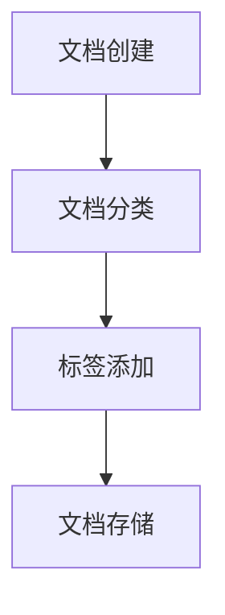
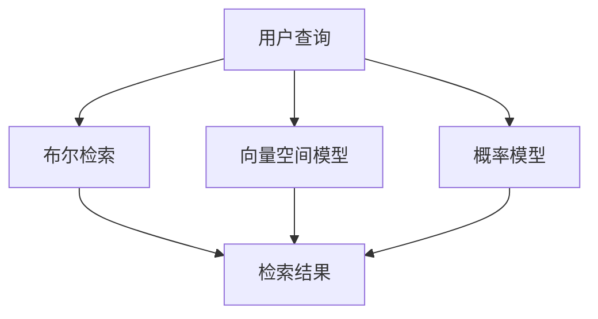
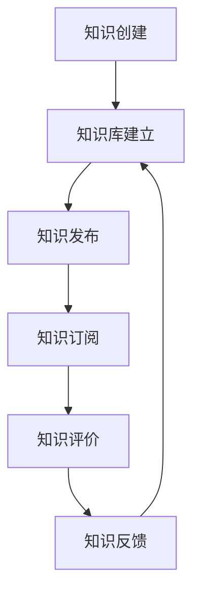

# 文档管理与知识共享原理与代码实战案例讲解

## 1.背景介绍

在现代企业和组织中，文档管理与知识共享是提高工作效率和促进创新的重要手段。随着信息技术的快速发展，企业积累了大量的文档和知识资源，如何有效地管理和共享这些资源成为了一个关键问题。本文将深入探讨文档管理与知识共享的核心原理，并通过具体的代码实例展示如何实现这些功能。

## 2.核心概念与联系

### 2.1 文档管理

文档管理是指对文档的创建、存储、检索、共享和销毁等全过程进行系统化管理。其核心目标是提高文档的可用性、安全性和效率。

### 2.2 知识共享

知识共享是指在组织内部或外部，通过各种手段和工具，将知识资源进行传播和利用。其核心目标是促进知识的流动和创新。

### 2.3 文档管理与知识共享的联系

文档管理和知识共享是相辅相成的。有效的文档管理是知识共享的基础，而知识共享又能提升文档管理的价值。两者的结合可以显著提高组织的整体效率和创新能力。

## 3.核心算法原理具体操作步骤

### 3.1 文档分类与标签

文档分类与标签是文档管理的基础。通过对文档进行分类和打标签，可以提高文档的检索效率。



### 3.2 文档检索算法

文档检索是文档管理的重要环节。常用的文档检索算法包括布尔检索、向量空间模型和概率模型等。



### 3.3 知识共享机制

知识共享机制包括知识库的建立、知识的发布与订阅、知识的评价与反馈等。



## 4.数学模型和公式详细讲解举例说明

### 4.1 向量空间模型

向量空间模型（Vector Space Model, VSM）是一种常用的文档检索模型。其基本思想是将文档和查询表示为向量，通过计算向量之间的相似度来进行检索。

$$
\text{相似度}(d, q) = \frac{\sum_{i=1}^{n} w_{di} \cdot w_{qi}}{\sqrt{\sum_{i=1}^{n} w_{di}^2} \cdot \sqrt{\sum_{i=1}^{n} w_{qi}^2}}
$$

其中，$w_{di}$ 和 $w_{qi}$ 分别表示文档 $d$ 和查询 $q$ 中第 $i$ 个词的权重。

### 4.2 TF-IDF 权重计算

TF-IDF（Term Frequency-Inverse Document Frequency）是一种常用的词权重计算方法。其基本思想是通过词频和逆文档频率来衡量词的重要性。

$$
\text{TF-IDF}(t, d) = \text{TF}(t, d) \cdot \text{IDF}(t)
$$

其中，$\text{TF}(t, d)$ 表示词 $t$ 在文档 $d$ 中的词频，$\text{IDF}(t)$ 表示词 $t$ 的逆文档频率。

$$
\text{IDF}(t) = \log \frac{N}{|\{d \in D: t \in d\}|}
$$

其中，$N$ 表示文档总数，$|\{d \in D: t \in d\}|$ 表示包含词 $t$ 的文档数。

## 5.项目实践：代码实例和详细解释说明

### 5.1 文档分类与标签

以下是一个简单的文档分类与标签的Python代码示例：

```python
import os
import json

class DocumentManager:
    def __init__(self, storage_path):
        self.storage_path = storage_path
        if not os.path.exists(storage_path):
            os.makedirs(storage_path)

    def add_document(self, doc_id, content, tags):
        doc_path = os.path.join(self.storage_path, f"{doc_id}.json")
        with open(doc_path, 'w') as f:
            json.dump({"content": content, "tags": tags}, f)

    def get_document(self, doc_id):
        doc_path = os.path.join(self.storage_path, f"{doc_id}.json")
        with open(doc_path, 'r') as f:
            return json.load(f)

# 使用示例
doc_manager = DocumentManager("docs")
doc_manager.add_document("doc1", "这是一个测试文档", ["测试", "文档"])
print(doc_manager.get_document("doc1"))
```

### 5.2 文档检索

以下是一个简单的基于TF-IDF的文档检索的Python代码示例：

```python
from sklearn.feature_extraction.text import TfidfVectorizer
import numpy as np

class DocumentRetrieval:
    def __init__(self, documents):
        self.vectorizer = TfidfVectorizer()
        self.tfidf_matrix = self.vectorizer.fit_transform(documents)

    def search(self, query):
        query_vec = self.vectorizer.transform([query])
        cosine_similarities = np.dot(self.tfidf_matrix, query_vec.T).toarray()
        return np.argsort(-cosine_similarities, axis=0)

# 使用示例
documents = ["这是第一个文档", "这是第二个文档", "这是第三个文档"]
retrieval = DocumentRetrieval(documents)
print(retrieval.search("第二个"))
```

### 5.3 知识共享

以下是一个简单的知识共享平台的Python代码示例：

```python
class KnowledgeBase:
    def __init__(self):
        self.knowledge = {}

    def add_knowledge(self, topic, content):
        if topic not in self.knowledge:
            self.knowledge[topic] = []
        self.knowledge[topic].append(content)

    def get_knowledge(self, topic):
        return self.knowledge.get(topic, [])

# 使用示例
kb = KnowledgeBase()
kb.add_knowledge("Python", "Python是一种解释型、面向对象、动态数据类型的高级程序设计语言。")
print(kb.get_knowledge("Python"))
```

## 6.实际应用场景

### 6.1 企业内部文档管理

在企业内部，文档管理系统可以帮助员工高效地创建、存储和检索文档，提高工作效率。例如，HR部门可以使用文档管理系统来管理员工档案，研发部门可以使用文档管理系统来管理技术文档。

### 6.2 知识共享平台

知识共享平台可以帮助企业内部或外部的人员共享和获取知识。例如，企业可以建立内部的知识共享平台，员工可以在平台上发布和获取技术文章、项目经验等。

### 6.3 学术研究

在学术研究中，文档管理和知识共享同样重要。研究人员可以使用文档管理系统来管理研究文档，使用知识共享平台来分享研究成果和获取最新的研究进展。

## 7.工具和资源推荐

### 7.1 文档管理工具

- **SharePoint**：微软提供的企业级文档管理和协作平台。
- **Google Drive**：谷歌提供的云存储和文档管理工具。
- **Evernote**：一款流行的笔记和文档管理工具。

### 7.2 知识共享平台

- **Confluence**：Atlassian提供的企业级知识共享和协作平台。
- **GitHub**：流行的代码托管和知识共享平台。
- **Stack Overflow**：程序员问答和知识共享平台。

### 7.3 资源推荐

- **《文档管理与知识共享》**：一本详细介绍文档管理和知识共享的书籍。
- **Coursera**：提供文档管理和知识共享相关的在线课程。
- **GitHub**：大量开源的文档管理和知识共享项目。

## 8.总结：未来发展趋势与挑战

### 8.1 未来发展趋势

随着人工智能和大数据技术的发展，文档管理和知识共享将变得更加智能化和自动化。例如，基于自然语言处理的智能文档检索、基于机器学习的知识推荐等。

### 8.2 挑战

尽管文档管理和知识共享技术已经取得了显著的进展，但仍然面临一些挑战。例如，如何保证文档和知识的安全性、如何处理海量的文档和知识、如何提高文档和知识的质量等。

## 9.附录：常见问题与解答

### 9.1 如何选择合适的文档管理工具？

选择文档管理工具时，可以考虑以下几个方面：功能需求、用户体验、安全性、成本等。可以根据具体的需求和预算选择合适的工具。

### 9.2 如何提高文档检索的准确性？

提高文档检索准确性的方法包括：使用先进的检索算法（如TF-IDF、BM25等）、对文档进行预处理（如分词、去停用词等）、使用领域知识进行优化等。

### 9.3 如何促进知识共享？

促进知识共享的方法包括：建立良好的知识共享机制（如奖励机制、评价机制等）、提供便捷的知识共享工具、营造良好的知识共享氛围等。

---

作者：禅与计算机程序设计艺术 / Zen and the Art of Computer Programming