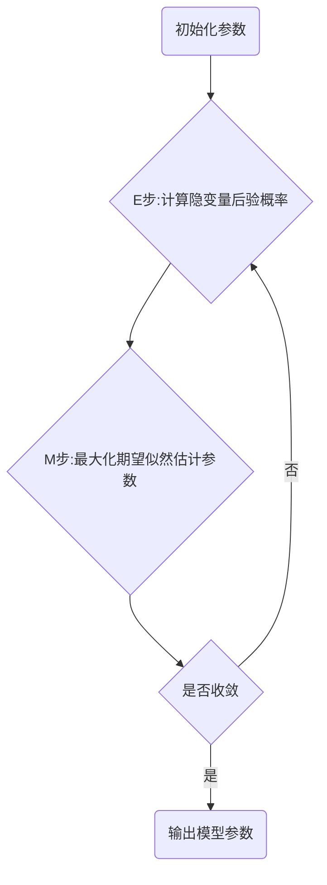

# 期望最大化EM原理与代码实例讲解

## 1. 背景介绍

期望最大化(Expectation-Maximization,EM)算法是一种在统计学中用于寻找依赖于隐变量的概率模型参数最大似然估计或者最大后验估计的算法。EM算法经常用在机器学习和计算机视觉的数据聚类(Data Clustering)领域。EM算法经过两个步骤交替进行计算，第一步是计算期望(E),利用对隐藏变量的现有估计值，计算其最大似然估计值；第二步是最大化(M),最大化在E步上求得的最大似然值来计算参数的值。M步上找到的参数估计值被用于下一个E步计算中，这个过程不断交替进行。

### 1.1 EM算法的应用背景

EM算法是一种非常通用的算法，在许多领域都有广泛的应用，比如：

- 在计算机视觉和图像处理领域,EM算法常用于图像分割、运动分割、人脸识别等。
- 在自然语言处理领域,EM算法可以用于词性标注、文本分类、机器翻译等。 
- 在生物信息学领域,EM算法常用于基因测序、蛋白质结构预测等问题。
- 在统计学和机器学习领域,EM算法是一种非常重要的参数估计方法,常用于高斯混合模型、隐马尔可夫模型等概率模型的参数估计。

### 1.2 EM算法的历史

- 1977年,Dempster、Laird和Rubin在论文《Maximum likelihood from incomplete data via the EM algorithm》中首次提出了EM算法。 
- 1983年,Boyles在论文《On the convergence of the EM algorithm》中证明了EM算法在一定条件下是收敛的。
- 1990年代以后,随着计算机计算能力的增强,EM算法开始在许多领域得到广泛应用。
- 近年来,EM算法与其他算法相结合,在大数据分析、深度学习等方面展现出了巨大的潜力。

## 2. 核心概念与联系

### 2.1 隐变量

隐变量是指那些未被观测到的、隐藏的变量。在许多实际问题中,我们感兴趣的变量可能是隐藏的,无法直接观测。比如在高斯混合模型聚类时,我们观测到的数据可以看作是从几个高斯分布中抽样得到的,但每个数据点具体来自哪个高斯分布是隐藏的。

### 2.2 不完全数据

不完全数据是指存在缺失数据或者含有隐变量的数据。EM算法就是用于处理存在隐变量的不完全数据,通过最大化观测数据的似然函数来估计模型参数。

### 2.3 完全数据的对数似然

假设我们获得了完全数据 $Y=(Y_{obs},Y_{mis})$,其中 $Y_{obs}$ 为观测数据,$Y_{mis}$ 为缺失数据。完全数据的对数似然函数可以表示为:

$$
\begin{aligned}
L(\theta|Y) &= log P(Y|\theta) \\
&= log P(Y_{obs},Y_{mis}|\theta) \\  
&= log P(Y_{obs}|Y_{mis},\theta) + log P(Y_{mis}|\theta)
\end{aligned}
$$

其中 $\theta$ 是模型参数。

### 2.4 观测数据的边缘分布

观测数据 $Y_{obs}$ 的边缘分布可以表示为:

$$
P(Y_{obs}|\theta) = \int P(Y_{obs},Y_{mis}|\theta) dY_{mis}
$$

### 2.5 联系

EM算法通过最大化观测数据的边缘分布的对数似然函数来估计模型参数 $\theta$。由于边缘分布的对数似然函数通常很难直接求解,所以EM算法通过迭代的方式间接地最大化它。

EM算法的核心思想是:若参数 $\theta$ 已知,可以根据观测数据和隐变量的联合分布来推断隐变量的后验分布;若隐变量的后验分布已知,可以通过最大化完全数据的对数似然函数来估计参数。EM算法就是交替进行这两个步骤,不断迭代直至收敛。

## 3. 核心算法原理具体操作步骤

### 3.1 问题定义

给定观测变量数据 $Y_{obs}$,找出模型参数 $\theta$,使得观测数据的似然函数 $P(Y_{obs}|\theta)$ 最大化。

### 3.2 算法流程



### 3.3 E步

在模型参数 $\theta^{(i)}$ 的当前估计下,计算隐变量 $Y_{mis}$ 的后验概率分布 $P(Y_{mis}|Y_{obs},\theta^{(i)})$,并计算完全数据的对数似然函数 $L(\theta|Y)$ 关于 $P(Y_{mis}|Y_{obs},\theta^{(i)})$ 的期望:

$$
\begin{aligned}
Q(\theta|\theta^{(i)}) &= E_{Y_{mis}|Y_{obs},\theta^{(i)}}[L(\theta|Y)] \\
&= \int L(\theta|Y) P(Y_{mis}|Y_{obs},\theta^{(i)}) dY_{mis}
\end{aligned}
$$

### 3.4 M步

找到参数的新估计 $\theta^{(i+1)}$,使得 $Q(\theta|\theta^{(i)})$ 达到最大,即:

$$
\theta^{(i+1)} = \arg \max_{\theta} Q(\theta|\theta^{(i)})
$$

### 3.5 停止条件

重复以上两步,直到模型参数的变化小于某个阈值,或者达到最大迭代次数。

## 4. 数学模型和公式详细讲解举例说明

下面我们以高斯混合模型(Gaussian Mixture Model,GMM)为例,详细讲解EM算法的数学模型和公式。

### 4.1 高斯混合模型

高斯混合模型是指数据由 $k$ 个高斯分布组合而成的概率模型,概率密度函数为:

$$
P(y|\theta) = \sum_{i=1}^k \alpha_i \mathcal{N}(y|\mu_i,\Sigma_i)
$$

其中 $\alpha_i$ 是第 $i$ 个高斯分布的权重,满足 $\sum_{i=1}^k \alpha_i=1$,$\mu_i$ 和 $\Sigma_i$ 分别是第 $i$ 个高斯分布的均值和协方差矩阵。

假设观测数据 $Y={y_1,y_2,...,y_n}$ 是由 GMM 生成的,我们的目标是估计GMM的参数 $\theta=(\alpha_1,...,\alpha_k,\mu_1,...,\mu_k,\Sigma_1,...,\Sigma_k)$。

### 4.2 引入隐变量

对于每个观测数据 $y_j$,引入一个隐变量 $z_j\in\{1,2,...,k\}$,表示 $y_j$ 是由第 $z_j$ 个高斯分布生成的。于是完全数据可以表示为 $(Y,Z)$,其中 $Z=(z_1,z_2,...,z_n)$。

完全数据的对数似然函数为:

$$
\begin{aligned}
L(\theta|Y,Z) &= log P(Y,Z|\theta) \\
&= \sum_{j=1}^n log P(y_j,z_j|\theta) \\
&= \sum_{j=1}^n log [\alpha_{z_j} \mathcal{N}(y_j|\mu_{z_j},\Sigma_{z_j})]
\end{aligned}
$$

### 4.3 E步

在 $\theta^{(i)}$ 的当前估计下,计算隐变量 $Z$ 的后验概率分布:

$$
\gamma_{jk}^{(i)} = P(z_j=k|y_j,\theta^{(i)}) = \frac{\alpha_k^{(i)} \mathcal{N}(y_j|\mu_k^{(i)},\Sigma_k^{(i)})}{\sum_{l=1}^k \alpha_l^{(i)} \mathcal{N}(y_j|\mu_l^{(i)},\Sigma_l^{(i)})}
$$

然后计算完全数据的对数似然函数关于后验概率分布的期望:

$$
\begin{aligned}
Q(\theta|\theta^{(i)}) &= E_{Z|Y,\theta^{(i)}}[L(\theta|Y,Z)] \\
&= \sum_{j=1}^n \sum_{k=1}^K \gamma_{jk}^{(i)} log [\alpha_k \mathcal{N}(y_j|\mu_k,\Sigma_k)]
\end{aligned}
$$

### 4.4 M步

最大化 $Q(\theta|\theta^{(i)})$ 得到参数的新估计:

$$
\begin{aligned}
\alpha_k^{(i+1)} &= \frac{1}{n} \sum_{j=1}^n \gamma_{jk}^{(i)} \\
\mu_k^{(i+1)} &= \frac{\sum_{j=1}^n \gamma_{jk}^{(i)} y_j}{\sum_{j=1}^n \gamma_{jk}^{(i)}} \\
\Sigma_k^{(i+1)} &= \frac{\sum_{j=1}^n \gamma_{jk}^{(i)} (y_j-\mu_k^{(i+1)})(y_j-\mu_k^{(i+1)})^T}{\sum_{j=1}^n \gamma_{jk}^{(i)}}
\end{aligned}
$$

## 5. 项目实践：代码实例和详细解释说明

下面我们用Python实现高斯混合模型的EM算法:

```python
import numpy as np
from scipy.stats import multivariate_normal

def gaussian_mixture_model(X, K, max_iters=100, tol=1e-6):
    n_samples, n_features = X.shape
    
    # 初始化模型参数
    weights = np.ones(K) / K
    means = X[np.random.choice(n_samples, K, replace=False)]
    covs = [np.eye(n_features)] * K
    
    for _ in range(max_iters):
        # E步
        probs = np.zeros((n_samples, K))
        for k in range(K):
            probs[:,k] = weights[k] * multivariate_normal.pdf(X, means[k], covs[k])
        probs /= probs.sum(axis=1, keepdims=True)
        
        # M步
        weights_new = probs.mean(axis=0)
        means_new = probs.T.dot(X) / probs.sum(axis=0, keepdims=True).T
        covs_new = []
        for k in range(K):
            diff = X - means_new[k]
            cov_k = diff.T.dot(diff * probs[:,k].reshape(-1,1)) / probs[:,k].sum()
            covs_new.append(cov_k)
        
        # 检查收敛性
        if np.linalg.norm(weights_new - weights) < tol:
            break
        
        weights, means, covs = weights_new, means_new, covs_new
        
    return weights, means, covs
```

代码说明:

- 函数 `gaussian_mixture_model` 接受输入数据 `X`、高斯分布数量 `K`、最大迭代次数 `max_iters` 和收敛阈值 `tol`。
- 首先随机初始化模型参数,包括各高斯分布的权重 `weights`、均值 `means` 和协方差矩阵 `covs`。
- 在每次迭代中,执行E步和M步:
    - E步:根据当前模型参数,计算每个数据点属于每个高斯分布的后验概率 `probs`。
    - M步:根据后验概率,更新模型参数 `weights_new`、`means_new` 和 `covs_new`。
- 检查模型参数的变化是否小于收敛阈值,若是则停止迭代。
- 函数返回估计出的高斯混合模型的参数。

## 6. 实际应用场景

EM算法在许多领域都有广泛应用,下面列举几个实际应用场景:

### 6.1 图像分割

在图像分割任务中,可以用高斯混合模型对图像像素进行建模。每个高斯分布对应一个区域,EM算法可以自动将图像分割成不同的区域。

### 6.2 文本聚类

在文本聚类任务中,可以用高斯混合模型对文本特征进行建模。每个高斯分布对应一个主题,EM算法可以自动将文本划分到不同的主题中。

### 6.3 缺失数据填补

在一些数据集中,经常会有一些缺失的数据。可以