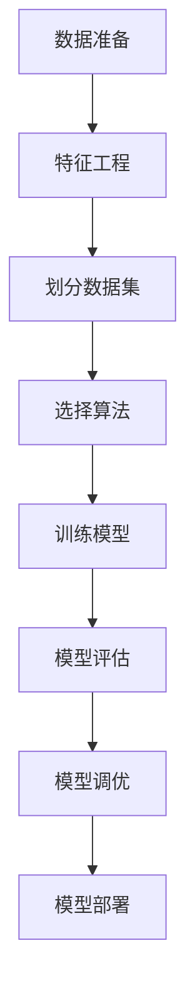

# 机器学习 原理与代码实例讲解

## 1. 背景介绍

机器学习是人工智能领域的一个重要分支,旨在让计算机系统能够从数据中自动学习,而无需显式编程。随着大数据时代的到来,海量数据的积累为机器学习的发展提供了充足的燃料。机器学习已广泛应用于图像识别、自然语言处理、推荐系统等诸多领域,极大地提高了人类的工作效率。

## 2. 核心概念与联系

机器学习的核心概念包括:

1. **数据集(Dataset)**: 机器学习算法从数据集中学习模式和规律。数据集通常分为训练集、验证集和测试集。

2. **特征(Feature)**: 特征是描述数据样本的属性,是机器学习算法学习的对象。特征工程对算法性能至关重要。

3. **模型(Model)**: 机器学习算法基于数据集构建模型,模型可以对新的数据样本进行预测或决策。

4. **监督学习(Supervised Learning)**: 算法从带有标签的训练数据中学习,目标是预测新数据的标签。常见算法有线性回归、逻辑回归、决策树等。

5. **无监督学习(Unsupervised Learning)**: 算法从无标签数据中发现内在模式和结构。常见算法有聚类、关联规则挖掘等。

6. **强化学习(Reinforcement Learning)**: 算法通过与环境交互并获得奖励信号来学习策略,常用于决策和控制问题。

7. **训练(Training)**: 机器学习算法在训练数据上优化模型参数的过程。

8. **泛化(Generalization)**: 模型在新数据上的表现能力,是机器学习的核心目标。

9. **过拟合(Overfitting)**: 模型过度拟合训练数据,在新数据上表现不佳。

10. **欠拟合(Underfitting)**: 模型无法很好地拟合训练数据,在训练集和新数据上都表现不佳。

这些概念相互关联,共同构建了机器学习的理论基础。

## 3. 核心算法原理具体操作步骤

机器学习算法的操作步骤通常包括以下几个阶段:



1. **数据准备**:收集和清洗数据,处理缺失值、异常值等。

2. **特征工程**:从原始数据中提取有用的特征,对特征进行缩放、编码等预处理。

3. **划分数据集**:将数据集划分为训练集、验证集和测试集。

4. **选择算法**:根据问题类型和数据特点选择合适的机器学习算法。

5. **训练模型**:使用训练数据训练模型,优化模型参数。

6. **模型评估**:在验证集或测试集上评估模型性能,使用合适的评估指标。

7. **模型调优**:根据评估结果调整模型超参数或特征,提高模型性能。

8. **模型部署**:将调优后的模型部署到生产环境中,应用于实际场景。

## 4. 数学模型和公式详细讲解举例说明

机器学习算法通常基于数学模型和优化理论,使用数学公式来描述模型和优化过程。以下是一些常见的数学模型和公式:

### 4.1 线性回归

线性回归是一种基本的监督学习算法,用于预测连续型目标变量。线性回归模型可表示为:

$$y = w_0 + w_1x_1 + w_2x_2 + ... + w_nx_n$$

其中 $y$ 是目标变量, $x_i$ 是特征, $w_i$ 是权重参数。模型训练的目标是找到最优参数 $w_i$,使得预测值 $\hat{y}$ 和真实值 $y$ 之间的误差最小化。常用的损失函数是均方误差(Mean Squared Error, MSE):

$$MSE = \frac{1}{n}\sum_{i=1}^n (y_i - \hat{y}_i)^2$$

可以使用梯度下降等优化算法来最小化损失函数,从而得到最优参数。

### 4.2 逻辑回归

逻辑回归是一种用于分类问题的监督学习算法。对于二分类问题,逻辑回归模型可表示为:

$$\hat{y} = \sigma(w_0 + w_1x_1 + w_2x_2 + ... + w_nx_n)$$

其中 $\sigma(x) = \frac{1}{1 + e^{-x}}$ 是 Sigmoid 函数,将线性组合的结果映射到 (0, 1) 区间,作为样本属于正类的概率。模型训练的目标是最小化交叉熵损失函数(Cross-Entropy Loss):

$$J(w) = -\frac{1}{n}\sum_{i=1}^n [y_i\log(\hat{y}_i) + (1 - y_i)\log(1 - \hat{y}_i)]$$

可以使用梯度下降等优化算法来最小化损失函数,从而得到最优参数。

### 4.3 决策树

决策树是一种常用的监督学习算法,可用于分类和回归问题。决策树通过递归地对特征空间进行划分,构建一棵树状结构,每个叶节点代表一个预测值。

决策树的构建过程可以使用信息增益或基尼系数等指标来选择最优划分特征和划分点。信息增益定义为:

$$\text{Gain}(D, a) = \text{Entropy}(D) - \sum_{v=1}^V \frac{|D^v|}{|D|} \text{Entropy}(D^v)$$

其中 $D$ 是当前数据集, $a$ 是特征, $V$ 是特征 $a$ 的可取值集合, $D^v$ 是根据特征 $a$ 的值 $v$ 划分出的子集, $\text{Entropy}(D)$ 是数据集 $D$ 的信息熵。

在构建决策树时,需要平衡模型的复杂度和准确性,避免过拟合或欠拟合。常用的方法包括设置最大深度、最小样本数等超参数,以及剪枝等技术。

### 4.4 支持向量机(SVM)

支持向量机是一种常用的监督学习算法,适用于分类和回归问题。SVM的基本思想是在高维空间中找到一个超平面,将不同类别的样本分开,并最大化超平面与最近样本点之间的距离(称为间隔)。

对于线性可分的二分类问题,SVM的目标是找到一个超平面 $w^Tx + b = 0$,使得:

$$\begin{align*}
\min_{w, b} \quad & \frac{1}{2}\|w\|^2 \\
\text{s.t.} \quad & y_i(w^Tx_i + b) \geq 1, \quad i = 1, 2, \ldots, n
\end{align*}$$

其中 $\|w\|^2$ 是超平面的范数,最小化范数相当于最大化间隔。对于线性不可分的情况,可以引入松弛变量和惩罚参数 $C$,形成软间隔 SVM。

对于非线性问题,SVM可以使用核技巧将数据映射到高维空间,在高维空间中寻找最优超平面。常用的核函数包括线性核、多项式核和高斯核等。

### 4.5 聚类算法

聚类是一种常见的无监督学习算法,旨在将相似的数据样本划分到同一个簇中。常用的聚类算法包括 K-Means、层次聚类、DBSCAN 等。

**K-Means 算法**是一种简单而有效的聚类算法。它的目标是最小化所有样本到其所属簇中心的距离之和:

$$J = \sum_{i=1}^{n}\sum_{j=1}^{k} r_{ij}\|x_i - \mu_j\|^2$$

其中 $n$ 是样本数, $k$ 是簇数, $r_{ij}$ 是指示变量(如果样本 $x_i$ 属于簇 $j$,则 $r_{ij} = 1$,否则为 0), $\mu_j$ 是簇 $j$ 的中心。

K-Means 算法通过迭代地重新分配样本到最近的簇中心,并更新簇中心的位置,直到收敛或达到最大迭代次数。

## 5. 项目实践: 代码实例和详细解释说明

以下是一个使用 Python 和 scikit-learn 库实现线性回归的示例:

```python
from sklearn.linear_model import LinearRegression
from sklearn.datasets import make_regression
from sklearn.model_selection import train_test_split
import matplotlib.pyplot as plt

# 生成样本数据
X, y = make_regression(n_samples=100, n_features=1, noise=10)

# 划分训练集和测试集
X_train, X_test, y_train, y_test = train_test_split(X, y, test_size=0.2, random_state=42)

# 创建线性回归模型
model = LinearRegression()

# 训练模型
model.fit(X_train, y_train)

# 在测试集上评估模型
score = model.score(X_test, y_test)
print(f"R-squared score: {score:.2f}")

# 可视化结果
plt.scatter(X_test, y_test, color='gray')
plt.plot(X_test, model.predict(X_test), color='red', linewidth=2)
plt.show()
```

代码解释:

1. 导入所需的库和模块。
2. 使用 `make_regression` 函数生成一个包含 100 个样本的线性回归数据集,特征数为 1,噪声水平为 10。
3. 使用 `train_test_split` 函数将数据集划分为训练集和测试集,测试集占 20%。
4. 创建一个 `LinearRegression` 对象,即线性回归模型。
5. 使用 `fit` 方法在训练集上训练模型。
6. 在测试集上评估模型的性能,使用 `score` 方法计算 R-squared 分数。
7. 使用 `scatter` 和 `plot` 函数可视化测试集上的真实值和预测值。

上述代码演示了如何使用 scikit-learn 库快速构建和评估一个线性回归模型。在实际项目中,你还需要进行数据预处理、特征工程、模型调优等步骤,以提高模型的性能和泛化能力。

## 6. 实际应用场景

机器学习在各个领域都有广泛的应用,以下是一些典型的应用场景:

1. **图像识别**: 使用卷积神经网络等深度学习模型,可以实现图像分类、目标检测、语义分割等任务,广泛应用于自动驾驶、医疗影像诊断等领域。

2. **自然语言处理(NLP)**: 使用循环神经网络、transformer 等模型,可以实现文本分类、机器翻译、问答系统、情感分析等任务,广泛应用于智能客服、内容审核等场景。

3. **推荐系统**: 使用协同过滤、矩阵分解等算法,可以为用户推荐感兴趣的商品、新闻、视频等内容,广泛应用于电商、社交媒体等平台。

4. **金融风控**: 使用逻辑回归、决策树等模型,可以进行信用评分、欺诈检测等,帮助金融机构控制风险。

5. **医疗健康**: 使用机器学习模型可以辅助疾病诊断、药物开发、基因分析等,提高医疗水平和效率。

6. **智能制造**: 在工业生产中,机器学习可以用于预测设备故障、优化生产流程、质量控制等,提高生产效率和产品质量。

7. **气象预报**: 使用机器学习模型可以更准确地预测天气变化,为农业、交通等领域提供决策支持。

8. **网络安全**: 使用机器学习可以检测入侵行为、识别恶意软件,提高网络安全防护能力。

机器学习的应用场景还在不断扩展,它正在深刻地改变着各个行业的发展模式。

## 7. 工具和资源推荐

在机器学习的学习和实践过程中,有许多优秀的工具和资源可以为你提供帮助:

1. **Python 库**:
   - scikit-learn: 经典的机器学习库,提供了多种算法和工具。
   - TensorFlow: Google 开源的深度学