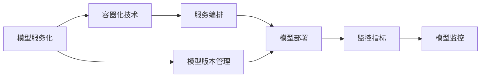

# 模型部署与监控：让模型投入生产

## 1. 背景介绍

随着人工智能和机器学习技术的快速发展,越来越多的企业开始将AI模型应用于实际业务场景中。然而,训练出一个性能优异的模型只是迈出了第一步,如何将模型高效、稳定、安全地部署到生产环境中,并对其进行持续监控和优化,才是AI落地的关键。本文将深入探讨模型部署与监控的核心概念、实践方法和面临的挑战。

### 1.1 模型部署的重要性
### 1.2 模型监控的必要性  
### 1.3 模型部署与监控面临的挑战

## 2. 核心概念与联系

在讨论模型部署与监控之前,我们需要先了解一些核心概念：

### 2.1 模型服务化
将训练好的模型封装成标准化的服务接口,以API的形式提供给外部调用。这是模型部署的基础。

### 2.2 容器化技术
Docker等容器化技术可以将模型服务打包成镜像,实现快速部署、弹性伸缩和环境隔离。

### 2.3 服务编排
Kubernetes等容器编排平台可以自动管理和调度大量的模型服务实例,提高资源利用率。

### 2.4 模型版本管理
需要对模型的版本进行管理和追踪,以支持模型的升级、回滚等操作。

### 2.5 监控指标
对模型服务的延迟、吞吐量、资源消耗等指标进行监控,以评估模型性能和及时发现异常。

### 2.6 概念之间的关系
下图展示了以上核心概念之间的关系:



## 3. 核心算法原理具体操作步骤

### 3.1 模型服务化流程
1. 模型导出:将训练好的模型导出为标准格式如ONNX、PMML等 
2. 服务封装:用Flask、FastAPI等Web框架将模型封装成RESTful API接口
3. 接口测试:对封装后的接口进行单元测试和集成测试,验证功能和性能

### 3.2 容器化部署流程
1. 编写Dockerfile:定义模型服务运行所需的环境依赖
2. 构建镜像:使用docker build命令构建模型服务镜像
3. 推送镜像:将构建好的镜像推送到镜像仓库如Docker Hub、Harbor等
4. 编写部署文件:定义Kubernetes Deployment和Service等资源
5. 应用部署:使用kubectl apply命令将部署文件应用到Kubernetes集群

### 3.3 模型版本管理流程
1. 模型注册:将新版本模型注册到模型仓库,记录相关元数据
2. 版本切换:通过更新部署文件中的镜像版本实现版本切换
3. 流量控制:通过Istio等服务网格平台,控制不同版本服务的流量分配
4. 效果评估:评估新版本模型的线上表现,决定是否全量发布

### 3.4 模型监控流程
1. 埋点:在模型服务代码中埋点,暴露监控指标数据
2. 数据采集:使用Prometheus、InfluxDB等时序数据库采集监控数据
3. 可视化展示:使用Grafana等可视化工具实时展示各项指标 
4. 告警:基于预先设定的阈值规则,触发告警通知

## 4. 数学模型和公式详细讲解举例说明

### 4.1 资源利用率计算
对于部署在Kubernetes中的模型服务,我们关注其资源利用率。以CPU利用率为例,假设一个Pod申请了200m的CPU资源,当前使用100m,则其CPU利用率为:

$$
CPU利用率 = \frac{实际使用CPU}{申请的CPU} \times 100\% = \frac{100}{200} \times 100\% = 50\%
$$

若一个Node节点上有多个Pod,其CPU利用率为各Pod使用量之和除以Node总量:

$$
Node CPU利用率 = \frac{\sum_i^n Pod_i 使用CPU}{Node总CPU} \times 100\%
$$

其中$n$为该节点上Pod的数量。

### 4.2 服务容量估算
在部署模型服务时需要估算所需的服务实例数。假设单个服务实例的最大QPS为$Q$,目标请求P99延迟为$L$,总体流量为$T$,则所需的实例数$N$可按下式估算:

$$
N = \left \lceil \frac{T}{Q} \right \rceil + \left \lceil \frac{T}{Q} \cdot 20\% \right \rceil
$$

其中20%为冗余预留,上取整。例如单实例QPS为10,总流量为100,则:

$$
N = \left \lceil \frac{100}{10} \right \rceil + \left \lceil \frac{100}{10} \cdot 20\% \right \rceil = 10 + 2 = 12
$$

需要部署12个实例来支撑该流量。

## 5. 项目实践：代码实例和详细解释说明

下面通过一个简单的案例演示模型服务化的代码实现。

### 5.1 模型导出
假设我们有一个训练好的图像分类模型,使用TensorFlow 2.0训练,导出为SavedModel格式:

```python
model = create_model()
model.fit(train_data, epochs=10, ...)

model.save('model', save_format='tf')
```

### 5.2 服务封装
使用FastAPI封装模型为RESTful API:

```python
import tensorflow as tf
from fastapi import FastAPI, File

app = FastAPI()

model = tf.keras.models.load_model('model')

@app.post('/predict')
async def predict(image: bytes = File(...)):
    img = load_image(image)
    pred = model.predict(img)
    return {'class_id': int(tf.argmax(pred, axis=-1))}
```

### 5.3 容器化部署
编写Dockerfile:

```dockerfile
FROM tensorflow/tensorflow:latest

COPY ./requirements.txt /app/requirements.txt
RUN pip install -r /app/requirements.txt

COPY ./app /app
WORKDIR /app

CMD ["uvicorn", "main:app", "--host", "0.0.0.0", "--port", "8080"]
```

构建、推送镜像:

```bash
docker build -t mymodel:v1 .
docker push myregistry/mymodel:v1
```

创建Kubernetes Deployment和Service:

```yaml
apiVersion: apps/v1
kind: Deployment
metadata:
  name: mymodel
spec:
  replicas: 3
  selector:
    matchLabels:
      app: mymodel
  template:
    metadata:
      labels:
        app: mymodel
    spec:
      containers:
      - name: mymodel
        image: myregistry/mymodel:v1
        ports:
        - containerPort: 8080
        
---

apiVersion: v1
kind: Service
metadata:
  name: mymodel-svc
spec:
  selector: 
    app: mymodel
  ports:
    - protocol: TCP
      port: 80
      targetPort: 8080
```

应用部署:

```bash
kubectl apply -f mymodel.yaml
```

### 5.4 模型监控
在服务代码中埋点,暴露Prometheus指标:

```python
from prometheus_client import Counter, Histogram

predict_counter = Counter('predict_requests', 'Number of prediction requests')
predict_hist = Histogram('predict_latency', 'Latency of prediction requests')

@app.post('/predict')
async def predict(image: bytes = File(...)):
    predict_counter.inc()
    with predict_hist.time():
        img = load_image(image)
        pred = model.predict(img)
    return {'class_id': int(tf.argmax(pred, axis=-1))}
```

配置Prometheus采集目标,在Grafana中创建仪表盘展示指标。

## 6. 实际应用场景

### 6.1 推荐系统
在电商、视频网站等场景中,推荐系统是提升用户体验和增加收入的利器。将推荐模型部署上线并持续监控其效果,对业务至关重要。

### 6.2 智能客服
传统客服面临人力成本高、效率低等问题。引入智能客服系统可以解答常见问题,大幅提高人效。但如何保障模型的服务质量和稳定性,是一大挑战。

### 6.3 工业质检
在工业生产中利用视觉模型自动检测产品缺陷,可以提升良品率。将质检模型部署到生产线并实时监控,对确保产品质量至关重要。

### 6.4 智慧城市
在城市交通、安防等领域应用AI模型,可以实现智能调度、及时预警等功能。这对模型的实时性和鲁棒性提出了很高要求。

## 7. 工具和资源推荐

### 7.1 模型服务框架
- TensorFlow Serving:TensorFlow官方的服务化框架
- ONNX Runtime:跨平台的高性能推理引擎
- BentoML:用于打包和部署机器学习模型的框架
- KFServing:Kubernetes原生的模型服务标准
- FastAPI:高性能的Python Web框架

### 7.2 容器平台
- Docker:应用容器引擎
- Kubernetes:生产级容器编排平台
- Knative:基于Kubernetes的Serverless框架

### 7.3 监控工具
- Prometheus:云原生监控告警系统
- Grafana:开源的可视化监控平台
- Jaeger:分布式追踪系统
- Elastic Stack:日志管理和分析平台

### 7.4 相关文章
- Introducing TensorFlow Serving
- Scaling Machine Learning as a Service
- Monitoring Machine Learning Models in Production
- Machine Learning Operations: You Design It, You Train It, You Run It!

## 8. 总结：未来发展趋势与挑战

### 8.1 MLOps成为刚需
随着越来越多的企业实施AI战略,MLOps将成为像DevOps一样不可或缺的实践。打通从模型训练到部署再到监控的全流程,将是大势所趋。

### 8.2 云原生成为主流
Kubernetes等云原生技术为AI平台提供了标准化的基础设施。从资源管理、弹性伸缩到监控运维,云原生使AI平台更加敏捷和高效。

### 8.3 模型即服务兴起
随着Serverless架构的发展,模型即服务(Model-as-a-Service)将成为一种主流的交付方式。用户无需关心底层资源,按需使用,大大降低使用门槛。

### 8.4 面临的挑战
- 模型版本管理与回滚
- 模型性能与成本的权衡
- 模型的可解释性与公平性
- 模型安全与隐私保护
- 跨平台和框架的互操作

## 9. 附录：常见问题与解答

### Q1:什么是模型服务化?与直接部署模型有何区别?
A1:模型服务化是将模型包装成标准的服务接口,供其他系统调用。相比直接部署模型,服务化使模型调用更加标准化、灵活和可扩展。

### Q2:模型部署需要哪些步骤?
A2:通常包括模型导出、服务封装、容器化打包、编排部署等步骤。

### Q3:模型监控为什么重要?需要关注哪些指标?
A3:模型监控可以帮助我们了解模型的健康状况,及时发现和解决问题。通常需要关注延迟、吞吐量、资源利用率、预测偏差等指标。

### Q4:如何进行模型版本管理?
A4:可以通过镜像仓库管理不同版本的模型服务镜像,在部署时指定所需版本。同时要建立版本演进和回滚机制。

### Q5:如何实现模型服务的弹性伸缩?
A5:对于部署在Kubernetes中的模型服务,可以通过HPA(Horizontal Pod Autoscaler)实现基于CPU等指标的自动伸缩。也可使用Knative等Serverless方案,自动根据流量伸缩。

### Q6:如何保障模型服务的高可用?
A6:首先要做好容量规划和冗余设计,并通过可用性测试验证。其次要配置多副本部署,并设置反亲和性避免单点故障。再次要配置就绪和存活探针,实现故障自动摘除。

### Q7:如何降低推理延迟?
A7:可以从模型优化、服务优化、硬件优化等方面入手。比如使用量化、剪枝等方法压缩模型;优化服务并发和批处理;使用GPU等加速硬件。

### Q8:如何保护模型安全和隐私?
A8:可以对敏感数据进行脱敏,使用联邦学习等隐私保护技术,对模型加密,并严