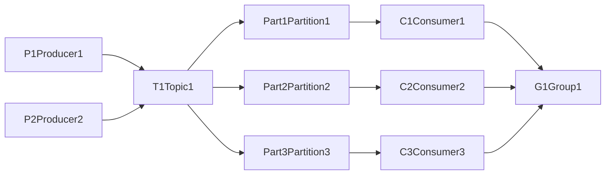

# 消费者组 原理与代码实例讲解

## 1.背景介绍

在现代分布式系统中,消息队列(Message Queue)已成为不可或缺的重要组件。消息队列作为分布式系统中异步通信的中间件,能够有效解耦生产者和消费者,提高系统的可扩展性和容错性。而在消息队列的生产者-消费者模型中,消费者组(Consumer Group)是一个非常重要的概念。

消费者组允许多个消费者实例共同消费同一个主题(Topic)的消息,并且保证每个消息只被一个消费者消费一次。这种机制不仅可以提高消息消费的吞吐量,还能实现消费者的负载均衡和容错。

本文将深入探讨消费者组的原理,并通过具体的代码实例来讲解如何使用消费者组实现高效可靠的消息消费。

## 2.核心概念与联系

在介绍消费者组之前,我们先来了解一下消息队列中的几个核心概念:

- 生产者(Producer):负责生产消息并发送到消息队列的角色。
- 消费者(Consumer):负责从消息队列中拉取消息并进行消费的角色。 
- 主题(Topic):消息队列中用于对消息进行分类的逻辑概念,生产者将消息发送到特定的主题,消费者从主题中拉取消息。
- 分区(Partition):为了实现消息的并行处理,主题通常会被划分为多个分区,每个分区可以被不同的消费者消费。
- 消费者组(Consumer Group):多个消费者实例组成的逻辑分组,同一个消费者组的消费者共同消费一个主题的消息,并保证每个消息只被组内一个消费者消费一次。

下面是这些概念之间的关系图:



从图中可以看出:
1. 生产者P1和P2向主题T1发送消息
2. 主题T1有3个分区Part1、Part2、Part3
3. 消费者C1、C2、C3隶属于同一个消费者组G1,分别消费主题T1的3个分区

## 3.核心算法原理具体操作步骤

消费者组的核心原理是通过协调算法,动态地为消费者分配主题分区,以实现消息消费的负载均衡。下面是消费者组工作的具体步骤:

1. 当消费者启动时,它会向消息队列的协调者(如Kafka的GroupCoordinator)发送一个JoinGroup请求,表明自己要加入某个消费者组。 

2. 协调者收到JoinGroup请求后,会等待一段时间(可配置),直到收集到该消费者组的所有消费者的JoinGroup请求。

3. 协调者从收到的JoinGroup请求中选择一个消费者作为"群主"(Leader),并将消费者组订阅的主题的分区分配方案交给群主制定。

4. 群主根据分区分配策略(如Range或RoundRobin)为每个消费者分配要消费的分区,然后将这个分配方案发给协调者。

5. 协调者将群主制定的分区分配方案下发给所有消费者,每个消费者根据收到的分配方案开始消费自己负责的分区。

6. 在消费过程中,如果有新的消费者加入或者现有消费者退出,就会触发再平衡(Rebalance),重新分配消费者和分区的对应关系。

可以看到,消费者组通过动态的分区分配,既实现了消费者间的负载均衡,又保证了每个分区只被一个消费者消费,从而避免了消息的重复消费。

## 4.数学模型和公式详细讲解举例说明

为了更好地理解消费者组的分区分配策略,我们可以用数学模型来描述。假设有$n$个消费者$\{C_1,C_2,...,C_n\}$和$m$个分区$\{P_1,P_2,...,P_m\}$,我们的目标是找到一个消费者到分区的映射关系$f:C \to P$,使得:

1. 每个消费者分配到的分区数尽可能均匀。可以用方差来衡量均匀程度,即:

$$Var = \frac{\sum_{i=1}^n (x_i - \overline{x})^2}{n}$$

其中$x_i$表示第$i$个消费者分配到的分区数,$\overline{x}$表示平均每个消费者分配到的分区数$\frac{m}{n}$。我们希望方差$Var$尽可能小。

2. 每个分区只分配给一个消费者。可以用如下约束条件来表示:

$$\sum_{i=1}^n I_{ij} = 1, \forall j \in \{1,2,...,m\}$$

其中$I_{ij}$是一个指示变量,表示分区$P_j$是否分配给消费者$C_i$。约束条件保证了每个分区有且仅有一个消费者。

举个例子,假如有3个消费者$\{C_1,C_2,C_3\}$和8个分区$\{P_1,P_2,...,P_8\}$,我们希望找到一个最优的分配方案。

如果采用Range策略,可以按照分区的顺序依次分配给消费者,得到如下分配:
- $C_1: \{P_1,P_2,P_3\}$
- $C_2: \{P_4,P_5,P_6\}$  
- $C_3: \{P_7,P_8\}$

可以计算这个分配方案的方差:

$$Var = \frac{(3-\frac{8}{3})^2 + (3-\frac{8}{3})^2 + (2-\frac{8}{3})^2}{3} \approx 0.22$$

如果采用RoundRobin策略,可以轮流将分区分配给消费者,得到如下分配:
- $C_1: \{P_1,P_4,P_7\}$
- $C_2: \{P_2,P_5,P_8\}$
- $C_3: \{P_3,P_6\}$  

这个分配方案的方差为:

$$Var = \frac{(3-\frac{8}{3})^2 + (3-\frac{8}{3})^2 + (2-\frac{8}{3})^2}{3} \approx 0.22$$

可以看到,在这个例子中,Range和RoundRobin策略得到的分配结果是一样的,方差都较小,实现了较为均匀的分配。当然在实际场景中,分区数可能是消费者数的几十倍甚至上百倍,找到最优的分配方案是一个组合优化问题。

## 5.项目实践:代码实例和详细解释说明

下面我们通过一个简单的Java代码实例,来演示如何使用Kafka的消费者组API实现消息消费。

```java
public class ConsumerGroupExample {
    private static final String TOPIC = "my-topic";
    private static final String GROUP_ID = "my-group";
    
    public static void main(String[] args) {
        Properties props = new Properties();
        props.put("bootstrap.servers", "localhost:9092");
        props.put("group.id", GROUP_ID);
        props.put("key.deserializer", "org.apache.kafka.common.serialization.StringDeserializer");
        props.put("value.deserializer", "org.apache.kafka.common.serialization.StringDeserializer");

        KafkaConsumer<String, String> consumer = new KafkaConsumer<>(props);
        consumer.subscribe(Collections.singletonList(TOPIC));
        
        try {
            while (true) {
                ConsumerRecords<String, String> records = consumer.poll(Duration.ofMillis(100));
                for (ConsumerRecord<String, String> record : records) {
                    System.out.printf("Consumed message: offset = %d, key = %s, value = %s%n", 
                        record.offset(), record.key(), record.value());
                }
            }
        } finally {
            consumer.close();
        }
    }
}
```

代码解释:

1. 首先定义了要消费的主题名称`TOPIC`和消费者组的名称`GROUP_ID`。

2. 创建一个`KafkaConsumer`实例,配置了Kafka服务器地址、消费者组ID、消息key和value的反序列化器。

3. 调用`consumer.subscribe()`方法订阅主题,传入主题名称的列表。

4. 在一个无限循环中,不断调用`consumer.poll()`方法拉取消息,并指定拉取的超时时间。

5. 遍历拉取到的消息集合`ConsumerRecords`,打印每条消息的偏移量、key和value。

6. 最后在异常处理代码块中关闭`KafkaConsumer`实例,释放资源。

当我们启动多个上述Consumer程序时(可以在不同机器上),它们会自动加入到同一个消费者组,并根据分区分配策略对主题的分区进行分配和消费,从而实现消费者组的功能。

## 6.实际应用场景

消费者组在实际的消息队列应用中有着广泛的应用场景,下面列举几个典型的例子:

1. 日志处理:一个日志收集系统,将不同服务器上的日志发送到Kafka的一个主题。多个日志处理程序作为一个消费者组,共同消费这个主题的日志数据,并进行清洗、过滤、聚合等处理,最后将结果写入下游的存储系统。

2. 数据同步:一个电商网站需要将订单数据从交易库同步到数仓和推荐系统。可以将订单数据写入Kafka的一个主题,然后启动多个消费者程序作为一个消费者组,分别负责将数据同步到不同的目标系统。

3. 流式计算:一个实时数据分析平台,接收多个数据源的流式数据,如用户点击、服务器指标等。可以将这些数据写入Kafka的不同主题,然后用Storm、Flink等流计算框架创建多个消费者程序,对数据进行实时的统计分析,并将结果推送到监控面板或报警系统。

4. 消息广播:一个基于微服务架构的系统,有些消息需要广播给所有的服务,如配置更新、服务注册等。可以让所有服务都订阅一个公共的Kafka主题,并将消息发送到该主题。每个服务启动一个消费者实例,它们共同组成一个消费者组,保证每个服务都能收到消息。

总之,消费者组提供了一种灵活可扩展的消息消费机制,可以根据不同的业务需求,动态地调整消费者的数量和消费方式,非常适合在分布式系统中实现解耦、异步通信和流量削峰等功能。

## 7.工具和资源推荐

如果你想深入学习和实践消费者组,以下是一些有用的工具和资源推荐:

1. Kafka官方文档:Kafka的官方文档提供了非常详尽的概念解释、API说明和示例代码,是学习Kafka的权威资料。
   官网:https://kafka.apache.org/
   
2. Kafka Tool:一个免费的Kafka图形化管理工具,可以用来查看主题、消费者组、消息内容等,对于学习和调试Kafka应用很有帮助。
   官网:https://www.kafkatool.com/
   
3. Kafka Manager:Yahoo开源的Kafka管理平台,提供了主题管理、消费者组管理、偏移量监控等功能,可以用来监控和运维Kafka集群。
   Github:https://github.com/yahoo/CMAK
   
4. Confluent Blog:Confluent是Kafka的商业化公司,它的技术博客有很多高质量的Kafka文章,包括消费者组的实现原理、最佳实践等。
   官网:https://www.confluent.io/blog/
   
5. 《Kafka权威指南》:Kafka的经典图书,对Kafka的方方面面都有深入的讲解,其中也包括消费者组的原理和使用方法。
   豆瓣:https://book.douban.com/subject/27665114/
   
以上资源可以帮助你全面地了解消费者组以及Kafka的其他特性,建议在学习和应用的过程中多多参考。
   
## 8.总结:未来发展趋势与挑战

消费者组作为消息队列的核心功能之一,已经被Kafka、RocketMQ等主流的消息队列所支持,未来它还将在以下几个方面不断发展和完善:

1. 更智能的分区分配策略:目前Kafka