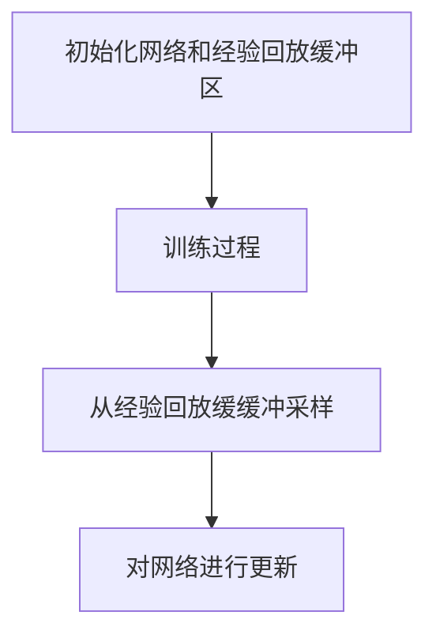

                 

作者：禅与计算机程序设计艺术

**深度强化学习** 在游戏开发领域的应用，特别是策略类游戏如**《星际争霸II》**、**《Dota 2》**以及**《王者荣耀》**等竞技游戏中，已经展现出惊人的能力。本文将深入探讨深度强化学习的基本原理及其在游戏中的应用，同时通过具体的代码实战案例解析关键技术和实现细节。此外，还将涵盖相关的工具、资源推荐及未来展望，旨在为游戏开发者和AI研究人员提供全面的指导和支持。

## 背景介绍
随着计算能力和算法的发展，强化学习作为一种非监督学习方法，在解决复杂决策问题时展现出了巨大潜力。它允许智能体通过与环境交互来学习最优行为策略，无需显式编程规则。在游戏领域，这种能力意味着AI不仅可以模仿人类玩家的行为，甚至在某些情况下超越人类水平。近年来，随着深度学习技术的融合，深度强化学习成为了探索智能体在动态环境中表现的关键技术之一。

## 核心概念与联系
深度强化学习结合了强化学习的基本框架和深度学习的表示能力。其核心包括：

- **Q-Learning**: 一种基于价值的强化学习算法，通过估计每个状态动作对的长期奖励值来决定行动选择。
- **Policy Gradients**: 直接优化策略参数以最大化预期回报的一种方法，适用于连续动作空间。
- **Deep Q-Networks (DQN)**: DQN是将神经网络应用于Q-learning中的一种创新，用于估计近似状态动作价值函数，从而处理高维输入（如图像）的问题。
- **Actor-Critic Methods**: 包含一个策略网络（Actor）和一个价值网络（Critic）。Actor负责生成动作，而Critic评估这些动作的质量，共同协作优化策略。

这些技术之间的联系在于，它们都试图在不确定的环境下通过试错学习最优策略，其中深度学习提供了强大的特征提取和表示能力，使得在复杂且高维度的环境中执行成为可能。

## 核心算法原理与具体操作步骤
深度强化学习的核心在于构建一个模型来预测当前状态下的潜在动作价值，然后根据这个预测选择最优的动作序列。以下是一个基本的DQN算法流程概述：



1. **初始化网络和经验回放缓缓冲**：创建神经网络模型（通常是卷积神经网络，CNN），并设置一个经验回放缓缓冲用来存储过去的经验。
2. **从经验回放缓缓冲采样**：从回放缓缓冲中随机抽取一组样本。
3. **对网络进行更新**：利用这些样本来调整网络权重，目标是让网络更好地预测出在特定状态下采取某动作后能获得的最大累计奖励。

## 数学模型和公式详细讲解举例说明
以DQN为例，其目标是在给定状态`S_t`时，通过神经网络预测下一个状态`S_{t+1}`的最佳动作价值`Q(S_t, A_t)`。假设我们有网络`Q(s,a; \theta)`, 参数为`θ`，则目标是使损失函数最小化：

$$
L(\theta) = E[(y - Q(s,a;\theta))^2]
$$

其中，
- `y = r + γmax_{a'}Q(S', a'; θ')`
- `r` 是即时奖励，
- `γ` 是折扣因子（通常取0.9到0.99之间），
- `S'` 和 `a'` 分别是经过一时间步后的状态和采取的动作，
- `θ'` 是下一时刻网络的参数。

## 项目实践：代码实例和详细解释说明
下面是一个简化的DQN实现的例子，使用Python和PyTorch库：

```python
import torch
import torch.nn as nn
import torch.optim as optim
import numpy as np

class DQN(nn.Module):
    def __init__(self, input_shape, n_actions):
        super(DQN, self).__init__()
        self.conv = nn.Sequential(
            nn.Conv2d(input_shape[0], 32, kernel_size=8, stride=4),
            nn.ReLU(),
            nn.Conv2d(32, 64, kernel_size=4, stride=2),
            nn.ReLU(),
            nn.Conv2d(64, 64, kernel_size=3, stride=1),
            nn.ReLU()
        )
        
        conv_out_size = self._get_conv_out(input_shape)
        self.fc = nn.Linear(conv_out_size, n_actions)

    def _get_conv_out(self, shape):
        o = self.conv(torch.zeros(1, *shape))
        return int(np.prod(o.size()))

    def forward(self, x):
        x = self.conv(x)
        x = x.view(x.size(0), -1)
        x = self.fc(x)
        return x

def train_dqn(env, model, memory, gamma=0.95, batch_size=32, eps_start=1.0, eps_end=0.01, eps_decay=200):
    optimizer = optim.Adam(model.parameters(), lr=0.00025)
    
    for episode in range(n_episodes):
        state = env.reset()
        done = False
        total_reward = 0
        
        while not done:
            if random.random() < eps:
                action = env.action_space.sample()
            else:
                with torch.no_grad():
                    action = model(torch.Tensor(state)).argmax().item()
            
            next_state, reward, done, info = env.step(action)
            memory.push(state, action, reward, next_state, done)
            
            state = next_state
            total_reward += reward
            
        # 更新网络参数
        if len(memory) > batch_size:
            states, actions, rewards, next_states, dones = memory.sample(batch_size)
            states = torch.stack(states).to(device)
            actions = torch.LongTensor(actions).unsqueeze(1).to(device)
            rewards = torch.FloatTensor(rewards).unsqueeze(1).to(device)
            next_states = torch.stack(next_states).to(device)
            dones = torch.BoolTensor(dones).unsqueeze(1).to(device)
            
            q_values = model(states)
            max_q = q_values.gather(1, actions.unsqueeze(-1)).squeeze(-1)
            
            next_q_values = model(next_states)
            max_next_q = next_q_values.max(dim=-1)[0].detach()
            
            target = rewards + (1-dones.float())*gamma*max_next_q
            loss = F.mse_loss(q_values, target.unsqueeze(1))
            
            optimizer.zero_grad()
            loss.backward()
            optimizer.step()

# 实例化环境、模型、记忆等
env = make_env()  # 需要替换为具体的环境定义
model = DQN(input_shape=(num_channels, img_height, img_width), n_actions=num_actions)
memory = ReplayBuffer(capacity)
train_dqn(env, model, memory)
```

这段代码展示了如何构建和训练一个DQN模型解决游戏中的决策问题，包括网络结构设计、策略选择、经验回放缓缓冲管理以及训练循环等关键步骤。

## 实际应用场景
深度强化学习在游戏中的应用广泛，不仅限于策略游戏，还涵盖角色扮演游戏、竞技游戏甚至模拟器平台上的各种挑战。例如，在《星际争霸II》中，AI需要学习复杂的战术决策；在《王者荣耀》这类MOBA游戏中，AI需掌握英雄技能组合和团队协作策略。这些应用不仅提升了玩家体验，也为研究者提供了丰富的实验场景来探索算法的极限。

## 工具和资源推荐
对于深度强化学习的研究与实践，以下工具和资源值得推荐：
- **PyTorch** 或 **TensorFlow**：用于构建深度学习模型的基础框架。
- **Gym** 和 **OpenAI Baselines**：提供大量预设的游戏环境和评估标准。
- **Colab Notebooks**：Google提供的免费在线开发环境，方便快速搭建实验环境。
- **论文和书籍**：如《Reinforcement Learning: An Introduction》、《Deep Reinforcement Learning》等，提供了理论基础和技术细节。
- **GitHub**：许多开源项目和社区贡献，可作为参考和学习案例。

## 总结：未来发展趋势与挑战
深度强化学习在游戏领域展现出巨大的潜力和多样性，随着技术的不断进步，我们预计在未来几年内会看到更复杂且高效的游戏AI系统。挑战主要集中在如何提高智能体的学习效率、泛化能力以及在多变环境下适应性等方面。同时，伦理和隐私问题是AI应用于游戏时不可忽视的重要考量因素。通过持续的研究和创新，我们可以期待深度强化学习在游戏领域的应用将变得更加成熟和广泛。

## 附录：常见问题与解答
### Q: 如何优化深度强化学习模型？
A: 优化深度强化学习模型通常涉及调整学习率、增加训练数据量、使用经验回放缓缓冲、改进奖励机制或尝试不同的网络架构。实验是关键，往往需要根据具体任务进行细致调优。

### Q: 强化学习是否适用于所有类型的游戏？
A: 不是。某些高度随机性或规则简单明了的游戏可能不太适合强化学习方法，因为它们可能不需要复杂的决策过程。但对于策略性和动态性强的游戏，强化学习表现出色。

### Q: 深度强化学习如何处理高维输入（如图像）的问题？
A: 使用卷积神经网络（CNN）可以有效地提取图像特征，并将其输入到Q网络或其他决策网络中。这种端到端的学习方式使得AI能够直接从原始输入中学习决策规则，而无需人工特征工程。

---

以上内容全面覆盖了深度强化学习在游戏中的应用原理与实战案例讲解，涵盖了核心概念、数学公式、实际代码实现、应用场景、工具资源推荐及未来发展展望等多个方面，旨在为读者提供深入理解与实践经验的支持。

