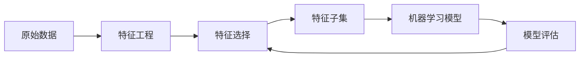

# 特征选择与特征工程原理与代码实战案例讲解

## 1. 背景介绍

在机器学习和数据挖掘领域,特征选择(Feature Selection)和特征工程(Feature Engineering)是两个非常重要的概念和技术。它们对于提高模型性能、减少计算开销、增强模型的泛化能力和可解释性都有着至关重要的作用。

### 1.1 特征选择的重要性

特征选择是指从原有特征中选择一个子集,去除冗余和不相关的特征,从而达到降维的目的。良好的特征选择可以带来以下好处:

- 降低模型复杂度,减少计算开销
- 去除噪声特征,提高模型泛化能力  
- 避免维度灾难,缓解过拟合
- 增强模型的可解释性

### 1.2 特征工程的重要性

特征工程是指基于领域知识和数据对原始数据进行转换,构建更有利于机器学习算法学习的新特征的过程。高质量的特征是模型取得好性能的基础。特征工程的意义体现在:

- 融入先验知识,引导模型学习
- 清洗和规范化数据,提高数据质量
- 提取或构建高级特征,增强数据的表达能力
- 实现特定的约束,如公平性、可解释性等

### 1.3 特征选择与特征工程的联系

特征选择和特征工程并非完全独立,而是相辅相成的。一方面,特征工程产生的新特征也需要经过特征选择来去冗余;另一方面,特征选择的结果可以为特征工程提供指引和评估。二者的目标是一致的,都是为了得到更优质的特征,从而训练出更好的模型。

## 2. 核心概念与联系

### 2.1 特征选择的分类

根据特征选择过程中是否利用标签信息,可以将特征选择方法分为3类:

- Filter(过滤式):基于特征本身的统计特性来评估特征是否重要,与学习器无关。如方差选择法、相关系数法等。
- Wrapper(包裹式):将特征选择看作一个特征子集搜索问题,用学习器性能来评估特征子集的好坏。如递归特征消除法。  
- Embedded(嵌入式):在学习器训练过程中自动进行特征选择。如L1正则化、决策树等。

### 2.2 特征工程的类型

根据特征工程的目的和方式,可以将其分为以下几类:  

- 数据预处理:清洗、归一化、缺失值填充、异常值处理等。
- 特征变换:如对数变换、多项式变换等。
- 特征构建:基于原始特征构建新特征,如特征交叉、统计量等。
- 特征分解:如主成分分析(PCA)、独立成分分析(ICA)等。
- 特征编码:将分类变量转为数值特征,如One-Hot编码等。

### 2.3 核心概念之间的联系



从上图可以看出,特征工程和特征选择是连接原始数据和机器学习模型的桥梁。原始数据经过特征工程转换成更高质量的特征,再通过特征选择去除冗余,最终输入机器学习模型。模型性能的反馈又可以指导新一轮的特征工程和选择。整个过程是一个迭代优化的过程。

## 3. 核心算法原理具体操作步骤

### 3.1 Filter方法

#### 3.1.1 方差选择法

1. 计算每个特征的方差 
2. 根据阈值,过滤掉方差过小的特征

#### 3.1.2 相关系数法

1. 计算每个特征与标签的相关系数(如Pearson系数)
2. 根据阈值,选择与标签高度相关的特征

### 3.2 Wrapper方法

#### 3.2.1 递归特征消除法(RFE)

1. 训练模型,得到各特征的重要性权重
2. 移除权重最小的特征 
3. 重复步骤1、2,直到达到预设的特征数量

### 3.3 Embedded方法 

#### 3.3.1 L1正则化

1. 在目标函数中加入L1正则化项
2. 求解优化问题,得到稀疏解
3. 将系数为0的特征剔除

#### 3.3.2 决策树

1. 构建决策树
2. 计算各特征的重要性(如Gini指数)
3. 根据阈值选择重要特征

### 3.4 常用的特征工程方法

#### 3.4.1 标准化

1. 计算特征的均值和标准差
2. 对每个特征值减去均值再除以标准差

#### 3.4.2 对数变换

1. 取特征值的对数

#### 3.4.3 多项式特征

1. 基于原始特征构造一系列多项式特征

#### 3.4.4 特征交叉

1. 将两个或多个特征组合成新的特征

## 4. 数学模型和公式详细讲解举例说明

### 4.1 方差

特征 $X$ 的方差定义为:

$$
Var(X) = \frac{1}{n}\sum_{i=1}^{n}(x_i - \bar{x})^2
$$

其中 $\bar{x}$ 为 $X$ 的均值。方差度量了特征的分散程度,方差越大,说明特征值分布越分散,包含的信息越多。

### 4.2 Pearson相关系数

两个变量 $X$ 和 $Y$ 的Pearson相关系数定义为:

$$
\rho(X,Y) = \frac{Cov(X,Y)}{\sqrt{Var(X)Var(Y)}} = \frac{\sum_{i=1}^{n}(x_i - \bar{x})(y_i - \bar{y})}{\sqrt{\sum_{i=1}^{n}(x_i - \bar{x})^2}\sqrt{\sum_{i=1}^{n}(y_i - \bar{y})^2}}
$$

其中 $Cov(X,Y)$ 为 $X$ 和 $Y$ 的协方差。相关系数衡量了两个变量的线性相关程度,取值范围为 $[-1,1]$ 。越接近1或-1,说明线性相关性越强。

### 4.3 L1正则化

加入L1正则化项的优化目标:

$$
\min_w \frac{1}{n}\sum_{i=1}^{n}L(y_i, f(x_i)) + \lambda||w||_1
$$

其中 $L$ 为损失函数,$f$ 为模型函数,$\lambda$ 为正则化系数。L1正则化倾向于产生稀疏解,可以用于特征选择。

### 4.4 标准化

标准化公式:

$$
x' = \frac{x - \mu}{\sigma}
$$

其中 $\mu$ 为均值, $\sigma$ 为标准差。标准化后的特征均值为0,方差为1,消除了量纲影响。

## 5. 项目实践：代码实例和详细解释说明

下面以Python和Scikit-learn为例,演示几种常用的特征选择和特征工程方法。

### 5.1 方差选择法

```python
from sklearn.feature_selection import VarianceThreshold

# 移除方差小于阈值的特征
selector = VarianceThreshold(threshold=0.8)
X_new = selector.fit_transform(X)
```

### 5.2 相关系数法

```python
from sklearn.feature_selection import SelectKBest
from scipy.stats import pearsonr

# 选择与标签最相关的k个特征  
def cor_selector(X, y):
    cor_list = []
    for i in range(X.shape[1]):
        cor = pearsonr(X[:, i], y)[0]
        cor_list.append(abs(cor))
    return cor_list

selector = SelectKBest(cor_selector, k=5)  
X_new = selector.fit_transform(X, y)
```

### 5.3 递归特征消除法

```python
from sklearn.feature_selection import RFE
from sklearn.linear_model import LogisticRegression

# 递归消除特征,直到剩下5个
rfe_selector = RFE(estimator=LogisticRegression(), n_features_to_select=5)
X_new = rfe_selector.fit_transform(X, y)
```

### 5.4 L1正则化

```python
from sklearn.linear_model import LogisticRegression
from sklearn.feature_selection import SelectFromModel

# L1逻辑回归作为基模型
lr = LogisticRegression(penalty='l1', C=0.1)
lr.fit(X, y)

# 将系数为0的特征剔除
model = SelectFromModel(lr, prefit=True)
X_new = model.transform(X)
```

### 5.5 标准化

```python
from sklearn.preprocessing import StandardScaler

# 标准化
scaler = StandardScaler()
X_new = scaler.fit_transform(X)  
```

### 5.6 多项式特征

```python
from sklearn.preprocessing import PolynomialFeatures

# 构造2次多项式特征
poly = PolynomialFeatures(degree=2)  
X_new = poly.fit_transform(X)
```

## 6. 实际应用场景

特征选择和特征工程几乎在所有的机器学习任务中都会用到,下面列举一些典型的应用场景。

### 6.1 文本分类

- 原始特征:词频、TF-IDF等
- 特征工程:n-gram、词性、命名实体等
- 特征选择:文本特征维度极高,需要过滤掉低频词、停用词等

### 6.2 点击率预估

- 原始特征:用户属性、物品属性、上下文信息等
- 特征工程:特征组合、统计特征、时间特征等  
- 特征选择:刻画用户兴趣和物品特点的关键特征

### 6.3 金融风控

- 原始特征:用户画像、交易记录、社交关系等
- 特征工程:衍生变量、分箱、编码等
- 特征选择:相关性分析、专家知识等

### 6.4 医疗诊断

- 原始特征:症状、体征、化验、影像等
- 特征工程:特征离散化、特征组合等
- 特征选择:专家经验、特征重要性等

## 7. 工具和资源推荐

- Scikit-learn:机器学习领域非常流行的Python库,提供了丰富的特征选择和特征工程工具。
- Numpy & Scipy:Python科学计算基础库,是进行特征工程的有力工具。
- Pandas:强大的数据处理工具,方便进行数据清洗和特征构建。
- Featuretools:自动化特征工程库,可从关系数据库自动抽取特征。
- Tsfresh:时间序列特征自动提取库。
- Boruta:一种基于随机森林的特征选择方法。
- Kaggle:著名的数据科学竞赛平台,包含大量特征工程实战案例。

## 8. 总结：未来发展趋势与挑战

### 8.1 自动化特征工程

传统的特征工程高度依赖专家经验,费时费力。随着自动机器学习(AutoML)的发展,自动化特征工程成为一个新的研究热点。利用元学习、强化学习、进化算法等技术,自动搜索数据预处理、特征构建、特征选择的最佳配置,将极大提升特征工程的效率。

### 8.2 深度学习中的特征学习

不同于传统机器学习依赖人工设计特征,深度学习可以端到端地自动学习特征。然而,并非所有场景都适合端到端训练,在样本量较小、任务较复杂时,适当的特征工程仍然必不可少。如何更好地将特征工程与深度学习结合,让两者互补,是值得探索的方向。

### 8.3 特征选择的可解释性

传统的特征选择方法评估特征重要性时往往是黑盒的,缺乏可解释性。在一些决策至关重要的场合,需要给出每个特征被选择的原因。因此,可解释的特征选择成为一个新的挑战。需要开发新的算法,既能高效地选择特征,又能提供选择的依据。

### 8.4 海量高维数据的特征选择

随着大数据时代的到来,很多问题都面临海量高维数据,给特征选择带来巨大挑战。传统的特征选择方法在超高维空间的计算开销往往难以承受。因此,亟需开发新的算法,能够在线性或次线性时间内实现特征选择,同时保证选择的质量。

## 9. 附录：常见问题与