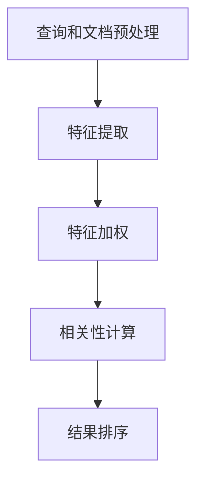

# 相关性评分 原理与代码实例讲解

## 1.背景介绍

在信息检索、推荐系统、搜索引擎等领域中,相关性评分是一个非常重要的概念和技术。它旨在衡量查询(query)与文档(document)之间的相关程度,从而为用户提供最相关的搜索结果或推荐内容。相关性评分广泛应用于各种场景,如网页搜索、电商产品推荐、社交媒体内容推荐等。

随着信息量的激增和用户需求的多样化,提高相关性评分的准确性和效率对于提升用户体验至关重要。本文将深入探讨相关性评分的核心原理、算法实现以及实践应用,为读者提供全面的理解和实用指导。

## 2.核心概念与联系

相关性评分涉及以下几个核心概念:

### 2.1 查询(Query)

查询是用户输入的搜索词或关键词,表达了用户的信息需求。在网页搜索中,查询可以是一个或多个单词;在电商场景中,查询可以是产品名称、类别或属性等。

### 2.2 文档(Document)

文档是待评分的信息单元,可以是网页、产品描述、新闻文章等。文档通常由标题、正文、元数据等多个字段组成。

### 2.3 相关性(Relevance)

相关性描述了查询与文档之间的关联程度。高相关性意味着文档与查询的匹配程度高,能够更好地满足用户的信息需求。

### 2.4 相关性评分函数(Relevance Scoring Function)

相关性评分函数是一个算法模型,它将查询和文档作为输入,输出一个相关性分数,用于衡量查询与文档之间的相关程度。设计高效准确的相关性评分函数是相关性评分的核心挑战。

## 3.核心算法原理具体操作步骤

相关性评分算法通常由以下几个关键步骤组成:



### 3.1 查询和文档预处理

在进行相关性评分之前,需要对查询和文档进行预处理,包括分词、去停用词、词形还原等自然语言处理操作,将文本转换为标准的词条序列。

### 3.2 特征提取

特征提取旨在从查询和文档中提取相关的信息,构建特征向量。常用的特征包括:

- 词频(Term Frequency, TF):词条在文档中出现的次数。
- 逆文档频率(Inverse Document Frequency, IDF):词条在整个文档集合中的稀有程度。
- 词位置(Term Proximity):词条在文档中的位置信息,如距离标题的距离等。
- 词语义(Term Semantics):利用词向量等技术捕捉词与词之间的语义关联。

### 3.3 特征加权

不同的特征对相关性评分的贡献不同,因此需要对特征进行加权。常用的加权方法包括:

- 布尔模型(Boolean Model):将特征视为存在或不存在,不考虑权重。
- 向量空间模型(Vector Space Model):根据TF-IDF值对特征进行加权。
- 概率模型(Probabilistic Model):基于贝叶斯定理估计文档相关性的概率。
- 机器学习模型:通过训练数据自动学习特征权重。

### 3.4 相关性计算

根据加权后的特征向量,通过相关性评分函数计算查询与文档之间的相关性分数。常用的相关性评分函数包括:

- 余弦相似度(Cosine Similarity)
- BM25算法
- 语言模型(Language Model)
- 机器学习排序模型,如LambdaMART、RankNet等

### 3.5 结果排序

将计算出的相关性分数从高到低排序,输出排序后的文档列表,作为最终的搜索或推荐结果。

## 4.数学模型和公式详细讲解举例说明

相关性评分算法中涉及了多种数学模型和公式,下面将详细介绍其中的几个核心模型。

### 4.1 TF-IDF

TF-IDF(Term Frequency-Inverse Document Frequency)是一种常用的特征加权方法,它将词频(TF)和逆文档频率(IDF)相结合,用于评估一个词对于一个文档的重要程度。

TF表示一个词在文档中出现的频率,可以使用原始计数,也可以使用一些归一化方法,如:

$$
tf(t,d) = \frac{n_{t,d}}{\sum_{t' \in d} n_{t',d}}
$$

其中,$ n_{t,d} $表示词t在文档d中出现的次数。

IDF表示一个词在整个文档集合中的稀有程度,通常定义为:

$$
idf(t,D) = \log \frac{|D|}{|\{d \in D: t \in d\}|}
$$

其中,|D|表示文档集合的大小,|\{d \in D: t \in d\}|表示包含词t的文档数量。

将TF和IDF相乘,即可得到TF-IDF权重:

$$
tfidf(t,d,D) = tf(t,d) \times idf(t,D)
$$

TF-IDF权重越高,表示该词对文档越重要。在相关性评分中,通常将查询和文档的TF-IDF向量进行余弦相似度计算,得到相关性分数。

### 4.2 BM25

BM25是一种常用的相关性评分函数,它基于概率模型,考虑了词频、逆文档频率以及文档长度等因素。BM25分数的计算公式如下:

$$
score(D,Q) = \sum_{q \in Q} \log \frac{N - df(q) + 0.5}{df(q) + 0.5} \cdot \frac{tf(q,D) \cdot (k_1 + 1)}{tf(q,D) + k_1 \cdot (1 - b + b \cdot \frac{|D|}{avgdl})}
$$

其中:

- $D$表示文档
- $Q$表示查询,包含多个词$q$
- $N$表示文档集合的总文档数
- $df(q)$表示包含词$q$的文档数量
- $tf(q,D)$表示词$q$在文档$D$中出现的次数
- $|D|$表示文档$D$的长度(词数)
- $avgdl$表示文档集合的平均文档长度
- $k_1$和$b$是可调节的参数,用于控制词频和文档长度的影响

BM25综合考虑了多个因素,在实践中表现良好,被广泛应用于网页搜索、文本检索等场景。

### 4.3 语言模型

语言模型(Language Model)是一种基于概率的相关性评分方法。它假设查询是由相关文档生成的,因此可以根据文档对查询的生成概率来衡量相关性。

具体来说,语言模型相关性评分的目标是找到使生成查询Q的概率P(Q|D)最大的文档D。根据贝叶斯定理,我们有:

$$
P(D|Q) = \frac{P(Q|D) \cdot P(D)}{P(Q)}
$$

由于P(Q)对所有文档是相同的,因此可以忽略,只需要最大化P(Q|D)⋅P(D)。

常用的语言模型包括:

- 多项式模型(Multinomial Model)
- 平滑语言模型(Smoothed Language Model)

以多项式模型为例,P(Q|D)的计算公式如下:

$$
P(Q|D) = \prod_{q \in Q} P(q|D) = \prod_{q \in Q} \frac{tf(q,D) + \mu \cdot P(q|C)}{|D| + \mu}
$$

其中:

- $q$表示查询中的词
- $tf(q,D)$表示词$q$在文档$D$中出现的次数
- $|D|$表示文档$D$的长度(词数)
- $P(q|C)$表示词$q$在整个语料库$C$中出现的概率,用于平滑
- $\mu$是控制平滑程度的参数

语言模型方法能够自然地融合多种特征,在实践中表现良好,被广泛应用于信息检索、机器翻译等领域。

## 5.项目实践:代码实例和详细解释说明

为了更好地理解相关性评分的实现,我们将通过一个基于Python的代码示例,演示如何计算TF-IDF权重和余弦相似度。

```python
import math
from collections import Counter

def tf(word, document):
    """计算词频(Term Frequency)"""
    return document.count(word) / len(document)

def idf(word, documents):
    """计算逆文档频率(Inverse Document Frequency)"""
    doc_count = sum(1 for doc in documents if word in doc)
    return math.log(len(documents) / (1 + doc_count))

def tfidf(word, document, documents):
    """计算TF-IDF权重"""
    return tf(word, document) * idf(word, documents)

def cosine_similarity(vector1, vector2):
    """计算余弦相似度"""
    dot_product = sum(x * y for x, y in zip(vector1, vector2))
    magnitude1 = math.sqrt(sum(x ** 2 for x in vector1))
    magnitude2 = math.sqrt(sum(y ** 2 for y in vector2))
    return dot_product / (magnitude1 * magnitude2)

# 示例数据
documents = [
    "This is a document about cats",
    "This is another document about dogs",
    "Yet another document about cats and dogs"
]

query = "cats"

# 预处理
processed_docs = [doc.lower().split() for doc in documents]
processed_query = query.lower().split()

# 构建词典
vocab = set()
for doc in processed_docs:
    vocab.update(doc)

# 计算TF-IDF向量
doc_tfidf_vectors = []
for doc in processed_docs:
    doc_vector = []
    for word in vocab:
        doc_vector.append(tfidf(word, doc, processed_docs))
    doc_tfidf_vectors.append(doc_vector)

# 计算查询的TF-IDF向量
query_vector = [tfidf(word, processed_query, processed_docs) for word in vocab]

# 计算余弦相似度
similarities = [cosine_similarity(query_vector, doc_vector) for doc_vector in doc_tfidf_vectors]

# 输出结果
for doc, sim in zip(documents, similarities):
    print(f"Document: {doc}, Similarity: {sim:.4f}")
```

上述代码实现了以下功能:

1. 计算词频(TF)
2. 计算逆文档频率(IDF)
3. 计算TF-IDF权重
4. 计算余弦相似度

首先,我们定义了一个示例文档集合`documents`和查询`query`。然后,对文档和查询进行预处理,将它们转换为小写并分词。

接下来,我们构建了词典`vocab`,包含所有出现过的词。对于每个文档,我们计算每个词的TF-IDF权重,构建TF-IDF向量。同样,我们也为查询构建了TF-IDF向量。

最后,我们计算查询向量与每个文档向量之间的余弦相似度,作为相关性分数。结果显示,第一个和第三个文档与查询"cats"更相关。

通过这个示例,你可以清楚地了解如何实现TF-IDF权重计算和余弦相似度计算,这是相关性评分中常用的技术。当然,在实际应用中,你还需要考虑更多的因素和优化,如查询扩展、同义词处理、特征工程等,以提高相关性评分的准确性和效率。

## 6.实际应用场景

相关性评分在多个领域都有广泛的应用,下面列举了几个典型的应用场景:

### 6.1 网页搜索引擎

在网页搜索引擎中,相关性评分是核心技术之一。搜索引擎需要根据用户输入的查询,从海量网页中找到最相关的结果。相关性评分算法会综合考虑网页内容、链接结构、用户行为数据等多种信号,为每个网页计算相关性分数,从而为用户提供高质量的搜索结果。

### 6.2 电商产品推荐

在电商平台上,相关性评分被广泛应用于个性化产品推荐。系统会根据用户的浏览历史、购买记录、偏好设置等数据,计算用户与各个产品的相关性分数,推荐最相关的商品给用户,提高购买转化率。

### 6.3 社交媒体内容推荐

社交媒体平台上每天都会产生大量的新内容,如何为用户推荐感兴趣的内容是一个巨大的挑战。