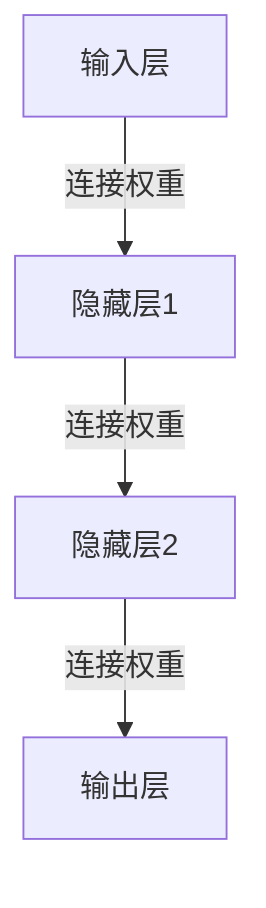

# 神经网络(Neural Network)原理与代码实战案例讲解

## 1. 背景介绍
在人工智能的众多分支中，神经网络技术因其强大的数据拟合和模式识别能力而备受关注。自从20世纪40年代首次提出以来，神经网络已经经历了多次发展浪潮，尤其是近年来，随着计算能力的提升和大数据的涌现，深度学习成为了推动神经网络发展的核心动力。本文将深入探讨神经网络的核心原理，并通过代码实战案例，帮助读者更好地理解和应用这一技术。

## 2. 核心概念与联系
神经网络的核心概念源自于对人脑神经元工作机制的模拟。一个基本的神经网络包含输入层、隐藏层和输出层。每一层由多个神经元组成，神经元之间通过权重连接，通过激活函数处理信号。

### 2.1 神经元模型


### 2.2 网络结构


### 2.3 激活函数
激活函数是神经网络中非常关键的一个环节，它决定了神经元是否应该被激活，从而影响网络的输出。常见的激活函数有Sigmoid、ReLU、Tanh等。

## 3. 核心算法原理具体操作步骤
神经网络的训练过程主要包括前向传播和反向传播两个阶段。前向传播用于计算输出，反向传播则用于更新网络中的权重。

### 3.1 前向传播
1. 输入数据被送入输入层。
2. 数据通过每个连接的权重被传递到隐藏层。
3. 隐藏层的神经元通过激活函数处理数据。
4. 数据继续传递到输出层，得到最终结果。

### 3.2 反向传播
1. 计算输出层的误差。
2. 将误差反向传播到隐藏层。
3. 根据误差更新权重。

## 4. 数学模型和公式详细讲解举例说明
神经网络的数学模型基于线性代数、微积分和概率论。以单个神经元为例，其数学表达可以写为：

$$
y = f(\sum_{i=1}^{n} w_i x_i + b)
$$

其中，$x_i$ 是输入，$w_i$ 是权重，$b$ 是偏置，$f$ 是激活函数，$y$ 是输出。

### 4.1 损失函数
损失函数用于评估模型的预测值与真实值之间的差异。常用的损失函数包括均方误差(MSE)和交叉熵损失函数。

### 4.2 梯度下降
梯度下降是一种优化算法，用于在训练过程中更新权重。权重的更新公式为：

$$
w_{new} = w_{old} - \alpha \frac{\partial L}{\partial w}
$$

其中，$\alpha$ 是学习率，$L$ 是损失函数。

## 5. 项目实践：代码实例和详细解释说明
为了更好地理解神经网络的工作原理，我们将通过一个简单的分类问题来展示如何实现一个神经网络。

```python
import numpy as np

# 定义激活函数
def sigmoid(x):
    return 1 / (1 + np.exp(-x))

# 定义损失函数
def mse_loss(y_true, y_pred):
    return ((y_true - y_pred) ** 2).mean()

# 定义神经网络结构
class NeuralNetwork:
    def __init__(self):
        # 初始化权重和偏置
        self.weights = np.random.normal(0, 1, (2, 1))
        self.bias = np.random.normal(0, 1)

    def forward(self, x):
        # 前向传播
        return sigmoid(np.dot(x, self.weights) + self.bias)

    def train(self, x, y, epochs, lr):
        # 训练神经网络
        for epoch in range(epochs):
            for i in range(len(x)):
                # 前向传播
                y_pred = self.forward(x[i])
                # 计算损失
                loss = mse_loss(y[i], y_pred)
                # 反向传播
                dL_dy = -2 * (y[i] - y_pred)
                dy_dw = x[i] * sigmoid(y_pred) * (1 - sigmoid(y_pred))
                dy_db = sigmoid(y_pred) * (1 - sigmoid(y_pred))
                # 更新权重和偏置
                self.weights -= lr * dL_dy * dy_dw
                self.bias -= lr * dL_dy * dy_db
            # 输出训练进度
            if epoch % 10 == 0:
                loss = mse_loss(y, self.forward(x))
                print("Epoch %d loss: %.3f" % (epoch, loss))

# 示例数据
x = np.array([[0, 0], [0, 1], [1, 0], [1, 1]])
y = np.array([[0], [1], [1], [0]])

# 创建神经网络实例
nn = NeuralNetwork()
# 训练神经网络
nn.train(x, y, epochs=1000, lr=0.1)
```

在这个例子中，我们定义了一个简单的神经网络，它包含一个输入层和一个输出层，没有隐藏层。我们使用Sigmoid函数作为激活函数，均方误差作为损失函数，并通过梯度下降算法来更新权重。

## 6. 实际应用场景
神经网络在许多领域都有广泛的应用，包括但不限于图像识别、语音识别、自然语言处理和预测建模。例如，在自动驾驶汽车中，神经网络可以用来识别道路标志和行人。在医疗领域，神经网络可以帮助诊断疾病和推荐治疗方案。

## 7. 工具和资源推荐
- TensorFlow和Keras：用于构建和训练神经网络的开源库。
- PyTorch：另一个流行的开源机器学习库。
- Scikit-learn：提供简单有效的数据挖掘和数据分析工具。
- Google Colab：免费的云端Jupyter笔记本环境，适合进行机器学习实验。

## 8. 总结：未来发展趋势与挑战
神经网络的未来发展趋势将更加侧重于模型的解释性、小数据学习能力和计算效率。同时，随着技术的发展，神经网络将在更多领域得到应用。然而，随之而来的挑战包括数据隐私、模型安全性和伦理问题。

## 9. 附录：常见问题与解答
Q1: 神经网络如何选择合适的激活函数？
A1: 选择激活函数通常基于问题类型和网络结构。例如，对于输出层，分类问题常用Softmax函数，回归问题常用线性激活函数。

Q2: 如何避免过拟合？
A2: 可以通过增加数据集、使用正则化技术、引入Dropout层等方法来避免过拟合。

Q3: 神经网络训练时学习率应该如何设置？
A3: 学习率的设置通常需要通过实验来确定。太高的学习率可能导致训练不稳定，太低则训练速度缓慢。

作者：禅与计算机程序设计艺术 / Zen and the Art of Computer Programming