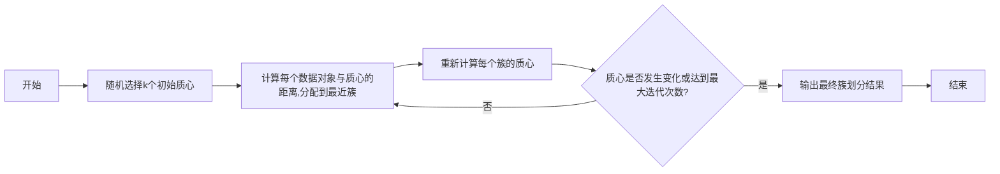
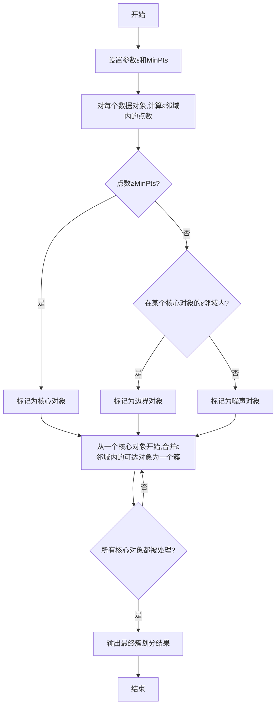

以下是根据您的要求撰写的技术博客文章正文内容：

# 聚类分析在供应链管理领域的应用

## 1.背景介绍

### 1.1 供应链管理的重要性

在当今快节奏的商业环境中，供应链管理已成为企业成功的关键因素。有效的供应链管理可以优化资源分配、降低运营成本、提高客户满意度,并增强企业的竞争优势。随着全球化和技术进步的推动,供应链日益复杂,管理难度也与日俱增。因此,企业需要采用先进的分析技术来优化供应链流程,提高效率和灵活性。

### 1.2 聚类分析概述

聚类分析是一种无监督学习技术,旨在根据数据的内在特征将其划分为多个相似的群组或簇。它广泛应用于各个领域,如客户细分、基因组学、计算机视觉等。在供应链管理中,聚类分析可用于多种场景,如产品分类、供应商评估、库存优化等,帮助企业发现数据模式,做出明智决策。

## 2.核心概念与联系

### 2.1 聚类分析的核心概念

1. **相似性度量**:定义数据对象之间的相似程度,常用的度量包括欧几里得距离、皮尔逊相关系数等。
2. **聚类准则**:根据相似性度量,将相似的对象分配到同一个簇,不相似的对象分配到不同簇。常用的准则有最小化簇内距离、最大化簇间距离等。
3. **聚类算法**:执行聚类过程的具体方法,如K-Means、层次聚类、DBSCAN等。

### 2.2 供应链管理中的关键概念

1. **需求预测**:准确预测未来产品需求,以优化库存水平和生产计划。
2. **供应商管理**:评估和选择合格的供应商,建立长期合作关系。
3. **库存优化**:平衡库存水平,避免过多或过少的库存。
4. **物流路线规划**:设计高效的运输路线,降低物流成本。

### 2.3 聚类分析与供应链管理的联系

聚类分析可以帮助供应链管理从以下几个方面获益:

1. **客户细分**:根据购买模式、偏好等将客户划分为不同群组,实施精准营销策略。
2. **产品分类**:将相似产品归类,优化库存管理和促销策略。 
3. **供应商评估**:根据供应商的表现将其分组,识别优质供应商。
4. **物流路线优化**:将地理位置相近的订单归为一簇,规划高效的运输路线。

## 3.核心算法原理具体操作步骤 

聚类分析包含多种算法,下面将重点介绍两种常用算法的工作原理和具体步骤。

### 3.1 K-Means 算法

K-Means是一种简单而有效的聚类算法,广泛应用于多个领域。其核心思想是将n个数据对象划分为k个簇,每个数据对象属于离其最近的簇的质心。算法步骤如下:

1. 随机选择k个初始质心。
2. 计算每个数据对象与各个质心的距离,将其分配到最近的簇。
3. 重新计算每个簇的质心。
4. 重复步骤2和3,直到质心不再发生变化或达到最大迭代次数。

K-Means算法的优点是简单、高效,但需要预先确定簇的数量k,并且对噪声和异常值敏感。



### 3.2 DBSCAN 算法

DBSCAN(基于密度的聚类噪声空间)是一种常用的基于密度的聚类算法,能够有效处理噪声和发现任意形状的簇。其核心思想是将高密度区域的数据对象划分为一个簇,低密度区域的对象视为噪声。算法步骤如下:

1. 设置两个参数:邻域半径ε和最小点数MinPts。
2. 对每个数据对象,计算其ε邻域内的点数。
   - 如果点数≥MinPts,则该对象为核心对象。
   - 如果点数<MinPts但在某个核心对象的ε邻域内,则该对象为边界对象。
   - 其余对象为噪声对象。
3. 从一个核心对象开始,递归地将它的ε邻域内的所有可达对象合并为一个簇。
4. 重复步骤3,直到所有核心对象都被处理。

DBSCAN算法的优点是能够发现任意形状的簇,并有效处理噪声,但对参数ε和MinPts敏感,需要合理设置。



## 4.数学模型和公式详细讲解举例说明

在聚类分析中,常用的数学模型和公式包括:

### 4.1 相似性度量

相似性度量用于计算两个数据对象之间的相似程度,常用的度量包括:

1. **欧几里得距离**:

$$d(x,y) = \sqrt{\sum_{i=1}^{n}(x_i-y_i)^2}$$

其中,x和y是n维空间中的两个向量。

2. **曼哈顿距离**:

$$d(x,y) = \sum_{i=1}^{n}|x_i-y_i|$$

3. **余弦相似度**:

$$\text{sim}(x,y) = \frac{x \cdot y}{\|x\| \|y\|}=\frac{\sum_{i=1}^{n}x_iy_i}{\sqrt{\sum_{i=1}^{n}x_i^2}\sqrt{\sum_{i=1}^{n}y_i^2}}$$

余弦相似度常用于文本挖掘和推荐系统中。

### 4.2 聚类评价指标

为了评估聚类结果的质量,常用的指标包括:

1. **簇内平方和(WSS)**:

$$\text{WSS} = \sum_{i=1}^{k}\sum_{x \in C_i}(x-\mu_i)^2$$

其中,k是簇的数量,C<sub>i</sub>是第i个簇,μ<sub>i</sub>是第i个簇的质心。WSS值越小,簇内的紧密程度越高。

2. **轮廓系数(Silhouette Coefficient)**:

$$s(i) = \frac{b(i)-a(i)}{\max(a(i),b(i))}$$

其中,a(i)是数据对象i与同簇其他对象的平均距离,b(i)是数据对象i与最近簇的平均距离。轮廓系数的取值范围为[-1,1],值越大,簇的质量越好。

### 4.3 实例说明

假设我们有一个包含客户购买记录的数据集,其中包括客户ID、购买金额、购买频率等特征。我们希望根据这些特征对客户进行细分,以实施有针对性的营销策略。

首先,我们需要选择合适的相似性度量,例如欧几里得距离。然后,使用K-Means或DBSCAN等算法进行聚类。假设使用K-Means算法,并设置k=3,我们可能得到以下三个客户群组:

- 群组1:高价值客户,购买金额和频率都很高。
- 群组2:中等价值客户,购买金额和频率适中。
- 群组3:低价值客户,购买金额和频率较低。

接下来,我们可以计算每个群组的WSS和轮廓系数,评估聚类结果的质量。如果结果令人满意,我们就可以针对不同群组制定不同的营销策略,例如对高价值客户提供优惠折扣,对低价值客户进行促销活动等。

## 5.项目实践:代码实例和详细解释说明

为了更好地理解聚类分析在供应链管理中的应用,我们将使用Python中的scikit-learn库,并基于一个供应商评估的案例进行实践。

### 5.1 数据准备

假设我们有一个包含供应商评分数据的CSV文件"suppliers.csv",其中包括以下列:

- Supplier ID:供应商ID
- On Time Delivery Score:按时交货评分(0-100)
- Quality Score:产品质量评分(0-100)
- Response Time:响应时间(天)
- Price:价格(美元)

我们将使用pandas库读取该文件:

```python
import pandas as pd

# 读取数据
suppliers = pd.read_csv('suppliers.csv')
```

### 5.2 数据预处理

在进行聚类之前,我们需要对数据进行预处理,包括缺失值处理和特征缩放。

```python
from sklearn.impute import SimpleImputer
from sklearn.preprocessing import StandardScaler

# 处理缺失值
imputer = SimpleImputer(strategy='mean')
suppliers_imputed = imputer.fit_transform(suppliers)

# 特征缩放
scaler = StandardScaler()
suppliers_scaled = scaler.fit_transform(suppliers_imputed)
```

### 5.3 K-Means聚类

接下来,我们将使用K-Means算法对供应商进行聚类,并可视化结果。

```python
from sklearn.cluster import KMeans
import matplotlib.pyplot as plt

# 执行K-Means聚类
kmeans = KMeans(n_clusters=3, random_state=0)
clusters = kmeans.fit_predict(suppliers_scaled)

# 可视化结果
plt.scatter(suppliers_scaled[:,3], suppliers_scaled[:,4], c=clusters)
plt.xlabel('Response Time')
plt.ylabel('Price')
plt.show()
```

上述代码将供应商划分为3个簇,并在响应时间和价格两个特征上进行可视化。结果如下图所示:


从图中可以看出,簇0(红色)包含响应时间较长但价格较低的供应商,簇1(绿色)包含响应时间和价格都较高的供应商,簇2(蓝色)包含响应时间较短但价格较高的供应商。

### 5.4 DBSCAN聚类

我们还可以使用DBSCAN算法进行聚类,并可视化结果。

```python
from sklearn.cluster import DBSCAN
import matplotlib.pyplot as plt

# 执行DBSCAN聚类
dbscan = DBSCAN(eps=0.5, min_samples=5)
clusters = dbscan.fit_predict(suppliers_scaled)

# 可视化结果
plt.scatter(suppliers_scaled[:,3], suppliers_scaled[:,4], c=clusters)
plt.xlabel('Response Time')
plt.ylabel('Price')
plt.show()
```

上述代码使用DBSCAN算法进行聚类,并在响应时间和价格两个特征上进行可视化。结果如下图所示:


从图中可以看出,DBSCAN算法发现了两个主要簇(绿色和红色)以及一些噪声点(黑色)。绿色簇包含响应时间较短且价格适中的供应商,红色簇包含响应时间较长且价格较低的供应商。

通过对比两种算法的结果,我们可以根据具体需求选择合适的聚类方法,并针对不同供应商群组制定相应的管理策略。

## 6.实际应用场景

聚类分析在供应链管理领域有着广泛的应用,下面列举了一些典型的场景:

### 6.1 客户细分

通过对客户的购买历史、偏好等数据进行聚类,可以将客户划分为不同的群组,如高价值客户、潜在客户、流失风险客户等。企业可以针对不同客户群