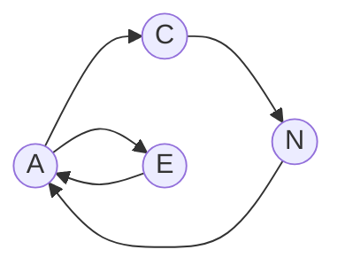

# 贝叶斯网络与心理学领域的研究与创新

## 1. 背景介绍

### 1.1 贝叶斯网络概述

贝叶斯网络(Bayesian Network,BN)是一种用于表示变量之间概率依赖关系的有向无环图模型。它由节点和有向边组成,其中每个节点表示一个随机变量,有向边表示变量之间的依赖关系。贝叶斯网络能够处理不确定性和复杂性,广泛应用于机器学习、数据挖掘、专家系统等领域。

### 1.2 心理学研究现状

心理学是研究人类心理现象、心理活动规律的科学。传统心理学研究主要采用定性分析方法,随着大数据时代的到来,定量分析方法逐渐受到重视。心理学家开始尝试利用数学模型和计算机技术来分析心理现象,但目前这一领域的研究还处于起步阶段,存在诸多挑战。

### 1.3 贝叶斯网络在心理学中的应用前景

贝叶斯网络作为一种强大的概率推理工具,在处理不确定性问题上具有独特优势。将其引入心理学研究,有望突破传统定性分析的局限,实现对心理现象的精确建模和预测。贝叶斯网络与心理学的结合,必将推动心理学研究迈向定量化、精细化的新阶段。

## 2. 核心概念与联系

### 2.1 贝叶斯定理

贝叶斯定理是贝叶斯网络的理论基础,其数学表达式为:

$$P(A|B) = \frac{P(B|A)P(A)}{P(B)}$$

其中,$P(A|B)$表示在事件B发生的条件下事件A发生的概率,$P(B|A)$表示在事件A发生的条件下事件B发生的概率,$P(A)$和$P(B)$分别表示事件A和事件B发生的先验概率。

### 2.2 条件概率表

条件概率表(Conditional Probability Table,CPT)是贝叶斯网络的核心组成部分,用于量化节点之间的依赖关系。对于每个节点,需要指定其在父节点取不同取值时的条件概率分布。

### 2.3 马尔可夫假设

马尔可夫假设是贝叶斯网络的重要性质,即每个节点在其父节点取值确定的条件下,与其非后代节点独立。基于此假设,贝叶斯网络可以用联合概率分布的链式法则分解为每个节点的条件概率分布的乘积:

$$P(X_1,X_2,...,X_n) = \prod_{i=1}^n P(X_i|Pa(X_i))$$ 

其中,$X_1,X_2,...,X_n$为贝叶斯网络中的节点,$Pa(X_i)$表示节点$X_i$的父节点集合。

### 2.4 心理学中的应用

在心理学研究中,可以用贝叶斯网络建模多种心理现象:

- 人格特质:五大人格特质(开放性、责任心、外向性、宜人性、神经质)之间的关系可用贝叶斯网络表示。
- 情绪:情绪状态如高兴、悲伤、愤怒等可作为贝叶斯网络的节点,刻画其因果关系。
- 行为决策:将目标、信念、行动等因素作为节点,分析其在行为决策过程中的作用机制。

贝叶斯网络为探索心理现象内在机理提供了新的视角和方法。

## 3. 核心算法原理具体操作步骤

### 3.1 网络结构学习

网络结构学习旨在从数据中发现变量之间的依赖关系,构建最优的贝叶斯网络拓扑结构。常用方法包括:

(1) 基于评分搜索的方法:定义评分函数(如BIC、AIC)衡量网络与数据的拟合程度,通过搜索算法(如爬山法、模拟退火)寻找评分最优的结构。

(2) 基于约束的方法:通过条件独立性测试(如卡方检验)找出变量之间的依赖关系,再结合专家知识构建网络结构。

(3) 混合方法:结合评分搜索和独立性测试,综合两者的优点。

### 3.2 参数学习

参数学习的目标是估计贝叶斯网络中每个节点的条件概率表。常用的参数估计方法有:

(1) 最大似然估计:利用训练数据,通过极大化似然函数求解参数。

(2) 贝叶斯估计:在最大似然估计的基础上,引入先验分布,得到后验分布作为参数估计值。

(3) 期望最大化算法(EM):针对含有隐变量的情况,通过迭代优化估计参数。

### 3.3 推理

推理是利用已知证据,计算网络中某些变量的后验概率分布。精确推理算法包括:

(1) 可达树算法:通过构建节点的可达树,利用动态规划计算后验概率。

(2) 聚类算法:将网络划分为多个簇,在簇内进行精确推理。

由于精确推理复杂度高,实际应用中常采用近似推理,如:

(1) 基于采样的方法:通过从网络分布中采样,估计后验概率。代表算法有Gibbs采样、重要性采样等。

(2) 变分推理:通过引入变分分布,将后验概率计算转化为优化问题求解。

### 3.4 在心理学中的应用步骤

将贝叶斯网络应用于心理学研究,一般包括以下步骤:

(1) 明确研究问题,确定相关变量。

(2) 收集数据,可以通过问卷调查、行为实验等方式获取。

(3) 数据预处理,包括缺失值处理、数据离散化等。

(4) 应用结构学习算法,构建心理现象的因果模型。

(5) 进行参数估计,得到变量之间的定量关系。

(6) 利用推理算法,分析特定情况下的心理状态或行为。

(7) 对结果进行解释和验证,提取有价值的心理学洞见。

## 4. 数学模型和公式详细讲解举例说明

### 4.1 贝叶斯网络的数学定义

形式化地,贝叶斯网络可定义为一个二元组$B=(G,\Theta)$:

- $G=(V,E)$表示有向无环图,其中$V$为节点集合,$E$为有向边集合。
- $\Theta=\{\theta_{x_i|pa(x_i)}\}$为参数集合,表示每个节点的条件概率分布。

基于马尔可夫假设,贝叶斯网络的联合概率分布可分解为:

$$P_B(X_1,X_2,...,X_n) = \prod_{i=1}^n P_B(X_i|Pa(X_i)) = \prod_{i=1}^n \theta_{X_i|Pa(X_i)}$$

### 4.2 参数学习的数学推导

以最大似然估计为例,假设训练集为$D=\{x^{(1)},x^{(2)},...,x^{(N)}\}$,每个样本$x^{(i)}$为节点的一组取值。似然函数定义为:

$$L(\theta|D) = \prod_{i=1}^N P_B(x^{(i)};\theta) = \prod_{i=1}^N \prod_{j=1}^n \theta_{x_j^{(i)}|pa(x_j^{(i)})}$$

对数似然为:

$$LL(\theta|D) = \sum_{i=1}^N \sum_{j=1}^n \log \theta_{x_j^{(i)}|pa(x_j^{(i)})}$$

求解参数$\theta$,使对数似然最大化:

$$\hat{\theta} = \arg\max_{\theta} LL(\theta|D)$$

求导并令导数为0,可得$\hat{\theta}$的闭式解为:

$$\hat{\theta}_{x_j|pa(x_j)} = \frac{N_{x_j,pa(x_j)}}{N_{pa(x_j)}}$$

其中,$N_{x_j,pa(x_j)}$为训练集中节点$X_j$取值为$x_j$且其父节点取值为$pa(x_j)$的样本数,$N_{pa(x_j)}$为父节点取值为$pa(x_j)$的样本数。

### 4.3 心理学案例分析

以人格特质为例,假设有五个二值变量:$A$(开放性)、$C$(责任心)、$E$(外向性)、$A$(宜人性)、$N$(神经质),其因果关系如下图所示:



假设通过问卷调查收集到1000个样本,利用最大似然估计可得每个节点的条件概率表。例如,节点$C$的CPT为:

|  A  |  C  | $\theta_{C|A}$ |
|:---:|:---:|:-------------:|
|  0  |  0  |     0.6       |
|  0  |  1  |     0.4       |
|  1  |  0  |     0.3       |
|  1  |  1  |     0.7       |

这表明,当一个人开放性较低时,其责任心较低的概率为0.6;当开放性较高时,责任心较高的概率为0.7。

基于学习得到的贝叶斯网络,可以进行推理。例如,已知一个人外向性较高,责任心较强,可计算其宜人性较高的概率:

$$P(A=1|E=1,C=1) = \frac{P(A=1,E=1,C=1)}{P(E=1,C=1)}$$

其中,联合概率可通过贝叶斯网络的链式法则计算:

$$P(A=1,E=1,C=1) = P(A=1|E=1,C=1)P(E=1|C=1)P(C=1)$$

这展示了贝叶斯网络在建模人格特质方面的应用价值。

## 5. 项目实践:代码实例和详细解释说明

下面以Python为例,演示如何使用pgmpy库构建贝叶斯网络模型。

### 5.1 创建网络结构

```python
from pgmpy.models import BayesianModel

# 定义网络结构
model = BayesianModel([('A', 'C'), ('A', 'E'), ('C', 'N'), ('E', 'A'), ('N', 'A')])
```

这里通过指定有向边的元组列表,创建了与前述人格特质例子相同结构的贝叶斯网络。

### 5.2 参数估计

```python
from pgmpy.estimators import MaximumLikelihoodEstimator

# 训练数据
data = pd.read_csv('personality_data.csv')

# 最大似然估计
model.fit(data, estimator=MaximumLikelihoodEstimator)
```

假设人格特质数据存储在`personality_data.csv`文件中,每行对应一个样本。使用`fit`方法,传入数据和估计器类型,即可学习模型参数。

### 5.3 概率推理

```python
from pgmpy.inference import VariableElimination

# 变量消除法推理
infer = VariableElimination(model)

# 查询后验概率 P(A=1|E=1,C=1)
prob = infer.query(['A'], evidence={'E': 1, 'C': 1})
print(prob)
```

利用变量消除法进行精确推理,查询在外向性较高、责任心较强的情况下,宜人性较高的概率。`query`的第一个参数为查询变量,`evidence`参数指定已知证据。

### 5.4 结果可视化

```python
from pgmpy.models import BayesianModel
import networkx as nx
import matplotlib.pyplot as plt

# 绘制网络结构图
nx.draw(model, with_labels=True)
plt.show()
```

借助NetworkX和Matplotlib,可以绘制贝叶斯网络的拓扑结构,直观展示变量之间的因果关系。

以上代码演示了使用pgmpy库构建贝叶斯网络的基本流程,包括定义网络结构、参数学习、推理查询等。在实际心理学研究中,可以根据具体问题进行适当改进和扩展。

## 6. 实际应用场景

贝叶斯网络在心理学领域有广泛的应用前景,主要场景包括:

### 6.1 人格特质分析

利用贝叶斯网络刻画人格特质之间的关联模式,有助于理解人格形成的内在机制。通过推理,可预测特定人格特质组合下的行为