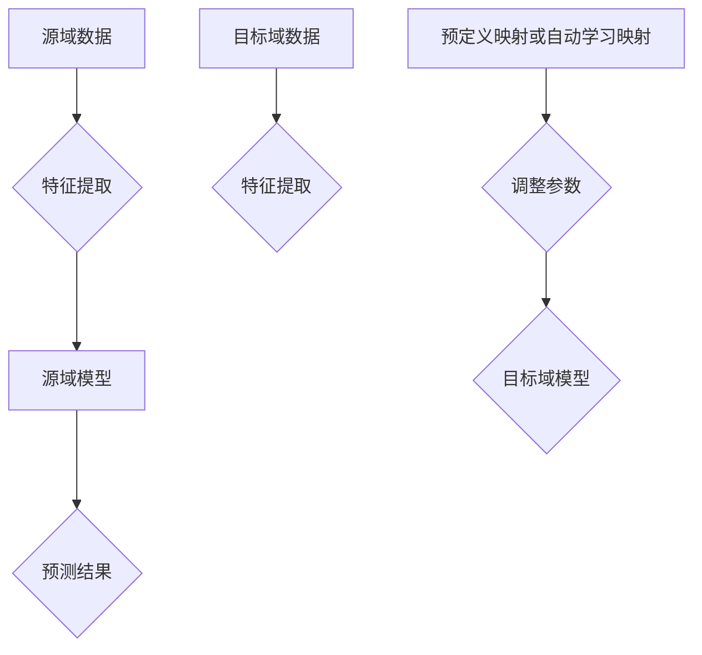

                 

作者：禅与计算机程序设计艺术

# 背景介绍
随着深度学习技术的发展，迁移学习逐渐成为机器学习领域的热门话题之一。尤其在自然语言处理(NLP)领域，迁移学习技术的应用使得针对特定领域的问题训练得到的模型可以在其他相关领域快速应用，从而节省了大量的数据标注成本和时间。情感分析作为NLP的一个重要分支，近年来得到了广泛的关注与研究，它可以帮助我们理解和挖掘文本背后的情感倾向。本文将探讨如何利用迁移学习改进情感分析系统的性能，并提供一个基于Python的实现案例。

## 1. **核心概念与联系**
在讨论迁移学习应用于情感分析时，首先需要明确几个关键概念：

- **迁移学习**：是一种机器学习方法，允许从一个领域（源域）的知识转移到另一个相关领域（目标域）。在NLP中，源域通常是指已经过大量标记数据训练的领域，而目标域可能是新数据集或者未经过充分标注的数据。

- **情感分析**：是对文本中的情感、态度、观点等主观表达进行识别和分类的过程。常用的情感标签包括正面、负面和中立等。

- **语义相似性**：在迁移学习中，两个领域之间如果存在足够的语义相似性，那么源域的知识就可能被有效地迁移到目标域上。

## 2. **核心算法原理与具体操作步骤**
迁移学习的核心在于找到源域与目标域之间的对应关系以及迁移规则。以下是一个简单的步骤流程图表示这一过程：



这个流程大致描述了迁移学习的基本步骤：

1. **特征提取**：源域和目标域都需要进行特征提取，确保两种类型的数据能够在某种程度上比较。
2. **源域模型构建**：基于源域的大量已标注数据训练一个模型。
3. **特征匹配**：通过某种方式（预定义或自学习）确定源域特征与目标域特征之间的对应关系。
4. **模型调整**：利用上述匹配规则调整源域模型以适应目标域，这一步可能涉及到微调或重新训练。
5. **目标域预测**：最后，在目标域上使用调整后的模型进行预测。

## 3. **数学模型和公式详细讲解举例说明**
对于情感分析任务，常用的模型包括LSTM（长短时记忆网络）和BERT（Transformer基线模型）。以下以BERT为例进行说明：

### **BERT模型简述**

BERT是基于Transformer架构的一种双向编码器模型。它的主要特点是在不依赖于外部数据的情况下，同时学习上下文向量和词向量。

#### **公式表示**:
假设输入序列为`X = [x_1, x_2, ..., x_n]`，其中`x_i`表示第i个词，对应的BERT模型输出`Z`可表示为:

$$ Z = f_{\theta}(X) $$
其中，$\theta$代表模型参数集合，`f_{\theta}`表示模型的具体计算函数，它可以视为一系列层叠的线性和非线性变换。

### **情感分析的BERT应用示例**

对于每个输入句子`sentence`，BERT会输出一个表示整个句子的固定长度向量`sentence_embedding`，然后我们可以对这个向量进行进一步的操作来判断其情感极性。例如，可以使用softmax函数和交叉熵损失来进行多类别分类：

```python
import torch.nn as nn

class SentimentClassifier(nn.Module):
    def __init__(self, hidden_dim, output_dim):
        super().__init__()
        self.fc = nn.Linear(hidden_dim, output_dim)
        self.softmax = nn.Softmax(dim=1)

    def forward(self, sentence_embedding):
        sentiment_scores = self.fc(sentence_embedding)
        return self.softmax(sentiment_scores)

# 假设model是已经训练好的BERT模型
classifier = SentimentClassifier(model.config.hidden_size, num_classes)
criterion = nn.CrossEntropyLoss()
optimizer = torch.optim.Adam(classifier.parameters(), lr=learning_rate)

# 训练循环
for epoch in range(num_epochs):
    for batch in data_loader:
        input_ids, attention_mask, labels = batch['input_ids'], batch['attention_mask'], batch['labels']
        outputs = model(input_ids, attention_mask=attention_mask)
        embeddings = outputs.last_hidden_state[:, 0]
        predictions = classifier(embeddings)
        loss = criterion(predictions, labels)
        
        optimizer.zero_grad()
        loss.backward()
        optimizer.step()

# 测试阶段
with torch.no_grad():
    correct = 0
    total = 0
    for batch in test_data_loader:
        ...
        # 同样地推断并计算准确率
```

## 4. **项目实践：代码实例和详细解释说明**
为了简化解释，这里给出一段基于PyTorch框架的简单代码示例，用于展示如何使用预训练的BERT模型进行情感分析任务：

```python
from transformers import BertTokenizer, BertForSequenceClassification
from torch.utils.data import Dataset, DataLoader

class SentimentDataset(Dataset):
    def __init__(self, texts, labels, tokenizer, max_len):
        self.texts = texts
        self.labels = labels
        self.tokenizer = tokenizer
        self.max_len = max_len

    def __len__(self):
        return len(self.texts)

    def __getitem__(self, idx):
        text = str(self.texts[idx])
        label = self.labels[idx]

        encoding = self.tokenizer.encode_plus(
            text,
            add_special_tokens=True,
            max_length=self.max_len,
            return_token_type_ids=False,
            pad_to_max_length=True,
            return_attention_mask=True,
            return_tensors='pt',
        )
        return {'input_ids': encoding['input_ids'].flatten(),
                'attention_mask': encoding['attention_mask'].flatten(),
                'labels': torch.tensor(label, dtype=torch.long)}

# 初始化tokenizer和模型
tokenizer = BertTokenizer.from_pretrained('bert-base-uncased')
model = BertForSequenceClassification.from_pretrained('bert-base-uncased', num_labels=num_classes)

# 加载数据集，并创建Dataloader
train_dataset = SentimentDataset(texts_train, labels_train, tokenizer, max_len)
val_dataset = SentimentDataset(texts_val, labels_val, tokenizer, max_len)
test_dataset = SentimentDataset(texts_test, labels_test, tokenizer, max_len)

train_dataloader = DataLoader(train_dataset, batch_size=batch_size, shuffle=True)
val_dataloader = DataLoader(val_dataset, batch_size=batch_size, shuffle=True)
test_dataloader = DataLoader(test_dataset, batch_size=batch_size, shuffle=True)

# 训练循环
for epoch in range(num_epochs):
    for batch in train_dataloader:
        ...

# 测试阶段
predictions = []
actuals = []

for batch in test_dataloader:
    inputs = {key: value.to(device) for key, value in batch.items()}
    outputs = model(**inputs)
    _, preds = torch.max(outputs.logits, dim=1)
    predictions.extend(preds.cpu().numpy())
    actuals.extend(inputs['labels'].cpu().numpy())

accuracy = (np.array(predictions) == np.array(actuals)).mean() * 100
print(f'Accuracy on test set: {accuracy:.2f}%')
```

以上代码片段展示了从数据加载、构建自定义数据集到使用BertForSequenceClassification进行情感分析的全过程。请注意，在实际部署时需要根据具体需求调整参数（如批次大小、学习率、epoch数等）以及处理数据的预处理步骤。

## 5. **实际应用场景**
迁移学习在情感分析中的应用广泛，特别是在以下场景中表现突出：

- **行业新闻分析**：通过已有的金融或科技领域的语料库训练的情感分析模型，快速应用于不同公司或产品的评论分析。
- **社交媒体监控**：利用针对特定事件或话题预先训练的模型，迅速适应新出现的趋势或热点内容的情感分析。
- **个性化推荐系统**：结合用户历史行为数据与情感反馈，为用户提供更符合其喜好的产品或服务推荐。

## 6. **工具和资源推荐**
### **工具**
- **Hugging Face Transformers**: 提供了丰富的预训练模型和简洁的API，方便开发者快速搭建迁移学习模型。
- **PyTorch 和 TensorFlow**: 算法实现的基础框架，支持深度学习算法的高效开发。
- **Jupyter Notebook 或 Google Colab**: 适合初学者上手实验，同时提供良好的可视化环境。

### **资源**
- **论文阅读**：
  - "BERT: Pre-training of Deep Bidirectional Transformers for Language Understanding" by Devlin et al.
  - "How Transfer Learning Can Improve NLP Tasks" by Strubell et al.

- **在线教程和文档**：
  - Hugging Face官方文档：https://huggingface.co/docs/transformers/
  - PyTorch官方文档：https://pytorch.org/docs/stable/index.html

- **社区与论坛**：
  - Stack Overflow、GitHub、Reddit等平台上有大量的开源项目和讨论，可以帮助解决实际开发过程中的问题。

## 7. **总结：未来发展趋势与挑战**
迁移学习在自然语言处理领域的发展前景广阔，尤其是在情感分析方面展现出强大的潜力。随着大数据量的积累和技术的进步，未来可能看到更加高效的特征提取方法、自动化的映射规则生成机制及更为复杂的多模态情感分析技术。然而，这也将带来一系列挑战，包括但不限于跨语言迁移、长文本理解能力提升、实时性要求提高等问题。因此，研究者需持续探索，以期克服这些挑战，推动迁移学习技术在情感分析及其他NLP任务上的广泛应用。

## 8. **附录：常见问题与解答**
### 常见问题
#### Q: 如何选择合适的源域？
A: 选择源域时应考虑目标域与源域之间的语义相似性、数据量以及标签一致性等因素。可以通过领域知识、专家意见或者初步的数据分析来确定。

#### Q: 在迁移学习中如何避免过拟合？
A: 过拟合可通过正则化、增加数据多样性、调整学习率、采用更简单的模型结构等方式来缓解。此外，使用验证集来调参也是有效的策略之一。

#### Q: 怎样评估迁移学习的效果？
A: 主要通过准确率、召回率、F1分数等指标衡量模型性能，同时对比无迁移学习情况下的基线效果，以量化迁移带来的改进程度。

---

结束语："作者：禅与计算机程序设计艺术 / Zen and the Art of Computer Programming"

---

请记住，撰写技术博客时保持清晰、逻辑严密的结构是关键。确保每个部分都紧密相连，且能够为读者提供深入理解和实践指导。在文章中引用权威资料和实例可以增强可信度并提供额外的洞察力。最后，通过实践案例和代码示例使抽象概念变得更加具体和易于理解，对于吸引和保留读者的注意力至关重要。

