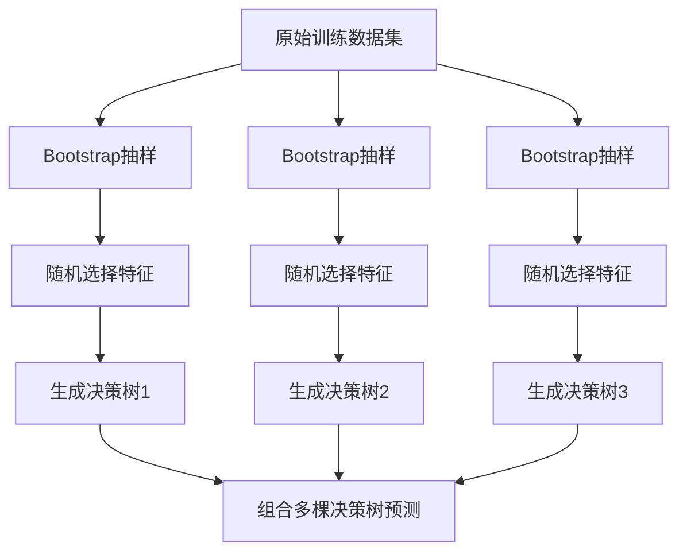

# 随机森林原理与代码实例讲解

## 1.背景介绍

随机森林(Random Forest)是一种基于集成学习的机器学习算法,由多个决策树组成。它通过在训练过程中引入随机性,在保持单个决策树预测能力的同时提高了模型的泛化能力和鲁棒性。随机森林广泛应用于分类、回归、特征选择、异常检测等领域,尤其在处理高维数据和非线性问题时表现优异。

### 1.1 随机森林的起源与发展

随机森林由 Tin Kam Ho 于1995年首次提出,后由 Leo Breiman 等人于2001年完善发展成为现在的形式。它源自于Bagging集成算法和决策树算法,通过引入额外的随机性进一步提升模型性能。

### 1.2 集成学习的基本思想

集成学习通过构建并结合多个学习器来完成学习任务,通常可获得比单一学习器显著优越的泛化性能。常见的集成学习方法有Bagging、Boosting和Stacking。

### 1.3 决策树算法概述

决策树是一种树形结构,其中每个内部节点表示一个属性测试,每个分支代表一个测试输出,每个叶节点存放一个类别。决策树学习通常采用自顶向下的递归方法,以信息增益等准则选择最优划分属性。

## 2.核心概念与联系

### 2.1 Bootstrap抽样

Bootstrap抽样是从原始训练集中有放回地随机抽取N个训练样本的技术。随机森林利用Bootstrap抽样产生不同的训练集来训练每个决策树,提高了模型的多样性。

### 2.2 决策树的随机性

除Bootstrap抽样外,随机森林还通过从候选特征中随机选取一个特征子集来分裂每个节点,进一步增加了决策树的差异性。这种随机性有助于降低决策树间的相关性。

### 2.3 投票/平均

对于分类问题,随机森林通过多数投票法得到最终预测结果;对于回归问题,则通过平均每棵树的预测值得到最终结果。这种结合策略可减少过拟合风险。

### 2.4 袋外数据(Out-of-Bag Data)

Bootstrap抽样会使得部分样本不出现在某棵树的训练集中,这些数据称为袋外数据。它可用于估计泛化误差、评价特征重要性等。

## 3.核心算法原理具体操作步骤

随机森林的训练过程如下:

1. 利用Bootstrap方法有放回地从原始训练集中随机抽取N个样本,形成每棵决策树的训练集。
2. 对每棵决策树,递归地进行如下操作,构建决策树:
   - 如果当前节点的样本属于同一类别,将该节点标记为叶节点,并将该类别作为节点的类别标记;
   - 否则,从M个属性中随机选取m<<M个属性,根据某一评价指标(如信息增益)选择最优划分属性,把训练集分配到相应的子节点中;
   - 对每个子节点递归地调用步骤(2),直到满足叶节点的条件。
3. 重复步骤(1)(2),建立多棵决策树,构成随机森林。

预测过程:
- 对分类问题,由多棵决策树投票决定最终分类结果;
- 对回归问题,由多棵决策树预测结果的平均值作为最终预测结果。



## 4.数学模型和公式详细讲解举例说明

### 4.1 Gini指数

假设有K个类,样本点属于第k类的概率为$p_k$,则概率分布的基尼指数定义为:

$$
\begin{aligned}
Gini(p) &=\sum_{k=1}^{K} p_{k}(1-p_{k}) \\
&=1-\sum_{k=1}^{K} p_{k}^{2}
\end{aligned}
$$

Gini指数反映了模型的不确定性,Gini指数越小,则不确定性越小,数据集的纯度越高。

### 4.2 信息增益

假设离散属性a有V个可能的取值$\{a^1,a^2,...,a^V\}$,若使用a来对数据集D进行划分,则会产生V个分支结点,其中第v个分支结点包含了D中所有在属性a上取值为$a^v$的样本,记为$D^v$。我们可计算出信息增益:

$$
\operatorname{Gain}(D, a)=\operatorname{Ent}(D)-\sum_{v=1}^{V} \frac{\left|D^{v}\right|}{|D|} \operatorname{Ent}\left(D^{v}\right)
$$

其中,Ent(D)是数据集D的信息熵:

$$
\operatorname{Ent}(D)=-\sum_{k=1}^{K} \frac{\left|C_{k}\right|}{|D|} \log _{2} \frac{\left|C_{k}\right|}{|D|}
$$

$C_k$是D中属于第k类的样本子集。信息增益越大,表示使用属性a来进行划分所获得的纯度提升越大。

## 5.项目实践：代码实例和详细解释说明

下面使用Python的scikit-learn库来实现随机森林:

```python
from sklearn.ensemble import RandomForestClassifier
from sklearn.datasets import make_classification
from sklearn.model_selection import train_test_split

# 生成随机分类数据集
X, y = make_classification(n_samples=1000, n_features=4, n_informative=2, 
                           n_redundant=0, random_state=0, shuffle=False)

# 划分训练集和测试集                          
X_train, X_test, y_train, y_test = train_test_split(X, y, test_size=0.2, random_state=42)

# 创建随机森林分类器
rfc = RandomForestClassifier(n_estimators=100, max_depth=2, random_state=0)

# 模型训练
rfc.fit(X_train, y_train)

# 模型预测
y_pred = rfc.predict(X_test)

# 计算分类准确率
from sklearn.metrics import accuracy_score
print('Accuracy:', accuracy_score(y_test, y_pred))
```

代码解释:

1. 导入所需的库,包括随机森林分类器`RandomForestClassifier`、示例数据集生成器`make_classification`、数据集划分工具`train_test_split`。
2. 使用`make_classification`生成一个随机分类数据集,其中样本数为1000,特征数为4,有效特征为2。
3. 使用`train_test_split`按照8:2的比例划分训练集和测试集。
4. 创建一个随机森林分类器`rfc`,其中决策树的数量为100,最大深度为2。
5. 调用`fit`函数使用训练数据对随机森林进行训练。
6. 调用`predict`函数对测试集进行预测,得到预测标签。
7. 使用`accuracy_score`计算分类准确率。

## 6.实际应用场景

随机森林可应用于多种实际场景,例如:

- 金融领域:信用评分、欺诈检测、股票价格预测等
- 医疗领域:疾病诊断、药物疗效预测、基因表达数据分析等  
- 网络安全:恶意软件检测、入侵检测、垃圾邮件识别等
- 推荐系统:电影推荐、商品推荐、广告点击率预测等
- 自然语言处理:文本分类、情感分析、语义理解等

随机森林以其较高的准确性、鲁棒性和可解释性在众多领域得到广泛应用。

## 7.工具和资源推荐

- scikit-learn:Python机器学习库,提供了多种机器学习算法的高效实现,包括随机森林。
- R语言randomForest包:R语言的随机森林实现。
- Weka:基于Java的机器学习工具包,提供了随机森林的图形化实现。
- MATLAB:MATLAB也提供了随机森林的实现。
- 相关书籍:《统计学习方法》、《机器学习》、《集成学习》等。

## 8.总结：未来发展趋势与挑战

随机森林已成为机器学习的主流算法之一,在诸多领域展现出优异性能。未来,随机森林还将在以下方面得到进一步发展:

- 大规模数据处理:针对海量数据设计更高效的随机森林训练算法。
- 特征工程:研究更有效的特征选择和特征提取方法,提升随机森林的性能。
- 深度学习结合:将随机森林与深度学习模型相结合,实现更强大的学习能力。
- 理论基础:加强随机森林的理论研究,揭示其内在机理。

同时,随机森林也面临一些挑战:

- 模型复杂度:随机森林由多棵决策树组成,模型复杂度较高,对计算和存储提出更高要求。
- 参数调优:随机森林包含多个超参数,如何自动高效地调优仍是一个难题。
- 增量学习:如何在新数据到来时高效地更新随机森林模型也有待进一步研究。

## 9.附录：常见问题与解答

**Q1:随机森林的优缺点是什么?**

A1:优点包括:
- 具有很高的准确率
- 能够有效地运行在大数据集上
- 能够处理高维特征输入,且不需要降维
- 对部分特征缺失不敏感
- 可以得到变量的重要性评分
- 训练速度较快,可并行化

缺点包括: 
- 对于噪声过大的数据,泛化性能较差
- 对于有不平衡的数据,模型的准确性可能会降低
- 相比单棵决策树,随机森林的模型可解释性差

**Q2:随机森林和单棵决策树相比有何优势?**

A2:相比单棵决策树,随机森林的优势在于:
- 通过集成多棵决策树,大大降低了过拟合的风险,提高了泛化能力
- 引入随机性,使得模型的鲁棒性更强
- 可以很好地并行化,训练速度快
- 对参数和异常值不敏感,更加稳定

**Q3:随机森林的主要调参因素有哪些?**

A3:随机森林的主要调参因素包括:
- n_estimators:决策树的数量,越多通常效果越好,但训练时间也越长
- max_depth:决策树的最大深度,控制模型复杂度
- min_samples_split:内部节点再划分所需最小样本数,控制过拟合
- max_features:寻找最佳分割时考虑的最大特征数,控制随机性

**Q4:如何处理随机森林中的缺失值?**

A4:随机森林对缺失值有一定的鲁棒性,主要有两种处理方式:
- 将缺失值单独作为一个类别处理
- 根据属于同一个叶节点的训练样本的均值或众数来填补缺失值

**Q5:如何评估随机森林的特征重要性?**

A5:随机森林可以给出特征重要性评分,主要有两种评估指标:
- 基于Gini指数的重要性:统计每个特征在森林中所有决策树的Gini指数之和
- 基于精确率的重要性:比较特征被随机置换前后,模型精确率的变化

作者：禅与计算机程序设计艺术 / Zen and the Art of Computer Programming