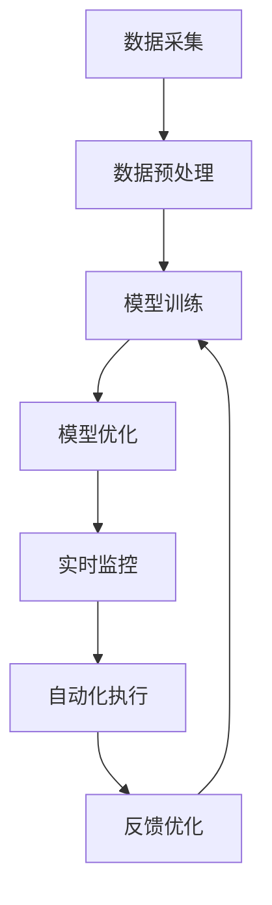

# 面向行业4.0的AI代理工作流自动化解决方案

## 1.背景介绍

### 1.1 行业4.0的定义与发展

行业4.0，也被称为第四次工业革命，是指通过智能制造技术的应用，实现生产过程的全面数字化、智能化和网络化。其核心理念是通过物联网（IoT）、大数据、人工智能（AI）等技术的融合，提升生产效率、降低成本、提高产品质量。

### 1.2 AI在行业4.0中的角色

在行业4.0中，AI扮演着至关重要的角色。AI技术可以通过数据分析、模式识别和预测分析等手段，优化生产流程、提高设备利用率、减少停机时间，并实现智能决策和自动化控制。

### 1.3 工作流自动化的必要性

工作流自动化是行业4.0的重要组成部分。通过自动化技术，可以减少人为干预，提高生产效率和准确性，降低运营成本。AI代理在工作流自动化中起到了关键作用，通过智能算法和模型，实现复杂任务的自动化处理。

## 2.核心概念与联系

### 2.1 AI代理的定义

AI代理是指能够自主感知环境、做出决策并执行任务的智能系统。它们可以通过学习和适应，不断优化自身的行为，以实现特定目标。

### 2.2 工作流自动化的定义

工作流自动化是指通过软件系统自动化执行一系列预定义的任务和流程，以提高效率和准确性。工作流自动化可以应用于各种业务场景，如生产制造、物流管理、客户服务等。

### 2.3 AI代理与工作流自动化的联系

AI代理与工作流自动化密切相关。AI代理可以通过智能算法和模型，自动化执行复杂的工作流任务，并根据实时数据进行优化和调整。通过AI代理的引入，可以实现更高效、更智能的工作流自动化。

## 3.核心算法原理具体操作步骤

### 3.1 数据采集与预处理

数据是AI代理工作的基础。首先，需要从各种传感器、设备和系统中采集数据，并进行预处理。预处理步骤包括数据清洗、数据归一化、特征提取等。

### 3.2 模型训练与优化

在数据预处理完成后，需要选择合适的算法和模型进行训练。常用的算法包括机器学习算法（如决策树、随机森林、支持向量机等）和深度学习算法（如卷积神经网络、循环神经网络等）。模型训练过程中，需要不断调整参数和优化模型，以提高预测准确性。

### 3.3 实时监控与反馈

在模型训练完成后，需要将模型部署到实际生产环境中，并进行实时监控。通过实时数据的反馈，AI代理可以不断调整和优化自身的行为，以适应变化的环境和需求。

### 3.4 自动化执行与优化

在实际生产过程中，AI代理可以根据模型的预测结果，自动化执行各种任务和流程。通过不断的学习和优化，AI代理可以提高工作效率和准确性，实现智能化的工作流自动化。



## 4.数学模型和公式详细讲解举例说明

### 4.1 线性回归模型

线性回归是一种常用的机器学习算法，用于预测连续变量。其数学模型如下：

$$
y = \beta_0 + \beta_1 x_1 + \beta_2 x_2 + \cdots + \beta_n x_n + \epsilon
$$

其中，$y$ 是预测值，$x_1, x_2, \cdots, x_n$ 是特征变量，$\beta_0, \beta_1, \cdots, \beta_n$ 是模型参数，$\epsilon$ 是误差项。

### 4.2 神经网络模型

神经网络是一种模拟人脑神经元结构的深度学习算法。其基本单元是神经元，数学模型如下：

$$
y = f\left(\sum_{i=1}^{n} w_i x_i + b\right)
$$

其中，$y$ 是输出值，$x_1, x_2, \cdots, x_n$ 是输入特征，$w_1, w_2, \cdots, w_n$ 是权重，$b$ 是偏置，$f$ 是激活函数。

### 4.3 优化算法

在模型训练过程中，常用的优化算法包括梯度下降算法、随机梯度下降算法等。梯度下降算法的更新公式如下：

$$
\theta := \theta - \alpha \nabla J(\theta)
$$

其中，$\theta$ 是模型参数，$\alpha$ 是学习率，$J(\theta)$ 是损失函数。

## 5.项目实践：代码实例和详细解释说明

### 5.1 数据采集与预处理

```python
import pandas as pd
from sklearn.preprocessing import StandardScaler

# 数据采集
data = pd.read_csv('data.csv')

# 数据预处理
scaler = StandardScaler()
data_scaled = scaler.fit_transform(data)
```

### 5.2 模型训练与优化

```python
from sklearn.model_selection import train_test_split
from sklearn.linear_model import LinearRegression
from sklearn.metrics import mean_squared_error

# 数据分割
X = data_scaled[:, :-1]
y = data_scaled[:, -1]
X_train, X_test, y_train, y_test = train_test_split(X, y, test_size=0.2, random_state=42)

# 模型训练
model = LinearRegression()
model.fit(X_train, y_train)

# 模型预测
y_pred = model.predict(X_test)

# 模型评估
mse = mean_squared_error(y_test, y_pred)
print(f'Mean Squared Error: {mse}')
```

### 5.3 实时监控与反馈

```python
import time

def monitor_and_feedback(model, new_data):
    while True:
        # 实时数据采集
        data = pd.read_csv(new_data)
        data_scaled = scaler.transform(data)
        
        # 模型预测
        predictions = model.predict(data_scaled)
        
        # 反馈与优化
        # 这里可以根据实际需求进行反馈和优化
        time.sleep(60)  # 每分钟监控一次
```

### 5.4 自动化执行与优化

```python
def automate_workflow(model, task_queue):
    while not task_queue.empty():
        task = task_queue.get()
        
        # 根据模型预测结果自动化执行任务
        result = model.predict(task['data'])
        
        # 执行相应的操作
        # 这里可以根据实际需求进行自动化操作
        task_queue.task_done()
```

## 6.实际应用场景

### 6.1 智能制造

在智能制造中，AI代理可以通过实时监控生产设备的状态，预测设备故障，优化生产流程，提高生产效率。例如，通过AI代理，可以实现设备的预测性维护，减少停机时间，提高设备利用率。

### 6.2 物流管理

在物流管理中，AI代理可以通过实时监控物流信息，优化运输路线，减少运输成本，提高物流效率。例如，通过AI代理，可以实现智能调度和路径优化，减少运输时间和成本。

### 6.3 客户服务

在客户服务中，AI代理可以通过自然语言处理技术，自动化处理客户咨询，提高客户满意度。例如，通过AI代理，可以实现智能客服系统，自动化回答客户问题，减少人工客服的工作量。

## 7.工具和资源推荐

### 7.1 开源工具

- TensorFlow：一个开源的深度学习框架，支持多种机器学习和深度学习算法。
- PyTorch：一个开源的深度学习框架，支持动态计算图和自动微分。
- Scikit-learn：一个开源的机器学习库，提供了多种机器学习算法和工具。

### 7.2 数据集

- UCI Machine Learning Repository：一个常用的机器学习数据集库，提供了多种数据集。
- Kaggle：一个数据科学竞赛平台，提供了多种数据集和竞赛。

### 7.3 在线课程

- Coursera：提供了多种机器学习和深度学习的在线课程。
- edX：提供了多种人工智能和数据科学的在线课程。

## 8.总结：未来发展趋势与挑战

### 8.1 未来发展趋势

随着技术的不断发展，AI代理和工作流自动化将在更多领域得到应用。未来，AI代理将更加智能化和自主化，能够处理更加复杂的任务和流程。同时，随着物联网和大数据技术的发展，AI代理将能够获取更多的数据，进行更加精准的预测和决策。

### 8.2 挑战

尽管AI代理和工作流自动化具有广阔的应用前景，但也面临一些挑战。首先，数据质量和数据隐私问题是一个重要挑战。其次，模型的准确性和鲁棒性也是一个重要问题。最后，如何实现AI代理的可解释性和透明性，也是一个需要解决的问题。

## 9.附录：常见问题与解答

### 9.1 什么是AI代理？

AI代理是指能够自主感知环境、做出决策并执行任务的智能系统。

### 9.2 什么是工作流自动化？

工作流自动化是指通过软件系统自动化执行一系列预定义的任务和流程，以提高效率和准确性。

### 9.3 AI代理如何实现工作流自动化？

AI代理可以通过智能算法和模型，自动化执行复杂的工作流任务，并根据实时数据进行优化和调整。

### 9.4 常用的机器学习算法有哪些？

常用的机器学习算法包括线性回归、决策树、随机森林、支持向量机等。

### 9.5 常用的深度学习算法有哪些？

常用的深度学习算法包括卷积神经网络、循环神经网络、生成对抗网络等。

### 9.6 如何选择合适的算法和模型？

选择合适的算法和模型需要根据具体的应用场景和数据特点进行选择。可以通过实验和评估，选择性能最优的算法和模型。

### 9.7 如何优化模型的性能？

可以通过调整模型参数、选择合适的优化算法、增加数据量等方法，优化模型的性能。

### 9.8 如何实现AI代理的可解释性？

可以通过模型可视化、特征重要性分析等方法，实现AI代理的可解释性。

### 9.9 AI代理在实际应用中面临哪些挑战？

AI代理在实际应用中面临数据质量和数据隐私问题、模型的准确性和鲁棒性问题、可解释性和透明性问题等挑战。

### 9.10 如何解决AI代理的挑战？

可以通过数据清洗和数据保护技术、模型优化和评估技术、可解释性和透明性技术等方法，解决AI代理的挑战。

---

作者：禅与计算机程序设计艺术 / Zen and the Art of Computer Programming