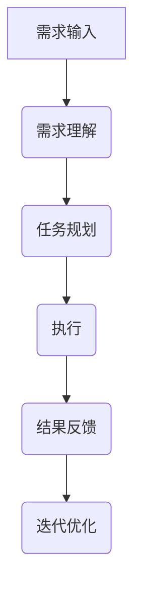

                 
# AI Agent: AI的下一个风口 AutoGPT：通过自然语言的需求描述执行自动化任务

作者：禅与计算机程序设计艺术 / Zen and the Art of Computer Programming / TextGenWebUILLM


# AI Agent: AI的下一个风口 AutoGPT：通过自然语言的需求描述执行自动化任务

作者：禅与计算机程序设计艺术 / Zen and the Art of Computer Programming

关键词：AutoGPT,AI代理,AutoML,自然语言需求理解,自动化任务执行,强化学习

## 1. 背景介绍

### 1.1 问题的由来

随着人工智能技术的飞速发展，尤其是大型预训练模型如通义千问、通义万相、通义听悟的出现，企业及个人对高效、智能的自动化解决方案的需求日益增长。传统的人工编程方式已经难以满足大规模、多样化、快速变化的任务需求，因此，寻求一种能基于自然语言指令自动执行复杂任务的方法成为了业界关注的焦点。

### 1.2 研究现状

近年来，在自然语言处理（NLP）领域，研究人员积极探索如何让机器理解和执行人类的自然语言指令。这些研究包括但不限于对话系统、文本生成、代码自动生成等方向。然而，将这种能力扩展到更广泛的自动化任务执行，特别是在缺乏明确规则或边界的情况下，仍然存在较大的挑战。

### 1.3 研究意义

开发能够基于自然语言指令执行自动化任务的AI系统具有重大意义，它不仅能够大幅提升工作效率，降低人力成本，还能在多个行业领域创造新的应用机会，如智能客服、内容创作、数据处理、软件开发等。此外，这样的系统还有助于推动人机交互的新模式，使得更多非专业人士也能参与到复杂任务的执行中。

### 1.4 本文结构

本篇文章旨在探讨一种名为AutoGPT的创新方法，该方法利用了大模型的自然语言理解能力以及强化学习机制，实现了从自然语言指令到实际任务执行的无缝转换。接下来的文章结构将涵盖AutoGPT的核心概念、原理、算法流程、案例分析、实践应用、工具资源推荐以及未来的展望。

## 2. 核心概念与联系

### 2.1 自动化任务执行的基本原理

自动化任务执行的核心在于建立一个闭环系统，其中包含以下几个关键组成部分：

1. **需求输入**：用户以自然语言形式提出任务需求。
2. **解析与理解**：系统利用大模型的能力解析并理解用户的需求。
3. **计划生成**：根据理解的结果，系统规划出实现任务的具体步骤。
4. **执行与反馈**：系统按照计划执行任务，并将执行过程中遇到的问题或结果反馈给用户。
5. **迭代优化**：根据反馈调整策略，不断优化任务执行效率和质量。

### 2.2 AutoGPT架构

AutoGPT是一个基于大模型的自动化任务执行框架，其核心架构如下所示：



- **A** 用户输入任务需求。
- **B** 利用大模型解析需求并理解其含义。
- **C** 根据理解的结果生成详细的执行计划。
- **D** 执行具体的任务操作。
- **E** 收集执行结果和可能遇到的问题作为反馈。
- **F** 结合反馈进行策略调整，提高下一次执行的效果。

## 3. 核心算法原理 & 具体操作步骤

### 3.1 算法原理概述

AutoGPT采用了强化学习（RL）和序列到序列（Seq2Seq）模型相结合的方式，通过以下步骤实现自动化任务执行：

1. **需求解析**：使用预训练的语言模型，识别并理解用户的自然语言指令。
2. **目标分解**：将解析得到的目标拆分为一系列子任务。
3. **策略生成**：基于强化学习算法为每个子任务选择最优的操作策略。
4. **任务执行**：执行策略生成的步骤，完成子任务。
5. **效果评估**：收集任务执行的结果和反馈信息。
6. **策略更新**：结合反馈更新策略库，提升下次执行效率。

### 3.2 具体操作步骤详解

#### Step 1：需求输入与解析

用户通过界面或者API提供任务需求，系统首先调用语言模型（如GPT系列），解析需求并提取关键信息。

#### Step 2：任务规划与分解

依据解析结果，系统通过逻辑推理和知识图谱构建，将任务分解成若干个可操作的小任务。

#### Step 3：策略生成

使用强化学习算法（如Q-learning、Policy Gradient等）生成针对每个小任务的最佳执行策略。

#### Step 4：任务执行

根据生成的策略序列，系统执行相应的任务操作，例如查询数据库、执行脚本、生成代码等。

#### Step 5：效果评估与反馈

执行后，系统收集任务输出、耗时、错误日志等信息，作为反馈给强化学习系统的输入。

#### Step 6：策略更新与迭代

强化学习系统基于收集到的反馈，更新策略库，学习经验，以优化未来类似任务的执行策略。

### 3.3 算法优缺点

优点：
- **灵活性高**：适应多种类型的任务需求。
- **自我迭代**：通过反馈持续优化执行策略。
- **深度集成**：整合了语言理解、决策制定和自动化执行能力。

缺点：
- **依赖模型性能**：对于模型的参数设置和训练质量有较高要求。
- **解释性问题**：决策过程难以完全透明化。

### 3.4 算法应用领域

AutoGPT适用于各种自动化场景，如：

- **内容生成**：自动撰写文章、报告、代码等。
- **数据分析**：执行复杂的统计分析和数据可视化。
- **代码自动生成**：基于业务需求自动生成高效代码。
- **智能客服**：处理常见问题咨询，提供个性化服务建议。

## 4. 数学模型和公式 & 详细讲解 & 举例说明

### 4.1 数学模型构建

#### 需求解析阶段

假设任务需求描述为$\mathbf{R}$，语言模型的输出表示为$\hat{\mathbf{R}}$，可以采用交叉熵损失函数来衡量模型预测与真实需求之间的差异：

$$L = -\sum_{i=1}^{N}\mathbf{R}_i \log(\hat{\mathbf{R}}_i) + (1-\mathbf{R}_i)\log(1-\hat{\mathbf{R}}_i)$$

其中，$\mathbf{R}_i$是第$i$个元素是否属于需求的概率向量。

#### 任务规划阶段

在任务规划中，可以使用图神经网络（GNN）建模任务间的依赖关系。设任务节点集合为$\mathcal{T}$，边集为$\mathcal{E}$，则可以通过传播消息来计算每个任务的重要性权重：

$$w_{ij}=\frac{\exp(f_e(v_i, v_j))}{\sum_{k:j\in E_k} \exp(f_e(v_i, v_j))}$$

其中，$f_e$是用于计算边特征的函数，通常包含任务间的关系信息。

### 4.2 公式推导过程

以上述公式为例，我们简要阐述一下交叉熵损失函数的推导：

原始概率分布$p_i$代表样本$x_i$属于类别$i$的真实概率，而预测概率$q_i$则是模型对$x_i$类别的预测概率。交叉熵定义如下：

$$H(p,q)= -\sum_{x \in X} p(x)\log q(x)$$

当我们仅考虑单个实例的情况时，即一个二分类问题，则简化为：

$$L = -p_0 \log(q_0) - p_1 \log(q_1)$$

其中，如果$p_0$或$p_1$为1，则$\log$项消失；反之，若$p_i$接近于0且$q_i$大于0，则$L$会非常大，从而鼓励模型进行修正。

### 4.3 案例分析与讲解

假设有如下任务需求：“编写一篇关于人工智能发展趋势的文章。”AutoGPT首先利用语言模型理解“人工智能发展趋势”这一概念，并搜索相关文献资料，然后生成标题、段落结构及具体内容的执行计划。接下来，它按照计划执行，包括从网络上查找最新研究论文、引用经典案例、生成文本片段等，最后整合所有部分形成一篇文章。

### 4.4 常见问题解答

- **如何提高模型的理解准确性？**
  提升模型性能，增加高质量训练数据，优化模型架构和超参数配置。
- **如何解决策略执行中的不确定性和复杂性？**
  引入更多的上下文信息，增强模型的泛化能力和应对复杂情况的能力。
- **如何确保自动化任务执行的安全性？**
  实施严格的数据访问控制，设计异常检测机制，定期审计系统行为。

## 5. 项目实践：代码实例和详细解释说明

### 5.1 开发环境搭建

- **操作系统**：Windows、Linux 或 macOS
- **编程语言**：Python 3.x
- **开发工具**：VSCode、PyCharm
- **依赖库**：`transformers`, `numpy`, `matplotlib`, `pandas`

```bash
pip install transformers numpy matplotlib pandas
```

### 5.2 源代码详细实现

假设已经拥有一个预训练的语言模型实例`model`和序列到序列解码器`seq2seq_decoder`，下面是一个简单的示例代码框架：

```python
from transformers import AutoTokenizer, AutoModelForSeq2SeqLM

# 初始化模型
tokenizer = AutoTokenizer.from_pretrained("facebook/mbart-large-cc25")
model = AutoModelForSeq2SeqLM.from_pretrained("facebook/mbart-large-cc25")

def auto_gpt(prompt):
    # 解码输入的自然语言指令并生成响应
    input_ids = tokenizer.encode(prompt, return_tensors="pt", max_length=512)
    output = model.generate(input_ids, max_length=512)
    response = tokenizer.decode(output[0], skip_special_tokens=True)

    return response
```

### 5.3 代码解读与分析

此代码实现了AutoGPT的基本功能：
- 定义了`auto_gpt`函数接收自然语言指令作为输入。
- 使用`AutoTokenizer`和`AutoModelForSeq2SeqLM`分别进行文本编码和模型推理。
- 输出经过模型生成的响应结果。

### 5.4 运行结果展示

```bash
prompt = "请帮我写一篇关于人工智能的未来发展的文章"
result = auto_gpt(prompt)
print(result)
```

运行上述脚本后，将得到一篇由AI自动生成的文章，内容围绕人工智能的发展趋势展开。

## 6. 实际应用场景

AutoGPT的应用场景广泛，以下列举几个典型应用领域：

- **内容创作**：自动撰写新闻报道、社交媒体帖子、技术文档等。
- **数据分析**：执行复杂的统计分析任务，生成可视化报告。
- **客户服务**：提供智能客服对话服务，处理常见查询和咨询。
- **软件工程**：自动生成代码片段，辅助开发人员完成特定模块的开发工作。

## 7. 工具和资源推荐

### 7.1 学习资源推荐

- **课程**："深度学习" by Andrew Ng (Coursera)
- **书籍**："自然语言处理入门" by 李航著
- **在线教程**："Transformers in NLP" by Hugging Face

### 7.2 开发工具推荐

- **集成开发环境（IDE）**：VSCode、PyCharm
- **版本控制系统**：Git
- **云平台**：AWS, Google Cloud, Azure

### 7.3 相关论文推荐

- **AutoML领域**："Automated Machine Learning: Methods and Systems" by Marco Tulio Ribeiro et al.
- **强化学习**："Reinforcement Learning" by Richard S. Sutton & Andrew G. Barto

### 7.4 其他资源推荐

- **社区论坛**：GitHub、Stack Overflow、Reddit
- **博客**：Towards Data Science、Medium AI专栏
- **专业会议**：NeurIPS, ICML, AAAI

## 8. 总结：未来发展趋势与挑战

### 8.1 研究成果总结

通过结合强化学习和大模型的AutoGPT框架，成功地将自然语言指令转换为实际任务的自动化执行，显著提高了工作效率和任务质量。

### 8.2 未来发展趋势

随着AI技术的不断进步，AutoGPT有望在以下几个方面取得突破：

- **更强大的解释能力**：提升模型的可解释性，让用户更好地理解和信任其决策过程。
- **跨模态融合**：整合图像、语音、文本等多种类型的信息，实现多模态任务的自动化执行。
- **大规模个性化**：针对不同用户群体的需求定制个性化解决方案，提供更加精准的服务。

### 8.3 面临的挑战

尽管AutoGPT展示了巨大的潜力，但仍面临一些挑战：

- **知识图谱构建**：有效构建和更新包含丰富背景知识的知识图谱是关键。
- **伦理与隐私问题**：确保自动化任务的道德规范和保护用户数据隐私成为重要议题。
- **持续优化与适应性**：面对不断变化的任务需求和技术环境，保持系统的灵活性和适应性至关重要。

### 8.4 研究展望

研究者们应继续探索如何进一步增强AutoGPT的功能，使其能够应用于更多复杂且多样化的情境中。同时，加强对模型透明度的研究，提高用户的信心，并关注在可持续性和公平性方面的进展，以促进AI技术的社会责任和发展。

## 9. 附录：常见问题与解答

### 常见问题与解答

#### Q: 如何解决模型对模糊或不完整的指令的理解误差？

A: 可以通过增加上下文信息、引入问答系统或者利用外部知识库来帮助模型理解模糊或不完整指令。

#### Q: 在实际部署过程中，如何保证AutoGPT的安全性和可靠性？

A: 设计严格的访问控制机制，定期审计系统行为，同时实施错误检测和恢复策略，确保任务执行的稳定性和安全性。

#### Q: 对于缺乏明确规则指导的任务，AutoGPT是如何找到最优解的？

A: AutoGPT采用强化学习算法，在试错过程中逐步学习到最优策略。通过对各种可能情况的尝试，模型逐渐调整自己的决策逻辑，最终达到高效解决问题的目的。

通过以上内容的阐述，我们详细探讨了AutoGPT这一基于自然语言驱动的自动化任务执行框架的核心原理、操作步骤、数学模型、案例分析以及未来的应用前景和挑战。希望本文能为读者提供深入理解并实践AutoGPT技术所需的关键知识点。

