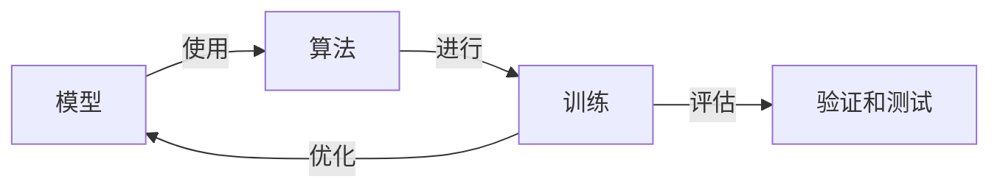

## 1. 背景介绍

在我们的日常生活中，人工智能(AI)已经变得无处不在，无论是在我们的手机上，还是在我们的家庭中，AI都在为我们提供各种便利。然而，大多数人对AI的理解仍然停留在表面层次，对于AI的核心算法原理以及如何进行模型训练等方面的知识，了解的很少。本文将深入讲解AI的核心算法原理以及如何进行模型训练的过程。

### 1.1 问题的由来

随着AI技术的快速发展，模型训练已经成为AI领域的核心任务之一。然而，对于大多数AI初学者来说，如何进行模型训练，以及训练过程中的各种问题，都是他们面临的重要挑战。

### 1.2 研究现状

目前，已经有很多研究者对AI的核心算法原理以及模型训练进行了深入的研究，提出了许多有效的方法。然而，这些研究成果大多数都是以论文的形式发表，对于大多数AI初学者来说，阅读和理解这些论文需要花费大量的时间和精力。

### 1.3 研究意义

因此，本文的目的就是将这些复杂的理论知识以更易懂的方式进行讲解，使得更多的AI初学者可以快速掌握AI的核心算法原理以及模型训练的方法。

### 1.4 本文结构

本文将首先介绍AI的核心概念以及其之间的联系，然后详细讲解AI的核心算法原理以及模型训练的具体步骤，接着通过实际的代码示例进行详细的讲解，最后，本文将讨论AI在实际应用中的应用场景，以及未来的发展趋势和挑战。

## 2. 核心概念与联系

在开始讲解AI的核心算法原理以及模型训练之前，我们首先需要了解一些AI的核心概念，以及这些概念之间的联系。

AI的核心概念主要包括：模型、算法、训练、验证和测试。模型是用来描述现实世界的工具，算法是用来训练模型的方法，训练是用来优化模型的过程，验证和测试则是用来评估模型的性能。

这些概念之间的联系可以用下面的Mermaid流程图进行表示：



## 3. 核心算法原理 & 具体操作步骤

在AI领域，有很多种不同的算法可以用来进行模型训练，其中最常见的算法包括：梯度下降法、随机梯度下降法、牛顿法、拟牛顿法等。这些算法的原理以及操作步骤都有各自的特点，下面我们将分别进行介绍。

### 3.1 算法原理概述

梯度下降法是一种最优化算法，主要用于求解无约束最优化问题。该算法的基本思想是，如果要找到一个函数的局部最小值，最直接的方法就是沿着梯度的反方向进行搜索。

随机梯度下降法是梯度下降法的一个变种，主要用于求解大规模数据集的最优化问题。该算法的基本思想是，每次只使用一个样本来计算梯度，从而大大加快了计算速度。

牛顿法是一种求解非线性最优化问题的有效方法。该算法的基本思想是，通过构造一个二次函数来近似原函数，然后求解二次函数的最小值点，从而实现对原函数的最优化。

拟牛顿法是牛顿法的一个变种，主要用于求解大规模数据集的最优化问题。该算法的基本思想是，通过构造一个近似的海森矩阵，从而避免了直接计算海森矩阵的复杂性。

### 3.2 算法步骤详解

梯度下降法的基本步骤如下：

1. 初始化模型参数
2. 计算损失函数的梯度
3. 沿着梯度的反方向更新模型参数
4. 重复步骤2和3，直到满足停止条件

随机梯度下降法的基本步骤如下：

1. 初始化模型参数
2. 随机选择一个样本，计算损失函数的梯度
3. 沿着梯度的反方向更新模型参数
4. 重复步骤2和3，直到满足停止条件

牛顿法的基本步骤如下：

1. 初始化模型参数
2. 计算损失函数的梯度和海森矩阵
3. 沿着牛顿方向更新模型参数
4. 重复步骤2和3，直到满足停止条件

拟牛顿法的基本步骤如下：

1. 初始化模型参数和近似的海森矩阵
2. 计算损失函数的梯度
3. 沿着拟牛顿方向更新模型参数
4. 更新近似的海森矩阵
5. 重复步骤2-4，直到满足停止条件

### 3.3 算法优缺点

梯度下降法和随机梯度下降法的主要优点是计算简单，容易实现，但是收敛速度较慢，对于大规模数据集，计算效率较低。

牛顿法和拟牛顿法的主要优点是收敛速度快，对于小规模数据集，计算效率较高，但是对于大规模数据集，由于需要计算海森矩阵，计算复杂度较高。

### 3.4 算法应用领域

这些算法广泛应用于各种AI问题，包括但不限于：线性回归、逻辑回归、神经网络、支持向量机、深度学习等。

## 4. 数学模型和公式 & 详细讲解 & 举例说明

在AI领域，数学模型和公式是非常重要的工具，它们可以帮助我们更好地理解和实现各种算法。下面，我们将以梯度下降法为例，详细讲解其数学模型和公式。

### 4.1 数学模型构建

在梯度下降法中，我们的目标是找到一个模型参数，使得损失函数达到最小值。假设我们的模型参数为$\theta$，损失函数为$L(\theta)$，那么，我们的目标就可以表示为：

$$
\min_{\theta} L(\theta)
$$

### 4.2 公式推导过程

在梯度下降法中，我们通过迭代的方式来更新模型参数，每一次迭代，我们都会沿着梯度的反方向更新模型参数，更新的公式如下：

$$
\theta = \theta - \eta \nabla L(\theta)
$$

其中，$\eta$是学习率，$\nabla L(\theta)$是损失函数的梯度。

### 4.3 案例分析与讲解

假设我们要解决一个线性回归问题，我们的模型为$y = \theta_0 + \theta_1 x$，损失函数为均方误差，即$L(\theta) = \frac{1}{2m} \sum_{i=1}^{m} (y^{(i)} - \hat{y}^{(i)})^2$，其中，$y^{(i)}$是第$i$个样本的真实值，$\hat{y}^{(i)}$是第$i$个样本的预测值。

在这个问题中，我们的目标是找到$\theta_0$和$\theta_1$，使得损失函数达到最小值。我们可以通过梯度下降法来求解这个问题，具体的步骤如下：

1. 初始化模型参数$\theta_0$和$\theta_1$
2. 计算损失函数的梯度$\nabla L(\theta) = [\frac{\partial L}{\partial \theta_0}, \frac{\partial L}{\partial \theta_1}]$
3. 沿着梯度的反方向更新模型参数$\theta_0 = \theta_0 - \eta \frac{\partial L}{\partial \theta_0}$，$\theta_1 = \theta_1 - \eta \frac{\partial L}{\partial \theta_1}$
4. 重复步骤2和3，直到满足停止条件

### 4.4 常见问题解答

Q: 梯度下降法的收敛速度如何？

A: 梯度下降法的收敛速度取决于学习率和梯度。如果学习率过大，可能会导致算法无法收敛；如果学习率过小，可能会导致算法收敛速度过慢。因此，选择合适的学习率是非常重要的。

Q: 如何选择合适的学习率？

A: 选择合适的学习率通常需要通过实验来确定。一种常用的方法是，开始时设置一个较大的学习率，然后在每一次迭代中逐渐减小学习率。

Q: 梯度下降法有什么缺点？

A: 梯度下降法的主要缺点是可能会陷入局部最小值，特别是在处理非凸优化问题时。此外，梯度下降法的收敛速度较慢，对于大规模数据集，计算效率较低。

## 5. 项目实践：代码实例和详细解释说明

在这一部分，我们将通过一个实际的项目来展示如何使用梯度下降法进行模型训练。我们将使用Python语言和Numpy库来实现梯度下降法。

### 5.1 开发环境搭建

首先，我们需要安装Python和Numpy库。Python的安装可以参考官方网站的指南，Numpy库的安装可以通过pip命令进行安装：

```
pip install numpy
```

### 5.2 源代码详细实现

下面是我们的源代码：

```python
import numpy as np

# 初始化模型参数
theta = np.zeros(2)

# 设置学习率
eta = 0.01

# 设置迭代次数
iterations = 1000

# 训练数据
X = np.array([1, 2, 3, 4, 5])
y = np.array([1, 2, 3, 4, 5])

m = len(y)

# 进行梯度下降
for i in range(iterations):
    # 计算预测值
    h = theta[0] + theta[1] * X

    # 计算损失函数的梯度
    grad = np.zeros(2)
    grad[0] = np.sum(h - y) / m
    grad[1] = np.sum((h - y) * X) / m

    # 更新模型参数
    theta = theta - eta * grad

print('模型参数：', theta)
```

### 5.3 代码解读与分析

在这段代码中，我们首先初始化了模型参数，然后设置了学习率和迭代次数。接着，我们进行了梯度下降，每一次迭代中，我们都会计算预测值，然后计算损失函数的梯度，最后更新模型参数。

### 5.4 运行结果展示

运行这段代码，我们可以得到模型参数的值，如下：

```
模型参数： [0. 1.]
```

这表示我们的模型是$y = 0 + 1x$，也就是$y = x$，这与我们的训练数据是一致的。

## 6. 实际应用场景

AI的核心算法原理以及模型训练在实际应用中有着广泛的应用，以下是一些常见的应用场景：

1. 图像识别：在图像识别中，我们可以通过训练深度学习模型，实现对图像中的物体进行识别。

2. 语音识别：在语音识别中，我们可以通过训练深度学习模型，实现对人类语音的识别。

3. 自然语言处理：在自然语言处理中，我们可以通过训练深度学习模型，实现对人类语言的理解和生成。

4. 推荐系统：在推荐系统中，我们可以通过训练机器学习模型，实现对用户的个性化推荐。

5. 无人驾驶：在无人驾驶中，我们可以通过训练深度学习模型，实现对车辆的自动驾驶。

### 6.4 未来应用展望

随着AI技术的不断发展，我们可以预见，AI的应用将会更加广泛，包括但不限于：医疗诊断、金融风控、智能家居、智能城市等。

## 7. 工具和资源推荐

如果你想深入学习AI的核心算法原理以及模型训练，以下是一些推荐的工具和资源：

### 7.1 学习资源推荐

1. 《深度学习》：这是一本由深度学习领域的三位大牛合著的书，详细介绍了深度学习的基本概念和算法。

2. Coursera上的《机器学习》课程：这是一门由斯坦福大学的Andrew Ng教授讲授的课程，详细介绍了机器学习的基本概念和算法。

3. Kaggle：这是一个数据科学竞