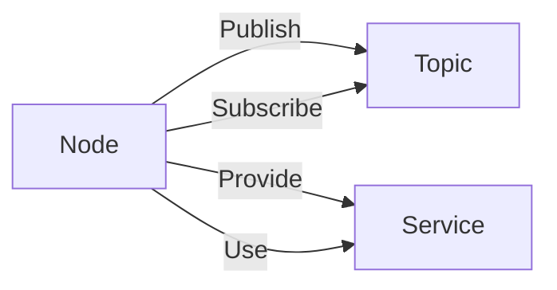
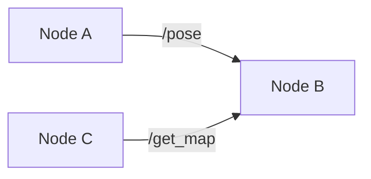

# Robot Operating System 原理与代码实战案例讲解

## 1. 背景介绍
### 1.1 问题的由来
随着机器人技术的不断发展,各种机器人系统和平台层出不穷。但是,不同厂商和团队开发的机器人系统往往缺乏统一的标准和接口,导致机器人软件开发的碎片化和重复劳动。为了解决这个问题,Robot Operating System(ROS)应运而生。
### 1.2 研究现状 
ROS是一个用于机器人软件开发的开源元操作系统。它提供了一系列的软件库、工具和约定,旨在简化跨不同机器人平台的复杂机器人行为的创建过程。目前,ROS已经成为机器人领域事实上的标准,被广泛应用于科研、教育和工业领域。
### 1.3 研究意义
深入研究ROS的原理和应用,对于推动机器人技术的发展具有重要意义。一方面,ROS为机器人软件开发提供了统一的框架和接口,大大降低了开发难度和成本。另一方面,ROS庞大的社区资源和丰富的功能包,为机器人研究和应用提供了强大的支持。
### 1.4 本文结构
本文将从以下几个方面深入探讨ROS的原理与应用:
- 核心概念与联系
- 核心算法原理与具体操作步骤
- 数学模型和公式详细讲解
- 项目实践:代码实例和详细解释
- 实际应用场景
- 工具和资源推荐
- 未来发展趋势与挑战
- 常见问题与解答

## 2. 核心概念与联系
### 2.1 节点(Node)
节点是ROS中的基本计算单元。一个节点就是一个可执行程序,可以通过ROS与其他节点进行通信。节点可以发布或订阅一个话题,也可以提供或使用某种服务。一个ROS系统通常由多个节点组成,不同的节点负责不同的任务,协同工作。
### 2.2 话题(Topic)  
话题是节点间异步通信的通道。节点可以通过发布消息到某个话题,或通过订阅某个话题来接收消息。一个话题可以有多个发布者和订阅者,ROS使用话题名称来匹配发布者和订阅者。
### 2.3 服务(Service)
服务提供了节点间同步通信的方式。与话题的异步通信不同,服务通信是一种请求/响应模式。一个节点可以提供某种服务,另一个节点可以使用该服务发送请求并等待响应。
### 2.4 概念之间的联系
ROS中的节点通过话题和服务进行通信。节点之间是松耦合的,不需要知道对方的具体实现,只需要知道话题或服务的名称和消息类型即可。这种设计使得ROS系统具有很好的模块化和可扩展性。下图展示了ROS核心概念之间的联系:



## 3. 核心算法原理 & 具体操作步骤
### 3.1 算法原理概述
ROS中的核心算法主要涉及到消息的发布、订阅和服务通信。其基本原理是使用TCP/IP套接字在节点之间传递消息。具体来说:
- 对于话题通信,ROS使用ROSTCP协议。发布节点和订阅节点通过TCP连接到ROS Master,ROS Master负责管理话题的注册和订阅关系,并在节点之间建立直接的TCP连接用于消息传输。  
- 对于服务通信,ROS使用XMLRPC协议。服务端节点通过XMLRPC在ROS Master上注册服务,客户端节点通过查询ROS Master获得服务的XMLRPC URI,然后使用XMLRPC请求服务。

### 3.2 算法步骤详解
1. 话题发布的步骤:
   - 初始化ROS节点
   - 向ROS Master注册发布者
   - 创建消息对象
   - 按照一定频率发布消息
2. 话题订阅的步骤:  
   - 初始化ROS节点
   - 向ROS Master注册订阅者
   - 创建消息回调函数
   - 进入消息循环,等待消息到达
3. 服务提供的步骤:
   - 初始化ROS节点  
   - 创建服务对象
   - 向ROS Master注册服务
   - 进入服务循环,等待请求到达
4. 服务使用的步骤:
   - 初始化ROS节点
   - 创建服务客户端对象
   - 发送服务请求,等待服务响应

### 3.3 算法优缺点
ROS通信算法的优点包括:
- 使用TCP/IP和XMLRPC等成熟的网络协议,具有很好的兼容性和可靠性
- 提供了话题和服务两种通信方式,满足了不同的应用场景
- 采用分布式设计,具有很好的可扩展性
- 内置了大量的工具和类库,使用方便

当然,ROS通信算法也存在一些局限性,例如:
- 对实时性要求较高的场合,ROS的通信延迟可能无法满足需求
- ROS的系统开销相对较大,对嵌入式系统的计算和存储资源要求较高
- ROS Master存在单点失效问题,可能影响系统的可靠性

### 3.4 算法应用领域
ROS通信算法主要应用于机器人系统的分布式控制和信息交互。一些典型的应用包括:
- 多传感器数据融合,如激光雷达、视觉、IMU等
- 分布式运动规划与控制,如导航、抓取等
- 人机交互,如语音控制、手势识别等
- 多机器人协同,如编队、协作等

## 4. 数学模型和公式 & 详细讲解 & 举例说明
### 4.1 数学模型构建
ROS通信的数学模型可以用一个三元组来表示:
$$
ROS\_Comm = (N, T, S)
$$
其中:
- $N$表示节点的集合,$N={n_1,n_2,...,n_k}$
- $T$表示话题的集合,$T={t_1,t_2,...,t_m}$ 
- $S$表示服务的集合,$S={s_1,s_2,...,s_n}$

对于任意两个节点$n_i$和$n_j$,如果它们之间存在话题或服务通信,则称它们之间存在一条边$e_{ij}$。所有的节点和边构成了一个无向图$G=(N,E)$,称为ROS通信图。

### 4.2 公式推导过程
1. 话题通信延迟
设节点$n_i$在时刻$t$发布一条消息$msg$到话题$t_k$,节点$n_j$订阅了话题$t_k$并在时刻$t'$收到该消息。则话题通信延迟可以表示为:
$$
delay_{topic} = t' - t
$$
影响话题通信延迟的因素主要有:
- 节点的计算时间
- 消息的大小和复杂度
- 网络传输延迟
- ROS Master的调度策略

2. 服务通信延迟
设节点$n_i$在时刻$t$发送一个服务请求$req$到服务$s_k$,节点$n_j$提供了服务$s_k$并在时刻$t'$返回响应$res$。则服务通信延迟可以表示为:
$$
delay_{service} = t' - t
$$
影响服务通信延迟的因素主要有:  
- 服务的计算时间
- 请求和响应的大小
- 网络传输延迟 
- ROS Master的调度策略

3. 通信带宽
设节点$n_i$在单位时间内发布消息的总大小为$size_i$,节点$n_j$在单位时间内发送服务请求的总大小为$size_j$。则节点$n_i$和$n_j$之间的通信带宽可以表示为:

$$
bandwidth_{ij} = size_i + size_j
$$

节点之间的通信带宽决定了系统的数据传输能力,影响因素主要有:
- 节点的数据生成速率
- 消息和服务的大小
- 网络的物理带宽
- ROS的通信机制开销

### 4.3 案例分析与讲解
下面以一个简单的ROS系统为例,分析其通信模型和性能。

假设有三个ROS节点:
- 节点A:以30Hz的频率发布一个pose消息(大小为100B)到话题"/pose"
- 节点B:订阅话题"/pose",并根据接收到的消息进行运动控制
- 节点C:提供一个服务"/get_map",返回地图数据(大小为1MB)

则该系统的ROS通信图如下:

节点A和B之间的话题通信延迟主要取决于:
- 节点A的消息发布周期(33ms)
- pose消息的大小(100B)
- 网络传输延迟(视网络条件而定,一般在1~10ms量级)

因此,节点B收到消息的延迟一般在35~45ms左右。

节点B和C之间的服务通信延迟主要取决于:
- 节点C生成地图的时间(视地图大小和算法复杂度而定)
- 地图消息的大小(1MB)
- 网络传输延迟(视网络条件而定,对于1MB的数据一般需要100ms以上)

因此,节点B收到地图的延迟可能在几百毫秒到几秒之间。

节点A和B之间的通信带宽为:
$$
bandwidth_{AB} = 100B * 30Hz = 3KB/s
$$

节点B和C之间的通信带宽取决于服务的调用频率,假设每秒调用一次,则:
$$
bandwidth_{BC} = 1MB/s
$$

可以看出,服务通信的延迟和带宽开销要远大于话题通信。因此在ROS系统设计中,需要权衡服务和话题的使用,尽量将高频的小数据通信放在话题中,而将低频的大数据通信放在服务中。

### 4.4 常见问题解答
1. 如何降低ROS通信延迟?
- 尽量使用小的消息,减少不必要的数据
- 提高节点的计算效率,减少消息的处理时间
- 优化网络条件,提高物理带宽,减少传输延迟
- 调整ROS的QoS策略,为关键消息设置更高的优先级

2. 如何提高ROS通信带宽?
- 减少不必要的消息发布,降低数据生成速率
- 压缩消息数据,减小消息体积
- 升级网络硬件,提高物理带宽
- 使用更高效的ROS通信机制,如共享内存传输

3. 什么时候应该使用话题通信,什么时候应该使用服务通信?
- 话题通信适用于连续的数据流,如传感器数据、状态信息等
- 服务通信适用于偶发的任务调用,如地图请求、参数设置等
- 对实时性和带宽敏感的场合优先使用话题通信
- 对数据量大、时延不敏感的场合优先使用服务通信

4. 如何权衡ROS通信的可靠性和实时性?
- 可通过调整ROS的QoS策略来平衡可靠性和实时性
- 为关键数据设置可靠传输模式,如TCP、QoS=Reliable等
- 为实时数据设置不可靠传输模式,如UDP、QoS=Best Effort等
- 牺牲一定的可靠性来获得更低的通信延迟
- 牺牲一定的实时性来获得更高的通信可靠性

## 5. 项目实践：代码实例和详细解释说明
### 5.1 开发环境搭建
首先需要搭建ROS的开发环境。以Ubuntu 20.04为例:
1. 安装ROS Noetic
```bash
sudo sh -c 'echo "deb http://packages.ros.org/ros/ubuntu $(lsb_release -sc) main" > /etc/apt/sources.list.d/ros-latest.list'
sudo apt-key adv --keyserver 'hkp://keyserver.ubuntu.com:80' --recv-key C1CF6E31E6BADE8868B172B4F42ED6FBAB17C654
sudo apt update
sudo apt install ros-noetic-desktop-full
```
2. 初始化rosdep
```bash
sudo apt install python3-ro