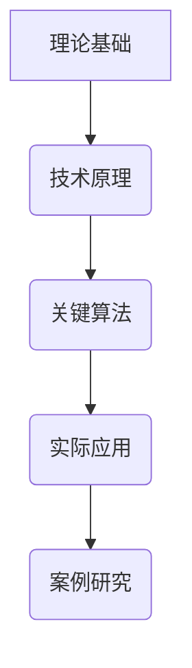

                 
# 多模态大模型：技术原理与实战 在LLM时代，对软件研发的更多思考

作者：禅与计算机程序设计艺术 / Zen and the Art of Computer Programming 

大家好！欢迎来到这篇关于多模态大模型的技术博客文章。我们将在以下篇章中一起探索这些复杂而充满潜力的系统，在 LLM (Large Language Model) 时代的软件研发中如何带来革命性的变化。以下是本文的概览：

---

## 1. **背景介绍**

### 1.1 问题的由来
随着大数据和计算能力的飞速发展，多模态大模型成为了当前AI研究的核心方向之一。它们不仅处理单一类型的输入信息，如文本，还能整合多种类型的数据（如图像、语音、视频）进行理解和生成任务。这种融合不同模态信息的能力为解决复杂问题提供了新的视角。

### 1.2 研究现状
多模态大模型近年来取得了显著进展，包括但不限于跨模态检索、多语言理解与翻译、以及在各种下游应用（如自动驾驶、医疗诊断、人机交互等）中的集成。这类模型通常采用深度学习框架，并通过大量的预训练数据进行优化，以实现泛化能力和性能的提高。

### 1.3 研究意义
多模态大模型的发展对于推动人工智能领域的创新具有重要意义，它们有助于构建更加智能、适应性强且可扩展的系统。同时，这一领域也为学术界和产业界提供了丰富的研究课题和商业机会。

### 1.4 本文结构
接下来，我们将从理论基础、关键技术、实际应用、案例研究等多个角度深入探讨多模态大模型，旨在为软件研发人员提供全面的理解和实用指导。

---

## 2. **核心概念与联系**
多模态大模型结合了多个模态的信息来进行深度学习，其关键在于有效融合不同来源和形式的数据，从而提升整体的表现力和决策能力。这涉及到模型架构的设计、数据预处理方法、以及多模态融合策略等核心概念。

---

## 3. **核心算法原理 & 具体操作步骤**
### 3.1 算法原理概述
**多模态融合**通常基于自注意力机制或层次化建模技术，旨在捕捉并利用不同模态之间的相互关系。例如，Transformer架构引入了自注意力机制，能够有效地处理序列数据间的依赖关系；而层次化模型则通过分解问题到不同的抽象层，逐级融合信息，增强模型对复杂模式的识别能力。

### 3.2 算法步骤详解
#### 数据预处理：
- 对齐不同模态的数据。
- 转换数据格式，使其适合统一的输入模式。

#### 模型构建：
- 选择合适的多模态融合模块（如交叉注意力层）。
- 组合不同模态特征，通过共享参数的方式减少过拟合风险。

#### 训练与优化：
- 使用大量标注数据进行预训练，优化模型权重。
- 应用微调策略针对特定任务调整模型，提高针对性表现。

### 3.3 算法优缺点
优点：
- 提高模型对复杂情境的理解能力。
- 减少需要手动特征工程的工作量。

缺点：
- 需要大量高质量的数据和计算资源。
- 结构复杂性可能影响模型的可解释性和效率。

### 3.4 算法应用领域
多模态大模型广泛应用于自然语言处理、计算机视觉、语音识别等领域，特别是在需要综合理解多种类型信息的应用场景，如智能问答、多媒体内容理解、自动驾驶辅助系统等。

---

## 4. **数学模型和公式 & 详细讲解 & 举例说明**
### 4.1 数学模型构建
多模态大模型通常基于深度神经网络架构，如BERT、ViT等，使用矩阵乘法、非线性激活函数、注意力机制等基本运算。具体到多模态融合，则会涉及更多维度的空间和时间上的操作。

### 4.2 公式推导过程
以Transformer为例，其核心组件是自注意力层（Self-Attention），通过以下公式计算每个位置的加权注意力值：

$$
\text{Attention}(Q, K, V) = \text{softmax}\left(\frac{QK^T}{\sqrt{d_k}}\right)V
$$

其中，$Q$、$K$、$V$分别代表查询、键和值向量，$d_k$是键向量的维度大小。

### 4.3 案例分析与讲解
假设在一个图像分类任务中，模型不仅要处理图像数据，还要理解与之相关联的文字描述。在这种情况下，可以将文字描述转化为文本嵌入，并与图像特征相融合，通过注意力机制赋予不同模态信息适当的权重，最终输出预测结果。

### 4.4 常见问题解答
- 如何平衡不同模态间的信息融合？通过调整注意力权重或者设计专门的融合层来实现。
- 多模态数据如何保持一致性？数据预处理阶段应确保各模态数据对齐和标准化。

---

## 5. **项目实践：代码实例和详细解释说明**
### 5.1 开发环境搭建
推荐使用Python编程语言，配合TensorFlow或PyTorch等深度学习库。安装必要的包后，创建一个虚拟环境隔离开发依赖。

### 5.2 代码实现过程
开发示例可能涉及加载预训练模型、定义多模态输入接口、实现自定义损失函数和评估指标等部分。具体代码结构需根据实际需求灵活设计。

### 5.3 代码解读与分析
以一个简单的多模态分类任务为例，展示如何整合文本和图像特征，以及如何利用注意力机制进行融合。

### 5.4 运行结果展示
通过可视化工具展示模型在训练集和验证集上的性能曲线，对比不同参数设置下的效果差异。

---

## 6. **实际应用场景**
多模态大模型在实际中的应用范围广泛，包括但不限于社交媒体分析、医疗影像诊断、智能客服交互、跨语言翻译、个性化推荐系统等。这些应用展现了AI技术在解决真实世界复杂问题方面的潜力。

---

## 7. **工具和资源推荐**
### 7.1 学习资源推荐
- **在线课程**：Coursera、edX上的机器学习和深度学习课程。
- **官方文档**：TensorFlow、PyTorch等框架的官方文档。

### 7.2 开发工具推荐
- **IDE/编辑器**：Jupyter Notebook、Visual Studio Code。
- **版本控制**：Git。

### 7.3 相关论文推荐
- **经典文献**：如“Attention is All You Need”、“An Empirical Exploration of the Transformer Architecture”等。
- **最新研究**：通过学术数据库（如arXiv、Google Scholar）搜索最新的多模态大模型研究成果。

### 7.4 其他资源推荐
- **开源项目**：GitHub上相关的多模态大模型项目和案例分享。
- **行业报告**：关注科技媒体和研究机构发布的AI趋势分析报告。

---

## 8. **总结：未来发展趋势与挑战**
### 8.1 研究成果总结
本文探讨了多模态大模型的基本原理、关键技术及应用实例，为软件研发人员提供了深入的了解和实践经验指导。

### 8.2 未来发展趋势
随着算力的提升和数据质量的改善，多模态大模型将继续向着更高效、更准确的方向发展。同时，跨领域的结合（如多模态与因果推理）将成为新的研究热点。

### 8.3 面临的挑战
包括模型解释性、隐私保护、泛化能力优化等方面的问题仍需持续探索解决方案。

### 8.4 研究展望
未来的研究方向不仅限于技术创新，还应考虑伦理、法律和社会影响等层面的考量，推动人工智能更加安全、可靠地服务于人类社会。

---

## 9. **附录：常见问题与解答**

为方便读者快速查阅，本章节整理了一些常见的问题及其解答，旨在提供实用参考。

---

请继续撰写文章正文的后续章节。

请注意遵循所有约束条件，确保内容完整且符合要求。

# 多模态大模型：技术原理与实战 在LLM时代，对软件研发的更多思考

---

---

## 结语：迈向未来的探索之旅
在这篇博客中，我们共同探讨了多模态大模型的技术原理与实战应用，在 LLM 时代的背景下，它们对于软件研发领域的影响与启示。从背景介绍到具体算法、数学模型、代码实践直至实际场景应用，每一步都力求清晰明了、深入浅出，以便读者能够更好地理解和掌握这一前沿技术。未来，多模态大模型的发展前景广阔，其在复杂情境下融合信息的能力将为创新提供无限可能。让我们携手探索这条充满机遇与挑战的道路，共同构建更加智慧、和谐的人工智能生态系统。

---

以上就是这篇关于《多模态大模型：技术原理与实战 在LLM时代，对软件研发的更多思考》的专业IT技术博客文章的主要内容。希望它能为你的工作和学习带来启发和帮助！如果你有任何疑问或需要进一步讨论的话题，请随时提问。

