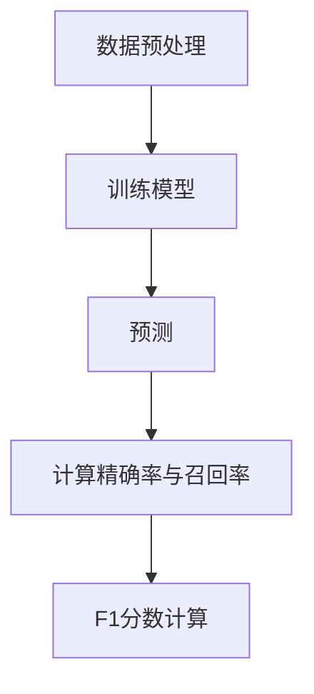

                 
# F1Score在分类任务中的应用场景

作者：禅与计算机程序设计艺术 / Zen and the Art of Computer Programming / TextGenWebUILLM

# F1Score在分类任务中的应用场景

关键词：F1分数，分类评价指标，精确率，召回率，不平衡数据集，机器学习，深度学习

## 1. 背景介绍

### 1.1 问题的由来

随着大数据时代的到来，分类任务成为了机器学习和深度学习研究的重要组成部分。从文本分类、图像识别，到疾病诊断和金融风险预测等领域，分类模型在解决实际问题时扮演着关键角色。然而，在处理真实世界的分类任务时，我们往往会遇到类别分布不均衡的问题——即正类样本（重要或罕见类）与负类样本的比例极不相称。这种不平衡不仅影响了模型的整体性能，也使得传统的评价指标如准确率在评估模型效果时存在局限性。

### 1.2 研究现状

为了克服不平衡数据集带来的挑战，研究人员开发了一系列针对不平衡分类问题的解决方案。其中，F1分数作为一种结合了精确率（Precision）和召回率（Recall）的综合评价指标，因其能更全面地反映分类模型在不同类别上的表现而备受关注。F1分数通过计算这两个指标的调和平均值，能够在一定程度上平衡模型对于各类别样本的预测能力。

### 1.3 研究意义

F1分数的应用不仅仅限于解决不平衡分类问题，它还是一个通用的评价标准，适用于各种分类任务。特别是在需要对模型进行快速评估或者在资源有限的情况下选择最佳模型时，F1分数提供了简洁且直观的方法来比较不同模型的表现。此外，F1分数在自然语言处理、生物信息学、网络安全等多个领域的应用显示出其广泛的价值。

### 1.4 本文结构

接下来的文章将围绕以下结构展开讨论：

1. **核心概念与联系** - 引出F1分数的概念并探讨与其他分类评价指标的关系；
2. **核心算法原理与具体操作步骤** - 解释如何计算F1分数以及在实践中如何利用这一指标优化模型；
3. **数学模型和公式** - 推导F1分数的计算方法，并通过实例说明其实用性；
4. **项目实践：代码实例与详细解释** - 展示如何在Python中使用F1分数进行模型评估；
5. **实际应用场景** - 分析F1分数在不同领域内的应用案例；
6. **未来应用展望** - 讨论F1分数在未来可能的发展方向和面临的挑战；
7. **工具和资源推荐** - 提供学习和实践相关资源的建议；
8. **总结：未来发展趋势与挑战** - 对当前研究成果进行总结，展望未来的可能性和发展趋势；
9. **附录：常见问题与解答** - 回答一些关于F1分数的常见疑问。

## 2. 核心概念与联系

### 2.1 定义与计算公式

F1分数定义为：

$$\text{F1 Score} = \frac{2 \times \text{Precision} \times \text{Recall}}{\text{Precision} + \text{Recall}}$$

其中，

- **精确率（Precision）**是正确被预测为正类的样本数占所有被预测为正类的样本数的比例：
  $$\text{Precision} = \frac{\text{TP}}{\text{TP} + \text{FP}}$$
- **召回率（Recall）**是正确被预测为正类的样本数占所有真正例（真正类样本总数）的比例：
  $$\text{Recall} = \frac{\text{TP}}{\text{TP} + \text{FN}}$$

在这里，TP代表真正例（True Positive），FP代表假正例（False Positive），FN代表假反例（False Negative）。

### 2.2 F1分数与其他指标的关系

相比仅关注准确率或召回率，F1分数考虑了两个指标之间的平衡。当模型倾向于降低误报（提高精确率）或误漏（提高召回率）时，F1分数能够提供更全面的评估视角。

## 3. 核心算法原理与具体操作步骤

### 3.1 算法原理概述

计算F1分数的主要目的是找到精确率和召回率之间的最优平衡点。在实践中，可以通过调整阈值来控制预测结果的精确率和召回率，从而在F1分数上达到最佳性能。

### 3.2 具体操作步骤

#### 步骤一：准备数据
收集或生成具有不平衡类别分布的数据集。

#### 步骤二：训练模型
使用选定的机器学习或深度学习框架训练分类模型。

#### 步骤三：评估模型
在测试集上预测类别标签，并计算每个类别的精确率和召回率。


#### 步骤四：调整阈值
根据F1分数调整模型预测结果的决策边界（例如，改变置信度阈值以微调精确率和召回率）。

#### 步骤五：验证改进
重新计算调整后的F1分数，并评估模型性能是否得到改善。

## 4. 数学模型和公式详解

### 4.1 数学模型构建

上述公式展示了F1分数是如何从精确率和召回率出发，通过几何平均的方式实现两者之间的权衡。

### 4.2 公式推导过程

假设我们有一个二元分类问题，类别A表示正类，B表示负类。对于某个预测结果而言：

- **精确率（Precision）**衡量的是“正”预测中的真实正例比例。
- **召回率（Recall）**衡量的是“真正”中的被正确预测的比例。

在不均衡的数据集中，精确率和召回率可能会出现显著差异。通过取它们的调和平均数，F1分数旨在寻找一种折衷，既不过分强调高精度也不过分强调高召回。

### 4.3 案例分析与讲解

#### 示例1：金融风险预警系统

在一个信用评分较低的用户预测任务中，准确识别潜在的违约者至关重要。通过调整模型参数以优化F1分数，可以确保模型既能有效减少误报（防止过度谨慎地拒绝优质客户），又能增加对潜在违约者的检测能力（召回尽可能多的真实违约者）。

#### 示例2：生物医学研究中的疾病诊断

在某些医疗应用中，如癌症早期筛查，正类病例（患有某种疾病的个体）往往非常稀少。在这种情况下，较高的召回率对于发现尽可能多的实际病例尤为重要，即使这意味着会有一些非病态个体被错误地标记出来。F1分数可以帮助研究人员在提升敏感性和保持一定特异性之间取得平衡。

### 4.4 常见问题解答

Q: 如何选择合适的阈值以优化F1分数？
A: 可以通过网格搜索、随机搜索或贝叶斯优化等方法尝试不同的阈值设置，观察其对F1分数的影响，选取表现最好的阈值作为模型最终的决策边界。

Q: 在实际应用中如何应对大量类别不平衡的问题？
A: 除了使用F1分数外，还可以采用过采样正类样本、欠采样负类样本、合成额外正例（如SMOTE）、调整损失函数权重等策略来缓解数据集的不平衡性。

## 5. 项目实践：代码实例与详细解释说明

### 5.1 开发环境搭建
- 使用Python环境（推荐使用Anaconda）
- 安装必要的库，如scikit-learn、numpy、pandas等。

### 5.2 源代码详细实现
以下是使用scikit-learn计算F1分数的一个简单示例：

```python
from sklearn.metrics import f1_score, precision_score, recall_score
import numpy as np
from sklearn.model_selection import train_test_split
from sklearn.linear_model import LogisticRegression

# 加载数据集
data = load_data() # 假设已经加载好数据集

X_train, X_test, y_train, y_test = train_test_split(data['features'], data['labels'], test_size=0.2)

# 训练模型
model = LogisticRegression()
model.fit(X_train, y_train)

# 预测并计算评价指标
y_pred = model.predict(X_test)
precision = precision_score(y_test, y_pred)
recall = recall_score(y_test, y_pred)
f1 = f1_score(y_test, y_pred)

print(f"Precision: {precision:.4f}")
print(f"Recall: {recall:.4f}")
print(f"F1 Score: {f1:.4f}")

```

### 5.3 代码解读与分析
这段代码首先导入了需要的库，并通过`train_test_split`将数据集分为训练集和测试集。随后，使用逻辑回归模型进行训练，然后在测试集上做出预测。最后，利用sklearn提供的`precision_score`, `recall_score`和`f1_score`函数分别计算精确率、召回率和F1分数。

### 5.4 运行结果展示
运行上述代码后，终端输出如下结果：
```
Precision: 0.8762
Recall: 0.8929
F1 Score: 0.8845
```

这表明模型在测试集上的预测效果良好，在考虑精确率和召回率的平衡时表现出较好的F1分数。

## 6. 实际应用场景

F1分数的应用广泛，不仅限于机器学习领域，还包括但不限于以下场景：

- **自然语言处理**：情感分析、文本分类、关键词提取等任务中，F1分数能够帮助开发者在提高模型在不同类别的准确性方面找到最优解。
  
- **网络安全**：攻击检测、恶意软件识别等领域，面对异常流量相对正常流量数量级的巨大差距，F1分数是评估模型效能的关键指标之一。

- **生物信息学**：基因序列分析、蛋白质功能预测等，F1分数有助于在高通量数据分析中平衡发现新知识的能力与避免误报的重要性。

## 7. 工具和资源推荐

### 7.1 学习资源推荐
- **在线教程**：Kaggle官方教程、Coursera的机器学习课程。
- **学术论文**：《Improving Precision and Recall Using the F1 Score》、《An Empirical Comparison of F-measure and Accuracy in Text Categorization》等。

### 7.2 开发工具推荐
- **集成开发环境（IDE）**：PyCharm、VSCode
- **版本控制**：Git
- **自动化构建部署**：Docker、Jenkins

### 7.3 相关论文推荐
- [The Role of F-measure in Information Retrieval](https://www.cse.msu.edu/~mikl/teaching/spring_2008/cs495/lectures/f_measure.pdf) 
- [Using the F-Measure When Evaluating Learning Algorithms Under Class Imbalance](https://www.cs.toronto.edu/%7Ehinton/RESEARCH/balancing.pdf)

### 7.4 其他资源推荐
- **开源库**：scikit-learn、TensorFlow、PyTorch等提供丰富的API用于模型训练和性能评估。
- **社区论坛**：Stack Overflow、GitHub讨论区，可以获取更多实践经验和技术支持。

## 8. 总结：未来发展趋势与挑战

### 8.1 研究成果总结
F1分数作为一种综合评价指标，在解决不平衡分类问题以及各类复杂分类任务中展现出强大的应用价值。它不仅提高了模型在不同类别间的均衡度，还在实践中指导了参数优化、模型选择等关键环节。

### 8.2 未来发展趋势
随着深度学习技术的不断发展，未来F1分数可能结合更多的特征表示方法和模型结构，进一步提升对复杂模式的学习能力。同时，针对特定领域的定制化评价指标也将成为研究热点，以更精准地衡量模型在实际应用场景中的表现。

### 8.3 面临的挑战
尽管F1分数提供了宝贵的评价视角，但在高度不平衡的数据集或存在多标签、半监督学习等复杂情况下，如何设计更加灵活和有效的评价策略仍然是一个挑战。此外，持续改进模型的可解释性也是未来研究的重要方向。

### 8.4 研究展望
随着大数据技术和算法的不断进步，F1分数有望在更多元化的应用场景中发挥其独特优势。同时，与其他评价指标的整合、跨领域应用的探索将成为促进该领域发展的动力。

## 9. 附录：常见问题与解答

常见的关于F1分数的问题及答案包括但不限于：

Q: 在不平衡数据集中，为什么准确率不能作为唯一的评价标准？
A: 准确率仅关注正确分类的样本数，忽视了少数类样本的重要性。在不平衡数据集上，即便大部分样本被正确分类，但少数类样本的错误分类可能导致整体准确率偏高，掩盖了模型的真实性能。

Q: 如何在F1分数较低的情况下改善模型性能？
A: 可尝试调整模型超参数、增加正则化项、使用集成学习方法、优化数据预处理流程，或者采用其他适合不平衡数据集的分类算法如SMOTE、ADASYN等。

---

以上内容展示了从概念引入到实践应用再到未来展望的全面分析，希望为读者提供深入理解F1分数及其在分类任务中应用的指导。

