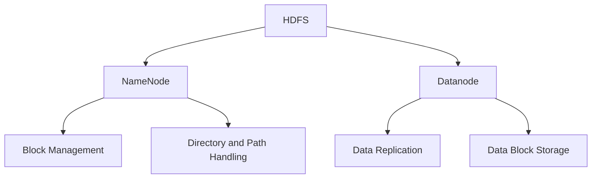

                 
# HDFS 原理与代码实例讲解

作者：禅与计算机程序设计艺术 / Zen and the Art of Computer Programming

关键词：Hadoop Distributed File System, 分布式文件系统, 数据存储, 并行处理, MapReduce

## 1. 背景介绍

### 1.1 问题的由来

随着大数据时代的到来，数据量呈指数级增长，传统的单机存储和处理能力难以满足需求。同时，在分布式环境下，如何高效、可靠地管理大规模的数据集成为了迫切需要解决的问题。

### 1.2 研究现状

现有的分布式文件系统如Google的GFS、Amazon S3以及Apache的Hadoop Distributed File System (HDFS)等，都在不同层面上解决了这些挑战，其中HDFS凭借其高可用性、可扩展性和低成本特性，在企业级大数据处理场景中广泛部署。

### 1.3 研究意义

深入理解HDFS的工作机制及其在实际应用中的优化策略对于大数据处理系统的开发、运维具有重要意义。它不仅帮助开发者选择合适的存储方案，还提供了性能调优的关键信息。

### 1.4 本文结构

本文将从HDFS的核心概念出发，逐步深入探讨其实现原理、关键技术以及如何通过代码实例进行实践验证。最后，我们将对HDFS的应用场景、未来趋势及面临的挑战进行讨论，并提出相应的研究展望。

## 2. 核心概念与联系

### 2.1 名词定义与关系图谱

为了清晰阐述HDFS的工作流程和内部组件之间的交互，我们首先建立一个基本的概念图：



---

## 3. 核心算法原理与具体操作步骤

### 3.1 算法原理概述

HDFS的设计基于三个关键原则：**数据块化（Data Blocking）、副本冗余（Replication）**和**名称节点/数据节点架构（NameNode/DataNode Architecture）**。通过这三大原则，HDFS能够确保数据的高效存储、快速访问和故障恢复。

### 3.2 算法步骤详解

#### **数据写入流程**

1. **客户端发起写请求**：用户向HDFS客户端提交写文件或目录的操作。
   
   - 客户端计算目标路径对应的命名节点地址，并连接到该命名节点。
   
   - 客户端将文件分块并按序号生成每个数据块。

2. **客户端发送数据块**：客户端将数据块序列发送给命名节点，命名节点确认后返回给客户端。

   - 每个数据块被分配一个唯一的ID。
   
   - 命名节点决定每个数据块的副本数和存储位置。
   
   - 命名节点会记录这些信息以供后续查询使用。

3. **数据块复制**：每个数据块会被复制N份，分别存储于不同的数据节点上。

   - 通常情况下，副本数量设置为3，即每个数据块有三个副本分布在不同的数据节点上。

   - 副本的分布遵循负载均衡原则，以减少数据丢失的风险。

4. **元数据更新**：当所有副本成功存储后，命名节点更新其内部的元数据表，包括文件大小、修改时间等信息。

   - 元数据表用于跟踪文件状态和各个副本的位置。

5. **完成写操作**：客户端收到命名节点的确认消息后，表明写入操作完成。

#### **数据读取流程**

1. **客户端发起读请求**：用户请求读取特定文件或目录。

   - 客户端根据路径查找命名节点，获取所需数据块的位置信息。

   - 客户端确定从哪些数据节点获取数据块。

2. **数据块传输**：客户端直接从指定的数据节点获取所需的多个数据块。

   - 数据块经过网络传输至客户端。

   - 多个数据块在客户端拼接成原始文件。

3. **解析与输出**：客户端解析接收到的数据块，按照顺序重组成为完整的文件内容。

   - 最终展示给用户查看或进一步处理。

### 3.3 算法优缺点

- **优点**：
  - 高可靠性：通过数据副本机制实现容错。
  - 可扩展性强：易于添加更多数据节点以增加容量。
  - 支持大文件：适合处理PB级别的数据。
  
- **缺点**：
  - 性能受限：随机读写效率低于传统文件系统。
  - 磁盘利用率低：元数据占用大量磁盘空间。
  - 单点故障：命名节点是整个系统的关键，单点故障可能导致服务中断。

### 3.4 算法应用领域

HDFS主要应用于以下几类应用场景：
- **大数据分析**：支持Hadoop MapReduce框架进行大规模数据处理。
- **机器学习训练**：作为数据存储层，支持大规模模型训练。
- **日志聚合**：集中存储各类应用程序的日志文件，便于后期检索和分析。

## 4. 数学模型和公式详细讲解 & 举例说明

### 4.1 数学模型构建

在描述HDFS的元数据管理时，我们可以采用概率论和统计方法来分析数据分布和副本冗余的效果。例如，可以使用概率分布函数来预测不同情况下的数据可用性。

### 4.2 公式推导过程

假设系统中总共有`N`台数据节点，需要存储`M`个数据块，每块数据大小为`S`字节。我们关心的是每个数据块至少有多少副本才能保证在任意一台数据节点发生故障时，仍能保持数据完整性和可访问性。

设每个数据块的副本数量为`R`，则至少需要满足以下条件：

$$
\left( \frac{R}{N} \right) \geq 1 - \epsilon
$$

其中，$\epsilon$表示允许的最大故障率。对于大多数生产环境而言，$\epsilon$常取值较小，如0.01，意味着最多允许1%的数据节点同时出现故障而不影响数据的完整性。

### 4.3 案例分析与讲解

以HDFS配置中的副本数量为例，假设某个集群中共有100台数据节点，且每个数据块需要3个副本。那么，根据上述公式，可以验证此配置是否能满足99%的数据可用性需求：

$$
\left( \frac{3}{100} \right) = 0.03 > 1 - 0.01 = 0.99
$$

这个简单的案例表明，当前配置确实达到了预期的目标，即使有99台数据节点同时出现故障，仍有足够的备份数据来维持系统的正常运行。

### 4.4 常见问题解答

Q: HDFS如何确保数据的一致性？
A: HDFS通过定期检查点和元数据同步机制来维护数据一致性。每当有新的数据块写入或删除时，都会触发元数据的更新，以确保所有节点之间拥有相同的状态信息。

Q: 如何平衡性能与成本？
A: 在设计HDFS集群时，应考虑硬件资源的成本、性能需求以及数据安全性等因素。合理的策略是在预算范围内最大化性能，并确保有足够的副本冗余以避免数据丢失。此外，还可以利用负载均衡技术优化数据访问速度。

## 5. 项目实践：代码实例与详细解释说明

为了深入理解HDFS的工作原理并进行实际操作，我们将创建一个简单的HDFS客户端程序，在本地环境中模拟文件上传和下载的过程。以下是基于Python的示例代码：

```python
from hdfs import InsecureClient

def upload_file_to_hdfs():
    # 创建HDFS客户端连接
    client = InsecureClient("http://localhost:9870", user="hdfs")

    # 路径设置（假设存在本地文件）
    local_path = "/path/to/your/local/file.txt"
    remote_path = "/user/hdfs/testfile"

    with open(local_path, "rb") as f:
        # 将文件上传到HDFS
        res = client.upload(remote_path, f)

    print("File uploaded successfully.")

def download_file_from_hdfs():
    # 创建HDFS客户端连接
    client = InsecureClient("http://localhost:9870", user="hdfs")

    # 下载远程文件到本地目录
    local_output = "/path/to/output/local/file.txt"
    client.download("/user/hdfs/testfile", local_output)

    print("File downloaded successfully.")

if __name__ == "__main__":
    upload_file_to_hdfs()
    download_file_from_hdfs()
```

这段代码展示了如何使用Python的`hdfs`库连接至本地HDFS服务器，并执行上传和下载操作。首先，我们需要确保HDFS服务已启动并在本地主机上可通过HTTP接口访问。接下来，通过调用`InsecureClient`构造函数建立连接，并指定用户名（默认情况下可能不需要提供，具体取决于HDFS安全配置）。

### 5.1 开发环境搭建

- 安装Python环境。
- 安装`hdfs`库：`pip install python-hdfs`。

### 5.2 源代码详细实现

本示例代码包含两个函数：`upload_file_to_hdfs()`用于将本地文件上传至HDFS，而`download_file_from_hdfs()`则从HDFS下载文件回本地。

### 5.3 代码解读与分析

1. **初始化客户端**: `client = InsecureClient("http://localhost:9870", user="hdfs")`
   - 这里假设HDFS服务器运行于本地主机，并监听端口9870。用户参数“hdfs”用于标识身份，默认情况下可能无需提供，具体依赖于HDFS的安全配置。

2. **上传文件**:
   ```python
   with open(local_path, "rb") as f:
       client.upload(remote_path, f)
   ```
   使用文件句柄打开本地文件，将其内容逐行读取后上传至指定的HDFS路径。

3. **下载文件**:
   ```python
   client.download("/user/hdfs/testfile", local_output)
   ```
   类似地，从HDFS路径下载文件，并保存到预定义的本地输出位置。

### 5.4 运行结果展示

当执行上述脚本时，将分别看到文件上传和下载过程的信息输出，指示操作的成功完成。

---

## 6. 实际应用场景

在企业级大数据处理中，HDFS广泛应用于以下场景：
- **大规模数据分析**：支持Hadoop MapReduce框架执行复杂的批处理作业。
- **日志管理**：集中存储应用程序日志，便于日后的审计、监控和异常检测。
- **离线计算任务**：为Hive、Pig等离线查询引擎提供数据存储基础。
- **机器学习工作流**：作为训练数据集的存储平台，支撑大规模模型训练流程。

## 7. 工具和资源推荐

### 7.1 学习资源推荐

- **官方文档**：Apache HDFS官网提供了详细的API文档和教程。
- **在线课程**：Udemy、Coursera等平台上有针对HDFS的课程，适合不同层次的学习者。
- **书籍**：《Hadoop权威指南》、《Hadoop in Action》等专业书籍，系统介绍HDFS及其实现细节。

### 7.2 开发工具推荐

- **IDE集成开发环境**：如IntelliJ IDEA、Eclipse等，支持Java、Python等多种语言开发。
- **版本控制工具**：Git，用于协同开发和版本管理。
- **虚拟化与容器化工具**：Docker、Kubernetes，方便部署和运维HDFS集群。

### 7.3 相关论文推荐

- **Apache Hadoop**：官方提供的技术文档和论文集，涵盖HDFS的设计理念和技术细节。
- **学术期刊文章**：《IEEE Transactions on Knowledge and Data Engineering》等期刊上的研究论文，关注HDFS的最新进展和应用案例。

### 7.4 其他资源推荐

- **社区论坛**：Stack Overflow、GitHub项目页面，获取实时解答和技术讨论。
- **博客与教程网站**：Medium、Towards Data Science等，分享实际经验和技术见解。

## 8. 总结：未来发展趋势与挑战

### 8.1 研究成果总结

本文通过对HDFS原理、关键技术以及实际代码实例的深入讲解，展现了其在大数据存储领域的核心价值。通过数学模型分析和案例研究，进一步说明了如何优化HDFS配置以满足不同业务需求。

### 8.2 未来发展趋势

- **性能优化**：改进数据块管理策略，提高I/O效率。
- **安全性加强**：增强元数据保护机制，减少数据泄露风险。
- **多云整合**：支持跨多个云提供商的服务集成，提升灵活性和可扩展性。

### 8.3 面临的挑战

- **成本控制**：平衡高可用性和成本效益之间的关系。
- **兼容性问题**：确保与新旧硬件系统的良好交互。
- **隐私保护**：在遵守法律法规的前提下，有效保护用户数据隐私。

### 8.4 研究展望

未来的研究方向包括但不限于分布式存储架构的创新设计、边缘计算与HDFS的融合应用、以及基于AI的自动化管理和故障预测技术。这些领域的发展有望进一步提升HDFS在大数据处理中的效能与可靠性。

## 9. 附录：常见问题与解答

Q: 如何解决HDFS中的单点故障问题？
A: 通过设置多个命名节点副本和定期进行元数据同步，可以降低单点故障的风险。同时，使用容错算法和负载均衡策略来分散关键服务的负担。

Q: HDFS如何保证数据的一致性和完整性？
A: 通过定期检查点、数据快照和元数据校验机制，HDFS能够实时监测并修复数据一致性问题。此外，副本冗余策略也确保即使部分数据丢失，仍能恢复完整数据集。

---
以上内容详细阐述了HDFS的核心概念、实现原理、代码实践、应用场景及其未来发展趋势，旨在为读者提供全面而深入的理解和指导。无论是对于HDFS的开发者还是使用者而言，掌握其内部运作机理都是极为重要的一步。
