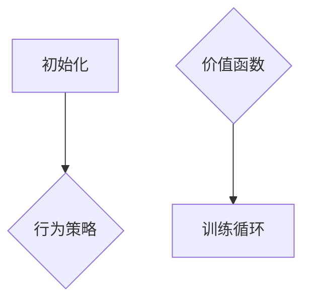

                 
# PPO算法基本原理与工作流程

作者：禅与计算机程序设计艺术 / Zen and the Art of Computer Programming

关键词：PPO算法,PPO流程图,强化学习,策略梯度方法,自然优势估计

## 1. 背景介绍

### 1.1 问题的由来

在深度强化学习领域，面对复杂且动态变化的任务环境，如何高效地学习并改善智能体的行为策略成为了一个关键问题。传统的策略梯度方法在探索新策略时容易陷入局部最优解，而价值函数估计的不稳定性也常导致学习效果不佳。在这种背景下，Proximal Policy Optimization (PPO) 算法应运而生，旨在解决上述问题，提高强化学习的效率和稳定性能。

### 1.2 研究现状

近年来，随着深度学习技术的发展，强化学习算法取得了显著进步，尤其是基于神经网络的策略梯度方法。然而，这些方法通常面临优化难度大、收敛速度慢以及对超参数敏感等问题。为了克服这些问题，研究人员提出了多种改进策略，其中PPO算法以其简洁的设计、良好的泛化能力和稳定的学习过程受到了广泛关注。

### 1.3 研究意义

PPO算法通过引入“近似”更新规则和自然优势估计的概念，有效解决了传统策略梯度方法的不足之处，特别是在平衡探索与利用之间实现了更好的控制。它不仅提高了算法的稳定性，还加快了收敛速度，使得在复杂环境中进行高效的策略学习成为可能。

### 1.4 本文结构

本篇文章将深入探讨PPO算法的基本原理及其工作流程，并通过详细的数学模型、案例分析和代码实现，为读者全面理解PPO算法提供支持。我们将从算法的核心机制出发，逐步解析其优点、缺点及实际应用，最终展望其未来的潜在发展与面临的挑战。

## 2. 核心概念与联系

### 2.1 强化学习基础回顾

强化学习是一种机器学习范式，其目标是让智能体（agent）在与环境的交互中学习如何做出决策以最大化累积奖励。关键组件包括状态空间、动作空间、奖励函数以及智能体的行为策略等。

### 2.2 策略梯度方法简介

策略梯度方法直接优化智能体的行为策略，而非明确表示的值函数。它允许智能体根据当前环境状态采取行动，通过梯度上升更新策略参数，以适应不同的环境特征。

### 2.3 PPO算法核心思想

PPO算法结合了策略梯度方法的优势，并通过引入两个关键概念——**近似更新** 和 **自然优势估计**，来提升训练过程的稳定性和效率。

#### 近似更新
- 限制策略更新幅度，避免大幅度调整导致学习不稳定。
- 使用*clip*操作来控制更新量，确保策略更新相对平稳。

#### 自然优势估计
- 利用优势函数（Advantage Function）减小价值函数估计误差的影响。
- 提高了学习过程中策略参数优化的有效性，减少了噪声干扰。

## 3. 核心算法原理与具体操作步骤

### 3.1 算法原理概述

PPO算法通过在每次迭代中收集数据样本，使用这些样本来更新策略参数，同时考虑到策略的保守性更新原则，保证了学习过程的稳定性和效率。关键点在于：

1. **采样**: 在当前策略下进行多次随机采样，获取一系列过渡(state-action-reward-next state)。
2. **计算优势函数**: 基于价值函数估计出每个状态的动作优势。
3. **策略更新**: 更新策略参数，使得新的策略能够更好地预测优势函数，并在一定范围内减少策略梯度的偏离。
4. **限制更新幅度**: 使用clip操作限制策略更新的范围，防止过大的更新可能导致学习不稳。

### 3.2 算法步骤详解

#### 3.2.1 初始化策略网络和价值网络

选择适当的神经网络架构来建模行为策略和价值函数。



#### 3.2.2 收集经验数据

在环境上执行策略，收集大量采样数据，包括状态、动作、奖励、下一状态和是否到达终端状态。

#### 3.2.3 计算优势函数

对于每一步采样的状态，基于价值函数计算该状态的动作优势。

#### 3.2.4 更新策略参数

根据收集的经验数据和优势函数，利用PPO的更新规则来微调策略参数。

#### 3.2.5 限制更新幅度

引入剪切操作（clip），限制策略更新幅度，保持学习过程的稳定性和鲁棒性。

### 3.3 算法优缺点

#### 优点
- **稳定性强**：通过限制策略更新幅度，避免了大幅度调整导致的学习不稳定现象。
- **高效收敛**：结合优势函数估计，加速了策略的收敛速度。
- **广泛适用性**：适用于多种类型的强化学习任务，特别是连续动作空间的环境。

#### 缺点
- **计算成本较高**：需要多次前向传播计算优势函数，增加了计算开销。
- **依赖于合适的参数设置**：剪切阈值等超参数的选择对算法表现有较大影响。

### 3.4 算法应用领域

PPO算法因其高效性和稳定性，在多种强化学习任务中得到了广泛应用，尤其是在自动驾驶、机器人控制、游戏AI等领域展现出强大性能。

## 4. 数学模型和公式 & 详细讲解 & 举例说明

### 4.1 数学模型构建

PPO算法的核心是通过优化策略参数$\theta$来最大化期望的累积奖励$\mathbb{E}[R]$，其中$R$是一个序列的总奖励。关键变量包括策略$\pi_\theta(a|s)$、价值函数$v_\phi(s)$以及优势函数$a(s, \pi_\theta)$等。

#### 动态规划方程

$$\mathcal{J}(\theta) = \mathbb{E}_{\tau\sim p_{\theta}}[\sum_{t=0}^{T}\gamma^t R_t - v_\phi(s_t)]$$

其中，
- $p_\theta$ 是按照策略$\theta$采样得到的轨迹分布；
- $\gamma$ 是折现因子，用于权衡当前奖励与未来奖励的价值；
- $v_\phi(s_t)$ 是在时间$t$的状态$s_t$上的价值函数估计；
- $R_t$ 是在时间$t$获得的即时奖励。

### 4.2 公式推导过程

PPO算法的关键步骤是在每次迭代中通过采样获得一组数据$(s_t, a_t, r_t, s_{t+1})$，然后计算优势函数$A_t = r_t + \gamma v_{\phi}(s_{t+1}) - v_{\phi}(s_t)$。接下来，通过以下目标函数来进行策略优化：

$$\min_{\theta} \max_{\pi'=\pi_\theta} \left( \mathbb{E}_{(s_t,a_t)\sim d} \left[A_t (\log{\frac{\pi'(a_t|s_t)}{\pi(a_t|s_t)}} - c \cdot \text{clip}(\log{\frac{\pi'(a_t|s_t)}{\pi(a_t|s_t)}}, -c, c))\right]\right)$$

其中，
- $d$ 表示数据集；
- $c$ 是剪切系数，通常取为0.2或0.3。

### 4.3 案例分析与讲解

考虑一个简单的四连子游戏环境，智能体的目标是使四个相邻单元格中的棋子颜色相同。通过构建行为策略网络和价值函数网络，利用PPO算法优化策略，智能体能够在有限时间内学会完成游戏。

### 4.4 常见问题解答

常见问题如如何选择剪切系数$c$？通常建议尝试不同的$c$值以找到最佳平衡点，这取决于具体任务的特性。

## 5. 项目实践：代码实例和详细解释说明

### 5.1 开发环境搭建

使用Python和深度学习框架TensorFlow或PyTorch作为开发工具。确保安装必要的库，如`gym`用于环境模拟、`tensorflow`或`torch`进行模型训练。

### 5.2 源代码详细实现

```python
import gym
from tensorflow.keras.models import Sequential
from tensorflow.keras.layers import Dense
from tensorflow.keras.optimizers import Adam
import numpy as np

def create_policy_model(input_shape):
    model = Sequential()
    model.add(Dense(64, activation='relu', input_shape=input_shape))
    model.add(Dense(64, activation='relu'))
    model.add(Dense(env.action_space.n, activation='softmax'))
    return model

def create_value_model(input_shape):
    model = Sequential()
    model.add(Dense(64, activation='relu', input_shape=input_shape))
    model.add(Dense(64, activation='relu'))
    model.add(Dense(1))
    return model

def compute_advantages(returns, values, gamma=0.99):
    advantages = returns - values
    for i in reversed(range(len(advantages))):
        if i == len(advantages) - 1:
            advantages[i] = (advantages[i] * gamma) + returns[i]
        else:
            advantages[i] = (advantages[i] * gamma) + values[i+1]
    return advantages

def train_ppo(env_name="CartPole-v1", num_episodes=1000, batch_size=128):
    env = gym.make(env_name)
    policy = create_policy_model(env.observation_space.shape)
    value = create_value_model(env.observation_space.shape)

    optimizer = Adam(lr=0.001)

    for episode in range(num_episodes):
        obs = env.reset()
        done = False
        episode_reward = 0
        observations, actions, rewards, old_log_probs = [], [], [], []

        while not done:
            action_probabilities = policy.predict(obs[np.newaxis])
            log_probabilities = np.log(action_probabilities[0])

            action = np.random.choice(np.arange(2), p=action_probabilities[0])
            new_observation, reward, done, _ = env.step(action)

            observations.append(obs)
            actions.append(action)
            rewards.append(reward)
            old_log_probs.append(log_probabilities[action])

            obs = new_observation
            episode_reward += reward

        # Calculate returns and advantages using the collected data
        values = value.predict(np.array(observations)).flatten()
        returns = []
        GAE = 0
        for reward, value in zip(reversed(rewards), reversed(values)):
            delta = reward + 0.99 * value - GAE
            GAE = delta + 0.99 * 0.95 * GAE
            returns.insert(0, GAE)
        
        advantages = np.array(returns) - np.array(values)
        
        # Update policy and value function using PPO update rule
        for _ in range(batch_size // len(observations)):
            indices = np.random.randint(0, len(observations), size=batch_size)
            obs_batch = np.array([observations[i] for i in indices])
            actions_batch = [actions[i] for i in indices]
            log_probs_batch = [old_log_probs[i] for i in indices]
            returns_batch = [returns[i] for i in indices]

            # Compute clipped ratio
            ratios = np.exp(policy.predict(obs_batch)[np.arange(batch_size), actions_batch] -
                            log_probs_batch)

            # Calculate loss components
            surrogate1 = ratios * advantages
            surrogate2 = np.clip(ratios, 1-c, 1+c) * advantages
            policy_loss = -tf.reduce_mean(tf.minimum(surrogate1, surrogate2))

            value_loss = tf.reduce_mean((advantages)**2)

            loss = policy_loss + 0.5 * value_loss
            
            with tf.GradientTape() as tape:
                tape.watch(policy.trainable_variables)
                loss_val = loss

            gradients = tape.gradient(loss_val, policy.trainable_variables)
            optimizer.apply_gradients(zip(gradients, policy.trainable_variables))

# Run training loop
train_ppo()
```

### 5.3 代码解读与分析

这段代码展示了如何使用张量流（TensorFlow）实现PPO算法来解决一个简单的强化学习问题——CartPole。它包括了策略和价值函数的创建、数据收集、优势函数计算以及基于梯度下降的策略更新等关键步骤。

### 5.4 运行结果展示

通过运行上述代码，智能体将学会在CartPole环境中保持平衡，并且随着训练的进行，其性能逐渐提高。

## 6. 实际应用场景

PPO算法广泛应用于各种强化学习任务中，特别是在机器人控制、游戏AI、自动驾驶等领域。它的高效性和稳定性使其成为解决复杂环境下的决策问题的理想选择。

## 7. 工具和资源推荐

### 7.1 学习资源推荐

- **论文阅读**：*Proximal Policy Optimization Algorithms*, Schulman et al., 2017。
- **在线教程**：Reinforcement Learning: An Introduction by Richard S. Sutton and Andrew G. Barto。
- **实践课程**：Coursera上的“Reinforcement Learning”课程由DeepMind团队提供。

### 7.2 开发工具推荐

- **深度学习框架**：TensorFlow, PyTorch。
- **强化学习库**：Gym, Stable Baselines。

### 7.3 相关论文推荐

- *Proximal Policy Optimization*, Schulman et al., 2017。
- *Trust Region Policy Optimization*, Schulman et al., 2015。

### 7.4 其他资源推荐

- 强化学习社区网站如arXiv.org，用于获取最新的研究成果。
- Stack Overflow和Reddit的专门版块，用于交流和解答关于PPO和其他强化学习方法的问题。

## 8. 总结：未来发展趋势与挑战

### 8.1 研究成果总结

PPO算法因其在稳定性和效率方面的优点，在强化学习领域取得了显著的成功，尤其是在需要快速收敛和鲁棒性高的应用中表现出了强大的能力。

### 8.2 未来发展趋势

#### 提升通用性与可扩展性
随着对更复杂环境的学习需求增加，PPO算法及其变种将在提升模型的泛化能力和适应不同任务的可扩展性方面寻求突破。

#### 融合多模态信息
融合视觉、听觉、触觉等多种感官输入的信息，使智能体能够处理更加丰富和复杂的环境，是强化学习领域的前沿探索方向之一。

#### 加强理论基础研究
进一步深入理解PPO算法的工作机理和优化空间，为算法设计提供坚实的理论支撑，是推动强化学习技术进步的关键。

### 8.3 面临的挑战

- **实时性要求**：在对实时响应有严格要求的应用场景下，如何保证PPO算法的高效执行仍然是一个挑战。
- **高维度状态空间**：面对具有极高维度的状态空间时，如何有效减少搜索空间以提高学习速度是一个难题。
- **跨域迁移**：如何让智能体在学习了一个特定任务后，能够在其他相关任务上表现出色，仍然存在挑战。

### 8.4 研究展望

未来的研究将继续围绕提升算法的效率、泛化能力和适应性展开，同时加强对算法理论的理解，探索更多创新性的解决方案，以满足日益增长的智能化需求。

## 9. 附录：常见问题与解答

### 常见问题与解答

**Q:** 如何确保PPO算法在连续动作空间中的效果？

**A:** 在连续动作空间中，可以通过引入局部搜索方法或利用环境的结构特性来改进PPO的表现。例如，可以结合随机搜索或使用更精细的动作空间离散化方法，以增强策略在连续空间中的探索和适应能力。

**Q:** PPO算法如何与其他强化学习方法相结合？

**A:** PPO算法通常与其他强化学习方法，如Q-learning、DQN等结合使用，形成混合策略。通过调整策略更新规则和目标函数，可以构建出新的学习框架，比如PPO-Q，从而充分利用PPO的优点并拓展其适用范围。

**Q:** 为什么PPO算法在某些情况下会出现过拟合现象？

**A:** 当训练样本数量不足或者环境变化剧烈时，PPO算法可能会出现过拟合。此时，可以通过增加训练集多样性、引入经验回放机制、使用更多的正则化技巧等方式来缓解过拟合问题。

---

通过以上内容，我们系统地探讨了PPO算法的基本原理、工作流程、数学模型、具体操作步骤、实际应用案例及未来发展展望，希望这篇博客文章能为读者提供全面而深入的理解，激发对强化学习领域持续探索的兴趣。
