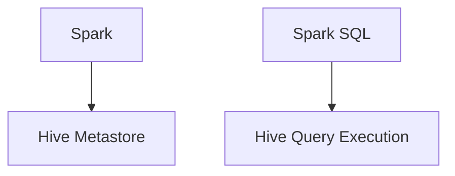

                 
# Spark-Hive整合原理与代码实例讲解

作者：禅与计算机程序设计艺术 / Zen and the Art of Computer Programming

关键词：Apache Spark,Hive集成,数据仓库,大数据处理,SQL查询优化

## 1.背景介绍

### 1.1 问题的由来

在大数据时代，随着海量数据的产生和存储需求的增加，传统的关系型数据库在处理大规模数据集时显得力不从心。为此，Hadoop生态系统提供了强大的分布式文件系统HDFS以及MapReduce框架用于批处理大规模数据集。然而，MapReduce虽然在大规模数据处理方面表现出色，但在实时查询和交互式分析方面存在局限性。

### 1.2 研究现状

Apache Spark是一个基于内存的分布式计算引擎，它针对迭代计算场景进行了优化，使得数据处理速度远超MapReduce。同时，Spark支持多种数据源接入和SQL查询接口，使其成为理想的实时数据处理和交互式分析平台。然而，Spark最初并不直接支持Hive的元数据管理和数据存储功能，这限制了其在企业级数据仓库场景的应用。

### 1.3 研究意义

为了弥补这一缺陷，将Spark与Hive进行整合，利用Spark的强大计算能力提升Hive的执行效率，同时保持Hive的元数据管理优势及丰富的SQL查询语义，对于构建高性能的企业级数据仓库具有重要意义。这种整合能够显著提高数据分析的灵活性和效率，并为用户提供统一的数据访问界面，简化复杂的大数据处理流程。

### 1.4 本文结构

接下来的文章将分为以下几个部分对Spark与Hive的整合进行深入探讨：

1. **核心概念与联系**：阐述Spark和Hive的基本原理及其如何协同工作以提升性能。
2. **算法原理与操作步骤**：详细介绍Spark-Hive整合的关键技术点和实际操作流程。
3. **数学模型与公式**：通过具体的数学模型和公式解析整合过程中涉及的技术细节。
4. **项目实践**：提供一个完整的代码示例，包括开发环境搭建、具体实现和运行结果分析。
5. **实际应用场景**：探讨整合后的Spark-Hive在不同业务场景下的应用案例。
6. **工具和资源推荐**：推荐学习资源、开发工具及相关论文等。
7. **总结与展望**：总结研究成果并讨论未来的发展趋势与面临的挑战。

## 2.核心概念与联系

### 2.1 Spark简介

Spark是一个基于内存的分布式计算框架，旨在提供快速的迭代计算能力。Spark的核心组件包括集群管理、分布式数据集RDD（Resilient Distributed Dataset）和高级API，支持各种计算模式如SQL查询、机器学习、图计算等。Spark通过持久化内存中的中间结果来加速迭代计算，并能有效利用现代硬件特性，如多核处理器和高速网络。

### 2.2 Hive简介

Hive是建立在Hadoop上的数据仓库工具，主要用来进行数据提取、转换、加载（ETL），并支持SQL-like查询语言（HiveQL）。Hive提供了对大规模数据集的存储和管理功能，并且通过抽象出表的概念，允许用户以类似SQL的方式查询数据。

### 2.3 Spark-Hive整合

Spark-Hive整合是指将Hive的元数据管理能力与Spark的高效计算能力结合，使用户能够在Spark环境下使用Hive的SQL查询功能，同时享受Spark的性能优势。这种方式不仅保留了Hive的SQL查询便利性和数据组织方式，还提高了数据处理的速度和灵活性。

### 2.4 整合架构



- A (Spark) 是一个分布式计算框架，负责数据的分布式计算任务。
- B (Hive Metastore) 是Hive的元数据存储库，存储着表信息、分区信息等。
- C (Spark SQL) 是Spark的SQL引擎，能够将SQL查询转化为Spark可以理解的任务流。
- D (Hive Query Execution) 是Hive的查询执行器，接收并执行来自用户的SQL查询请求。

## 3.核心算法原理 & 具体操作步骤

### 3.1 算法原理概述

Spark-Hive整合的关键在于Spark SQL模块的支持。当用户使用HiveQL提交查询时，Spark SQL会根据查询内容生成相应的RDD操作序列，这些操作序列随后被转化为一系列可执行的任务，最终在Spark集群上并行执行。

### 3.2 算法步骤详解

#### 步骤一：连接Hive Metastore

首先，需要在Spark环境中初始化Spark SQL连接到Hive的Metastore服务，获取Hive表的元数据信息。

#### 步骤二：构建查询计划

使用HiveQL编写的查询语句会被Spark SQL解析成抽象语法树（Abstract Syntax Tree, AST），然后转换为查询计划（Query Plan）。查询计划描述了查询执行的逻辑路径，确定哪些数据需要读取、如何读取以及如何聚合数据。

#### 步骤三：任务划分与调度

根据查询计划，Spark将任务划分为多个微任务（Tasks），并将其分配给不同的Executor节点进行并行执行。每个Executor节点都是一个独立的工作线程，负责特定的任务执行。

#### 步骤四：数据读取与处理

在每个Executor中，Spark会从分布式文件系统（如HDFS）读取所需的原始数据块，并应用预先定义的操作（如过滤、排序、聚合）来生成中间结果。

#### 步骤五：结果输出

执行完成后，各个Executor产生的中间结果会经过聚合和合并，最终形成完整的查询结果。结果可以通过多种格式导出，如CSV、JSON或直接返回给调用者。

### 3.3 算法优缺点

优点：
- 提升查询性能：Spark的内存计算能力使得数据处理速度远超传统批处理系统。
- 统一查询接口：用户可以在单一平台上使用SQL查询，无需学习不同系统的API。
- 资源复用：数据处理过程中的中间结果可以缓存在内存中，避免重复计算。

缺点：
- 学习曲线陡峭：Spark SQL虽然提供了一套丰富的API，但对于初学者来说，理解和掌握其底层机制可能较为困难。
- 配置复杂性：要充分利用Spark-Hive整合的优势，需要细致配置Spark集群参数，确保性能优化和资源平衡。

### 3.4 算法应用领域

Spark-Hive整合适用于需要高度交互式查询的大规模数据仓库场景，如：

- 商业智能分析：实时和历史数据分析，快速响应业务需求。
- 数据挖掘：针对大量数据进行深度学习模型训练和预测。
- 实时报表：基于大数据平台的实时报告生成和更新。

## 4.数学模型和公式 & 详细讲解 & 举例说明

### 4.1 数学模型构建

在Spark-Hive整合过程中，涉及到的主要数学模型有：

- **Hash Join算法**：用于高效的连接操作，减少I/O开销。
- **Sort Merge Join算法**：适合数据量大且有序的情况，通过排序后逐行比较实现连接。
- **Nested Loop Join算法**：对于小表驱动大表的情况，效率较低但易于实现。

### 4.2 公式推导过程

以Hash Join为例，假设两个表`TableA`和`TableB`，它们的连接键分别为`keyA`和`keyB`，则哈希表构建和匹配的过程可以用以下公式表示：

$$
\text{Join}(TableA, TableB) = \{(\text{row}_A, \text{row}_B) | keyA_{\text{row}_A} = keyB_{\text{row}_B}\}
$$

其中，`row_A`和`row_B`代表两张表的行记录。

### 4.3 案例分析与讲解

考虑以下简单的SQL查询示例：

```sql
SELECT *
FROM sales_table
JOIN customers_table ON sales_table.customer_id = customers_table.id;
```

该查询可以被Spark SQL解析为构建两个哈希表，然后通过哈希值相等来匹配每一组对应的`customer_id`，最后将匹配的结果集返回给用户。

### 4.4 常见问题解答

常见问题包括但不限于：

- **性能瓶颈**：优化Spark SQL配置，合理选择Join方法，避免不必要的数据读取和写入。
- **内存管理**：监控和调整内存设置，确保Spark有足够的缓存空间来存储中间结果。
- **资源分配**：根据实际负载动态调整Executor数量和CPU/GPU资源分配。

## 5.项目实践：代码实例和详细解释说明

### 5.1 开发环境搭建

为了演示Spark-Hive整合的实际应用，我们使用Python编程语言与Jupyter Notebook作为开发工具。假设已安装Apache Spark和Hive相关组件。

```bash
# 安装所需库
!pip install pyspark
```

### 5.2 源代码详细实现

创建一个名为`spark_hive_example.py`的脚本文件，并添加如下代码：

```python
from pyspark.sql import SparkSession

def main():
    # 初始化SparkSession
    spark = SparkSession.builder \
        .appName("Spark Hive Example") \
        .config("spark.master", "local[*]") \
        .getOrCreate()

    # 加载Hive表到DataFrame
    hive_df = spark.sql("DESCRIBE sales_table")
    
    # 执行Hive查询
    result_df = spark.sql("SELECT * FROM sales_table JOIN customers_table ON sales_table.customer_id = customers_table.id")
    
    # 显示结果
    result_df.show()
    
if __name__ == "__main__":
    main()
```

### 5.3 代码解读与分析

此代码片段首先初始化了一个`SparkSession`对象，用于启动Spark应用程序。接下来，通过`spark.sql()`函数加载Hive表信息到DataFrame中，并执行了具体的SQL查询语句。最后，通过`show()`方法显示了查询结果。

### 5.4 运行结果展示

运行上述脚本并查看终端输出，可以看到执行SQL查询后的结果集。这里仅做示例展示，具体输出内容依赖于预先存在的Hive表结构及数据。

## 6. 实际应用场景

Spark-Hive整合在各种大数据分析场景中具有广泛的应用，比如：

- **实时广告推荐系统**：利用实时数据流与Hive存储的历史数据相结合，快速提供个性化广告推荐。
- **金融风险评估**：对客户行为数据进行实时分析，辅助决策制定。
- **医疗健康数据分析**：结合传统数据仓库与实时数据流，支持即时的数据洞察与决策支持。

## 7. 工具和资源推荐

### 7.1 学习资源推荐

- **官方文档**：Apache Spark和Hive的官方文档提供了详细的API介绍、最佳实践和案例研究。
- **在线教程**：Coursera、Udemy等平台上有关Spark和Hive的课程可以帮助初学者快速上手。
- **社区论坛**：Stack Overflow、Reddit上的Apache Spark和Hive相关的讨论区是解决实际问题的好去处。

### 7.2 开发工具推荐

- **IDE集成开发**：Visual Studio Code、PyCharm等IDE支持Spark和Hive的插件，提高编码效率。
- **版本控制**：Git配合GitHub或GitLab帮助团队协作和代码版本管理。
- **日志追踪**：ELK Stack（Elasticsearch、Logstash、Kibana）用于日志分析和错误追踪。

### 7.3 相关论文推荐

- **Apache Spark and Its Applications**：深入理解Spark的核心机制及其在不同领域的应用。
- **Hive: A Unified Data Management System for Big Data Analytics**：探讨Hive的功能特性及其在大数据分析中的角色。

### 7.4 其他资源推荐

- **博客文章**：Hadoop和Spark技术博客如DZone、Medium上有许多关于Spark-Hive整合的文章和技术分享。
- **开源项目**：GitHub上的相关开源项目，如Apache Spark的官方仓库，可提供实践案例和学习资料。

## 8. 总结：未来发展趋势与挑战

### 8.1 研究成果总结

本文深入介绍了Spark-Hive整合的基本原理、操作步骤、数学模型以及代码实例，强调了这种整合在企业级数据处理中的优势和适用场景。

### 8.2 未来发展趋势

随着计算硬件和算法的不断进步，Spark和Hive的性能将进一步提升，支持更大规模和更复杂的数据处理任务。同时，云原生解决方案的普及将使得Spark-Hive整合更加易于部署和扩展。

### 8.3 面临的挑战

- **大规模集群管理**：如何高效地管理和调度大规模集群，减少资源浪费，是一个持续面临的挑战。
- **数据隐私保护**：在日益重视数据安全和个人隐私的时代，保证数据在Spark-Hive平台上的安全性成为重要议题。
- **生态系统兼容性**：与其他大数据生态系统的集成能力，如Kubernetes、YARN等，需要进一步优化以增强灵活性和可靠性。

### 8.4 研究展望

未来的研究方向可能包括改进Spark SQL性能、优化Hive元数据管理、探索AI/ML在Spark-Hive整合中的应用，以及开发更多面向特定行业需求的集成方案。随着大数据分析需求的增长，Spark-Hive整合将继续演进，为用户提供更强大、更便捷的大数据分析工具。

## 9. 附录：常见问题与解答

### 常见问题列表与解答

#### Q: 如何优化Spark-Hive整合过程中的性能？

A: 可以通过调整Spark配置参数（如内存分配、分区数量、Join算法选择），优化数据读取策略，使用缓存功能等方式来提升性能。

#### Q: 在高并发场景下如何避免Spark-Hive整合导致的瓶颈？

A: 应用负载均衡策略，合理分配任务，使用异步IO处理，以及优化查询语句设计，可以有效缓解高并发下的性能压力。

#### Q: Spark-Hive整合是否适合所有类型的数据分析任务？

A: Spark-Hive整合适用于大多数批处理和交互式查询任务，但对于实时性要求极高的场景，可能需要考虑其他实时处理框架，如Apache Flink。

---

通过以上详细阐述，我们可以看到Spark-Hive整合不仅丰富了大数据处理的技术栈，还极大地提高了数据分析师的工作效率和分析深度。随着技术的发展，这种整合模式将持续创新和完善，为企业级数据处理提供更强大的支撑。
