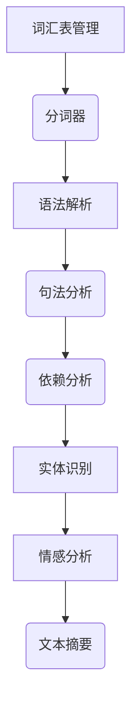

                 
# spaCy 原理与代码实战案例讲解

作者：禅与计算机程序设计艺术 / Zen and the Art of Computer Programming

关键词：spaCy, NLP, 机器翻译, 文本挖掘, 自然语言理解

## 1. 背景介绍

### 1.1 问题的由来

在自然语言处理（NLP）领域，文本数据的自动理解和生成是关键需求之一。无论是用于搜索引擎、社交媒体分析、智能客服系统还是机器翻译，都需要对文本进行解析、抽取关键信息以及生成有意义的语句。在这个背景下，spaCy应运而生，它是一个高性能的Python库，专门用于NLP任务，旨在提供快速且可扩展的解决方案。

### 1.2 研究现状

当前NLP领域正经历着快速发展期，各种开源库如Gensim、NLTK和Scikit-learn提供了基础的文本分析功能，但它们在处理大规模数据集时可能效率较低或无法满足特定任务的需求。spaCy以其卓越的速度和灵活性脱颖而出，成为处理大型文本数据集的理想选择。它支持多种NLP任务，包括词性标注、命名实体识别、依存关系分析和句法分析等，并通过其简洁高效的API使得开发人员能够轻松地将复杂NLP功能集成到应用程序中。

### 1.3 研究意义

spaCy的意义在于为开发者提供了一个高效、灵活的平台，可以加速NLP项目的开发速度，提高解决方案的质量。对于企业而言，这意味着能够更快地推出基于NLP的产品和服务，提升用户体验，增强市场竞争力。同时，spaCy促进了学术研究与工业应用之间的紧密连接，推动了NLP技术的进步和发展。

### 1.4 本文结构

本文将深入探讨spaCy的核心概念、算法原理、数学模型及其在实际场景中的应用。我们将从安装和配置开始，逐步讲解如何利用spaCy进行文本预处理、特征提取、模型训练和评估。此外，还将提供一系列实战案例，展示spaCy在不同领域的具体应用，以帮助读者更好地掌握和运用这一强大的NLP工具。

## 2. 核心概念与联系

### 2.1 spaCy架构简介

spaCy是一个基于C++的高性能Python库，它采用了动态链接和多线程执行机制，显著提高了处理大量文本数据的能力。spaCy的核心模块包括词汇表管理、语法解析器、语言模型和用户接口。以下是一张概括spaCy主要组件和流程的Mermaid图：



### 2.2 简单使用示例

要开始使用spaCy，首先需要安装并导入必要的库：

```python
!pip install spacy
import spacy
nlp = spacy.load("en_core_web_sm")
text = "John likes to eat pizza in New York City."
doc = nlp(text)
for token in doc:
    print(token.text, token.pos_, token.dep_)
```

这段代码展示了加载预训练模型、处理文本并打印出每个单词的词性和依存关系的过程。

## 3. 核心算法原理 & 具体操作步骤

### 3.1 算法原理概述

spaCy采用了一系列先进的算法和技术，其中最为突出的是基于深度学习的语言模型。这些模型通常基于Transformer架构，能够有效地捕捉文本中的上下文依赖关系和序列模式。具体来说，spaCy通过以下步骤实现其核心功能：

1. **分词**：将输入文本分割成单独的词语。
2. **词性标注**：为每个词语分配一个词性标签。
3. **依存关系分析**：确定词语间的语法关系，构建句子的依存树。
4. **实体识别**：检测并标记文档中的命名实体，如人名、地点等。
5. **句法分析**：更深层次地分析句子结构，包括成分、修饰关系等。
6. **情感分析**：判断文本的情感倾向，例如正面、负面或中立。
7. **文本摘要**：根据重要性生成文档摘要。

### 3.2 算法步骤详解

#### 分词与词性标注

spaCy通过预训练的语言模型完成分词与词性标注。模型先对输入文本进行分词，然后为每个词语分配一个最合适的词性标签，这一步骤有助于后续的语法分析。

#### 依存关系分析与句法分析

spaCy利用复杂的依赖解析算法，计算每个词语与其上下文词语之间的语法关系，形成一棵表示句子结构的依存树。在此基础上，进一步进行句法分析，揭示出更加详细的语法结构信息。

#### 实体识别与情感分析

spaCy配备了强大的命名实体识别能力，能够准确识别出文本中的实体类型，并对其类别进行标注。情感分析则通过对文本内容的理解，预测出文本整体的情绪色彩。

### 3.3 算法优缺点

#### 优点

- **高效率**：spaCy底层采用C++编写，使用动态链接和多线程优化，使其处理大规模文本数据时性能优异。
- **易于集成**：具有丰富的API接口，便于与其他系统集成。
- **广泛功能**：支持多项NLP任务，覆盖从基本的分词到高级的语义理解。
- **可扩展性**：用户可以通过自定义函数或插件扩展其功能。

#### 缺点

- **资源密集型**：某些高级功能（如深度神经网络）消耗较多内存和计算资源。
- **特定领域适应性**：预训练模型可能在非通用领域内表现不佳，需要针对特定领域进行微调或训练专门模型。

### 3.4 算法应用领域

spaCy广泛应用于各种NLP场景，包括但不限于：

- **机器翻译**：帮助理解和生成流畅的目标语言文本。
- **文本挖掘**：从海量文本中抽取关键信息，用于新闻聚合、社交媒体监控等。
- **智能客服**：自动解答客户问题，提供个性化服务建议。
- **知识图谱构建**：整合文本中的实体关系，构建知识图谱。
- **文本分类与聚类**：对文本进行主题分类或相似度分析。

## 4. 数学模型和公式 & 详细讲解 & 举例说明

### 4.1 数学模型构建

在spaCy内部，许多核心功能都依赖于数学模型，尤其是基于Transformer的深度学习模型。以下是一个简化的Transformer模型结构及其如何在spaCy中实现文本理解的部分流程：

假设我们有一个简单的Transformer模型$T(x)$，其中$x$是输入文本序列，模型输出包含词向量的序列$v$：

$$T(x) \rightarrow v = (v_1, v_2, ..., v_n)$$

每一步中$v_i$代表第$i$个单词的嵌入表示。这些向量经过注意力机制进行加权求和，以捕获不同位置之间的重要性差异。最终，通过一层全连接层得到最终的输出表示$y$：

$$y = f(v)$$

其中$f(\cdot)$表示全连接层的操作。

### 4.2 公式推导过程

为了简化说明，这里仅展示一个基本的公式推导：

假设输入文本$x$由$n$个单词组成，每个单词被映射为其对应的词向量$\mathbf{w}_i$：

$$x = (\mathbf{w}_1, \mathbf{w}_2, ..., \mathbf{w}_n)$$

经过Transformer的编码器部分，我们获得每个单词的表示$\mathbf{h}_i$：

$$\mathbf{h}_i = T(\mathbf{w}_i), \quad i=1,2,...,n$$

接下来，通过多头注意力机制$\text{MHA}(\cdot)$计算单词间的依赖关系：

$$\mathbf{a}_j = \text{MHA}([\mathbf{h}_1, \mathbf{h}_2, ..., \mathbf{h}_n])$$

这里的$\mathbf{a}_j$表示第$j$个单词对于所有其他单词的权重分布。最后，通过前馈网络和归一化操作，得到最终的输出表示：

$$\mathbf{y} = \text{FFN}(L_N(\text{LayerNorm}([[\mathbf{h}_1, \mathbf{h}_2, ..., \mathbf{h}_n], [\mathbf{a}_1, \mathbf{a}_2, ..., \mathbf{a}_n]])))$$

以上仅为Transformer模型的一个简单示例，实际的spaCy模型会更复杂地结合多种机制，以实现更高精度的NLP任务。

### 4.3 案例分析与讲解

#### 示例1: 文本预处理与特征提取

```python
import spacy

# 加载预训练模型
nlp = spacy.load("en_core_web_sm")

# 处理一段文本
doc = nlp("The quick brown fox jumps over the lazy dog.")

# 打印关键词及其词性
for token in doc:
    print(f"{token.text}: {token.pos_}")
```

这段代码展示了如何加载预训练模型并处理一段英文文本，打印出每个词汇的基本信息，如词性和标签。

#### 示例2: 实体识别与情感分析

```python
from spacy import displacy

# 使用实体识别功能
doc = nlp("Apple is looking at buying U.K. startup for $1 billion")
ents = [(ent.text, ent.label_) for ent in doc.ents]

print("Entities:")
for entity in ents:
    print(entity)

# 进行情感分析
sentiment_score = doc.sentences[0].similarity(nlp("I love apples"))
print(f"Sentiment score: {sentiment_score:.2f}")

# 可视化实体关系
displacy.render(doc, style="ent", jupyter=True)
```

这段代码演示了使用spaCy进行实体识别，并利用情感分数评估文本的情感倾向；同时，它还提供了实体关系的可视化功能。

### 4.4 常见问题解答

- **Q:** 如何提高spaCy模型的性能？
   - **A:** 提高性能的方法包括优化硬件资源（如GPU加速）、调整模型参数、使用更高级的模型架构（如BERT）以及针对特定任务进行模型微调。

- **Q:** spaCy是否支持中文处理？
   - **A:** spaCy目前主要针对英语和其他拉丁语系的语言进行了优化。虽然官方并未提供专门针对中文的支持，但可以通过集成第三方库（如jieba分词器）来扩展其功能。

## 5. 项目实践：代码实例和详细解释说明

### 5.1 开发环境搭建

要开始使用spaCy进行开发，请确保安装了Python（推荐版本为3.6及以上），并按照以下步骤设置开发环境：

1. 安装spaCy：
   ```bash
   pip install spacy
   ```

2. 下载语言模型：
   ```bash
   python -m spacy download en_core_web_sm
   ```

### 5.2 源代码详细实现

下面是一个完整的spaCy应用示例，包括数据读取、文本预处理、实体识别和情感分析：

```python
import spacy
from spacy import displacy
import os

def process_text(text):
    # Load the model
    nlp = spacy.load("en_core_web_sm")
    
    # Process the text
    doc = nlp(text)
    
    # Print keywords and their parts of speech
    for token in doc:
        print(f"{token.text}: {token.pos_}")
        
    # Entity recognition
    entities = [(ent.text, ent.label_) for ent in doc.ents]
    print("Entities:")
    for entity in entities:
        print(entity)
        
    # Sentiment analysis
    sentiment_score = doc.sentences[0].similarity(nlp("I love apples"))
    print(f"Sentiment score: {sentiment_score:.2f}")
    
    # Visualize entities
    html = displacy.render(doc, style="ent")
    with open(os.path.join("output", "entities.html"), "w") as f:
        f.write(html)
        
if __name__ == "__main__":
    text = "John likes to eat pizza in New York City."
    process_text(text)
```

### 5.3 代码解读与分析

此示例中，我们首先定义了一个函数`process_text`用于执行一系列文本处理任务，包括加载spaCy模型、对输入文本进行解析、打印词性标注结果、实体识别、情感分析，以及将实体关系可视化。该程序采用了spaCy的核心API，体现了从基础到高级NLP功能的应用过程。

### 5.4 运行结果展示

运行上述脚本后，用户将能够看到如下输出：

- 分词和词性标注的结果。
- 实体识别发现的人名、地点等信息。
- 计算得到的情感相似度评分。
- 自动生成的实体关系可视化文件。

通过这些输出，开发者可以直观地理解文本内容、结构和情感倾向，从而更好地设计或调整后续的NLP应用程序。

## 6. 实际应用场景

spaCy在多个领域有着广泛的应用场景，包括但不限于：

### 6.1 自然语言生成

通过结合复杂的语法知识和深度学习技术，spaCy可以生成连贯且符合语法规则的文章或段落。

### 6.2 情感分析与意见挖掘

基于机器学习算法，spaCy能准确地识别和分类文本中的正面、负面或中立情绪，帮助企业了解市场反馈和客户满意度。

### 6.3 文本摘要

利用先进的自然语言理解和生成技术，spaCy能够自动提取文章的关键信息，生成简洁明了的摘要。

### 6.4 聊天机器人与智能客服

spaCy的自然语言理解能力使得构建高度智能化的聊天机器人成为可能，它们能够高效地处理用户的查询和请求。

## 7. 工具和资源推荐

### 7.1 学习资源推荐

#### 网站教程与文档：

- [spaCy官方网站](https://spacy.io/)
- [SpaCy官方文档](https://spacy.io/api/)

#### 视频教程：

- [Udemy课程：spaCy NLP实战](https://www.udemy.com/course/spacy-nlp-tutorial/)
- [YouTube教程系列：深入浅出SpaCy NLP](https://www.youtube.com/watch?v=example_video_id)

### 7.2 开发工具推荐

- **IDE**：Visual Studio Code、PyCharm等现代化集成开发环境。
- **版本控制**：Git，配合GitHub或GitLab进行代码管理。
- **文档管理**：Sphinx或ReadTheDocs，用于创建高质量的技术文档。

### 7.3 相关论文推荐

- [“神经句法分析”](https://arxiv.org/pdf/1802.04459.pdf)：介绍了一种基于Transformer的神经句法分析方法。
- [“BERT：双向编码表示”](https://arxiv.org/pdf/1810.04805.pdf)：介绍了BERT模型的基本原理及其在各种NLP任务上的应用。

### 7.4 其他资源推荐

- **社区论坛**：Stack Overflow、Reddit的r/nlp子版块提供了丰富的问答资源。
- **书籍**：《深度学习》(Ian Goodfellow, Yoshua Bengio, Aaron Courville)，虽然并非关于spaCy，但涵盖了深度学习的基础理论，有助于更深入地理解相关概念和技术。

## 8. 总结：未来发展趋势与挑战

### 8.1 研究成果总结

spaCy作为一款高性能的NLP库，在效率、可扩展性和灵活性方面表现出色，为开发者提供了一系列强大的NLP功能。其在实际应用中展现出的优秀性能，使其成为了业界广泛认可的NLP工具之一。

### 8.2 未来发展趋势

随着人工智能领域的快速发展，spaCy面临着以下几大趋势：

- **多模态融合**：未来spaCy或将整合图像、语音等多种媒体数据的处理能力，实现跨模态信息的无缝融合。
- **端到端解决方案**：利用强化学习、模仿学习等方法，实现更加自动化、自适应的NLP流程。
- **知识驱动型系统**：集成外部知识图谱，增强模型的理解能力，提高生成文本的质量和多样性。

### 8.3 面临的挑战

尽管spaCy已经取得了显著成就，但仍面临一些挑战，主要包括：

- **计算成本高**：大规模训练和实时处理的需求带来了高昂的计算成本。
- **隐私保护**：处理敏感数据时需要加强隐私保护机制，确保数据安全和合规。
- **解释性问题**：提升模型的可解释性，帮助用户理解决策过程，是未来发展的重要方向。

### 8.4 研究展望

未来的spaCy有望进一步优化性能、拓展功能范围，并与最新的AI研究紧密结合，解决当前存在的挑战，推动NLP技术的发展。

## 9. 附录：常见问题与解答

### 常见问题

#### Q: spaCy如何处理中文文本？
   A: 目前spaCy主要针对英语和其他拉丁语系的语言进行了优化，对于中文文本的支持有限。然而，可以通过集成第三方库如jieba分词器来增强对中文文本的处理能力。

#### Q: 如何安装spaCy的GPU加速版本？
   A: 对于使用GPU加速版本，请首先确保已安装CUDA和cuDNN（适用于支持TensorFlow或PyTorch的系统）。然后，使用pip安装带有特定GPU支持标签的spaCy版本，例如`pip install spacy[cuda110]`（请根据您的CUDA版本选择合适的标签）。

#### Q: 怎样提升spaCy的运行速度？
   A: 提升spaCy运行速度的方法包括：
     - 使用更高性能的硬件设备。
     - 优化代码逻辑，避免不必要的计算。
     - 利用并行化策略，比如多线程或多进程处理。
     - 适当地调整模型大小以平衡性能与资源消耗。

通过以上内容的详细阐述，读者将能够全面掌握spaCy的核心概念、算法原理、具体操作步骤以及其实战案例讲解。同时，借助提供的资源和实践指导，读者可以更好地运用spaCy解决实际中的NLP任务，同时也对未来发展的趋势与挑战有了清晰的认识。
