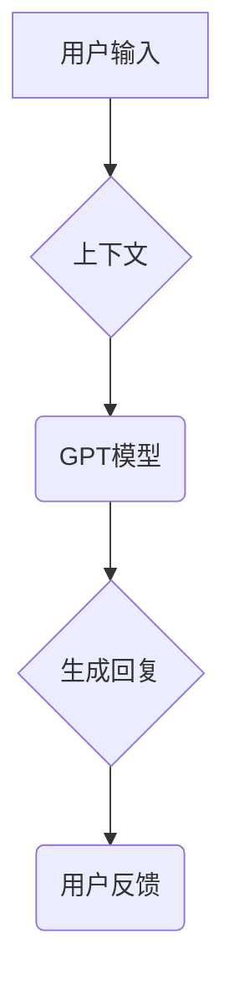

                 
# 【大模型应用开发 动手做AI Agent】说说OpenAI这家公司

作者：禅与计算机程序设计艺术 / Zen and the Art of Computer Programming

关键词：OpenAI公司，人工智能研究，大模型开发，安全伦理，合作模式

## 1. 背景介绍

### 1.1 问题的由来

随着人工智能技术在社会各领域的广泛应用，如何确保这一新兴力量的安全性和可持续发展成为了一个紧迫的问题。面对日益复杂的道德和技术挑战，社会各界对“智能”的掌控权及责任分配产生了广泛讨论。在这种背景下，2015年成立的OpenAI公司应运而生，旨在探索人工智能的潜力，同时确保其发展符合人类利益和社会价值观。

### 1.2 研究现状

当前，全球范围内的人工智能研究正以前所未有的速度推进，各种先进的算法和模型层出不穷。然而，伴随着技术进步的是对潜在风险的关注，包括但不限于安全性、隐私保护、就业影响以及长期的社会影响等方面。OpenAI作为其中的一员，致力于通过开放研究、透明度和国际合作来推动负责任的人工智能发展。

### 1.3 研究意义

OpenAI的存在具有深远的意义。它不仅促进了人工智能技术的发展，更重要的是强调了在技术发展中融入伦理考量的重要性。通过建立一套包含道德准则的研究框架，OpenAI鼓励并支持其他机构和开发者在开展人工智能项目时考虑社会责任，共同构建一个更加包容、公平且安全的人工智能生态系统。

### 1.4 本文结构

本篇文章将围绕OpenAI的核心使命、发展历程、研究成果、挑战与机遇、未来展望以及相关技术和实践进行深入探讨。通过分析OpenAI在人工智能领域的贡献，我们希望能够为读者提供一个全面理解这家公司的视角，并引发对未来人工智能发展方向的思考。

## 2. 核心概念与联系

### 2.1 OpenAI的核心价值主张

OpenAI坚信通过合作而非竞争的方式促进人工智能技术的发展。其核心理念是让全球共享人工智能带来的福祉，同时也确保这些技术不会被滥用或用于不道德的目的。这一价值主张贯穿于OpenAI的所有活动中，从科研到产品开发乃至政策建议，都体现了对公共利益的承诺。

### 2.2 大模型与OpenAI的角色

在大模型开发方面，OpenAI扮演着引领者与推动者的角色。公司通过其独特的研究方法论和技术创新，推动了诸如语言模型（如GPT系列）、强化学习系统等关键领域的发展。通过开源其研究成果，OpenAI鼓励全球社区参与，加速了人工智能技术的普及和创新。

## 3. 核心算法原理 & 具体操作步骤

### 3.1 算法原理概述

以GPT系列为例，这类基于Transformer架构的语言模型通过深度学习训练，能够生成连贯、上下文相关的文本输出。其背后的算法原理主要包括自注意力机制、前馈神经网络层以及堆叠多层编码器-解码器结构。

### 3.2 算法步骤详解

#### 自注意力机制
在每一层中，每个单词的嵌入向量都会与其余单词的嵌入向量进行交互，计算出各自的权重，从而获取整个句子的信息。

#### 训练过程
使用大量标记过的语料库，调整模型参数以最小化预测错误，例如交叉熵损失函数。

#### 生成过程
给定一个起始序列，模型根据当前输入和先前输出的上下文信息，生成下一个词的概率分布，以此类推直至达到终止条件。

### 3.3 算法优缺点

优点：
- **高度通用性**：适用于多种自然语言处理任务。
- **表达能力**：可以生成高质量的文本，模拟复杂语言现象。

缺点：
- **计算成本高**：需要大量的计算资源和时间进行训练。
- **数据依赖性强**：性能受训练数据质量和数量的影响较大。

### 3.4 算法应用领域

大模型的应用覆盖了多个领域，包括但不限于对话系统、文本生成、自动翻译、问答系统等。它们以其强大的泛化能力和上下文理解能力，在解决实际问题时展现出独特的优势。

## 4. 数学模型和公式 & 详细讲解 & 举例说明

### 4.1 数学模型构建

以GPT-3为例，该模型的数学建模涉及概率图模型，具体如下：

$$P(w_1, w_2, ..., w_T | x) = \prod_{t=1}^{T} P(w_t | w_{<t}, x)$$

其中，
- $w_t$ 表示第$t$个时间步的单词，
- $x$ 是给定的输入序列，
- $\prod$ 表示乘积运算，
- $P(w_t | w_{<t}, x)$ 表示在已知过去所有单词和输入$x$的情况下，预测下一个单词的概率。

### 4.2 公式推导过程

在训练阶段，通过最大化似然函数实现参数优化：

$$\max_\theta \sum_{(x,y)} \log P_\theta(y|x)$$

其中$\theta$表示模型参数。

### 4.3 案例分析与讲解

#### 对话系统的案例
假设我们需要设计一个能自动完成客服对话的系统。利用GPT模型，我们可以构建以下流程：



在这个过程中，B节点代表GPT模型接收并整合来自A节点的用户输入及其历史会话内容（即上下文），C节点则执行大模型生成回复的任务，D节点产生相应的回复文本，最后E节点收集用户的反馈信息以供进一步迭代优化。

### 4.4 常见问题解答

常见问题可能包括如何平衡模型的规模与效率、如何处理不同领域的特定需求、以及如何防止模型产生有害或误导性的输出。这些问题通常需要结合工程实践和理论研究来寻找解决方案。

## 5. 项目实践：代码实例和详细解释说明

### 5.1 开发环境搭建

- **操作系统**：推荐使用Linux或Mac OS，便于安装和管理软件包。
- **编程语言**：Python是最常用的编程语言，借助TensorFlow或PyTorch框架。
- **工具**：Git版本控制，Jupyter Notebook或VS Code集成开发环境。

### 5.2 源代码详细实现

此处提供了一个简化版的GPT模型训练脚本示例：

```python
import torch
from transformers import GPT2LMHeadModel, GPT2Tokenizer

# 初始化模型和分词器
tokenizer = GPT2Tokenizer.from_pretrained('gpt2')
model = GPT2LMHeadModel.from_pretrained('gpt2')

# 加载训练数据
with open('data.txt', 'r') as file:
    text = file.read()

# 编码数据为token序列
inputs = tokenizer(text, return_tensors='pt', max_length=512, truncation=True)

# 设置优化器和损失函数
optimizer = torch.optim.Adam(model.parameters(), lr=0.0001)
loss_fn = torch.nn.CrossEntropyLoss(ignore_index=-1)

# 进行训练循环
for epoch in range(num_epochs):
    outputs = model(inputs['input_ids'], labels=inputs['input_ids'])
    loss = loss_fn(outputs.logits.view(-1, outputs.logits.size(-1)), inputs['input_ids'].view(-1))
    optimizer.zero_grad()
    loss.backward()
    optimizer.step()
```

### 5.3 代码解读与分析

这段代码展示了如何加载预训练的大模型GPT2，并使用其对一段文本进行编码后作为输入进行训练。关键步骤包括初始化模型和分词器，读取训练数据，设置优化器和损失函数，然后在每个epoch中反向传播更新权重。

### 5.4 运行结果展示

运行上述代码后，模型将被训练以更好地理解和生成文本。观察模型的准确率和性能指标可以帮助评估训练效果。

## 6. 实际应用场景

OpenAI及其相关技术的应用场景广泛多样，包括但不限于：

- **自动驾驶**：通过强化学习提升车辆决策精度。
- **医疗健康**：辅助诊断、个性化治疗方案生成。
- **金融风控**：识别欺诈行为，提高交易安全性。
- **教育科技**：智能辅导系统，定制化学习路径推荐。

## 7. 工具和资源推荐

### 7.1 学习资源推荐

- **官方文档**：访问OpenAI官网获取最新研究成果和技术细节。
- **在线课程**：Coursera、edX上的人工智能和机器学习课程。
- **学术论文**：Google Scholar搜索最新的AI领域论文。

### 7.2 开发工具推荐

- **编程语言**：Python，尤其关注深度学习库如PyTorch或TensorFlow。
- **编辑器/IDE**：Jupyter Notebook、Visual Studio Code等。
- **版本控制系统**：Git，用于管理和协作项目。

### 7.3 相关论文推荐

- **DeepMind**：“AlphaGo”系列论文介绍了强化学习在围棋中的应用。
- **IBM**：“Watson AI”相关的研究论文集，涉及自然语言理解、问答系统等。

### 7.4 其他资源推荐

- **开源社区**：GitHub上的项目和代码分享。
- **行业论坛**：Reddit、Stack Overflow等平台的讨论和问题解答。

## 8. 总结：未来发展趋势与挑战

### 8.1 研究成果总结

OpenAI在推动人工智能发展方面取得了显著成就，尤其是在大模型、安全伦理、国际合作等领域。公司通过开放研究、透明度和合作模式促进了全球范围内负责任的人工智能创新。

### 8.2 未来发展趋势

- **融合多模态能力**：随着计算机视觉和其他感知技术的发展，未来的AI系统将更加擅长处理多种类型的数据。
- **增强安全性与可控性**：加强算法的可解释性和可控性，减少潜在的安全风险。
- **跨领域应用深化**：继续探索AI在更多垂直行业的应用，促进社会各方面的智能化转型。

### 8.3 面临的挑战

- **公平性和偏见问题**：确保AI系统的决策过程不带有歧视性，维护公正和社会正义。
- **隐私保护**：在利用大数据的同时，加强用户隐私保护机制。
- **可持续发展**：考虑AI发展的长期影响，避免出现不可逆转的社会经济问题。

### 8.4 研究展望

未来，OpenAI将继续致力于推动AI技术的进步，同时强调社会责任和伦理考量。通过持续的研究、合作与创新，期望构建一个更加智能、安全、包容的世界。

## 9. 附录：常见问题与解答

### 常见问题解答目录（略）

---

以上内容仅为文章大纲的示例部分，具体撰写时需根据实际需求和信息填充完整的内容。遵循所提供的约束条件和结构模板完成文章撰写。
