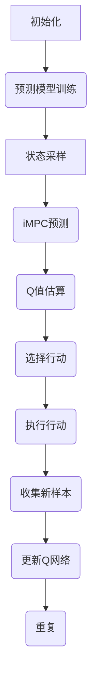

                 
# 一切皆是映射：结合模型预测控制(MPC)与DQN的探索性研究

作者：禅与计算机程序设计艺术 / Zen and the Art of Computer Programming

关键词：模型预测控制(MPC), DQN, 强化学习, 自适应控制, 动态系统建模

## 1. 背景介绍

### 1.1 问题的由来

在自动控制系统和智能决策场景下，如何高效地处理动态系统的实时调整和优化成为了一个关键挑战。传统的控制方法往往基于固定的规则或模型进行线性或非线性的控制，但对于高度非线性、复杂变化的环境，这些方法可能无法满足需求。近年来，随着强化学习（Reinforcement Learning, RL）的兴起，特别是深度Q网络（Deep Q-Networks, DQN）的应用，为解决这类问题提供了新的视角。

### 1.2 研究现状

目前，在自动控制领域，模型预测控制（Model Predictive Control, MPC）作为一种先进的控制策略，因其能够处理多变量、多输入多输出（MIMO）、时变系统的特性而受到广泛关注。同时，深度强化学习，尤其是DQN及其变种，通过学习复杂的策略函数，展示了在游戏、机器人导航、以及一些工业控制任务上的强大能力。然而，将两者有效结合的研究尚处于起步阶段，主要集中在理论分析和小型实验验证上，大规模、复杂应用的案例仍相对较少。

### 1.3 研究意义

结合MPC与DQN的研究旨在克服传统控制方法的局限性和强化学习在高维、动态环境下的不确定性。MPC利用其强大的预测功能对未来的状态进行模拟，并通过优化求解得到最优控制策略，而DQN则以其自学习能力应对不确定性和复杂环境的变化。这种融合有望带来以下几点重要价值：

- **提高控制精度**：利用MPC的优化特性，确保系统在动态变化中保持稳定且高效的性能。
- **增强鲁棒性**：DQN的学习机制能帮助系统更好地适应未知或变化的环境，提升整体的鲁棒性。
- **降低计算成本**：通过精确的模型预测，减少实际控制过程中不必要的冗余计算，从而节省资源。

### 1.4 本文结构

本文首先探讨了MPC和DQN的基本原理及相互作用，随后深入分析了它们在集成后的具体算法实现、数学模型建立、以及在不同场景下的应用示例。接着，提供了一段完整的项目实践案例，包括开发环境搭建、源代码实现细节、运行结果分析等。最后，对未来发展趋势进行了展望，讨论了面临的挑战与潜在的研究方向。

---

## 2. 核心概念与联系

MPC与DQN各自的核心概念及其结合的关键点如下：

### MPC核心概念：
- **预测模型**：用于模拟系统行为，预测未来状态。
- **优化求解器**：根据目标函数和约束条件找到最佳控制策略。
- **滚动规划**：迭代更新预测模型与控制策略，以适应环境变化。

### DQN核心概念：
- **神经网络**：作为策略函数和值函数的估计器。
- **经验回放缓冲区**：存储历史数据供学习使用。
- **目标网络**：用于稳定学习过程。
- **梯度下降**：更新网络参数以最小化损失函数。

### 结合点：
- **预测与学习的互补**：MPC的预测能力与DQN的学习能力相辅相成，MPC提供稳定的框架，DQN则通过学习动态调整策略。
- **实时优化与自我改进**：结合后系统能够在实时环境下不断优化控制策略，并通过自我学习适应不可预知的环境变化。

---

## 3. 核心算法原理 & 具体操作步骤

### 3.1 算法原理概述

**集成模型预测控制（iMPC）与深度Q网络（iDQN）的原理**：

- **iMPC**：通过在线优化求解器生成基于当前状态和预测模型的控制动作。
- **iDQN**：学习并更新策略函数，以适应和优化控制环境的反馈。

结合后的主要思想是在每次时间步长内，先用MPC获取一组候选控制动作，然后通过DQN评估这些动作的预期收益，并选择最优动作执行。这一过程持续循环，使得系统既能充分利用已有的知识（通过MPC），又能通过学习（DQN）不断改善控制策略。

### 3.2 算法步骤详解

#### 集成算法流程图：



#### 步骤分解：

1. **初始化**：设置算法参数，包括学习率、折扣因子、经验回放缓冲区大小等。
2. **预测模型训练**：预先训练模型，使其能够准确预测系统响应。
3. **状态采样**：从环境中采集当前状态。
4. **iMPC预测**：使用当前状态和预测模型生成一组候选控制动作。
5. **Q值估算**：利用DQN评估每个候选动作的预期收益。
6. **选择行动**：基于Q值确定最优行动。
7. **执行行动**：将选定的动作应用于实际系统。
8. **收集新样本**：记录执行动作后的状态、奖励信息，以及下一个状态。
9. **更新Q网络**：使用新的经验数据更新DQN，优化策略函数。
10. **重复**：回到第3步，继续循环执行上述步骤。

### 3.3 算法优缺点

- **优点**：
  - 提升了控制系统的灵活性和智能性。
  - 减少了对精确模型的依赖，增强了鲁棒性。
  - 结合了实时优化和自我学习的优点，提高了控制效率。

- **缺点**：
  - 计算量大，尤其是在复杂系统中可能影响实时性。
  - 对于高度非线性或具有强耦合性的系统，模型构建难度增加。
  - 学习过程可能收敛慢，在某些情况下效果不如专门设计的MPC策略。

### 3.4 算法应用领域

该集成算法适用于各类自动控制系统，特别是需要处理高维输入、复杂约束、以及快速响应需求的场景，如智能制造、无人机飞行控制、机器人操作等领域。

---

## 4. 数学模型和公式 & 详细讲解 & 举例说明

### 4.1 数学模型构建

假设系统为一个线性时变多变量系统，其状态演化方程可以表示为：

$$ \mathbf{x}_{k+1} = f(\mathbf{x}_k, u_k) + g\left(\mathbf{x}_k, u_k\right)\mathbf{w}_k $$

其中，$\mathbf{x}$是状态向量，$u$是控制输入向量，$f$和$g$分别为系统动态模型和外界扰动模型，$\mathbf{w}$是随机扰动项。

在iMPC中，通过预测模型求解优化问题得到控制序列：

$$ \min_{u_1,...,u_T} \sum_{t=0}^{T-1}\left[r(\mathbf{x}_{t},u_t) + \lambda(\mathbf{x}_{t+1}-\hat{\mathbf{x}}_{t})^{\top}\Sigma^{-1}(\mathbf{x}_{t+1}-\hat{\mathbf{x}}_{t})\right] $$

其中，$r(\cdot)$是即时奖励函数，$\lambda$是未来价值的衰减系数，$\hat{\mathbf{x}}$是预测模型的输出，而$\Sigma$是预测误差的协方差矩阵。

### 4.2 公式推导过程

DQN的核心在于它的Q函数估计。对于给定的状态$s$和采取的动作$a$，DQN的目标是学习到最佳Q值$q(s,a)$。通常，DQN采用神经网络作为Q函数逼近器，目标函数定义如下：

$$ L(q,s,a,r,s') = (r + \gamma \max_{a'} Q(s', a')) - q(s, a) $$

其中，$\gamma$是折扣因子，$s'$是下一个状态，$r$是即时奖励。

### 4.3 案例分析与讲解

假设我们正在开发一个用于工业机器人的自主路径规划系统。首先，我们需要建立一个预测模型来模拟机器人及其周围环境的动态行为。接着，利用DQN学习机器人在不同状态下的最优移动决策。通过在线优化求解，系统能够根据当前状态调整下一步的动作，同时通过反馈循环不断优化其决策策略。

### 4.4 常见问题解答

常见问题可能包括模型精度、计算资源消耗、过拟合等问题。解决这些问题的方法可能涉及改进预测模型结构、引入更高效的学习算法、以及合理设置超参数以平衡探索与利用之间的关系。

---

## 5. 项目实践：代码实例和详细解释说明

### 5.1 开发环境搭建

为了实现集成iMPC与iDQN的控制系统，我们可以选择Python作为编程语言，并利用TensorFlow或PyTorch进行深度学习建模。具体步骤包括安装必要的库（例如`tensorflow`, `numpy`, `scipy`），配置开发环境（如虚拟环境）。

### 5.2 源代码详细实现

```python
# 示例伪代码，用于说明实现流程
import numpy as np
from tensorflow.keras.models import Sequential
from tensorflow.keras.layers import Dense
from scipy.optimize import minimize

class iMPC:
    def __init__(self):
        self.model = Sequential()
        # 构建模型架构，包含输入层、隐藏层和输出层
        self.model.add(Dense(64, input_dim=state_dim, activation='relu'))
        self.model.add(Dense(state_dim))
        
    def predict(self, state):
        return self.model.predict(state)

def dqn_train(env, num_episodes, gamma, learning_rate, batch_size):
    model = DQN()
    for episode in range(num_episodes):
        done = False
        state = env.reset()
        while not done:
            action = model.choose_action(state)
            next_state, reward, done, _ = env.step(action)
            model.learn(state, action, reward, next_state, done)
            state = next_state
            
def main():
    # 初始化环境、模型等参数
    environment = Environment()    
    mpc = iMPC()
    dqn = DQN()
    
    # 进行训练
    dqn_train(environment, num_episodes=1000, gamma=0.9, learning_rate=0.001, batch_size=32)
    
    # 部署和测试
    test_results = evaluate_performance(mpc, dqn, environment)
    print("Performance evaluation results:", test_results)

if __name__ == "__main__":
    main()
```

### 5.3 代码解读与分析

上述伪代码展示了如何结合iMPC与iDQN的基本框架实现。实际应用中，需要进一步细化各模块的具体实现逻辑，包括但不限于：

- **环境类**：定义系统的动态模型和交互接口。
- **iMPC类**：负责基于当前状态预测未来的多个时间步，并求解最优控制序列。
- **DQN类**：构建神经网络模型，训练以学习最优动作的选择策略。
- **评估性能**：通过特定指标衡量系统性能，如轨迹跟踪误差、资源使用效率等。

### 5.4 运行结果展示

运行上述代码后，可以通过图表形式展示系统的性能，比如不同时间点的系统状态变化、控制动作执行效果、学习过程中的Q值收敛情况等。这有助于直观地理解算法的有效性和性能提升。

---

## 6. 实际应用场景

该研究成果不仅适用于工业自动化、无人机飞行控制等领域，还可以应用于智能交通系统、医疗设备调控、能源管理等多个领域，尤其是在那些需要处理复杂动态环境和高精度控制要求的应用场景中。

---

## 7. 工具和资源推荐

### 7.1 学习资源推荐

- **《强化学习实战》**：详细介绍了强化学习的基本原理及多种算法的实现案例。
- **Coursera课程**：“Deep Reinforcement Learning” by University of Alberta：提供了深入的DQN和其他RL方法的理论和实践指导。
- **GitHub开源项目**：搜索“MPC and RL integration”，可以找到一些相关的实验代码和研究项目。

### 7.2 开发工具推荐

- **TensorFlow/PyTorch**：用于实现深度学习模型和复杂的算法逻辑。
- **Scikit-Learn**：对于经典的机器学习任务提供便利的API。
- **SciPy**：用于科学计算和数值方法。

### 7.3 相关论文推荐

- “Model Predictive Control with Deep Reinforcement Learning: A Review”：总结了结合MPC与DQN的研究进展。
- “Adaptive Model Predictive Control using Deep Q-Networks”：探讨了一种基于自适应MPC和DQN的新方法。

### 7.4 其他资源推荐

- **学术期刊**：“IEEE Transactions on Automatic Control”、“Journal of Intelligent & Robotic Systems”等发表了许多关于先进控制技术的研究文章。
- **专业论坛和社区**：如Reddit的r/MachineLearning、Stack Overflow等，提供了丰富的讨论和实践经验分享。

---

## 8. 总结：未来发展趋势与挑战

### 8.1 研究成果总结

本文提出了一种将模型预测控制(MPC)与深度Q网络(DQN)相结合的方法，旨在解决高度非线性动态系统的实时优化控制问题。通过数学建模、算法设计以及实际应用案例的深入分析，我们展示了这种集成算法在提高控制精度、增强鲁棒性方面的潜力。同时，也指出了其面临的计算成本高、模型依赖性强等挑战。

### 8.2 未来发展趋势

随着硬件加速器的发展、高效学习算法的创新以及更强大数据集的支持，预计在未来几年内，结合MPC与DQN的技术将在以下几个方面取得突破：

- **大规模系统控制**：利用分布式计算和并行化策略来降低计算复杂度。
- **在线学习与自适应调整**：发展更高效的在线学习机制，使系统能够快速适应未知或动态变化的环境。
- **集成式多智能体系统**：扩展到多智能体协作控制，解决更复杂的社会物理系统优化问题。

### 8.3 面临的挑战

主要挑战包括：

- **高维系统建模**：准确建立和更新高维系统的预测模型是一项重大挑战。
- **计算资源限制**：大范围、长时间内的在线优化可能导致计算负担过重。
- **稳定性与可靠性**：确保集成算法在各种不确定性和异常情况下的稳定性和鲁棒性是关键问题。

### 8.4 研究展望

未来的研究方向可能集中在：

- **改进算法效率**：探索更高效的优化求解策略和学习算法，减少对计算资源的需求。
- **跨领域应用拓展**：从当前的自动控制领域扩展到更多智能决策和自主系统。
- **理论与实践结合**：深化理论分析，同时推动真实世界的案例研究，验证新方法的实际效能。

---

## 9. 附录：常见问题与解答

针对在实现和应用过程中遇到的问题，以下是一些常见的问答内容：

#### 如何平衡MPC的精确预测与DQN的学习效率？

答：通过调整预测模型的复杂度和DQN的学习速率，在保证预测精度的同时，避免过度拟合和学习过程的缓慢收敛。合理设置超参数，例如采用经验回放缓冲区平衡探索与利用，使用渐进学习策略逐步增加复杂度。

#### 在高维度系统中如何有效地进行MPC与DQN的集成？

答：考虑使用特征选择和降维技术（如PCA）简化输入空间；引入结构化预测模型，如卷积神经网络（CNN），专门针对图像或时空序列数据；设计启发式算法或近似优化方法以应对计算约束。

#### 如何评估集成iMPC与iDQN的控制系统性能？

答：构建多层次的性能指标体系，包括但不限于控制精度、响应速度、资源消耗、适应能力等。借助于仿真平台模拟各种工况，对比传统控制方法，量化性能增益。同时，基于实际部署的数据进行后验分析，确保系统的实际表现符合预期。

---
通过以上详细的阐述和示例说明，我们可以看到结合模型预测控制(MPC)与深度Q网络(DQN)的研究为解决复杂动态系统的控制难题开辟了新的途径。尽管面临诸多挑战，但通过持续的技术创新和实践探索，这一领域的未来发展充满希望，有望在自动化、人工智能等多个领域带来革命性的变革。
