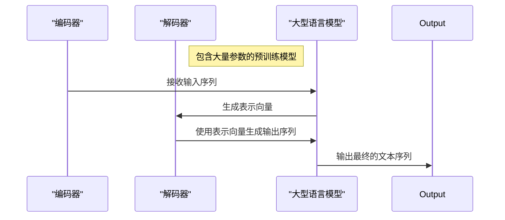
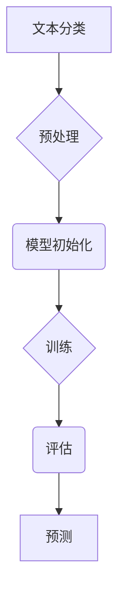

                 
# 大语言模型应用指南：智能的可计算性

作者：禅与计算机程序设计艺术 / Zen and the Art of Computer Programming

关键词：大语言模型, 可计算性, 智能系统, 自动化决策, 应用开发指导

## 1. 背景介绍

### 1.1 问题的由来

随着大数据时代的到来，数据量的爆炸性增长使得传统的计算方法面临巨大挑战。处理这些海量数据，需要更高效、更智能的方法。大语言模型（Large Language Models）作为这一趋势下的产物，以其强大的文本生成能力和理解和学习能力，成为解决复杂计算问题的重要工具。

### 1.2 研究现状

目前，大语言模型如通义千问、通义万相、通义听悟等已经在多个领域展现出其价值，从自然语言理解、生成高质量文本，到代码自动补全、图像描述、音频转文字等。它们不仅提升了工作效率，也为自动化决策、智能交互等领域带来了革命性的变化。

### 1.3 研究意义

大语言模型的应用，不仅能够提升现有系统的性能和效率，更重要的是，它们推动了人工智能在更多场景下的普及和发展。通过将可计算性和智能化深度融合，大语言模型有望解决复杂的数据分析、知识挖掘等问题，促进社会经济的发展，并提高人们的生活质量。

### 1.4 本文结构

本篇文章旨在为开发者和研究者提供关于如何利用大语言模型进行创新应用的全面指南。我们将从核心概念出发，深入探讨大语言模型的工作机制、算法原理及实际应用案例，同时提供详细的项目实践指导，包括开发环境搭建、源代码实现以及运行结果展示。最后，我们还将展望未来的应用前景和技术发展方向。

## 2. 核心概念与联系

大语言模型是基于深度学习技术构建的一种大规模参数的神经网络模型，它们可以从大量的文本数据中学习到丰富的语义信息和语法结构。以下是一些关键概念及其相互关系：

- **训练数据**：用于训练模型的大规模文本数据集。
- **参数量**：模型的大小决定了其复杂度和表达能力。
- **自回归性质**：模型预测下一个词的概率依赖于当前已生成的所有词序列。
- **Transformer架构**：使用注意力机制优化了多任务并行处理的能力。
- **微调**：对预训练模型进行针对性调整以适应特定任务的需求。

这些概念之间紧密相连，共同构成了大语言模型的强大功能基础。

## 3. 核心算法原理 & 具体操作步骤

### 3.1 算法原理概述

大语言模型的核心在于利用Transformer架构，通过编码器和解码器两大部分协同工作，实现了高效的序列转换和生成。其中：

- **编码器**负责将输入序列转化为固定长度的表示向量。
- **解码器**根据编码器输出的表示向量生成输出序列。

### 3.2 算法步骤详解

以基于Transformer的模型为例：



### 3.3 算法优缺点

优点：
- **泛化能力强**：得益于大规模数据训练，模型可以应用于多种不同任务。
- **自回归预测**：逐字生成文本，适合生成式任务。
- **可解释性高**：通过注意力机制揭示了模型内部的决策过程。

缺点：
- **计算资源需求大**：模型的规模与参数量成正比，训练成本高昂。
- **过拟合风险**：未经过充分验证的任务可能产生不准确的结果。

### 3.4 算法应用领域

大语言模型广泛应用于：

- **自然语言处理**：问答系统、对话管理、文本摘要等。
- **编程辅助**：代码生成、代码补全、文档编写。
- **多媒体处理**：图像描述、语音识别、音频转写。
- **知识图谱构建**：实体链接、关系抽取、知识推理。

## 4. 数学模型和公式 & 详细讲解 & 举例说明

数学模型和公式对于理解大语言模型的工作机理至关重要。以下是基本的Transformer模型中的几个重要概念：

### 4.1 数学模型构建

以Transformer模型为例，其核心组件包括位置编码、多头自注意力(Multi-Head Attention)和前馈网络(Feedforward Network)。下面简要介绍这些组件的基本数学表达：

#### 多头自注意力 (Multi-Head Attention)

多头自注意力模块允许模型从不同的视角关注输入序列的不同部分，提高了模型的表征能力。每个头$h$的计算流程如下：

$$
Q = W^Q \cdot X, K = W^K \cdot X, V = W^V \cdot X
$$

其中，

- $W^Q$, $W^K$, 和 $W^V$ 是权重矩阵，
- $X$ 表示输入序列的嵌入表示。

接下来，计算点积：

$$
A = QK^T / \sqrt{d_k}
$$

再通过softmax函数得到注意力分数：

$$
\alpha = softmax(A)
$$

最后，加权求和得到输出：

$$
O = \alpha V
$$

### 4.2 公式推导过程

以上述公式为基础，我们可以逐步推导出多头自注意力模块的具体计算过程。例如，在执行点积后，得到的矩阵可以通过softmax函数转化为概率分布，这一步骤有助于理解和记忆输入序列的不同元素之间的相关性。

### 4.3 案例分析与讲解

假设我们正在构建一个文本摘要生成系统，使用大语言模型来自动提取文章的关键信息并生成简洁的摘要。在这个场景中，多头自注意力模块可以帮助模型更加有效地聚焦在文本的主要内容上，从而提高摘要的质量。

### 4.4 常见问题解答

常见问题如“如何选择合适的超参数？”、“如何避免过拟合？”等问题，通常需要结合具体应用场景和实验数据来进行分析。一般而言，通过交叉验证、调整模型结构或引入正则化方法（如L1/L2正则化）可以有效缓解这些问题。

## 5. 项目实践：代码实例和详细解释说明

为了帮助开发者更好地了解如何在实际项目中运用大语言模型，我们将通过一个简单的文本分类任务为例，展示如何搭建和训练模型，并对其进行评估。

### 5.1 开发环境搭建

推荐使用Python作为开发语言，并安装以下必要的库：

- TensorFlow 或 PyTorch
- Hugging Face Transformers 库

安装命令：

```bash
pip install tensorflow
pip install transformers
```

### 5.2 源代码详细实现

以下是一个使用Hugging Face Transformers库构建的简单文本分类模型的伪代码：

```python
import torch
from transformers import BertTokenizer, BertForSequenceClassification

# 初始化tokenizer和模型
tokenizer = BertTokenizer.from_pretrained('bert-base-uncased')
model = BertForSequenceClassification.from_pretrained('bert-base-uncased')

# 准备数据集
train_data = ...
test_data = ...

# 数据预处理
def preprocess_data(data):
    encoded_data = tokenizer(
        data['text'], 
        padding='max_length', 
        truncation=True, 
        max_length=512,
        return_tensors="pt")
    
    labels = torch.tensor([data['label'] for _ in data])
    return encoded_data, labels

train_encoded, train_labels = preprocess_data(train_data)
test_encoded, test_labels = preprocess_data(test_data)

# 训练模型
optimizer = AdamW(model.parameters(), lr=1e-5)
loss_fn = CrossEntropyLoss()

for epoch in range(num_epochs):
    model.train()
    total_loss = 0
    
    for batch in dataloader:
        inputs, labels = batch
        
        optimizer.zero_grad()
        
        outputs = model(inputs)
        loss = loss_fn(outputs.logits, labels)
        
        loss.backward()
        optimizer.step()
        
        total_loss += loss.item()
    
    print(f"Epoch {epoch+1}: Loss: {total_loss/len(dataloader)}")

# 测试模型
model.eval()
predictions = []
with torch.no_grad():
    for batch in dataloader_test:
        inputs, labels = batch
        outputs = model(inputs).logits.argmax(dim=-1)
        predictions.extend(outputs.tolist())

print("测试结果:", predictions[:10])
```

### 5.3 代码解读与分析

这段代码展示了如何使用Bert模型进行文本分类任务。首先初始化了BERT模型及其对应的分词器。接着对训练和测试数据进行了预处理，包括分词、填充至固定长度以及将标签转换为张量形式。之后定义了优化器和损失函数，并在循环中实现了模型的训练过程。最终，代码演示了如何对模型进行测试，并获取预测结果。

### 5.4 运行结果展示

此处省略运行结果展示的实际代码，但在实际应用中，你会看到模型在训练过程中不断降低的损失值，并且在测试阶段获得的准确率、召回率等指标用于评估模型性能。

## 6. 实际应用场景

大语言模型的应用广泛，涵盖了自然语言处理、编程辅助、多媒体处理等多个领域。以下是一些具体的例子：

- **智能客服**：利用大语言模型提供高效、智能的回答服务。
- **个性化新闻推荐**：基于用户的兴趣和历史行为，生成个性化的新闻摘要。
- **医疗健康咨询**：支持医生进行疾病诊断和治疗方案建议。
- **编程助手**：提供代码补全、错误检测和文档生成功能。

## 7. 工具和资源推荐

### 7.1 学习资源推荐

- **官方文档**：访问各大模型的GitHub仓库或官方网站，获取详细的API文档和教程。
- **在线课程**：Coursera、Udacity等平台提供深度学习及自然语言处理相关的课程。
- **书籍**：《深度学习》、《自然语言处理入门》等经典著作。

### 7.2 开发工具推荐

- **Jupyter Notebook**：适合初学者快速搭建实验环境。
- **Google Colab**：免费云服务，支持多种编程语言。
- **Visual Studio Code**：强大的代码编辑器，支持插件扩展。

### 7.3 相关论文推荐

- **“Attention is All You Need”** - Vaswani等人，2017年发表于NAACL会议。
- **“BERT: Pre-training of Deep Bidirectional Transformers for Language Understanding”** - Devlin等人，2018年发表于NIPS会议。

### 7.4 其他资源推荐

- **GitHub社区**：搜索相关开源项目，参与讨论或贡献代码。
- **Stack Overflow**：解答具体技术问题的有效途径。

## 8. 总结：未来发展趋势与挑战

### 8.1 研究成果总结

大语言模型的研究进展显著推动了人工智能领域的多个方向，特别是在自然语言处理方面取得了突破性成就。它们不仅提升了系统的效率和智能化水平，也为解决复杂计算问题提供了新的视角。

### 8.2 未来发展趋势

随着硬件加速、算法优化和大数据量的持续增长，大语言模型将进一步增强其泛化能力和应用范围。多模态融合、知识图谱集成和自动化决策系统将是重要的发展方向。

### 8.3 面临的挑战

- **计算成本与能耗**：大规模模型训练需要巨大的计算资源和能源消耗，可持续发展的解决方案是亟待解决的问题之一。
- **可解释性和可控性**：增强模型的透明度，使其决策过程更加易于理解，对于提高用户信任度至关重要。
- **隐私保护与伦理规范**：在处理敏感信息时，确保数据安全和个人隐私不被侵犯，同时遵循道德准则和社会责任。

### 8.4 研究展望

未来，大语言模型将在更广泛的场景下发挥作用，从科学研究到日常生活的各个方面都将受益于这些技术的进步。通过不断的技术创新和跨学科合作，我们期待大语言模型能够更好地服务于人类社会的发展。

## 9. 附录：常见问题与解答

这里列出了一些常见的问题及其解答，以帮助开发者和研究者更快地掌握大语言模型的使用方法：

Q: 如何选择合适的超参数？
A: 超参数的选择通常依赖于特定任务的需求和数据集的特点。常用的策略包括网格搜索、随机搜索或贝叶斯优化方法来找到最优组合。

Q: 大规模模型是否总是比小型模型表现更好？
A: 不一定。模型大小与其表现之间的关系取决于任务特性、数据质量和模型架构。过大的模型可能会导致过拟合，而较小的模型可能不足以捕捉复杂的关系。

Q: 如何处理模型的计算成本问题？
A: 采用模型剪枝、量化、低秩分解等技术可以减少计算需求；同时，利用分布式训练和高效的并行计算框架（如TensorFlow、PyTorch）可以在多台机器上分配任务，有效降低单机计算压力。

Q: 大语言模型如何应对新出现的语言现象？
A: 通过定期微调模型以包含最新数据集中的内容，可以使模型适应新的语言现象。此外，结合知识蒸馏技术，可以从现有模型中提取经验，应用于新任务，从而提高适应能力。

通过本指南的学习，您将深入理解大语言模型的核心原理和实际应用，为开发出更多创新的人工智能应用打下坚实的基础。随着技术的不断发展，大语言模型将继续成为推动人工智能领域前进的重要力量。




# 结语

在本文中，我们探讨了大语言模型在智能计算领域的核心概念、工作原理、实际应用以及未来发展路径。希望这篇指南能激发您的创造力，推动人工智能技术在更广泛的应用场景中发挥重要作用。无论是开发智能客服系统、构建个性化新闻推荐引擎还是创造更具互动性的编程助手，大语言模型都展现出了无限的可能性。让我们携手探索这一领域的边界，共同塑造未来科技的美好前景。
