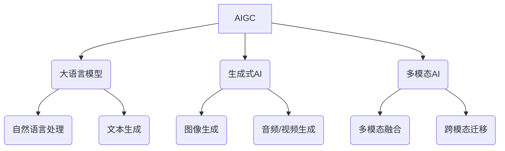

# AIGC(AI Generated Content) - 原理与代码实例讲解

## 1. 背景介绍

### 1.1 问题的由来

随着人工智能技术的快速发展,特别是大语言模型和生成式人工智能的崛起,AI生成内容(AIGC)已经成为一个备受关注的热门话题。AIGC指的是利用人工智能算法自动生成文本、图像、音频、视频等多种形式的内容。这种新型内容生成方式正在改变着人们获取信息和创作内容的传统模式,对多个行业产生了深远影响。

### 1.2 研究现状

目前,AIGC主要应用于以下几个领域:

- 内容创作:AI可以生成高质量的文章、小说、新闻报道、营销文案等文字内容。
- 视觉设计:AI可以生成逼真的图像、插画、3D模型等视觉内容。
- 多媒体内容:AI可以生成音频内容(如音乐、播客)和视频内容(如动画短片)。
- 代码生成:AI可以根据需求自动生成计算机程序代码。

虽然AIGC技术还处于发展的初级阶段,但已经展现出巨大的潜力。越来越多的企业和个人开始尝试使用AIGC来提高工作效率、降低成本、创造新的商业模式。

### 1.3 研究意义

AIGC技术的兴起将深刻影响多个行业,带来诸多机遇和挑战:

- 提高生产效率:AIGC可以快速生成大量内容,大幅提高内容创作效率。
- 降低创作门槛:AIGC降低了内容创作的技术门槛,使普通人也能创作出专业水准的内容。
- 创新商业模式:AIGC为内容创作、设计、娱乐等行业带来了新的商业机遇。
- 版权挑战:AIGC内容的版权归属问题有待解决。
- 伦理道德问题:AIGC可能被滥用于制造虚假信息、色情低俗内容等。

因此,深入研究AIGC的原理和实践具有重要的理论意义和应用价值。

### 1.4 本文结构  

本文将全面介绍AIGC的核心概念、算法原理、数学模型、代码实现、应用场景等内容。文章主要分为以下几个部分:

1. 背景介绍
2. 核心概念与联系
3. 核心算法原理与具体操作步骤
4. 数学模型和公式详细讲解与案例分析  
5. 项目实践:代码实例和详细解释说明
6. 实际应用场景
7. 工具和资源推荐
8. 总结:未来发展趋势与挑战
9. 附录:常见问题与解答

## 2. 核心概念与联系

AIGC(AI Generated Content)是一个涵盖面很广的概念,它与以下几个核心概念密切相关:

- **大语言模型(Large Language Model, LLM)**: 大型的基于自然语言的人工智能模型,如GPT、BERT等,擅长进行自然语言理解和生成任务。大语言模型是AIGC文本生成的核心技术基础。

- **生成式AI(Generative AI)**: 能够基于输入生成新的、原创性的内容输出的人工智能技术,包括生成图像、音频、视频等多种形式的内容。生成式AI是AIGC的关键驱动力。

- **多模态AI(Multimodal AI)**: 能够同时处理多种模态(如文本、图像、语音等)输入输出的人工智能技术,实现不同模态之间的融合和转换。多模态AI赋予了AIGC更强的表现力。

上述三个概念相互关联、相辅相成,共同推动了AIGC技术的发展。大语言模型为文本生成奠定了基础;生成式AI使AIGC能够创造更丰富的内容形式;多模态AI则将不同模态的内容联系在一起,实现跨模态的内容理解与生成。

## 3. 核心算法原理与具体操作步骤

### 3.1 算法原理概述

AIGC的核心算法主要基于以下几种技术:

1. **自然语言处理(Natural Language Processing, NLP)**: 用于理解和生成自然语言文本。
2. **生成对抗网络(Generative Adversarial Networks, GANs)**: 用于生成逼真的图像、视频等视觉内容。
3. **变分自动编码器(Variational Autoencoders, VAEs)**: 用于生成图像、音频等连续数据。
4. **transformer模型**: 基于自注意力机制的序列到序列模型,广泛应用于大语言模型、机器翻译等任务。
5. **多任务学习(Multi-Task Learning)**: 在同一个模型中同时学习多个任务,提高泛化能力。
6. **迁移学习(Transfer Learning)**: 将在一个领域学习到的知识迁移到另一个领域,提高学习效率。
7. **元学习(Meta Learning)**: 学习如何更好地学习新任务,提高模型的适应性。

这些算法原理相互交织、环环相扣,共同构建了AIGC的技术基础。

### 3.2 算法步骤详解

以基于transformer的大语言模型GPT为例,它的核心算法步骤如下:

1. **数据预处理**: 将大量文本语料进行标记化、词条化等预处理,构建训练数据集。

2. **模型构建**: 基于transformer的encoder-decoder结构构建序列到序列模型,使用多头注意力机制捕捉输入序列中的长程依赖关系。

3. **预训练**: 在海量无标注文本语料上进行自监督预训练,让模型捕捉自然语言的语义和语法规则。常用的预训练目标包括遮蔽语言模型(Masked LM)和下一句预测(Next Sentence Prediction)等。

4. **微调(Fine-tuning)**: 将预训练好的大语言模型在特定的下游任务(如文本生成、问答等)数据集上进行进一步微调,使模型适应特定任务。

5. **生成(Generation)**: 对于文本生成任务,给定一个起始文本(或prompt),基于学习到的语言模型概率分布,通过解码器自回归地生成新的文本序列。

6. **评估与优化**: 使用各种评估指标(如BLEU、ROUGE等)评估生成文本的质量,并对模型的各种超参数(如学习率、正则化系数等)进行优化,提高生成效果。

上述算法步骤同样适用于基于VAEs和GANs的图像、音频等其他模态内容生成,只是网络结构和损失函数有所不同。此外,对于多模态内容生成任务,还需要引入模态融合和迁移学习等技术。

### 3.3 算法优缺点

AIGC的核心算法具有以下优缺点:

**优点**:

- 生成质量高:基于大量数据训练,能生成逼真、多样、高质量的内容。
- 高效便捷:可以快速、低成本地批量生成各种形式的内容。
- 可控性强:通过调整输入条件,可以控制生成内容的风格、主题等。
- 可扩展性好:算法可以迁移到不同领域,生成各种形式的内容。

**缺点**:

- 缺乏创造力:生成内容仍然是在现有数据的基础上重新组合,缺乏真正的创造力。
- 可解释性差:算法内部的决策过程是一个黑箱,缺乏可解释性。
- 偏差和安全性:存在算法偏差和安全性问题,可能生成有害或不当内容。
- 数据质量依赖:算法的性能很大程度上依赖于训练数据的质量和数量。

### 3.4 算法应用领域

AIGC算法在以下领域有着广泛的应用前景:

- **内容创作**: 生成新闻报道、小说、营销文案、社交媒体内容等文字内容。
- **视觉设计**: 生成图像、插画、3D模型、UI界面等视觉内容。
- **多媒体创作**: 生成音乐、视频、动画等多媒体内容。
- **代码生成**: 根据需求自动生成计算机程序代码。
- **教育&娱乐**: 生成教育资源、游戏内容、虚拟人物等。
- **医疗&科研**: 生成医疗报告、科研论文等专业内容。

总的来说,AIGC算法为内容创作和设计带来了革命性的变化,为各行各业提供了新的工具和机遇。

## 4. 数学模型和公式详细讲解与举例说明

### 4.1 数学模型构建

AIGC的核心算法通常基于概率图模型和深度神经网络模型。以生成文本的GPT大语言模型为例,它的数学模型可以形式化表示为:

给定一个文本序列 $X = (x_1, x_2, ..., x_n)$,我们的目标是最大化该序列的条件概率 $P(X)$:

$$P(X) = \prod_{t=1}^n P(x_t | x_1, ..., x_{t-1})$$

其中,每个条件概率 $P(x_t | x_1, ..., x_{t-1})$ 由一个基于transformer的自回归语言模型 $f_\theta$ 来计算:

$$P(x_t | x_1, ..., x_{t-1}) = f_\theta(x_t | x_1, ..., x_{t-1})$$

该模型 $f_\theta$ 包含了自注意力机制、前馈神经网络等模块,其参数 $\theta$ 需要通过大量文本数据的训练来学习得到。

在训练过程中,我们最小化模型在训练语料 $\mathcal{D}$ 上的负对数似然损失:

$$\mathcal{L}(\theta) = -\frac{1}{|\mathcal{D}|} \sum_{X \in \mathcal{D}} \log P_\theta(X)$$

通过梯度下降等优化算法,可以有效地学习模型参数 $\theta$,从而获得能够很好地拟合训练数据的语言模型。

### 4.2 公式推导过程

以变分自动编码器(VAE)为例,我们来推导它在生成图像任务中的核心公式。

VAE的基本思想是将观测数据(如图像)$x$看作是潜在变量$z$通过某个生成过程$p_\theta(x|z)$产生的,其中$\theta$是模型参数。我们的目标是最大化数据$x$的边际对数似然:

$$\log p_\theta(x) = \log \int p_\theta(x,z)dz = \log \int p_\theta(x|z)p(z)dz$$

由于上式中的积分通常是难以直接计算的,我们引入一个近似的后验分布$q_\phi(z|x)$,其中$\phi$是近似后验的参数。根据重参数技巧和重要性采样,可以将$\log p_\theta(x)$重写为:

$$\log p_\theta(x) \geq \mathbb{E}_{q_\phi(z|x)}[\log p_\theta(x|z)] - D_{KL}(q_\phi(z|x)||p(z))$$

其中,$D_{KL}$是KL散度。上式右边的第一项是重构项,第二项是正则化项。

在VAE中,我们最大化该下界,即最小化如下损失函数:

$$\mathcal{L}(\theta,\phi;x) = -\mathbb{E}_{q_\phi(z|x)}[\log p_\theta(x|z)] + D_{KL}(q_\phi(z|x)||p(z))$$

通过随机梯度下降等优化算法,可以同时学习生成模型$p_\theta(x|z)$和近似后验$q_\phi(z|x)$的参数。在生成新图像时,我们先从先验$p(z)$采样潜变量$z$,再通过生成模型$p_\theta(x|z)$生成图像$x$。

### 4.3 案例分析与讲解

我们以一个具体的文本生成案例,来进一步说明GPT大语言模型是如何工作的。

假设我们有一个已经在大量文本语料上预训练好的GPT模型,现在我们想让它生成一篇关于"AIGC技术发展前景"