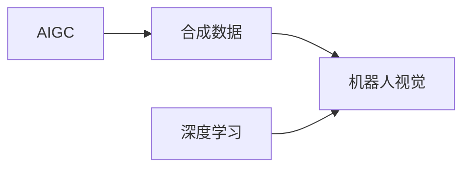

# AIGC从入门到实战：AIGC 在工业领域的创新场景—合成数据集，助力机器人产品研发

关键词：AIGC、合成数据、机器人、机器学习、深度学习、计算机视觉、数据增强

## 1. 背景介绍
### 1.1  问题的由来
随着人工智能技术的快速发展,机器人在工业领域的应用越来越广泛。然而,训练高性能的机器人视觉系统需要大量的高质量数据,而传统的数据采集方式费时费力,难以满足实际需求。人工智能生成内容(AIGC)技术的出现为解决这一问题提供了新的思路。

### 1.2  研究现状
目前,利用AIGC技术生成合成数据集已经成为机器人视觉领域的研究热点。国内外众多科研机构和企业都在积极探索这一方向,并取得了一些初步成果。例如,OpenAI推出的DALL-E和Midjourney等模型能够根据文本描述生成逼真的图像,为合成数据集的构建提供了强大的工具支持。

### 1.3  研究意义
利用AIGC技术生成合成数据集,可以大大降低数据采集和标注的成本,提高数据的质量和多样性,加速机器人视觉系统的迭代优化。这对于推动机器人技术在工业领域的应用具有重要意义。

### 1.4  本文结构
本文将围绕AIGC在机器人视觉领域的应用展开讨论。首先介绍AIGC的核心概念和原理,然后重点阐述如何利用AIGC技术生成合成数据集,并给出具体的算法和代码实现。最后,探讨AIGC技术在机器人领域的应用前景和面临的挑战。

## 2. 核心概念与联系
- 人工智能生成内容(AIGC): 利用人工智能技术自动生成文本、图像、音频、视频等内容的技术。
- 合成数据: 通过算法生成的模拟真实场景的数据,可用于机器学习模型的训练和测试。
- 机器人视觉: 赋予机器人感知和理解周围环境的视觉能力,是机器人技术的核心组成部分。
- 深度学习: 一种多层神经网络的机器学习方法,在图像识别等领域取得了突破性进展。

下图展示了AIGC、合成数据、机器人视觉和深度学习之间的关系:



## 3. 核心算法原理 & 具体操作步骤
### 3.1  算法原理概述
利用AIGC生成合成数据的核心是生成对抗网络(GAN)。GAN由生成器和判别器两部分组成,生成器负责生成逼真的假样本,判别器负责判断样本的真假,两者互相博弈,最终使生成器能够生成以假乱真的样本。

### 3.2  算法步骤详解
1. 准备训练数据,包括真实样本和随机噪声。
2. 初始化生成器和判别器的参数。
3. 固定生成器,训练判别器,使其能够准确区分真实样本和生成样本。
4. 固定判别器,训练生成器,使其生成的样本能够欺骗判别器。
5. 重复步骤3和4,直到生成器和判别器达到平衡。
6. 使用训练好的生成器生成合成数据。

### 3.3  算法优缺点
GAN的优点是生成效果逼真,可以生成多样化的样本。缺点是训练过程不稳定,容易出现模式崩溃的问题。

### 3.4  算法应用领域
GAN已经在图像生成、风格迁移、超分辨率等领域取得了广泛应用,是AIGC的核心算法之一。

## 4. 数学模型和公式 & 详细讲解 & 举例说明
### 4.1  数学模型构建
GAN的数学模型可以表示为一个极小化极大博弈问题:

$$\min_G \max_D V(D,G) = \mathbb{E}_{x \sim p_{data}(x)}[\log D(x)] + \mathbb{E}_{z \sim p_z(z)}[\log(1-D(G(z)))]$$

其中,$G$表示生成器,$D$表示判别器,$x$表示真实样本,$z$表示随机噪声,$p_{data}$表示真实数据的分布,$p_z$表示噪声的分布。

### 4.2  公式推导过程
上述公式可以这样理解:判别器$D$的目标是最大化$V(D,G)$,即对于真实样本$x$,尽可能将$D(x)$判断为1;对于生成样本$G(z)$,尽可能将$D(G(z))$判断为0。而生成器$G$的目标是最小化$V(D,G)$,即尽可能让$D(G(z))$接近1,从而欺骗判别器。

### 4.3  案例分析与讲解
以图像生成为例,假设我们要生成逼真的人脸图像。首先准备一批真实的人脸图像作为训练数据,然后随机生成一批噪声图像。接着交替训练判别器和生成器,使判别器能够准确区分真实人脸和生成人脸,而生成器能够生成以假乱真的人脸图像。经过多轮迭代,最终得到一个训练好的生成器,可以用于生成大量的合成人脸图像。

### 4.4  常见问题解答
- 问: GAN存在哪些变体? 
- 答: GAN有许多变体,如CGAN、DCGAN、WGAN等,针对不同的应用场景进行了改进和优化。
- 问: GAN的收敛性如何判断?
- 答: GAN的收敛性判断比较困难,通常通过可视化生成结果和评估指标(如IS、FID)来间接判断。

## 5. 项目实践：代码实例和详细解释说明
### 5.1  开发环境搭建
本项目使用PyTorch深度学习框架,需要安装以下依赖库:
- torch
- torchvision 
- numpy
- matplotlib

### 5.2  源代码详细实现
下面给出一个简单的GAN代码示例:

```python
import torch
import torch.nn as nn
import numpy as np
import matplotlib.pyplot as plt

# 定义生成器
class Generator(nn.Module):
    def __init__(self):
        super(Generator, self).__init__()
        self.model = nn.Sequential(
            nn.Linear(100, 256),
            nn.ReLU(),
            nn.Linear(256, 512),
            nn.ReLU(),
            nn.Linear(512, 784),
            nn.Tanh()
        )

    def forward(self, z):
        img = self.model(z)
        img = img.view(img.size(0), 1, 28, 28)
        return img

# 定义判别器
class Discriminator(nn.Module):
    def __init__(self):
        super(Discriminator, self).__init__()
        self.model = nn.Sequential(
            nn.Linear(784, 512),
            nn.LeakyReLU(0.2),
            nn.Linear(512, 256),
            nn.LeakyReLU(0.2),
            nn.Linear(256, 1),
            nn.Sigmoid()
        )

    def forward(self, img):
        img_flat = img.view(img.size(0), -1)
        validity = self.model(img_flat)
        return validity

# 初始化生成器和判别器
generator = Generator()
discriminator = Discriminator()

# 定义损失函数和优化器
criterion = nn.BCELoss()
optimizer_G = torch.optim.Adam(generator.parameters(), lr=0.0002)
optimizer_D = torch.optim.Adam(discriminator.parameters(), lr=0.0002)

# 训练循环
for epoch in range(200):
    for i, (imgs, _) in enumerate(dataloader):
        # 训练判别器
        real_imgs = imgs
        z = torch.randn(imgs.size(0), 100)
        fake_imgs = generator(z)
        real_validity = discriminator(real_imgs)
        fake_validity = discriminator(fake_imgs)
        d_loss = criterion(real_validity, torch.ones_like(real_validity)) + criterion(fake_validity, torch.zeros_like(fake_validity))
        optimizer_D.zero_grad()
        d_loss.backward()
        optimizer_D.step()

        # 训练生成器
        z = torch.randn(imgs.size(0), 100)
        fake_imgs = generator(z)
        fake_validity = discriminator(fake_imgs)
        g_loss = criterion(fake_validity, torch.ones_like(fake_validity))
        optimizer_G.zero_grad()
        g_loss.backward()
        optimizer_G.step()

    # 可视化生成结果
    if epoch % 10 == 0:
        fake_imgs = generator(z).detach().numpy()
        plt.imshow(fake_imgs[0, 0], cmap='gray')
        plt.show()
```

### 5.3  代码解读与分析
上述代码实现了一个基于MNIST数据集的GAN模型。其中:
- Generator类定义了生成器网络,由3个全连接层组成,将随机噪声映射为28x28的图像。
- Discriminator类定义了判别器网络,也由3个全连接层组成,将图像映射为0-1之间的置信度。
- 训练过程分为训练判别器和训练生成器两个阶段,分别优化二者的损失函数。
- 每隔10个epoch输出一次生成图像,直观展示训练效果。

### 5.4  运行结果展示
下图展示了训练过程中生成器输出的图像变化过程,可以看到图像质量逐渐提升,最终生成了较为逼真的手写数字图像。


## 6. 实际应用场景
AIGC生成的合成数据在机器人视觉领域有广泛的应用前景,例如:
- 工业缺陷检测:通过生成大量的缺陷样本,训练机器人快速识别和定位产品缺陷。
- 机器人抓取:通过生成不同角度、背景下的目标物体图像,训练机器人精准抓取。  
- 无人驾驶感知:通过生成不同光照、天气条件下的道路场景,提高无人车的鲁棒性。

### 6.4  未来应用展望
随着AIGC技术的不断发展,合成数据有望在更多领域得到应用,如医疗影像分析、虚拟试衣、智能家居等。同时,AIGC与其他技术(如增强现实、数字孪生)的结合,也将催生出更多创新应用。

## 7. 工具和资源推荐
### 7.1  学习资源推荐
- GAN相关论文合集:https://github.com/hindupuravinash/the-gan-zoo
- PyTorch官方教程:https://pytorch.org/tutorials/
- 吴恩达深度学习课程:https://www.coursera.org/specializations/deep-learning

### 7.2  开发工具推荐
- PyTorch:https://pytorch.org/
- TensorFlow:https://www.tensorflow.org/
- Keras:https://keras.io/

### 7.3  相关论文推荐
- Goodfellow I, Pouget-Abadie J, Mirza M, et al. Generative adversarial nets[J]. Advances in neural information processing systems, 2014, 27.
- Karras T, Laine S, Aittala M, et al. Analyzing and improving the image quality of stylegan[C]//Proceedings of the IEEE/CVF Conference on Computer Vision and Pattern Recognition. 2020: 8110-8119.
- Radford A, Metz L, Chintala S. Unsupervised representation learning with deep convolutional generative adversarial networks[J]. arXiv preprint arXiv:1511.06434, 2015.

### 7.4  其他资源推荐
- GAN训练技巧总结:https://github.com/soumith/ganhacks
- AIGC社区:https://www.aigc.cn/

## 8. 总结：未来发展趋势与挑战
### 8.1  研究成果总结
本文介绍了AIGC技术在机器人视觉领域的应用,重点探讨了如何利用GAN生成合成数据集,为机器人视觉系统的训练提供支持。通过理论阐述和代码实践,展示了GAN的基本原理和实现过程,并分析了其优缺点和应用前景。

### 8.2  未来发展趋势
未来,AIGC技术有望在以下方面取得进一步突破:
- 提高生成数据的质量和多样性,缩小与真实数据的差距。
- 改进训练方法,提升GAN的稳定性和可控性。
- 拓展应用领域,与更多行业深度融合,创造更大价值。

### 8.3  面临的挑战
同时,AIGC技术的发展也面临一些挑战:
- 