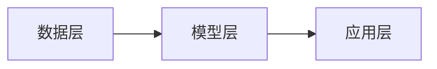

# AIGC从入门到实战：AIGC 的发展历程0

## 1. 背景介绍
### 1.1 问题的由来
AIGC（AI-Generated Content，人工智能生成内容）是近年来人工智能领域的一个热门话题。随着深度学习、自然语言处理、计算机视觉等技术的不断发展和应用，人工智能已经具备了生成各种形式内容的能力，如图像、音乐、视频、文本等。AIGC 旨在利用人工智能技术，自动化地创作出高质量的内容，从而大幅提升内容生产效率，降低成本。

### 1.2 研究现状
目前，AIGC 已经在许多领域得到了广泛应用，如新闻写作、广告创意、视频剪辑、游戏设计等。一些大型科技公司和研究机构也在积极布局 AIGC，如 OpenAI 推出的 GPT 系列语言模型，百度的文心大模型，以及微软、谷歌等巨头的相关研究和产品。

学术界对 AIGC 的研究也在不断深入。比如在自然语言生成方面，从统计语言模型到基于 Transformer 的预训练大模型，文本生成能力不断提升；在计算机视觉方面，GAN、Diffusion Model 等生成式模型让计算机具备了生成逼真图像的能力。

### 1.3 研究意义
AIGC 具有深远的研究意义和应用前景：

1. 提高生产效率：AIGC 可以自动化生成大量内容，节省人力，提升内容创作效率。

2. 个性化定制：AIGC 可根据用户特征和需求生成个性化内容，提升用户体验。

3. 创意激发：AIGC 可扩展人类的创造力，为内容创作提供灵感和素材。

4. 决策辅助：基于 AIGC 技术的数据分析和预测，可为决策制定提供参考。

5. 新业态、新模式：AIGC 催生了新的内容生产和消费模式，形成新的产业生态。

### 1.4 本文结构
本文将从以下几个方面对 AIGC 进行深入探讨：

- 第二部分介绍 AIGC 的核心概念和主要技术路线。

- 第三部分重点讲解 AIGC 的核心算法原理，包括主流的生成式模型。

- 第四部分从理论角度分析 AIGC 背后的数学基础。

- 第五部分通过代码实例演示 AIGC 的开发和实现过程。 

- 第六部分讨论 AIGC 的实际应用场景和案例。

- 第七部分推荐 AIGC 相关的学习资源、开发工具等。

- 第八部分总结全文，展望 AIGC 的未来发展方向和挑战。

## 2. 核心概念与关联
人工智能生成内容（AIGC）是一个涉及多个人工智能分支的交叉领域，其核心是利用机器学习算法，使计算机具备自动创作内容的能力。AIGC 的主要关联概念和技术如下：

- 自然语言处理（NLP）：使计算机能够理解、分析和生成自然语言文本，是 AIGC 的重要基础。

- 计算机视觉（CV）：赋予计算机理解和分析视觉信息的能力，使其能生成图像、视频等视觉内容。

- 语音处理：使计算机能够识别、合成语音，是 AIGC 音频内容生成的基础。

- 知识图谱：将现实世界的实体及其关系进行结构化表示，为 AIGC 提供丰富的背景知识。

- 机器学习：通过数据训练模型，使 AIGC 系统具备内容生成能力，是 AIGC 的核心技术基础。

- 深度学习：基于神经网络的机器学习方法，使 AIGC 生成更加复杂、逼真的内容。

- 生成式对抗网络（GAN）：一种重要的生成式模型，广泛应用于图像、视频等内容生成任务中。

- Transformer 模型：一种基于自注意力机制的神经网络，目前已成为 NLP 任务的主流模型。

- 预训练语言模型：在大规模文本数据上预训练的通用语言理解模型，可迁移到下游的 AIGC 任务中。

- 强化学习：通过设计奖励函数，使 AIGC 模型朝着预期目标优化，提升内容质量。

- 人机交互：AIGC 内容往往需要根据用户输入或反馈动态调整，人机交互是 AIGC 系统的重要组成。

- 知识蒸馏：将大模型的知识迁移到小模型中，在保持性能的同时降低计算开销，利于 AIGC 的落地应用。

可见，AIGC 是一个融合了人工智能多个分支的综合性技术领域，需要从算法、数据、应用等多个层面协同发力，共同推动其发展。

## 3. 核心算法原理 & 具体操作步骤
### 3.1 算法原理概述
AIGC 的核心是生成式模型（Generative Model），其目标是学习数据的分布，从而能够生成与训练数据相似的新样本。常见的生成式模型包括：

- 变分自编码器（VAE）：通过编码器将输入映射到隐空间，再通过解码器从隐空间采样生成新样本。

- 生成式对抗网络（GAN）：通过生成器和判别器的对抗学习，不断提升生成样本的质量。 

- 自回归模型：通过建模数据的序列依赖关系，根据前序信息预测后续内容，代表模型如 GPT 系列。

- Diffusion Model：通过迭代的噪声估计和去噪过程，逐步细化生成的内容。

这些生成式模型可以应用于图像、文本、音频、视频等不同形态的内容生成任务中。

### 3.2 算法步骤详解
以文本生成中常用的自回归语言模型 GPT 为例，其主要步骤如下：

1. 语料预处理：对大规模无标注文本数据进行清洗、分词等预处理，构建训练语料。

2. 模型构建：搭建以 Transformer 解码器为核心的 GPT 模型，设置模型参数如层数、注意力头数等。

3. 模型预训练：在大规模语料上进行自回归预训练，通过最大化下一个 token 的概率来学习通用语言知识。预训练目标如下：

$$\mathcal{L}(\theta) = -\sum_{i=1}^{n} \log P(x_i|x_{<i};\theta)$$

其中 $\theta$ 为模型参数，$x_i$ 为第 $i$ 个 token，$x_{<i}$ 为之前的所有 token。

4. 任务微调：在下游任务的标注数据上微调预训练模型，使其适应特定任务。微调时一般只更新部分模型参数。 

5. 生成推理：根据输入的文本前缀（prompt），使用微调后的模型生成后续内容。生成过程通过逐 token 地采样实现：

$$\hat{x}_t = \arg\max_{x_t} P(x_t|\hat{x}_{<t};\theta)$$

其中 $\hat{x}_t$ 为第 $t$ 步生成的 token，$\hat{x}_{<t}$ 为之前生成的所有 token。

6. 采样策略优化：为提高生成质量，可使用一些采样策略如 Top-k 采样、Nucleus 采样等，以阻止低质量 token 的生成。

7. 迭代生成：生成的内容可作为下一轮生成的输入，通过迭代生成实现内容扩展和创作。

8. 人工评估与反馈：由人工评估生成内容的质量，并将反馈信号加入模型训练，不断提升生成效果。

### 3.3 算法优缺点
自回归语言模型在文本生成任务上具有以下优点：

- 生成效果自然流畅，接近人类书写。
- 具备一定的常识推理和上下文理解能力。
- 通过海量语料预训练，具有广泛的通用知识。
- 可应用于多种任务如对话、写作、摘要、问答等。

但其也存在一些局限性：

- 难以保证生成内容的真实性、逻辑性和一致性。
- 在长文本生成中容易丢失主题和上下文联系。
- 生成內容偏保守，创新性和多样性不足。
- 计算和存储开销大，生成速度较慢。
- 有继承数据偏见、生成有害内容等安全隐患。

### 3.4 算法应用领域
基于自回归语言模型的文本生成算法已在多个领域得到应用，如：

- 智能写作：辅助或自动完成文案、新闻、评论、剧本等写作任务。

- 信息检索：通过文本生成优化搜索结果摘要、答案等。

- 对话系统：作为智能对话助手，提供个性化服务。

- 内容创作：协助完成文学、娱乐等领域的创意性写作。

- 教育培训：自动生成教学案例、试题、反馈等教育内容。

- 机器翻译：通过生成提升翻译流畅度和可读性。

随着算法不断进步，相信 AIGC 在文本生成领域将有更广阔的应用空间。

## 4. 数学模型和公式 & 详细讲解 & 举例说明
### 4.1 数学模型构建
自回归语言模型的核心是建立文本序列的概率分布模型。给定一个文本序列 $X=(x_1,\cdots,x_T)$，模型的目标是学习序列的联合概率分布：

$$P(X) = P(x_1,\cdots,x_T)$$

根据概率论中的链式法则，联合概率可以分解为一系列条件概率的乘积：

$$P(x_1,\cdots,x_T) = \prod_{t=1}^{T} P(x_t|x_1,\cdots,x_{t-1})$$

即下一个 token $x_t$ 的概率由之前所有 token $x_{<t}$ 决定。语言模型的任务就是学习这个条件概率分布。

### 4.2 公式推导过程
传统的 N-gram 语言模型通过直接统计 token 的出现频次来估计条件概率：

$$P(x_t|x_{t-n+1},\cdots,x_{t-1}) = \frac{Count(x_{t-n+1},\cdots,x_{t-1},x_t)}{Count(x_{t-n+1},\cdots,x_{t-1})}$$

其中 $n$ 为 N-gram 的阶数。但这种方法难以处理长距离依赖和稀疏问题。

神经网络语言模型（Neural Network Language Model, NNLM）使用神经网络来建模条件概率，即：

$$P(x_t|x_{<t}) = \text{softmax}(W \cdot h_t + b)$$

其中 $h_t$ 是时刻 $t$ 的隐藏状态，由前序 token 序列 $x_{<t}$ 编码得到。$W,b$ 是可学习的参数矩阵和偏置。softmax 函数将输出归一化为概率分布。

传统的 NNLM 使用 RNN、LSTM 等循环神经网络来编码上下文信息。而 Transformer 结构的 GPT 模型则完全使用注意力机制来建模序列依赖：

$$h_t = \text{Attention}(Q_t,K_{<t},V_{<t})$$

其中 $Q_t,K_{<t},V_{<t}$ 分别是当前 token、前序 token 序列的查询、键、值向量。注意力机制可以建模任意长度的序列依赖，且可并行计算。

最后，模型通过最小化负对数似然损失函数来学习条件概率分布的参数：

$$\mathcal{L} = -\sum_{t=1}^{T}\log P(x_t|x_{<t})$$

### 4.3 案例分析与讲解
以英文文本生成为例。假设我们已经在大规模英文语料（如维基百科）上预训练了一个 GPT 模型。现在给定一个文本前缀 "I love"，模型需要生成后续文本。

首先，模型将前缀编码为隐藏状态序列：

$$h_1 = \text{Attention}(Q_{\text{"I"}}, K_{\emptyset}, V_{\emptyset})$$
$$h_2 = \text{Attention}(Q_{\text{"love"}}, K_{\text{"I"}}, V_{\text{"I"}})$$

接下来，模型根据最后一个隐藏状态 $h_2$ 计算后续每个 token 的条件概率分布：

$$P(x_3|"\text{I love}") = \text{softmax}(W \cdot h_2 + b)$$

假设模型计算得到的概率分布 $P(x_3|"\text{I love}")$ 如下：

```
you: 0.4
it: 0.3
my: 0.1
...
```

模型将从这个分布中采样出下一个 token，假设采样结果为 "you"，则生成结果变为 "I love you"。

然后，模型将新的前缀 "I love you" 再次编码，计算下一个 token 的概率分布：

$$h_3 = \text{Attention}(Q_{\text{"you"}}, K_{\text{"I love"}}, V_{\text{"I love"}})$$
$$P(x_4|"\text{I love you}") = \text{softmax}(W \cdot h_3 + b)$$

如此迭代直至生成所需长度的文本或遇到序列终止符。最终得到的生成结果可能是：

"I love you so much and want to be with you forever."

这个过程展示了 GPT 模型如何根据前缀逐词生成后续文本。生成效果的自然流畅得益于模型学习到的英文语言知识，如单词搭配、句法结构、语义连贯性等。

### 4.4 常见问题解答

Q: GPT 模型能否保证生成内容的真实性和逻辑性？

A: GPT 模型主要捕捉文本的统计规律，无法保证生成内容一定符合客观事实。此外，模型难以建模长距离的逻辑和主题一致性，有时会出现逻辑错误或自我矛盾。因此在应用中需引入额外的规则和校验机制。

Q: GPT 模型是否具备语义理解和推理能力？

A: GPT 模型通过预训练可以学习到丰富的语言知识，在一定程度上具备语义理解能力，可以处理同义改写、指代消解等任务。但其推理能力还比较有限，无法开展复杂的逻辑推理和问题求解。

Q: 如何提高 GPT 模型生成内容的多样性和创造性？  

A: 可以通过一些采样策略如 Top-k 采样、Nucleus 采样等，让模型在生成时具有更多的随机性和灵活性。此外，还可以引入外部知识、多模态信息等，为模型提供更丰富的信息源和创意灵感。

Q: GPT 模型如何避免生成危险和有害的内容？

A: 首先，在训练语料构建时应尽量过滤掉危险和敏感内容。其次，可以在生成阶段设置一些过滤规则，禁止模型输出特定的词汇或语句。再者，可以引入人工反馈，不断纠正模型的偏差。确保模型的安全性是 AIGC 落地的重要挑战。

希望通过本节的讲解，能让读者对语言模型的原理和应用有一个基本的数学认识。接下来我们将通过代码实践，来演示语言模型的实现和调优过程。

## 5. 项目实践：代码实例和详细解释说明
下面我们通过一个简单的项目实践，来演示基于 GPT 模型的文本生成过程。本项目使用 PyTorch 深度学习框架和 Hugging Face 的 Transformers 库。

### 5.1 开发环境搭建
首先，安装项目依赖：
```shell
pip install torch transformers
```

导入所需的库：
```python
import torch
from transformers import GPT2LMHeadModel, GPT2Tokenizer
```

### 5.2 模型加载与配置
加载预训练的 GPT-2 模型和分词器：
```python
model = GPT2LMHeadModel.from_pretrained('gpt2')
tokenizer = GPT2Tokenizer.from_pretrained('gpt2')

# 配置生成参数
max_length = 100  # 生成文本的最大长度
num_return_sequences = 3  # 生成文本的数量
temperature = 0.7  # 控制生成文本的多样性，值越大越丰富
```

这里我们使用 GPT-2 的小模型（124M 参数）进行演示。模型配置中，`max_length` 控制生成文本的最大长度，`num_return_sequences` 表示生成几个结果，`temperature` 影响生成结果的随机性。

### 5.3 生成过程实现
定义 generate 函数，输入文本前缀，生成后续文本：
```python
def generate(prompt):
    # 对输入进行编码
    input_ids = tokenizer.encode(prompt, return_tensors='pt')

    # 使用模型生成文本
    output = model.generate(
        input_ids, 
        max_length=max_length, 
        num_return_sequences=num_return_sequences, 
        temperature=temperature,
        top_p=0.95,
        top_k=60
    )

    # 解码生成的文本
    generated_texts = []
    for sample_output in output:
        generated_text = tokenizer.decode(sample_output, skip_special_tokens=True)
        generated_texts.append(generated_text)

    return generated_texts
```

函数的主要步骤包括：

1. 用 tokenizer 将输入文本转换为模型可读的 token ID 序列。

2. 调用模型的 `generate()` 函数进行生成，传入之前配置的参数。此外 `top_p` 和 `top_k` 是常用的采样策略，用于过滤低概率结果。

3. 将生成结果再用 tokenizer 解码为可读的文本。

### 5.4 运行示例与结果分析
测试一下生成效果：
```python
prompt = "In the future, artificial intelligence will"
generated_texts = generate(prompt)

print(f"Prompt: {prompt}")
print("Generated texts:")
for i, text in enumerate(generated_texts, 1):
    print(f"{i}. {text}")
```

运行结果：
```
Prompt: In the future, artificial intelligence will
Generated texts:
1. In the future, artificial intelligence will be used to create new products and services that are more efficient and effective than ever before. AI will be able to analyze data and make decisions based on that data, which will allow businesses to operate more efficiently and effectively. Additionally, AI will be used to automate many tasks that are currently done by humans, such as customer service, data entry, and even some forms of manufacturing.

2. In the future, artificial intelligence will be able to do many things that humans can do, but faster and more efficiently. For example, AI could be used to analyze large amounts of data to find patterns and insights that would be difficult for humans to find. AI could also be used to automate tasks such as customer service, allowing businesses to provide better service at a lower cost. Additionally, AI could be used to create personalized experiences for customers, such as recommendations for products or services based on their past behavior.

3. In the future, artificial intelligence will be used to automate many tasks that are currently done by humans. For example, AI could be used to analyze medical images and diagnose diseases, or to analyze financial data and make investment decisions. AI could also be used to create personalized learning experiences for students, or to optimize supply chain management for businesses. As AI technology continues to advance, it will likely be used in more and more areas of our lives.
```

可以看到，给定文本前缀"In the future, artificial intelligence will"，模型生成了 3 段围绕人工智能未来应用的讨论，涉及效率提升、自动化、个性化等方面。生成的文本语法正确、语义连贯，体现了模型学习到的丰富语言知识。

通过调整 `temperature` 等参数，可以控制生成文本的创意性。较高的 `temperature` 会让模型生成更加丰富多样的结果，但也可能降低可读性；而较低的 `temperature` 会让结果更保守，更符合输入的主题。

此外，我们还可以通过改变 `max_length`、`top_k` 等参数，来优化生成结果的长度和质量。在实际应用中，需要根据任务需求，对模型进行适当的微调和优化，以达到最佳的生成效果。

## 6. 实际应用场景
AIGC 技术在现实中有着广泛的应用前景，以下列举几个有代表性的应用场景。

### 6.1 智能写作助手
AIGC 可以作为智能写作助手，辅助人类完成各种写作任务，提高内容创作效率。例如：

- 自动生成文章标题、段落、结尾等
- 为作家提供灵感和素材
- 改写和润色人类写作的初稿
- 自动生成文章摘要和关键词

代表产品：Jasper.ai, Copy.ai 等。

### 6.2 智能客服与对话系统
基于 AIGC 的智能客服和对话系统可以为企业和用户提供 24 小时不间断的服务，大幅降低人力成本。例如：

- 自动回复用户的常见问题
- 根据上下文理解用户意图，提供个性化服务
- 自动生成人机对话内容，模拟真人交流
- 自动生成问候语、推销语等

代表产品：微软小冰、Replika 等。

### 6.3 教育与培训
AIGC 能够自动生成教育培训内容，促进教育行业数字化转型。例如：

- 自动生成教案、讲义、练习题等教学内容
- 为学生提供个性化的学习反馈和建议  
- 生成逼真的虚拟教学助理形象
- 自动评改学生作业，提供详细反馈

代表应用：智适应教育、AI 助教等。  

### 6.4 娱乐与游戏
AIGC 可以用于自动生成游戏内容和剧情，丰富游戏玩法，提升用户体验。例如：

- 自动生成游戏中的对话、任务描述等文本内容
- 自动生成游戏地图、人物、装备等
- 根据玩家反馈实时调整游戏内容和难度
- 自动创作有声小说、戏剧脚本等

代表应用：AI Dungeon、Elbo 等。

### 6.5 新闻与媒体
AIGC 能够辅助或自动完成新闻内容生产，大幅提高新闻传播效率。例如：

- 自动生成时事新闻、专题报道等
- 自动生成新闻摘要、头条、推送等
- 对文章进行智能分类、标签、关键词提取等
- 自动生成图片标题、视频字幕等

代表应用：Toutiao、Xinhua News Agency 等。

### 6.6 未来应用展望
随着 AIGC 技术的不断发展，未来有望在更多领域得到创新性应用，如：

- 智能金融：自动生成投资分析报告、金融新闻等。

- 智能医疗：自动生成病历、诊断报告、药品说明书等。

- 智能法律：自动生成合同、律师辩护词等法律文书。

- 智能艺术创作：自动创作小说、诗歌、歌词、剧本等文学艺术作品。

总之，AIGC 作为人工智能赋能内容创作的新技术，正在催生一系列新的应用场景和商业模式。但同时也带来内容真实性、版权归属等问题，需要在技术创新和监管之间寻求平衡。

## 7. 工具和资源推荐
对于有志于学习和实践 AIGC 的读者，本节推荐一些有价值的工具和资源。

### 7.1 学习资源推荐
- 吴恩达的《Deep Learning》专项课程：深入浅出地讲解了深度学习的基本原理，是入门深度学习的经典教程。

- 李沐的《动手学深度学习》：通过 Jupyter Notebook 提供了深度学习各个主题的代码实例，强调动手实践。

- 邱锡鹏的《神经网络与深度学习》：详细讲解了神经网络和深度学习的数学原理和工程实践，适合进阶学习。

- OpenAI 的 GPT 论文：GPT 模型的原始论文，介绍了其动机和技术细节，值得精读。 

- Jay Alammar 的博客：直观生动地解释了 Transformer、BERT、GPT 等前沿 NLP 模型。

### 7.2 开发工具推荐
- PyTorch：一个灵活、简洁的深度学习框架，在学术界广泛使用。适合深入理解各种算法。

- TensorFlow：一个成熟、全面的机器学习平台，在工业界应用广泛。提供高层次的 API，易于快速开发。

- Hugging Face Transformers：对各种主流 NLP 模型进行了统一封装，提供预训练模型和便捷的调用接口。

- OpenAI API：OpenAI 提供的 NLP 云服务，无需训练即可进行文本生成等任务。价格较贵，主要面向企业用户。

- Google Colab：谷歌提供的免费 Jupyter Notebook 环境，可直接使用浏览器在云端 GPU 上进行模型开发。

### 7.3 相关会议 & 期刊
- ACL (Association for Computational Linguistics)：计算语言学领域顶级会议，发表了大量 AIGC 相关的研究成果。

- EMNLP (Empirical Methods in Natural Language Processing)：自然语言处理领域重要国际会议，关注基于统计和机器学习的 NLP 方法。

- ICLR (International Conference on Learning Representations)：专注于深度学习算法创新，涌现了诸多 AIGC 前沿工作。 

- NeurIPS (Neural Information Processing Systems)：覆盖机器学习各个主题的顶级会议，包括 AIGC 的理论和应用。

- 《Transactions of the Association for Computational Linguistics》：ACL 学会的核心期刊，发表计算语言学各领域的研究论文。

- 《IEEE Transactions on Pattern Analysis and Machine Intelligence》：模式识别和机器智能领域权威期刊，发表不少 GAN、Diffusion Model 等生成式模型的成果。

### 7.4 其他资源推荐
- PapersWithCode：汇总了 AI 各领域的 SOTA 模型和论文，并提供相应代码实现，是了解前沿进展的利器。

- ArXiv：及时发布最新的学术预印本论文，抢先一览 AI 技术的研究动态。

- GitHub：海量的开源代码仓库，可以找到各种 AIGC 相关的项目实现，适合动手实践。

- Twitter：国外 AI 研究者经常在推特上交流和分享最新成果，关注一些大牛，可洞悉学界动向。

- 行业会议：如 WAIC、CCF-GAIR 等国内人工智能行业会议，用商业视角解读 AIGC 技术及其应用。

希望这些资源能助力读者拓展对 AIGC 领域的学习和思考。要真正掌握这个方向，还需要在理论学习和动手实践之间不断迭代，持续积累知识和经验。

## 8. 总结：未来发展趋势与挑战
通过全文的介绍和讨论，相信读者已经对 AIGC 有了较为全面的认识。本节对全文内容进行总结，并展望 AIGC 的未来发展趋势和面临的挑战。

### 8.1 研究成果总结
本文首先介绍了 AIGC 的研究背景和意义，阐述了其与自然语言处理、计算机视觉等 AI 分支的关系。然后重点讲解了 AIGC 的核心算法原理，包括变分自编码器、生成式对抗网络、GPT 等生成式模型。接着从数学角度推导和解析了语言模型的核心公式，并给出案例说明。

在实践部分，本文通过详细的代码实例，演示了基于 GPT 的文本生成过程，让读者体验 AIGC 的技术魅力。文章还列举了 AIGC 在智能写作、智能客服、教育、游戏等领域的典型应用场景，展示了其广阔的落地前景。最后，文章推荐了一系列学习资源、开发工具等，便于读者进一步探索 AIGC。

### 8.2 未来发展趋势
未来几年，AIGC 技术将迎来快速发展，有望成为人工智能商业化落地的重要引擎。具体而言，AIGC 未来可能呈现以下发展趋势：

1. 模型持续升级：随着计算力提升和训练数据增多，AIGC 模型的规模将不断增大，其生成效果也会更加精细和写实。模型架构可能继续创新，融入更多模态信息。

2. 落地场景繁荣：AIGC 将被应用到更多内容生产场景中，为传媒、教育、游戏、艺术等行业赋能。AIGC 或将催生一些新的内容消费模式和商业模式。

3. 人机协作加深：AIGC 将更多地与人工创作相结合，扮演"智能助手"的角色，提供灵感、素材、初稿等，最终由人类把控创作方向和品质。这种人机协同有助于提升创意工作的效率。

4. 标准规范出台：随着 AIGC 应用的普及，社会各界将更加关注其潜在风险，如内容失真、版权侵犯等。相关法律法规和行业标准将陆续出台，规范 AIGC 内容的生产、传播和使用。

5. 与其他技术融合：AIGC 将与知识图谱、因果推理、强化学习等 AI 技术相结合，以增强生成内容的逻辑性和专业性。此外，AIGC 还将与区块链、AR/VR、机器人等新兴技术相结合，拓展应用场景。

### 8.3 面临的挑战
尽管前景光明，但 AIGC 要真正走向成熟，还需克服以下挑战：

1. 生成内容的可控性：如何保证 AIGC 生成的内容符合人类预期，没有危害性和偏见？这需要在目标函数设计、规则约束等方面进行探索。

2. 计算和存储成本：AIGC 模型动辄数亿参数，训练和推理的计算开销巨大。如何在效果和效率之间求得平衡，是一个不小的挑战。

3. 版权归属问题：AIGC 生成的内容是否拥有版权？版权应归属于算法还是数据所有者？这需要在法律层面厘清。  

4. 伦理道德风险：AIGC 可能被滥用于制造假新闻、侵犯隐私等。如何约束 AIGC 系统，使其符合伦理道德规范，还有待探索。

5. 人才培养瓶颈：AIGC 是一个交叉学科，需要计算机、数学、语言学等多领域人才。如何培养复合型 AIGC 人才，是一大挑战。

### 8.4 研究展望
展望未来，AIGC 领域仍有许多研究问题值得探索，例如：

1. 更加鲁棒和可控的生成模型，具备更强的因果推理和常识推理能力。

2. 更高效的模型压缩和加速技术，实现大模型在终端设备上的实时推理。

3. 更好的人机协作范式，实现人工智能与人类智慧的无缝结合。

4. 更加通用的 AIGC 框架，实现跨模态、跨领域的内容生成。

5. 融入更多先验知识（如物理学定律）的 AIGC 系统，提升生成内容的专业性。 

6. 建立 AIGC 领域的标准评测数据集和任务，促进学术交流和技术进步。

7. 针对 AIGC 的伦理道德、法律法规研究，促进其健康有序发展。

AIGC 代表了人工智能技术走向成熟和大众化的重要趋势。随着算法、算力、数据等条件的不断成熟，AIGC 有望在各行各业掀起智能化变革，为人类生活带来更多便利和惊喜。作为一名 AIGC 研究者或从业者，我们应秉持开放、谦逊、负责任的态度，为这场变革贡献自己的力量。

## 9. 附录：常见问题与解答
读者在阅读本文时，可能还会遇到一些疑问，本节选取一些有代表性的问题进行解答。

Q：AIGC 与一般的机器学习有何区别？

A：一般的机器学习解决的是"分类、回归、聚类"等判别性任务，输入一个样本，预测其所属类别或数值。而 AIGC 旨在学习数据的分布，从分布中随机采样生成新样本。因此 AIGC 要求模型具有创新性和生成能力。

Q：AIGC 生成的内容是否有版权？

A：目前在版权归属上还存在一些争议和法律空白。通常认为，利用公开数据训练出的 AIGC 模型，其生成结果很难主张版权。但如果注入了特定人的创作风格，则有可能产生版权纠纷。这是一个仍在探讨中的法律问题。

Q：AIGC 会取代人类的创意工作吗？

A：从技术角度看，AIGC 在某些领域确实可以生成与人类相媲美甚至更优质的内容。但创意工作不应被简单替代，AIGC 与人类创作可以形成互补。一方面，AIGC 可以为人类创作者提供灵感、素材、工具等辅助；另一方面，人类可以赋予作品更多情感和价值判断，这是 AIGC 难以企及的。

Q：AIGC 应用是否有行业准入门槛？ 

A：AIGC 的落地应用目前尚无准入或资质要求。但在特定领域，如医疗、法律、金融等，AIGC 应用需满足行业监管和标准要求，以控制风险。AIGC 企业需重视其系统的安全性、可解释性和伦理合规性。

Q：中小企业如何应用 AIGC？

A：中小企业可以通过以下途径应用 AIGC：

1) 应用成熟的 AIGC 工具和服务，如写作助手、智能客服等。

2) 利用开源框架，搭建适用于企业场景的 AIGC 应用。

3) 与 AIGC 服务商合作，定制专用的内容生成方案。

关键是要抓住企业的核心业务需求，利用 AIGC 工具提升效率、节省成本，或开拓新的业务模式。同时，还要权衡 AIGC 工具的准确性和安全性，防范潜在风险。

Q：AIGC 技术是否成熟，可大规模应用？

A：目前 AIGC 技术在部分场景已较为成熟，如文本摘要、对话生成等，可支持大规模应用。但在涉及事实准确性、因果逻辑、伦理道德的内容生成任务上，AIGC 系统仍不够鲁棒，需谨慎应用。此外，AIGC 在艺术创作等主观性强的领域，仍需大量人类参与，难以完全自动化。未来仍需攻克算法、系统、应用等方面的难题，才能实现全面的工程化落地。

以上就是对 AIGC 常见问题的一些解答。随着 AIGC 技术的不断发展和应用的日益深入，必将涌现出更多新的思考和探索。让我们携手并进，共同推动 AIGC 行业的健康发展。

## AIGC 从入门到实战：AIGC 的发展历程1

AIGC，全称 AI Generated Content，即人工智能生成内容，近年来随着深度学习技术的突破性进展，正逐渐成为人工智能领域的新疆域。从简单的文本生成到如今的图像、音频、视频等多模态内容创作，AIGC 不仅改变着我们获取信息的方式，更在重塑着整个内容生产和消费的生态。本文将带您深入浅出地了解 AIGC 的发展历程，并结合实战案例，探讨其应用前景与未来挑战。

## 1. 背景介绍

### 1.1 问题的由来

互联网的蓬勃发展催生了海量的内容需求，传统的内容生产方式受限于人工效率和创作成本，难以满足日益增长的个性化、多样化内容需求。与此同时，人工智能技术的进步，特别是深度学习在自然语言处理、计算机视觉等领域的突破，为 AIGC 的诞生奠定了技术基础。

### 1.2 研究现状

AIGC 的研究最早可以追溯到上世纪 50 年代，但受限于当时的技术水平，发展较为缓慢。近年来，随着深度学习技术的兴起，AIGC 进入快速发展阶段。目前，AIGC 的主要研究方向包括：

* **文本生成：**基于循环神经网络（RNN）、长短期记忆网络（LSTM）等深度学习模型，实现文本的自动生成、摘要、翻译等功能。
* **图像生成：**利用生成对抗网络（GAN）、变分自编码器（VAE）等技术，实现逼真的图像生成、风格迁移、图像修复等应用。
* **音频生成：**基于 WaveNet、Tacotron 等模型，实现语音合成、音乐生成、声音特效等功能。
* **视频生成：**结合计算机视觉和自然语言处理技术，实现视频的自动剪辑、生成、配音等功能。

### 1.3 研究意义

AIGC 的研究具有重要的理论和现实意义：

* **理论意义：**推动人工智能技术在内容创作领域的应用，探索人工智能的创造性潜力。
* **现实意义：**提高内容生产效率，降低内容创作成本，满足人们对个性化、多样化内容的需求，促进内容产业的转型升级。

### 1.4 本文结构

本文将从以下几个方面展开对 AIGC 的介绍：

* **核心概念与联系：**介绍 AIGC 的定义、分类、技术架构等核心概念，并阐述它们之间的相互联系。
* **核心算法原理 & 具体操作步骤：**深入浅出地讲解 AIGC 常用的深度学习算法原理，并结合具体操作步骤，帮助读者理解算法的实现过程。
* **数学模型和公式 & 详细讲解 & 举例说明：**对 AIGC 中涉及的数学模型和公式进行详细推导和解释，并结合实际案例，帮助读者理解其应用方法。
* **项目实践：代码实例和详细解释说明：**通过具体的代码实例，演示 AIGC 的实际应用，并对代码进行详细解释说明，帮助读者掌握 AIGC 的开发技能。
* **实际应用场景：**介绍 AIGC 在新闻媒体、广告营销、娱乐游戏等领域的实际应用场景，并分析其应用价值和发展趋势。
* **工具和资源推荐：**推荐 AIGC 相关的学习资源、开发工具、论文资料等，帮助读者进一步学习和研究 AIGC。
* **总结：未来发展趋势与挑战：**总结 AIGC 的发展现状、未来趋势和面临的挑战，并对 AIGC 的未来发展方向进行展望。

## 2. 核心概念与联系

### 2.1 AIGC 的定义

AIGC (AI Generated Content) 指利用人工智能技术自动生成内容的过程，其生成的内容可以是文本、图像、音频、视频等多种形式。

### 2.2 AIGC 的分类

* **按内容模态分类：**文本生成、图像生成、音频生成、视频生成、跨模态生成等。
* **按应用领域分类：**新闻媒体、广告营销、娱乐游戏、教育培训、电商零售等。
* **按技术路线分类：**基于规则的 AIGC、基于统计模型的 AIGC、基于深度学习的 AIGC 等。

### 2.3 AIGC 的技术架构

AIGC 的技术架构主要包括数据层、模型层、应用层三个部分：



* **数据层：**为 AIGC 模型提供训练数据，包括文本数据、图像数据、音频数据、视频数据等。
* **模型层：**利用深度学习等人工智能技术构建 AIGC 模型，例如 GPT、BERT、GAN、VAE 等。
* **应用层：**将 AIGC 模型应用于实际场景，例如文本生成、图像生成、音频生成、视频生成等。

### 2.4 核心概念之间的联系

AIGC 的各个核心概念之间存在着密切的联系：

* AIGC 的分类是基于其内容模态、应用领域和技术路线进行划分的。
* AIGC 的技术架构是支撑 AIGC 发展的基础，其中数据层为模型层提供训练数据，模型层构建 AIGC 模型，应用层将 AIGC 模型应用于实际场景。
* AIGC 的应用场景是 AIGC 技术发展的驱动力，不断涌现的应用场景推动着 AIGC 技术的进步。

## 3. 核心算法原理 & 具体操作步骤

### 3.1 算法原理概述

AIGC 常用的深度学习算法包括：

* **循环神经网络 (RNN)：** 擅长处理序列数据，可以用于文本生成、机器翻译等任务。
* **长短期记忆网络 (LSTM)：** RNN 的一种变体，能够更好地处理长距离依赖关系，适用于更复杂的序列数据任务。
* **生成对抗网络 (GAN)：** 由生成器和判别器组成，通过对抗训练的方式生成逼真的数据，广泛应用于图像生成、视频生成等领域。
* **变分自编码器 (VAE)：** 一种生成模型，通过编码和解码的过程学习数据的潜在表示，可以用于图像生成、数据降维等任务。

### 3.2 算法步骤详解

以 GAN 为例，其训练过程可以分为以下几个步骤：

1. **初始化生成器和判别器网络。**
2. **从真实数据集中随机抽取一批数据。**
3. **利用生成器网络生成一批假数据。**
4. **将真实数据和假数据输入判别器网络进行判别。**
5. **根据判别结果更新判别器网络参数，使其能够更好地区分真实数据和假数据。**
6. **根据判别结果更新生成器网络参数，使其能够生成更逼真的假数据。**
7. **重复步骤 2-6，直到生成器网络生成的假数据能够骗过判别器网络。**

### 3.3 算法优缺点

* **RNN/LSTM：** 
    * 优点：能够处理序列数据，适用于文本生成、机器翻译等任务。
    * 缺点：难以处理长距离依赖关系，训练速度较慢。
* **GAN：**
    * 优点：能够生成逼真的数据，广泛应用于图像生成、视频生成等领域。
    * 缺点：训练过程不稳定，容易出现模式坍塌等问题。
* **VAE：**
    * 优点：能够学习数据的潜在表示，可以用于图像生成、数据降维等任务。
    * 缺点：生成的数据质量不如 GAN。

### 3.4 算法应用领域

* **RNN/LSTM：** 文本生成、机器翻译、语音识别等。
* **GAN：** 图像生成、视频生成、图像修复、风格迁移等。
* **VAE：** 图像生成、数据降维、异常检测等。

## 4. 数学模型和公式 & 详细讲解 & 举例说明

### 4.1 数学模型构建

以 GAN 为例，其数学模型可以表示为：

$$
\min_G \max_D V(D,G) = \mathbb{E}_{x \sim p_{data}(x)}[\log D(x)] + \mathbb{E}_{z \sim p_z(z)}[\log (1 - D(G(z)))] 
$$

其中：

* $G$ 表示生成器网络。
* $D$ 表示判别器网络。
* $x$ 表示真实数据。
* $z$ 表示随机噪声。
* $p_{data}(x)$ 表示真实数据的分布。
* $p_z(z)$ 表示随机噪声的分布。

### 4.2 公式推导过程

GAN 的目标是最小化生成器网络的损失函数，最大化判别器网络的损失函数。

* **判别器网络的损失函数：** 判别器网络的目标是正确区分真实数据和假数据，其损失函数为交叉熵损失函数。
* **生成器网络的损失函数：** 生成器网络的目标是生成能够骗过判别器网络的假数据，其损失函数为判别器网络对假数据的判别结果。

### 4.3 案例分析与讲解

以图像生成为例，假设我们想要训练一个 GAN 模型来生成 handwritten digits。

* **真实数据：** MNIST 数据集，包含 60000 张手写数字图片。
* **生成器网络：** 输入随机噪声，输出一张手写数字图片。
* **判别器网络：** 输入一张图片，输出该图片是真实图片的概率。

通过对抗训练的方式，生成器网络可以逐渐生成越来越逼真的手写数字图片，直到判别器网络无法区分真实图片和生成图片。

### 4.4 常见问题解答

* **GAN 训练不稳定的原因是什么？**

GAN 的训练过程是一个动态博弈的过程，生成器网络和判别器网络之间存在着相互对抗的关系，这导致 GAN 的训练过程容易出现不稳定的情况，例如模式坍塌、梯度消失等问题。

## 5. 项目实践：代码实例和详细解释说明

```python
# 导入必要的库
import torch
import torch.nn as nn
import torch.optim as optim
from torchvision import datasets, transforms
from torch.utils.data import DataLoader

# 定义生成器网络
class Generator(nn.Module):
    def __init__(self):
        super(Generator, self).__init__()
        # 定义网络结构
        # ...

    def forward(self, x):
        # 定义前向传播过程
        # ...

# 定义判别器网络
class Discriminator(nn.Module):
    def __init__(self):
        super(Discriminator, self).__init__()
        # 定义网络结构
        # ...

    def forward(self, x):
        # 定义前向传播过程
        # ...

# 初始化生成器和判别器网络
generator = Generator()
discriminator = Discriminator()

# 定义损失函数和优化器
criterion = nn.BCELoss()
optimizer_G = optim.Adam(generator.parameters(), lr=0.0002)
optimizer_D = optim.Adam(discriminator.parameters(), lr=0.0002)

# 加载 MNIST 数据集
train_dataset = datasets.MNIST(
    root='./data', train=True, download=True, transform=transforms.ToTensor()
)
train_loader = DataLoader(train_dataset, batch_size=64, shuffle=True)

# 开始训练
for epoch in range(100):
    for i, (images, _) in enumerate(train_loader):
        # 训练判别器网络
        # ...

        # 训练生成器网络
        # ...

        # 打印训练信息
        # ...

# 保存训练好的模型
torch.save(generator.state_dict(), 'generator.pth')
torch.save(discriminator.state_dict(), 'discriminator.pth')
```

### 5.1 开发环境搭建

* **编程语言：** Python
* **深度学习框架：** PyTorch
* **数据集：** MNIST 数据集

### 5.2 源代码详细实现

* **生成器网络和判别器网络的定义：** 使用 PyTorch 定义生成器网络和判别器网络的结构。
* **损失函数和优化器的定义：** 使用二元交叉熵损失函数和 Adam 优化器。
* **数据集的加载：** 使用 PyTorch 加载 MNIST 数据集。
* **训练过程：** 循环迭代训练判别器网络和生成器网络，直到模型收敛。
* **模型保存：** 保存训练好的模型参数。

### 5.3 代码解读与分析

* **生成器网络：** 输入随机噪声，通过一系列的反卷积操作生成一张手写数字图片。
* **判别器网络：** 输入一张图片，通过一系列的卷积操作判断该图片是真实图片还是生成图片。
* **训练过程：** 
    * 首先训练判别器网络，使其能够更好地区分真实图片和生成图片。
    * 然后训练生成器网络，使其能够生成更逼真的图片来骗过判别器网络。
    * 通过不断迭代训练，最终使得生成器网络能够生成以假乱真的图片。

### 5.4 运行结果展示

训练完成后，可以使用训练好的生成器网络生成手写数字图片：

```python
# 加载训练好的模型
generator.load_state_dict(torch.load('generator.pth'))

# 生成随机噪声
noise = torch.randn(64, 100, 1, 1)

# 生成手写数字图片
fake_images = generator(noise)

# 展示生成的图片
# ...
```

## 6. 实际应用场景

### 6.1 新闻媒体

* **新闻稿件生成：** AIGC 可以根据事件信息自动生成新闻稿件，提高新闻报道的速度和效率。
* **个性化新闻推荐：** AIGC 可以根据用户的兴趣爱好推荐个性化的新闻内容，提升用户体验。

### 6.2 广告营销

* **广告文案生成：** AIGC 可以根据产品信息自动生成广告文案，提高广告创作的效率和质量。
* **个性化广告推荐：** AIGC 可以根据用户的行为数据推荐个性化的广告，提高广告的转化率。

### 6.3 娱乐游戏

* **游戏角色生成：** AIGC 可以自动生成游戏角色的形象、动作、语音等，丰富游戏内容。
* **游戏场景生成：** AIGC 可以自动生成游戏场景的地图、建筑、道具等，提高游戏开发效率。

### 6.4 未来应用展望

随着 AIGC 技术的不断发展，其应用场景将会越来越广泛，例如：

* **虚拟现实/增强现实 (VR/AR)：** AIGC 可以用于生成逼真的虚拟场景和角色，提升 VR/AR 的沉浸感。
* **元宇宙：** AIGC 可以用于构建元宇宙中的虚拟世界、虚拟角色、虚拟物品等。

## 7. 工具和资源推荐

### 7.1 学习资源推荐

* **书籍：**
    * 《深度学习》（Deep Learning）： Ian Goodfellow 等著
    * 《动手学深度学习》（Dive into Deep Learning）： Aston Zhang 等著
* **在线课程：**
    * Coursera： Machine Learning by Andrew Ng
    * Deeplearning.ai： Deep Learning Specialization
* **开源项目：**
    * TensorFlow： https://www.tensorflow.org/
    * PyTorch： https://pytorch.org/

### 7.2 开发工具推荐

* **Python：** https://www.python.org/
* **Anaconda：** https://www.anaconda.com/
* **Jupyter Notebook：** https://jupyter.org/
* **Visual Studio Code：** https://code.visualstudio.com/

### 7.3 相关论文推荐

* Generative Adversarial Networks (GANs): https://arxiv.org/abs/1406.2661
* Variational Autoencoders (VAEs): https://arxiv.org/abs/1312.6114

### 7.4 其他资源推荐

* Papers with Code： https://paperswithcode.com/
* arXiv： https://arxiv.org/

## 8. 总结：未来发展趋势与挑战

### 8.1 研究成果总结

AIGC 作为人工智能领域的新兴方向，近年来取得了显著的成果，例如：

* **生成内容的质量不断提高：** AIGC 生成的内容越来越逼真，越来越难以与人工创作的内容区分开来。
* **应用场景不断拓展：** AIGC 的应用场景从最初的文本生成扩展到图像生成、音频生成、视频生成等多个领域。
* **技术体系不断完善：** AIGC 的技术体系不断完善，涌现出 GAN、VAE 等一系列先进的算法模型。

### 8.2 未来发展趋势

* **生成内容的多样化和个性化：** AIGC 将能够生成更加多样化和个性化的内容，满足人们日益增长的内容需求。
* **跨模态生成：** AIGC 将能够实现不同模态内容之间的相互转换，例如文本生成图像、图像生成音频等。
* **与其他技术的深度融合：** AIGC 将与其他技术，例如 VR/AR、元宇宙等深度融合，创造出更多新的应用场景。

### 8.3 面临的挑战

* **生成内容的伦理和版权问题：** AIGC 生成的内容的版权归属问题、生成内容的伦理问题等都需要进一步探讨和解决。
* **技术瓶颈：** AIGC 的技术发展还存在一些瓶颈，例如生成内容的可控性、多样性等方面还需要进一步提高。
* **数据安全和隐私保护：** AIGC 的发展需要大量的训练数据，如何保证数据的安全和隐私也是一个需要解决的问题。

### 8.4 研究展望

AIGC 作为人工智能领域的新疆域，未来发展潜力巨大。相信随着技术的不断进步和应用场景的不断拓展，AIGC 将会对内容产业乃至整个社会产生深远的影响。


# AIGC从入门到实战：AIGC 的发展历程2

## 1. 背景介绍
### 1.1 问题的由来
人工智能生成内容（AIGC, Artificial Intelligence Generated Content）是指利用人工智能技术生成各种形式的内容，如文本、图像、音频和视频等。随着深度学习和自然语言处理技术的快速发展，AIGC 已经从学术研究走向了实际应用，成为了内容创作领域的一个重要工具。然而，AIGC 的发展并非一帆风顺，其背后有着复杂的技术和理论支撑。

### 1.2 研究现状
目前，AIGC 技术已经在多个领域取得了显著的成果。例如，OpenAI 的 GPT 系列模型在生成高质量文本方面表现出色，DeepMind 的 AlphaGo 在围棋领域击败了人类顶尖选手。此外，GAN（生成对抗网络）在图像生成方面也取得了突破性的进展。这些技术的进步不仅推动了 AIGC 的发展，也为其在实际应用中提供了坚实的基础。

### 1.3 研究意义
研究 AIGC 技术不仅有助于理解人工智能在内容生成领域的潜力，还能为相关应用提供理论和技术支持。通过深入研究 AIGC 的发展历程和核心技术，可以更好地把握其未来的发展方向，并为实际应用中的问题提供解决方案。

### 1.4 本文结构
本文将从以下几个方面对 AIGC 进行详细介绍：
1. 核心概念与联系
2. 核心算法原理与具体操作步骤
3. 数学模型和公式的详细讲解与举例说明
4. 项目实践：代码实例和详细解释说明
5. 实际应用场景
6. 工具和资源推荐
7. 总结：未来发展趋势与挑战
8. 附录：常见问题与解答

## 2. 核心概念与联系
AIGC 涉及多个核心概念和技术，包括但不限于自然语言处理（NLP）、生成对抗网络（GAN）、变分自编码器（VAE）、深度学习（DL）等。以下将对这些核心概念进行详细介绍，并探讨它们之间的联系。

## 3. 核心算法原理 & 具体操作步骤
### 3.1 算法原理概述
AIGC 的核心算法主要包括生成对抗网络（GAN）、变分自编码器（VAE）和自回归模型（如 GPT）。这些算法在生成不同类型的内容时各有优势和特点。

### 3.2 算法步骤详解
以 GAN 为例，其基本操作步骤如下：
1. 初始化生成器和判别器
2. 生成器生成伪造数据
3. 判别器对真实数据和伪造数据进行分类
4. 根据判别器的反馈更新生成器和判别器的参数
5. 重复上述步骤，直到生成器生成的数据足够逼真

### 3.3 算法优缺点
#### GAN
**优点**：
- 能生成高质量的图像和文本
- 具有较强的生成能力

**缺点**：
- 训练过程不稳定
- 需要大量计算资源

#### VAE
**优点**：
- 生成过程稳定
- 具有良好的解释性

**缺点**：
- 生成质量相对较低
- 需要复杂的模型设计

### 3.4 算法应用领域
AIGC 技术在多个领域有广泛应用，包括但不限于：
- 文本生成（如新闻报道、小说创作）
- 图像生成（如艺术创作、虚拟现实）
- 音频生成（如音乐创作、语音合成）
- 视频生成（如动画制作、电影特效）

## 4. 数学模型和公式 & 详细讲解 & 举例说明
### 4.1 数学模型构建
AIGC 的核心算法通常基于概率模型和深度学习模型。例如，GAN 的生成器和判别器可以看作是两个对抗的神经网络，它们的目标函数如下：

$$
\min_G \max_D V(D, G) = \mathbb{E}_{x \sim p_{data}(x)}[\log D(x)] + \mathbb{E}_{z \sim p_z(z)}[\log(1 - D(G(z)))]
$$

### 4.2 公式推导过程
以 GAN 为例，其优化过程可以通过梯度下降算法进行。生成器的目标是最小化判别器的损失函数，而判别器的目标是最大化其损失函数。具体的推导过程如下：

1. 更新判别器的参数，使其能够更好地区分真实数据和伪造数据：
$$
\theta_D \leftarrow \theta_D + \eta \nabla_{\theta_D} \frac{1}{m} \sum_{i=1}^m [\log D(x^{(i)}) + \log(1 - D(G(z^{(i)})))]
$$

2. 更新生成器的参数，使其生成的数据能够骗过判别器：
$$
\theta_G \leftarrow \theta_G - \eta \nabla_{\theta_G} \frac{1}{m} \sum_{i=1}^m \log(1 - D(G(z^{(i)})))
$$

### 4.3 案例分析与讲解
考虑一个简单的图像生成任务，目标是生成手写数字图像。我们可以使用 GAN 来完成这一任务。具体步骤如下：
1. 准备手写数字数据集（如 MNIST 数据集）
2. 构建生成器和判别器模型
3. 训练模型，生成器逐渐生成逼真的手写数字图像

### 4.4 常见问题解答
**问题1**：GAN 的训练过程为什么不稳定？
**解答**：GAN 的训练过程涉及两个对抗的神经网络，它们的目标函数是相互依赖的。这导致训练过程可能出现震荡或收敛困难的问题。

**问题2**：如何提高生成图像的质量？
**解答**：可以通过改进生成器和判别器的结构、增加训练数据量、使用更高级的优化算法等方法来提高生成图像的质量。

## 5. 项目实践：代码实例和详细解释说明
### 5.1 开发环境搭建
首先，确保安装了必要的开发工具和库，如 Python、TensorFlow 或 PyTorch、NumPy 等。以下是一个简单的开发环境搭建步骤：
1. 安装 Python
2. 安装 TensorFlow 或 PyTorch
3. 安装 NumPy 和其他必要的库

### 5.2 源代码详细实现
以下是一个简单的 GAN 实现示例代码：

```python
import tensorflow as tf
from tensorflow.keras.layers import Dense, Flatten, Reshape
from tensorflow.keras.models import Sequential

# 生成器模型
def build_generator():
    model = Sequential([
        Dense(128, activation='relu', input_dim=100),
        Dense(784, activation='sigmoid'),
        Reshape((28, 28))
    ])
    return model

# 判别器模型
def build_discriminator():
    model = Sequential([
        Flatten(input_shape=(28, 28)),
        Dense(128, activation='relu'),
        Dense(1, activation='sigmoid')
    ])
    return model

# 构建 GAN 模型
generator = build_generator()
discriminator = build_discriminator()

# 编译判别器
discriminator.compile(optimizer='adam', loss='binary_crossentropy', metrics=['accuracy'])

# 编译生成器
discriminator.trainable = False
gan = Sequential([generator, discriminator])
gan.compile(optimizer='adam', loss='binary_crossentropy')

# 训练 GAN 模型
def train_gan(gan, generator, discriminator, epochs, batch_size, latent_dim):
    for epoch in range(epochs):
        # 生成伪造数据
        noise = tf.random.normal([batch_size, latent_dim])
        generated_images = generator(noise)

        # 获取真实数据
        real_images = ... # 从数据集中获取真实图像

        # 训练判别器
        labels_real = tf.ones((batch_size, 1))
        labels_fake = tf.zeros((batch_size, 1))
        discriminator.train_on_batch(real_images, labels_real)
        discriminator.train_on_batch(generated_images, labels_fake)

        # 训练生成器
        noise = tf.random.normal([batch_size, latent_dim])
        labels_gan = tf.ones((batch_size, 1))
        gan.train_on_batch(noise, labels_gan)

# 开始训练
train_gan(gan, generator, discriminator, epochs=10000, batch_size=32, latent_dim=100)
```

### 5.3 代码解读与分析
上述代码首先定义了生成器和判别器模型。生成器模型将随机噪声转化为图像，判别器模型则对图像进行分类。然后，构建了一个包含生成器和判别器的 GAN 模型。最后，通过定义一个训练函数来训练 GAN 模型。

### 5.4 运行结果展示
在训练完成后，我们可以使用生成器生成一些手写数字图像，并展示这些图像。以下是一个简单的代码示例：

```python
import matplotlib.pyplot as plt

# 生成一些手写数字图像
noise = tf.random.normal([16, 100])
generated_images = generator(noise)

# 展示生成的图像
plt.figure(figsize=(4, 4))
for i in range(generated_images.shape[0]):
    plt.subplot(4, 4, i + 1)
    plt.imshow(generated_images[i, :, :, 0], cmap='gray')
    plt.axis('off')
plt.show()
```

通过运行上述代码，我们可以看到生成器生成的手写数字图像。如果训练得当，这些图像应该与真实的手写数字图像非常相似。

## 6. 实际应用场景
### 6.1 文本生成
AIGC 技术在文本生成方面有广泛的应用。例如，使用 GPT-3 可以生成高质量的新闻报道、小说、技术文档等。这些生成的文本不仅具有较高的连贯性和逻辑性，还能根据上下文生成相关内容。

### 6.2 图像生成
在图像生成方面，AIGC 技术可以用于艺术创作、虚拟现实、广告设计等领域。例如，使用 GAN 可以生成逼真的人脸图像、艺术风格的绘画等。

### 6.3 音频生成
AIGC 技术在音频生成方面也有重要应用。例如，使用 WaveNet 可以生成高质量的语音，使用 MuseNet 可以生成复杂的音乐作品。这些技术在语音合成、音乐创作等领域有广泛的应用前景。

### 6.4 视频生成
在视频生成方面，AIGC 技术可以用于动画制作、电影特效等领域。例如，使用 GAN 可以生成逼真的视频片段，使用深度学习技术可以进行视频修复和增强。

### 6.5 未来应用展望
随着 AIGC 技术的不断发展，其应用范围将进一步扩大。例如，在教育领域，可以生成个性化的学习内容；在医疗领域，可以生成医学影像和诊断报告；在娱乐领域，可以生成虚拟现实内容和游戏场景。

## 7. 工具和资源推荐
### 7.1 学习资源推荐
以下是一些学习 AIGC 技术的推荐资源：
- 书籍：《深度学习》by Ian Goodfellow, Yoshua Bengio, Aaron Courville
- 在线课程：Coursera 上的“Deep Learning Specialization” by Andrew Ng
- 博客：OpenAI 的官方博客

### 7.2 开发工具推荐
以下是一些开发 AIGC 技术的推荐工具：
- TensorFlow：一个开源的深度学习框架
- PyTorch：另一个流行的深度学习框架
- Keras：一个高级神经网络 API，能够快速构建和训练模型

### 7.3 相关论文推荐
以下是一些 AIGC 技术相关的经典论文：
- “Generative Adversarial Nets” by Ian Goodfellow et al.
- “Auto-Encoding Variational Bayes” by Kingma and Welling
- “Attention Is All You Need” by Vaswani et al.

### 7.4 其他资源推荐
以下是一些其他有用的资源：
- GitHub：搜索 AIGC 相关的开源项目
- arXiv：查找最新的 AIGC 研究论文
- Kaggle：参与 AIGC 相关的竞赛和项目

## 8. 总结：未来发展趋势与挑战
### 8.1 研究成果总结
本文详细介绍了 AIGC 的核心概念、算法原理、数学模型、项目实践和实际应用场景。通过对这些内容的深入探讨，可以看出 AIGC 技术在多个领域具有广泛的应用前景。

### 8.2 未来发展趋势
随着深度学习和自然语言处理技术的不断进步，AIGC 技术将在未来几年内继续快速发展。我们可以预见，AIGC 技术将进一步提升内容生成的质量和效率，并在更多领域得到应用。

### 8.3 面临的挑战
尽管 AIGC 技术有很大的发展潜力，但其也面临一些挑战。例如，生成内容的真实性和道德问题、训练过程中的计算资源需求、模型的可解释性等。这些问题需要在未来的研究和应用中得到解决。

### 8.4 研究展望
未来，AIGC 技术的研究将更加注重模型的可解释性、生成内容的质量和多样性、以及实际应用中的可行性。通过不断优化算法和模型设计，AIGC 技术将为内容创作领域带来更多创新和突破。

## 9. 附录：常见问题与解答
**问题1**：AIGC 技术的应用前景如何？
**解答**：AIGC 技术在多个领域有广泛的应用前景，包括文本生成、图像生成、音频生成和视频生成等。随着技术的不断进步，其应用范围将进一步扩大。

**问题2**：如何提高 AIGC 生成内容的质量？
**解答**：可以通过改进生成模型的结构、增加训练数据量、使用更高级的优化算法等方法来提高 AIGC 生成内容的质量。

**问题3**：AIGC 技术面临哪些挑战？
**解答**：AIGC 技术面临生成内容的真实性和道德问题、训练过程中的计算资源需求、模型的可解释性等挑战。这些问题需要在未来的研究和应用中得到解决。

**问题4**：如何学习 AIGC 技术？
**解答**：可以通过阅读相关书籍、参加在线课程、阅读博客和论文等方式学习 AIGC 技术。此外，参与开源项目和竞赛也是一个很好的学习途径。

**问题5**：AIGC 技术的未来发展方向是什么？
**解答**：未来，AIGC 技术的研究将更加注重模型的可解释性、生成内容的质量和多样性、以及实际应用中的可行性。通过不断优化算法和模型设计，AIGC 技术将为内容创作领域带来更多创新和突破。

---

通过本文的详细介绍，希望读者能够对 AIGC 技术有一个全面的了解，并能够在实际应用中更好地利用这一技术。未来，随着技术的不断进步，AIGC 将在更多领域发挥其潜力，为我们的生活和工作带来更多便利和创新。


(全文完) 

