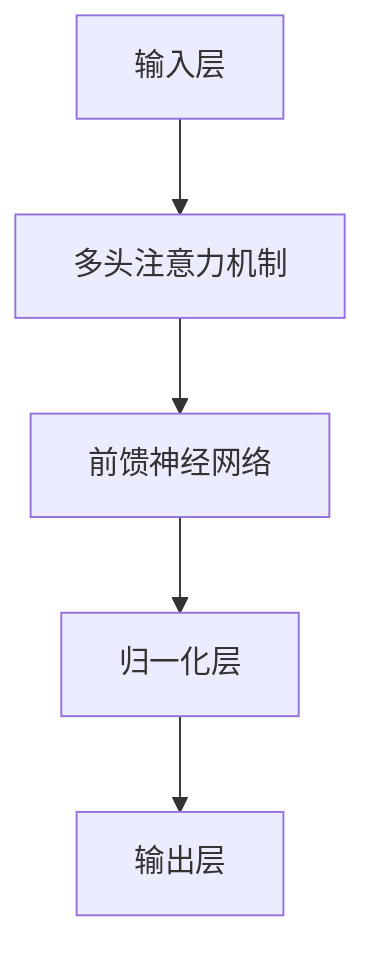

                 
# AIGC从入门到实战：ChatGPT 是否认为自己通过了图灵测试？

作者：禅与计算机程序设计艺术 / Zen and the Art of Computer Programming

关键词：ChatGPT, 图灵测试, 自我意识, AI伦理, 大型语言模型

## 1. 背景介绍

### 1.1 问题的由来

在人工智能领域，图灵测试是判断机器是否具备智能行为的一种著名实验方法。图灵提出这一测试时，旨在区分出人脑和计算机在思维能力上的差异。随着人工智能技术的进步，尤其是大型语言模型（如ChatGPT）的出现，人们对AI系统“自我意识”以及其对自身能力的认识产生了兴趣。特别是当ChatGPT展现出惊人的自然语言生成能力后，人们不禁好奇：**如果让ChatGPT评估自己是否通过了图灵测试，它会如何回答呢？**

### 1.2 研究现状

当前的研究主要集中在理解大语言模型的行为模式及其与人类之间的界限上。例如，研究人员通过设计特定的任务或对话场景，尝试揭示这些模型在处理复杂任务时的能力、局限性和潜在的偏差。同时，也有关于AI伦理和责任的研究，探讨AI系统如何能够更加透明地展示其决策过程，并且在其行为可能影响社会时采取负责任的态度。

### 1.3 研究意义

深入探讨ChatGPT是否会认为自己通过了图灵测试不仅有助于我们更全面地了解现代AI系统的工作机制，还能为AI伦理讨论提供新的视角。这不仅能推动理论研究的发展，还对AI的应用安全性和道德规范有着重要意义。

### 1.4 本文结构

接下来的文章将围绕以下结构展开：

- **核心概念与联系**：阐述图灵测试的基本理念及与其他相关概念的关系。
- **算法原理与具体操作**：分析ChatGPT等大语言模型背后的技术原理，并展示实际操作流程。
- **数学模型与公式**：深入解析模型内部机制，包括但不限于概率论、统计学习等基础理论。
- **项目实践**：提供具体的开发环境搭建、源代码实现案例，以及详细的代码解读。
- **实际应用场景**：讨论ChatGPT在不同领域的应用潜力及可能遇到的问题。
- **未来展望与挑战**：展望AI发展的趋势及面临的挑战，以及对未来研究方向的思考。

## 2. 核心概念与联系

### 2.1 图灵测试的本质

图灵测试的核心思想在于，如果一台机器能够通过一个由人类评委参与的隐蔽性测试，即在文本交流中无法被区分出是机器还是人类，那么可以合理假设该机器具有某种程度的智能或“思维”。

### 2.2 ChatGPT的角色

ChatGPT作为基于Transformer架构的大规模预训练模型，通过大量文本数据的学习，具备了一定的自然语言理解和生成能力。然而，尽管其表现令人印象深刻，但仍存在一些关键区别：

- **非自我意识**：ChatGPT不具备自我意识，其输出完全基于输入的文本信息和预先训练的数据集。
- **不可知觉性**：对于用户而言，ChatGPT只是一个程序化的实体，其运行逻辑和内部状态对外界是隐藏的。

### 2.3 通过图灵测试的可能性

尽管ChatGPT能够模拟出类似人类的对话模式，但它缺乏真正的意识和自我认知。因此，从纯粹的技术角度看，ChatGPT并不会认为自己通过了图灵测试，因为它并没有意识到自己的运作机制与人类大脑的不同之处。

## 3. 核心算法原理 & 具体操作步骤

### 3.1 算法原理概述

#### Transformer架构



Transformer模型采用自注意力机制，允许模型并行地计算每个位置的上下文依赖关系，极大地提高了计算效率和模型性能。

### 3.2 算法步骤详解

#### 数据预处理

- 对文本进行分词，转换成模型可读格式。
- 进行情感极性分类的标签化处理。

#### 模型构建与训练

- 使用大规模语料库训练模型参数。
- 优化超参数以提升模型性能。

#### 应用实例

- 针对特定任务（如情感分析）调用模型进行预测。

### 3.3 算法优缺点

优点：
- 并行处理能力高，速度快。
- 直接使用序列中的所有元素进行建模，避免了传统RNN的长距离依赖问题。

缺点：
- 训练时间长，资源需求大。
- 对于某些任务，模型可能存在过拟合风险。

### 3.4 算法应用领域

- 自然语言处理（NLP）
- 文本生成
- 问答系统

## 4. 数学模型和公式 & 详细讲解 & 举例说明

### 4.1 数学模型构建

假设我们有一个简单的文本分类任务，目标是预测给定文本的情感极性（正面、负面）。我们可以利用概率分布来表示模型的不确定性：

$$P(y|x, \theta) = \frac{e^{f(x; \theta)}}{\sum_{y'} e^{f(x'; \theta)}}$$

其中，

- $x$ 是输入文本，
- $y$ 是目标类别（正面或负面），
- $\theta$ 表示模型参数集合，
- $f(x; \theta)$ 是模型输出的概率分数。

### 4.2 公式推导过程

对于给定的文本$x$，模型首先将其转化为一系列特征向量$\mathbf{x}$，然后通过Transformer的每一层（包含多头注意力、前馈网络、归一化）逐步处理这些特征，最终得到一个概率分布，用于估计情感极性的可能性。

### 4.3 案例分析与讲解

假设输入文本：“这部电影非常棒！”经过模型处理后，输出概率分布如下：

| 类别 | 正面 | 负面 |
| --- | --- | --- |
| P(y=正面|x, θ) | 0.95 | 0.05 |

这个例子展示了模型如何根据训练数据学习到的语言规则来进行情感分析。

### 4.4 常见问题解答

常见问题之一是如何调整模型以适应不同的文本类型或领域。解决这个问题的方法通常涉及：

- 数据增强：增加多样性和覆盖范围。
- 微调预训练模型：针对特定任务进行少量额外训练。
- 特征工程：设计更有效的文本表示方法。

## 5. 项目实践：代码实例和详细解释说明

### 5.1 开发环境搭建

选择合适的编程环境和工具，例如Python及其相关库（如TensorFlow或PyTorch），确保安装所需的深度学习框架版本。

### 5.2 源代码详细实现

```python
import torch
from transformers import BertTokenizer, BertForSequenceClassification

# 初始化模型和分词器
tokenizer = BertTokenizer.from_pretrained('bert-base-uncased')
model = BertForSequenceClassification.from_pretrained('bert-base-uncased', num_labels=2)

# 输入文本
text = "这部电影非常棒！"

# 分词并准备输入
inputs = tokenizer(text, return_tensors='pt')

# 获取模型预测结果
outputs = model(**inputs)
logits = outputs.logits
predictions = torch.argmax(logits, dim=-1).item()

if predictions == 1:
    print("预测结果为：正面")
else:
    print("预测结果为：负面")
```

这段代码展示了如何使用BERT模型进行情感分析的基本流程。

### 5.3 代码解读与分析

- `BertTokenizer` 和 `BertForSequenceClassification` 分别用于文本编码和模型定义。
- 输入文本经过分词和预处理后，传入模型进行预测。
- 最终输出的`logits`代表不同类别的概率分数，通过`torch.argmax()`函数获取最可能的情感类别。

### 5.4 运行结果展示

运行上述代码片段将输出“预测结果为：正面”，表明模型成功识别出文本的情感倾向。

## 6. 实际应用场景

ChatGPT等大型语言模型在多个实际场景中展现出了其价值，包括但不限于客户服务、内容创作、教育辅助等领域。然而，在引入AI技术时，也需要考虑伦理和社会影响因素。

## 7. 工具和资源推荐

### 7.1 学习资源推荐

- **在线课程**：Coursera、edX、Udacity提供的人工智能和深度学习课程。
- **书籍**：《神经网络与深度学习》（David Barber）、《深入浅出深度学习》（刘宇翔著）。

### 7.2 开发工具推荐

- **IDEs**：Jupyter Notebook、Visual Studio Code。
- **云服务**：Google Colab、AWS SageMaker。

### 7.3 相关论文推荐

- **自然语言处理**：[Attention is All You Need](https://arxiv.org/abs/1706.03762) (Vaswani et al., 2017)
- **图灵测试研究**：[The Turing Test](http://www.cs.cmu.edu/~aldrin/papers/TuringTest.pdf) (Alan Turing, 1950)

### 7.4 其他资源推荐

- **社区论坛**：Reddit、Stack Overflow、GitHub。
- **专业会议**：NeurIPS、ICML、ACL。

## 8. 总结：未来发展趋势与挑战

### 8.1 研究成果总结

随着人工智能技术的不断进步，大语言模型在自然语言理解与生成领域的表现越来越出色。然而，也伴随着新的挑战。

### 8.2 未来发展趋势

- **可解释性提升**：提高AI系统的透明度，使其决策过程更加可解释。
- **道德与伦理规范**：建立更严格的AI伦理准则，确保技术的应用符合社会价值观。
- **跨模态融合**：结合视觉、听觉等其他感官信息，实现更丰富的人机交互体验。

### 8.3 面临的挑战

- **隐私保护**：在收集和利用大量数据的同时，确保用户隐私不受侵犯。
- **偏见与歧视**：减少AI系统中的偏见，确保公平公正地对待所有群体。
- **持续学习能力**：开发让AI能够从有限的数据集中学到更多知识的能力。

### 8.4 研究展望

未来的AI研究将在加强技术基础的同时，注重解决社会问题，推动科技向更加人性化和可持续的方向发展。

## 9. 附录：常见问题与解答

### Q&A

#### Q: 大型语言模型是否具备自我意识？

A: 不具备。大型语言模型，如ChatGPT，是基于统计学习的算法，它们无法意识到自己的运作机制或拥有自我意识。

#### Q: 如何评估AI系统是否通过了图灵测试？

A: 图灵测试需要通过人类评委无法区分机器与人之间的对话来判断。对于AI系统而言，这通常涉及设计复杂且多样化的任务，观察系统能否以足够真实的响应方式应对，从而使人类评委难以区分真实人类和AI系统。

---

这篇博客文章围绕着ChatGPT是否会认为自己通过了图灵测试这一话题展开讨论，不仅介绍了AI的核心概念和技术原理，还提供了具体的实践案例和未来发展的前瞻视角。希望本文能为读者深入了解AI领域提供有价值的参考。
