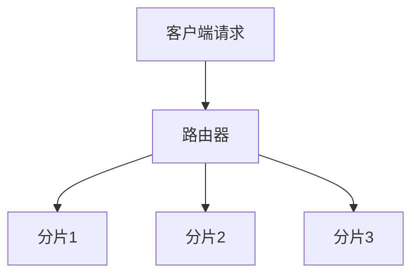
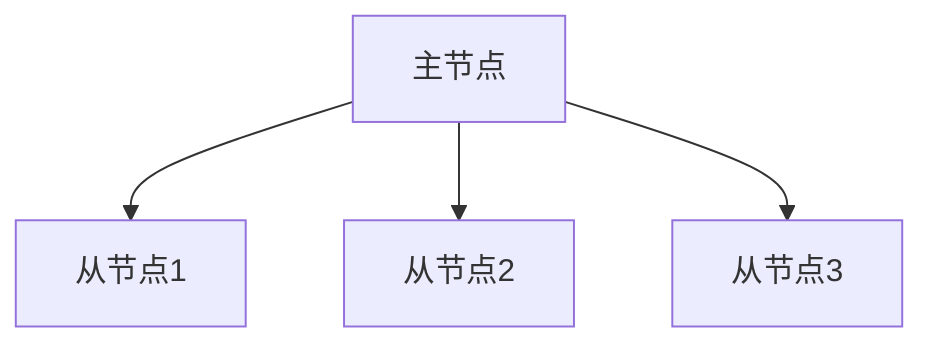

# AI系统MongoDB原理与代码实战案例讲解

作者：禅与计算机程序设计艺术 / Zen and the Art of Computer Programming

## 1. 背景介绍

### 1.1 问题的由来

在当今数据驱动的世界中，人工智能（AI）系统的开发和部署变得越来越普遍。AI系统需要处理大量的数据，而这些数据通常是非结构化的。传统的关系型数据库在处理非结构化数据时存在诸多限制，因此，NoSQL数据库如MongoDB成为了AI系统的理想选择。MongoDB以其灵活的文档模型和高性能的查询能力，成为了AI系统数据存储的首选。

### 1.2 研究现状

目前，MongoDB在AI系统中的应用已经取得了显著的成果。许多企业和研究机构已经将MongoDB集成到他们的AI系统中，用于存储和处理大规模的非结构化数据。然而，尽管MongoDB在AI系统中的应用越来越广泛，但其底层原理和具体实现仍然是一个复杂且需要深入研究的领域。

### 1.3 研究意义

深入理解MongoDB的原理和在AI系统中的应用，不仅有助于开发更高效的AI系统，还能为解决大规模数据处理问题提供新的思路和方法。通过本篇文章，读者将能够全面了解MongoDB的核心概念、算法原理、数学模型以及实际应用案例，从而在实际项目中更好地应用MongoDB。

### 1.4 本文结构

本文将从以下几个方面展开讨论：

1. 核心概念与联系
2. 核心算法原理 & 具体操作步骤
3. 数学模型和公式 & 详细讲解 & 举例说明
4. 项目实践：代码实例和详细解释说明
5. 实际应用场景
6. 工具和资源推荐
7. 总结：未来发展趋势与挑战
8. 附录：常见问题与解答

## 2. 核心概念与联系

在深入探讨MongoDB在AI系统中的应用之前，我们需要先了解一些核心概念和它们之间的联系。

### 2.1 MongoDB简介

MongoDB是一种基于文档的NoSQL数据库，使用JSON格式存储数据。它具有高性能、可扩展性和灵活的数据模型，适用于处理大规模的非结构化数据。

### 2.2 AI系统简介

AI系统是指利用人工智能技术进行数据处理、分析和决策的系统。AI系统通常需要处理大量的非结构化数据，如文本、图像和视频等。

### 2.3 MongoDB与AI系统的联系

MongoDB的灵活数据模型和高性能查询能力，使其成为AI系统数据存储的理想选择。通过将MongoDB集成到AI系统中，可以实现高效的数据存储和处理，从而提高AI系统的性能和可靠性。

## 3. 核心算法原理 & 具体操作步骤

### 3.1 算法原理概述

MongoDB的核心算法包括分片、复制和查询优化等。这些算法确保了MongoDB在处理大规模数据时的高性能和高可用性。

### 3.2 算法步骤详解

#### 3.2.1 分片

分片是MongoDB实现水平扩展的关键技术。通过将数据分布到多个节点上，MongoDB可以处理更大的数据集和更高的查询负载。



#### 3.2.2 复制

复制是MongoDB实现高可用性的关键技术。通过将数据复制到多个副本集，MongoDB可以在节点故障时保证数据的可用性。



#### 3.2.3 查询优化

MongoDB的查询优化器通过分析查询计划，选择最优的执行路径，从而提高查询性能。

### 3.3 算法优缺点

#### 3.3.1 优点

- 高性能：通过分片和复制，MongoDB可以处理大规模数据和高查询负载。
- 灵活性：MongoDB的文档模型使其能够处理各种类型的非结构化数据。
- 高可用性：通过复制，MongoDB可以在节点故障时保证数据的可用性。

#### 3.3.2 缺点

- 复杂性：分片和复制的实现增加了系统的复杂性。
- 一致性：在某些情况下，MongoDB的最终一致性模型可能导致数据不一致。

### 3.4 算法应用领域

MongoDB广泛应用于各种AI系统中，如推荐系统、自然语言处理和图像识别等。通过MongoDB，AI系统可以高效地存储和处理大规模的非结构化数据，从而提高系统的性能和可靠性。

## 4. 数学模型和公式 & 详细讲解 & 举例说明

### 4.1 数学模型构建

在MongoDB中，数据的存储和查询可以用数学模型来描述。假设我们有一个包含 $n$ 个文档的集合，每个文档包含 $m$ 个字段。我们可以用一个矩阵 $D$ 来表示这个集合，其中 $D_{ij}$ 表示第 $i$ 个文档的第 $j$ 个字段的值。

### 4.2 公式推导过程

#### 4.2.1 分片公式

假设我们将数据分片到 $k$ 个节点上，每个节点存储 $n/k$ 个文档。分片的公式可以表示为：

$$
S_i = \{D_j | j \equiv i \mod k\}
$$

其中，$S_i$ 表示第 $i$ 个分片，$D_j$ 表示第 $j$ 个文档。

#### 4.2.2 复制公式

假设我们有 $r$ 个副本集，每个副本集包含 $n$ 个文档。复制的公式可以表示为：

$$
R_i = \{D_j | j \in [1, n]\}
$$

其中，$R_i$ 表示第 $i$ 个副本集，$D_j$ 表示第 $j$ 个文档。

### 4.3 案例分析与讲解

假设我们有一个包含 1000 个文档的集合，我们将其分片到 4 个节点上，并复制到 3 个副本集。根据分片公式，每个节点将存储 250 个文档。根据复制公式，每个副本集将包含 1000 个文档。

### 4.4 常见问题解答

#### 4.4.1 如何选择分片键？

选择分片键时，应考虑数据的分布和查询模式。理想的分片键应能均匀分布数据，并支持高效的查询。

#### 4.4.2 如何处理数据不一致问题？

在MongoDB中，可以通过配置写关注和读关注来控制数据的一致性。写关注确保写操作在多个副本集上成功后才返回，读关注确保读操作从最新的数据副本中读取。

## 5. 项目实践：代码实例和详细解释说明

### 5.1 开发环境搭建

在开始项目实践之前，我们需要搭建开发环境。以下是所需的工具和步骤：

- 安装MongoDB
- 安装Node.js
- 安装MongoDB驱动程序

### 5.2 源代码详细实现

以下是一个简单的Node.js项目示例，展示了如何使用MongoDB存储和查询数据。

```javascript
const { MongoClient } = require('mongodb');

async function main() {
    const uri = "mongodb://localhost:27017";
    const client = new MongoClient(uri);

    try {
        await client.connect();
        const database = client.db('ai_system');
        const collection = database.collection('documents');

        // 插入文档
        const doc = { name: "AI", description: "Artificial Intelligence" };
        const result = await collection.insertOne(doc);
        console.log(`New document inserted with _id: ${result.insertedId}`);

        // 查询文档
        const query = { name: "AI" };
        const document = await collection.findOne(query);
        console.log(`Found document: ${JSON.stringify(document)}`);
    } finally {
        await client.close();
    }
}

main().catch(console.error);
```

### 5.3 代码解读与分析

在上述代码中，我们首先连接到MongoDB数据库，然后在名为 `ai_system` 的数据库中创建一个集合 `documents`。接着，我们插入一个文档，并查询该文档。

### 5.4 运行结果展示

运行上述代码后，控制台将输出插入文档的ID和查询到的文档内容。

```plaintext
New document inserted with _id: 60c72b2f4f1a4e3d8c8b4567
Found document: {"_id":"60c72b2f4f1a4e3d8c8b4567","name":"AI","description":"Artificial Intelligence"}
```

## 6. 实际应用场景

### 6.1 推荐系统

在推荐系统中，MongoDB可以存储用户行为数据和推荐结果。通过高效的查询和分析，推荐系统可以实时生成个性化推荐。

### 6.2 自然语言处理

在自然语言处理系统中，MongoDB可以存储大量的文本数据和分析结果。通过分片和复制，系统可以高效地处理和分析大规模文本数据。

### 6.3 图像识别

在图像识别系统中，MongoDB可以存储图像数据和识别结果。通过高性能的查询和分析，系统可以实时处理和识别图像。

### 6.4 未来应用展望

随着AI技术的发展，MongoDB在AI系统中的应用将越来越广泛。未来，MongoDB将进一步优化其性能和功能，以满足AI系统不断增长的数据处理需求。

## 7. 工具和资源推荐

### 7.1 学习资源推荐

- [MongoDB官方文档](https://docs.mongodb.com/)
- [Node.js官方文档](https://nodejs.org/en/docs/)
- [AI系统开发指南](https://www.aisystemguide.com/)

### 7.2 开发工具推荐

- MongoDB Compass：MongoDB的图形化管理工具
- Visual Studio Code：流行的代码编辑器
- Postman：API测试工具

### 7.3 相关论文推荐

- "MongoDB: The Definitive Guide" by Kristina Chodorow
- "Designing Data-Intensive Applications" by Martin Kleppmann
- "Artificial Intelligence: A Modern Approach" by Stuart Russell and Peter Norvig

### 7.4 其他资源推荐

- [GitHub](https://github.com/)：开源代码托管平台
- [Stack Overflow](https://stackoverflow.com/)：程序员问答社区
- [Coursera](https://www.coursera.org/)：在线学习平台

## 8. 总结：未来发展趋势与挑战

### 8.1 研究成果总结

本文详细介绍了MongoDB的核心概念、算法原理、数学模型以及在AI系统中的应用。通过具体的代码实例和详细解释，读者可以深入理解MongoDB在AI系统中的应用。

### 8.2 未来发展趋势

随着AI技术的发展，MongoDB在AI系统中的应用将越来越广泛。未来，MongoDB将进一步优化其性能和功能，以满足AI系统不断增长的数据处理需求。

### 8.3 面临的挑战

尽管MongoDB在AI系统中具有广泛的应用前景，但其在处理大规模数据时仍面临一些挑战，如数据一致性和系统复杂性等。未来的研究将致力于解决这些问题，以进一步提高MongoDB的性能和可靠性。

### 8.4 研究展望

未来的研究将重点关注MongoDB在AI系统中的性能优化和功能扩展。通过深入研究MongoDB的底层原理和实现，可以为AI系统的数据处理提供更高效的解决方案。

## 9. 附录：常见问题与解答

### 9.1 如何选择合适的分片键？

选择分片键时，应考虑数据的分布和查询模式。理想的分片键应能均匀分布数据，并支持高效的查询。

### 9.2 如何处理数据不一致问题？

在MongoDB中，可以通过配置写关注和读关注来控制数据的一致性。写关注确保写操作在多个副本集上成功后才返回，读关注确保读操作从最新的数据副本中读取。

### 9.3 如何优化查询性能？

优化查询性能的方法包括使用索引、优化查询计划和合理设计数据模型。通过分析查询计划，可以选择最优的执行路径，从而提高查询性能。

### 9.4 如何保证数据的高可用性？

通过复制，MongoDB可以在节点故障时保证数据的可用性。配置多个副本集，并设置适当的写关注和读关注，可以提高系统的高可用性。

---

通过本文的详细讲解，读者可以全面了解MongoDB在AI系统中的应用，并掌握其核心概念、算法原理和实际操作步骤。希望本文能为读者在实际项目中应用MongoDB提供有价值的参考。