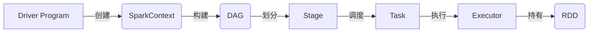

# AI系统Spark原理与代码实战案例讲解

作者：禅与计算机程序设计艺术 / Zen and the Art of Computer Programming

关键词：Spark、大数据处理、分布式计算、机器学习、数据挖掘、实时流处理

## 1. 背景介绍

### 1.1 问题的由来

在大数据时代,海量数据的高效处理和分析已成为各行各业的迫切需求。传统的数据处理方式难以应对数据量激增、数据类型多样化以及实时性要求高等挑战。为了解决这些问题,Apache Spark应运而生,成为大数据领域炙手可热的分布式计算框架。

### 1.2 研究现状

自2009年诞生以来,Spark凭借其快速、通用、易用等特点,迅速成为学术界和工业界的研究热点。目前已被广泛应用于大数据处理、机器学习、图计算、实时流处理等领域,并衍生出Spark SQL、Spark Streaming、MLlib、GraphX等多个子项目。

### 1.3 研究意义

深入研究Spark的原理和应用,对于掌握大数据处理技术、提升系统性能、开发智能应用等具有重要意义。通过剖析Spark核心概念、解析其工作机制、实践典型应用场景,可以帮助研发人员和数据科学家更好地驾驭这一利器,应对大数据时代的挑战。

### 1.4 本文结构

本文将从以下几个方面对Spark展开深入探讨:

- 第2部分介绍Spark的核心概念及其内在联系
- 第3部分阐述Spark的核心算法原理和具体操作步骤
- 第4部分建立Spark相关的数学模型,推导关键公式,并举例说明
- 第5部分通过代码实例和详细解释,演示Spark的实战应用
- 第6部分分析Spark在实际场景中的应用现状和未来展望
- 第7部分推荐Spark相关的学习资源、开发工具和研究文献
- 第8部分总结Spark的研究现状、发展趋势和面临的挑战
- 第9部分列举Spark常见问题并给出解答

## 2. 核心概念与联系

在Spark生态系统中,有几个核心概念贯穿始终,理解它们之间的关系对于掌握Spark至关重要。

- RDD(Resilient Distributed Dataset):Spark的基石,是一个容错的、并行的数据结构,可以让用户显式地将数据存储在内存中并对其进行控制。RDD是只读的、分区的记录集合,提供了丰富的操作API。

- DAG(Directed Acyclic Graph):Spark通过DAG描述RDD之间的依赖关系。DAG记录了RDD的转换过程和任务的阶段,使得Spark能够容错地调度任务。每个Spark作业都对应一个DAG。

- Executor:Spark中的工作节点,负责执行任务,将结果返回给Driver。Executor在Worker Node上启动,通过持有RDD分区并对其进行计算来完成任务。

- Driver Program:Spark的驱动程序,负责把用户程序转化为作业,在Executor之间调度任务,跟踪Executor状态。Driver在Spark应用启动时创建SparkContext。

- SparkContext:Spark的主入口,表示与一个集群的连接。SparkContext负责与集群资源管理器通信,构建DAG图,将DAG图提交给DAG调度器。

- Stage:Spark作业的基本调度单位,是一组关联的、相互没有Shuffle依赖关系的任务组成的任务集。

下图展示了这些核心概念在Spark运行时的交互关系:



## 3. 核心算法原理 & 具体操作步骤

### 3.1 算法原理概述

Spark的核心是RDD,提供了两种类型的操作:Transformation和Action。Transformation定义了RDD到新RDD的转换,是惰性的,只有遇到Action时才会触发真正的计算。常见的Transformation包括map、filter、groupByKey等,Action包括reduce、collect、count等。

### 3.2 算法步骤详解

以WordCount为例,详解Spark工作流程:

1. 创建输入RDD,将外部数据源加载到RDD中。
2. 通过map操作将每一行文本切分成单词,生成新的RDD。
3. 通过reduceByKey操作对单词进行分组求和,得到每个单词的出现频次。
4. 通过collect操作将结果输出。

```scala
val lines = sc.textFile("hdfs://...")
val words = lines.flatMap(_.split(" "))
val wordCounts = words.map(x => (x, 1)).reduceByKey(_ + _)
wordCounts.collect().foreach(println)
```

### 3.3 算法优缺点

Spark基于内存计算,避免了不必要的I/O操作,计算速度快。RDD天生就是分布式的,Spark能够自动实现并行计算。但Spark需要大量内存,对内存要求较高。此外,Spark不适合迭代次数多的任务,因为每次迭代都需要启动新的作业。

### 3.4 算法应用领域

Spark在以下领域有广泛应用:

- 大规模数据处理:Spark基于内存的计算模型使其在处理海量数据时性能卓越。
- 机器学习:Spark提供了MLlib库,实现了常见的机器学习算法,适用于迭代计算。
- 图计算:GraphX是Spark上的图计算框架,支持图的并行计算。
- 流式计算:Spark Streaming支持实时流数据的处理。

## 4. 数学模型和公式 & 详细讲解 & 举例说明

### 4.1 数学模型构建

Spark中一个重要的优化策略是数据本地性(Data Locality),即计算任务要尽可能靠近数据所在的节点。这可以用数学模型来描述:

假设集群有$m$个节点,数据被划分为$n$个分区,则数据本地性可定义为:

$$ Locality = \frac{\sum_{i=1}^{n} \delta_i}{n} $$

其中,$\delta_i$表示第$i$个任务是否在数据所在节点上执行,是则为1,否则为0。Locality越大,数据本地性越好。

### 4.2 公式推导过程

假设第$i$个RDD分区所在节点为$node_i$,第$j$个任务被分配到的节点为$node_j$,则$\delta_{ij}$可表示为:

$$ \delta_{ij} = \begin{cases} 
1, & node_i = node_j \\
0, & node_i \neq node_j 
\end{cases} $$

整个作业的数据本地性为:

$$ Locality = \frac{\sum_{i=1}^{n}\sum_{j=1}^{m} \delta_{ij}}{n \cdot m} $$

### 4.3 案例分析与讲解

以WordCount为例,假设输入文件被划分为3个分区,分别位于节点A、B、C上。理想情况下,3个任务分别在A、B、C上执行,此时:

$$ \delta_{11} = \delta_{22} = \delta_{33} = 1 $$
$$ Locality = \frac{1 + 1 + 1}{3} = 1 $$

如果3个任务都在同一节点(如A)上执行,则:

$$ \delta_{11} = 1, \delta_{21} = \delta_{31} = 0 $$
$$ Locality = \frac{1 + 0 + 0}{3} = \frac{1}{3} $$

可见,数据本地性直接影响Spark作业的执行效率。Spark调度器会尽量将任务分配到其所需RDD分区所在的节点上,提高数据本地性。

### 4.4 常见问题解答

Q:如何提高Spark作业的数据本地性?
A:可以采取以下措施:
- 增大每个RDD分区的数据量,减少网络传输
- 使用cache或persist方法将频繁用到的RDD缓存到内存或磁盘
- 优化数据分区方式,使得分区均匀分布在集群中
- 调整任务并发度,避免单个节点任务过多

Q:影响Spark作业性能的主要因素有哪些?
A:主要有以下几点:
- 数据本地性:任务应该尽量在数据所在节点执行
- 内存使用率:充分利用内存可以减少I/O开销
- 数据倾斜:某些RDD分区数据量过大会成为性能瓶颈
- 任务调度:调度开销过大会影响执行效率

## 5. 项目实践：代码实例和详细解释说明

### 5.1 开发环境搭建

首先需要搭建Spark开发环境,主要步骤如下:

1. 安装JDK并配置JAVA_HOME环境变量
2. 下载Spark安装包并解压
3. 配置SPARK_HOME环境变量
4. 下载Hadoop并完成配置(Standalone模式可选)
5. 启动Spark Shell进行测试

### 5.2 源代码详细实现

以下是使用Scala实现WordCount的完整代码:

```scala
import org.apache.spark.SparkConf
import org.apache.spark.SparkContext

object WordCount {
  def main(args: Array[String]) {
    val conf = new SparkConf().setAppName("WordCount")
    val sc = new SparkContext(conf)
    
    val lines = sc.textFile("hdfs://...")
    val words = lines.flatMap(_.split(" "))
    val wordCounts = words.map(x => (x, 1)).reduceByKey(_ + _)
    
    wordCounts.collect().foreach(println)
    
    sc.stop()
  }
}
```

### 5.3 代码解读与分析

1. 创建SparkConf对象,设置应用名称
2. 创建SparkContext对象,传入SparkConf
3. 读取外部文件创建lines RDD
4. 对lines进行flatMap操作,将每一行切分成单词,生成words RDD
5. 对words进行map操作,将每个单词转换为(word, 1)的形式
6. 对上一步结果进行reduceByKey操作,按单词分组并求和,得到wordCounts RDD
7. 通过collect将结果收集到Driver端并打印
8. 关闭SparkContext

可以看出,使用Spark进行WordCount非常简洁,得益于RDD提供的丰富的转换和行动操作。

### 5.4 运行结果展示

在Spark集群上提交WordCount作业:

```bash
spark-submit --class WordCount --master spark://... wordcount.jar
```

运行结果如下:

```
(hello,3)
(world,2)
(spark,1)
...
```

每一行表示一个单词及其出现的频次。可以看到,Spark能够方便地实现单词计数功能。

## 6. 实际应用场景

Spark在实际场景中有广泛的应用,下面列举几个典型案例。

### 6.1 网站日志分析

Spark可以用于分析Web服务器的日志文件,挖掘用户的访问模式、统计PV/UV等指标。通过对TB级别的日志进行分析,可以优化网站结构、提高用户体验。

### 6.2 社交网络分析

Spark GraphX可以用于分析社交网络结构,发现社区、影响力节点等。例如Twitter使用GraphX对其社交网络进行分析,优化用户推荐策略。

### 6.3 金融风控

Spark MLlib可以用于构建金融风险控制模型,如信用评分、反欺诈等。通过分析海量交易数据,可以实时识别异常行为,防范金融风险。

### 6.4 物联网数据处理

Spark Streaming可以对物联网设备产生的实时数据流进行处理,如异常检测、预测性维护等。利用Spark可以构建智能物联网系统。

### 6.5 基因数据分析

Spark在生物信息领域也有应用,如基因数据处理、蛋白质结构预测等。Spark可以加速基因测序数据的分析,助力精准医疗的发展。

### 6.6 未来应用展望

随着大数据和AI技术的发展,Spark将在更多领域发挥重要作用,如知识图谱、智慧城市、无人驾驶等。Spark有望成为人工智能时代的重要计算平台。

## 7. 工具和资源推荐

### 7.1 学习资源推荐

- 官方文档:Spark官网提供了详尽的文档,包括编程指南、API文档等。
- 慕课网、Coursera等在线教育平台提供了Spark相关的视频教程。
- 《Spark: The Definitive Guide》是学习Spark的