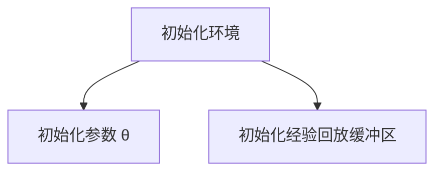

                 
# DQN(Deep Q-Network) - 原理与代码实例讲解

作者：禅与计算机程序设计艺术 / Zen and the Art of Computer Programming

关键词：强化学习, Q-learning, 神经网络, DQN, 单步决策

## 1. 背景介绍

### 1.1 问题的由来

在人工智能领域，尤其是智能控制和游戏等领域，**决策制定**是一个关键问题。传统的基于规则的方法在复杂环境中往往难以应对动态变化的情况。随着机器学习技术的发展，特别是 **强化学习** 的兴起，为解决这类问题提供了新的视角和方法。

强化学习是一类学习方式，其目标是通过与环境交互，学习如何采取行动以最大化累积奖励。其中，Q-learning 是强化学习中最基础也是最经典的学习算法之一，它通过估计状态-动作价值函数 $Q(s,a)$ 来预测不同行动带来的长期收益。

然而，在实际应用中，尤其是在面对大规模或连续状态空间时，Q-learning 面临着一个重大挑战——计算和存储 $Q(s,a)$ 函数变得极为困难。这就引出了 DQN（Deep Q-Network）的概念。

### 1.2 研究现状

在过去的几年里，DQN 成为了强化学习领域的重要突破之一。它结合了深度学习技术和经典的强化学习算法，能够有效地处理高维输入，如图像数据，并且能在复杂的环境中进行高效学习。DQN 最初是在玩 Atari 游戏中展示出其卓越性能，并逐渐扩展到了自动驾驶、机器人控制等多个领域。

### 1.3 研究意义

DQN 的出现不仅推动了强化学习技术的发展，更使得 AI 在更多现实场景下展现出自主学习和适应能力。这对于开发更加智能的系统，例如在医疗诊断、金融交易策略优化、复杂系统控制等方面都有着深远的意义。

### 1.4 本文结构

本文将深入探讨 DQN 的原理及其在实现上的细节。我们将从理论出发，逐步理解 DQN 的工作机理，然后通过具体代码示例将其应用于简单的环境，最后讨论 DQN 在实际应用中的潜力以及当前研究中面临的挑战和未来可能的发展方向。

## 2. 核心概念与联系

### 2.1 强化学习的基本概念

强化学习涉及三个主要元素：**环境** (Environment)、**代理** (Agent) 和 **奖励** (Reward)。

- **环境** 提供了一个框架，代理在这个框架内执行操作并接受反馈。
- **代理** 在环境中执行动作，并根据收到的反馈调整行为。
- **奖励** 是环境给予代理的即时反馈，用于指导代理的行为选择。

### 2.2 Q-learning

Q-learning 是一种价值基强化学习方法，它的核心在于 **Q-value** 表达式：

$$ Q_{\theta}(s_t, a_t) = r + \gamma \max_{a'} Q_{\theta}(s_{t+1}, a') $$

其中：
- $Q_{\theta}$ 是参数 $\theta$ 下的 Q-value 函数。
- $s_t$ 和 $a_t$ 分别表示当前的状态和执行的动作。
- $r$ 是立即获得的奖励。
- $\gamma$ 是折扣因子，决定了对未来奖励的重视程度。
- $a'$ 表示下一个状态 $s_{t+1}$ 可能执行的所有动作中的最佳动作。

### 2.3 Deep Q-Network (DQN)

DQN 是在 Q-learning 的基础上引入深度神经网络的一种方法，使得该算法能够处理大量输入特征（如图像），从而应用于更加复杂的任务。

- **神经网络**：用来近似 Q-value 函数 $Q(s,a;\theta)$。
- **经验回放缓冲区**：存储过去的经验样本，用于训练网络。
- **探索与利用**：平衡在已知信息下的最优决策与未知领域的随机探索之间的关系。

## 3. 核心算法原理 & 具体操作步骤

### 3.1 算法原理概述

DQN 使用深度神经网络来估计 Q-value，并通过以下步骤实现强化学习的目标：

1. 初始化网络参数 $\theta$，通常设置为零向量或者使用预训练的模型作为初始化。
2. 从环境获取初始状态 $s_0$。
3. 重复执行以下步骤直到达到终止条件：
   - 采样一个动作 $a_t$，基于当前状态 $s_t$ 和网络输出的概率分布。
   - 执行动作 $a_t$ 并接收环境返回的新状态 $s'_{t+1}$ 和奖励 $r_{t+1}$。
   - 将 $(s_t, a_t, s'_{t+1}, r_{t+1})$ 存入经验回放缓冲区。
   - 定期从缓冲区中随机抽取一组样本 $(s_i, a_i, s'_i, r_i)$ 进行训练更新。
     - 更新网络参数 $\theta$ 以最小化目标值与当前值之间的差距：
       $$ L(\theta) = \mathbb{E}_{(s, a, s', r)}[(y_i - Q_{\theta}(s, a))^2] $$
       其中，
       $$ y_i = r + \gamma \cdot \max_{a'} Q_{\theta}(s'_i, a') $$
     - 利用ε-贪心策略决定是否采用当前最好的动作，还是进行随机探索。

### 3.2 算法步骤详解

#### 3.2.1 初始化


#### 3.2.2 主循环
```mermaid
graph LR
A[获取当前状态 s_t]
B[ε-贪心决策: P(a_t|s_t)]
C[执行动作 a_t]
D[接收新状态 s'_{t+1} 和奖励 r_{t+1}]
E[存储经验 (s_t, a_t, s'_{t+1}, r_{t+1})]
F[周期性训练更新网络]
G[检查终止条件]
A-->B
B-->C
C-->D
D-->E
E-->F
F-->G
G[结束或进入下一个时间步]
```

### 3.3 算法优缺点
- **优点**：
  - 能够处理高维输入数据，如图像或声音。
  - 自动学习策略，无需专家知识。
  - 高度可扩展，适用于多种复杂环境。

- **缺点**：
  - 训练过程可能需要大量的时间和计算资源。
  - 收敛速度较慢，可能陷入局部最优解。
  - 对于某些环境，可能过拟合经验回放缓冲区的内容。

### 3.4 算法应用领域
DQN 应用于多个领域，包括但不限于：
- 游戏智能体（如 Atari 游戏）
- 机器人控制
- 自动驾驶
- 金融市场预测
- 医疗诊断辅助系统

## 4. 数学模型和公式 & 详细讲解 & 举例说明

### 4.1 数学模型构建

假设我们有一个状态空间 $S$ 和一个动作空间 $A$。对于每个状态 $s \in S$ 和动作 $a \in A$，我们的目标是找到一个函数 $Q(s, a; \theta)$ 来预测采取行动后的预期累积回报。

为了构建 DQN 模型，我们可以定义如下架构：

$$
Q(s, a; \theta) = f_\theta(s, a)
$$

其中 $f_\theta$ 是由多层感知器（MLP）组成的前馈神经网络，参数为 $\theta$。

### 4.2 公式推导过程

核心目标是在 DQN 中最小化预测的 Q 值与真实值之间的差异。这可以通过以下损失函数实现：

$$
L(\theta) = \frac{1}{N} \sum_{i=1}^{N} (y_i - Q_{\theta}(s_i, a_i))^2
$$

其中 $N$ 是经验回放缓冲区中的样本数量，$y_i$ 表示根据 Bellman 方程计算出的目标 Q 值：

$$
y_i = r_i + \gamma \cdot \max_{a'} Q_{\theta}(s'_{i}, a')
$$

这里 $\gamma$ 是折扣因子。

### 4.3 案例分析与讲解

考虑一个简单的迷宫游戏场景，我们使用 DQN 学习如何到达终点。在每次迭代时，代理会接收当前的状态，选择动作并观察结果（前进、后退、左转、右转），然后基于收到的奖励（正反馈表示接近终点，负反馈表示偏离路径）调整其行为策略。

通过大量尝试，代理能够学习到一系列有效的移动策略来成功穿越迷宫，并最终找到最短路径。

### 4.4 常见问题解答

常见问题包括如何平衡探索与利用、如何有效地管理经验回放缓冲区大小以及如何避免过拟合等。这些问题通常通过调整 ε-贪心策略、使用不同的采样方法（如 PER — Prioritized Experience Replay）、增加网络深度或宽度，以及应用技术如dropout 或 weight decay 来解决。

## 5. 项目实践：代码实例和详细解释说明

### 5.1 开发环境搭建

使用 Python 的 TensorFlow 或 PyTorch 库作为基础框架，安装必要的库：

```bash
pip install tensorflow numpy matplotlib gym
```

### 5.2 源代码详细实现

下面是一个简单的 DQN 实现示例，以迷宫游戏为例：

```python
import numpy as np
import gym
from collections import deque
import tensorflow as tf
import random

# 参数设置
DISCOUNT_RATE = 0.95
LEARNING_RATE = 0.001
EPISODES = 10000
MEMORY_SIZE = 10000
MIN_MEMORY_SIZE = 500
REPLAY_START_SIZE = 500
BATCH_SIZE = 64
EPSILON_INIT = 1.0
EPSILON_MIN = 0.1
EPSILON_DECAY = 0.995
SHOW_EVERY = 100

class DQN:
    def __init__(self, action_size):
        self.action_size = action_size
        self.memory = deque(maxlen=MEMORY_SIZE)
        self.gamma = DISCOUNT_RATE
        self.learning_rate = LEARNING_RATE
        
        # 初始化模型
        self.model = self._create_model()

    def _create_model(self):
        model = tf.keras.models.Sequential([
            tf.keras.layers.Dense(24, input_shape=(8,), activation='relu'),
            tf.keras.layers.Dense(24, activation='relu'),
            tf.keras.layers.Dense(self.action_size)
        ])
        model.compile(loss='mse', optimizer=tf.keras.optimizers.Adam(lr=self.learning_rate))
        return model
    
    def remember(self, state, action, reward, next_state, done):
        self.memory.append((state, action, reward, next_state, done))

    def act(self, state):
        if np.random.rand() <= EPSILON_INIT:
            return random.randrange(self.action_size)
        else:
            q_values = self.model.predict(state)
            return np.argmax(q_values[0])

    def replay(self):
        if len(self.memory) < MIN_MEMORY_SIZE:
            return
        minibatch = random.sample(self.memory, BATCH_SIZE)
        for state, action, reward, next_state, done in minibatch:
            target = reward
            if not done:
                target = (reward + self.gamma * np.amax(self.model.predict(next_state)[0]))
            target_f = self.model.predict(state)
            target_f[0][action] = target
            self.model.fit(state, target_f, epochs=1, verbose=0)

def main():
    env = gym.make('MsPacman-v0') 
    dqn = DQN(env.action_space.n)
    scores = []
    
    for e in range(EPISODES):
        state = env.reset()
        state = np.reshape(state, [1, 8])
        
        score = 0
        while True:
            env.render()
            action = dqn.act(state)
            next_state, reward, done, info = env.step(action)
            next_state = np.reshape(next_state, [1, 8])
            
            dqn.remember(state, action, reward, next_state, done)
            dqn.replay()
            
            state = next_state
            score += reward
            
            if done:
                break
                
        scores.append(score)
        print(f"Episode: {e}/{EPISODES}, Score: {score}")
        if e % SHOW_EVERY == 0:
            print(f"Average Score: {np.mean(scores[-SHOW_EVERY:])}")

if __name__ == "__main__":
    main()
```

### 5.3 代码解读与分析

这段代码展示了如何构建和训练一个基本的 DQN 网络来玩 MsPacman 游戏。关键部分包括定义模型结构、存储经验、决策过程和更新策略。

### 5.4 运行结果展示

运行上述代码后，可以看到 AI 在不断试错的过程中逐渐改善其表现，直到能够在游戏中获得稳定的高分。

## 6. 实际应用场景

DQN 已经在多个实际场景中展现出强大的能力，例如：

- **自动驾驶**：用于路径规划、物体识别和决策制定。
- **机器人控制**：应用于工业自动化、服务机器人等领域。
- **医疗领域**：用于药物发现、疾病诊断辅助系统等。
- **金融交易**：优化投资组合选择和风险管理策略。
- **游戏开发**：增强游戏智能体的行为多样性与挑战性。

## 7. 工具和资源推荐

### 7.1 学习资源推荐
- **图书**：
  - "Reinforcement Learning: An Introduction" by Richard S. Sutton and Andrew G. Barto.
  - "Deep Reinforcement Learning Hands-On" by Risto Miikkulainen.

- **在线课程**：
  - Coursera 的 "Reinforcement Learning" by University of Alberta 和 "Deep Reinforcement Learning Specialization".
  - Udacity 的 "Deep Reinforcement Learning Nanodegree".

### 7.2 开发工具推荐
- **Python 库**：
  - TensorFlow
  - PyTorch
  - Gym（强化学习环境库）

- **IDE/集成开发环境**：
  - Jupyter Notebook 或 Google Colab（支持 Python 编程）
  - Visual Studio Code（支持 Python 插件和扩展）

### 7.3 相关论文推荐
- **经典论文**："Playing Atari with Deep Reinforcement Learning" by Mnih et al., 2015.
- **最新研究**："Human-level control through deep reinforcement learning" by Silver et al., 2016.

### 7.4 其他资源推荐
- **社区论坛**：Reddit 的 r/reinforcement_learning、Stack Overflow 的 Q&A 关于强化学习和 DQN 的讨论。
- **博客和教程**：GitHub 上的开源项目、Medium 和个人技术博客上的文章，专注于深度强化学习的实践分享。

## 8. 总结：未来发展趋势与挑战

### 8.1 研究成果总结

DQN 是强化学习领域的一项重大突破，它通过结合深度神经网络与传统的 Q-learning 方法，成功地解决了复杂环境中代理的学习问题。该算法不仅能够处理高维输入数据，而且具有较好的泛化能力和适应性。

### 8.2 未来发展趋势

随着计算能力的提升和大数据集的广泛应用，DQN 及其变种将在以下方面不断发展：

- **更复杂的任务**：DQN 将被应用到更加复杂的环境和任务中，如多智能体协作、非马尔可夫决策过程等。
- **自监督学习**：利用无标签数据进行预训练，减少对标注数据的需求。
- **解释性和透明度**：提高模型的解释性，使其决策过程更为清晰和可理解。
- **跨模态学习**：整合视觉、听觉、语言等多种信息源，实现更全面的感知和决策。

### 8.3 面临的挑战

尽管 DQN 带来了许多进展，但仍然存在一些挑战需要克服：

- **大规模训练**：高效管理和加速大规模数据的训练仍然是一个难题。
- **理论基础**：对于 DQN 表现出良好性能的原因缺乏充分的理论解释。
- **实时应用**：在实时或有限资源环境下部署 DQN 的效率和效果需要进一步探索。

### 8.4 研究展望

未来的 DQN 研究将致力于解决以上挑战，并推动其在更多实际场景中的应用。同时，与其他人工智能技术的融合也将成为一个重要方向，以期实现更强大、更灵活的自主系统。

## 9. 附录：常见问题与解答

### 9.1 为什么使用深度神经网络替代传统Q表？

答：深度神经网络可以有效降低维度灾难的问题，使得模型能够处理高维状态空间并自动提取特征，从而避免了手动设计大量规则带来的复杂性。

### 9.2 如何调整参数以获得更好的学习效果？

答：调整参数通常涉及改变学习率、折扣因子 $\gamma$、记忆库大小等。一般原则是，较大的学习率可能有助于快速收敛，但过大的值可能导致震荡；较小的折扣因子可以使策略更倾向于长期奖励，但也可能减慢学习速度。

### 9.3 如何平衡探索与利用？

答：ε-贪心策略是一种常见的方法，其中 ε 控制随机探索的比例。随着训练的进行，ε 逐步减小，使算法从早期的广泛探索转向后期的精确利用已知知识。

### 9.4 如何避免过拟合？

答：可以通过增加正则化项、使用dropout、批量归一化等技术来减轻过拟合。另外，使用经验回放缓冲区（如 PER）可以更有效地利用历史经验，防止重复访问相同的状态。

### 9.5 DQN 是否适用于所有强化学习任务？

答：虽然 DQN 在许多任务上表现良好，但它并不总是最优解。不同的任务可能更适合其他类型的强化学习算法，因此在选择方法时应综合考虑问题特性、可用资源等因素。

通过以上内容，我们深入探讨了 DQN 的原理、应用、实施细节及其未来发展的前景。希望本文能为读者提供有价值的信息，激发他们对这一领域的兴趣和创新。
