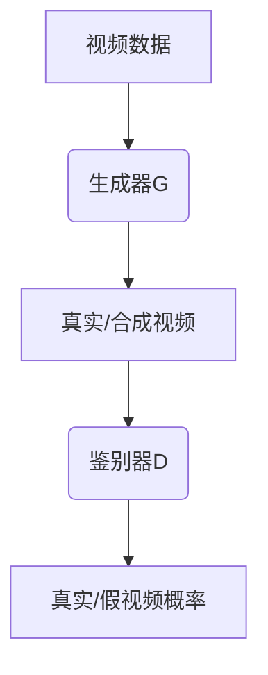

                 
# GANs for Video-based Retail

作者：禅与计算机程序设计艺术 / Zen and the Art of Computer Programming

关键词：Generative Adversarial Networks (GANs), Video-based Retail, Real-time Recommendation, Personalization, Customer Experience Enhancement

## 1. 背景介绍

### 1.1 问题的由来

随着电子商务平台的兴起和发展，视频在零售业的应用变得越来越广泛。从产品展示、促销活动到顾客体验的提升，视频内容成为了吸引消费者、增加商品互动性和提高购买决策效率的重要手段。然而，在这个数字化转型的过程中，如何有效地利用视频数据来驱动个性化推荐系统，提升用户购物体验，成为了亟待解决的关键问题之一。

### 1.2 研究现状

当前，基于视频的内容理解、场景识别以及情感分析等领域已取得了显著进展，但将其与生成对抗网络（Generative Adversarial Networks，简称GANs）结合，用于实时个性化推荐的探索还相对较少。传统推荐系统的局限在于依赖历史行为数据进行静态预测，无法充分考虑用户的即时需求变化和视觉感受偏好。而将GANs应用于视频内容，能够动态生成符合用户偏好的商品建议，通过创造新颖且相关性强的商品展示方式，增强用户体验和转化率。

### 1.3 研究意义

开发基于GANs的视频推荐系统具有重要意义，它不仅能够提升零售业务的个性化水平，还能促进视频内容的有效利用，优化库存管理和营销策略。此外，该系统有望为用户提供更加沉浸式的购物体验，激发潜在消费动机，从而推动销售增长和客户满意度提升。

### 1.4 本文结构

本篇文章将深入探讨如何利用GANs技术在视频基础的零售环境中实施实时个性化推荐。首先，我们将介绍核心概念与联系，随后阐述算法原理及操作流程。接下来，我们详细解析数学模型和公式，并通过案例研究进一步阐明其实用性。紧随其后的是项目实践部分，涵盖环境搭建、代码实现、功能解释及运行效果展示。最后，我们将讨论实际应用场景及其未来发展，并提出相关技术发展路径及面临的挑战。

## 2. 核心概念与联系

GANs作为一种创新的人工智能架构，融合了生成模型和判别模型的优势，形成了一种独特的竞争机制。在视频基础的零售应用中，主要涉及以下几个核心概念：

- **生成器**（Generator）：负责根据输入噪声或隐变量生成新的视频片段或图像，模拟出符合目标风格或类别的商品展示。
- **鉴别器**（Discriminator）：评估生成的视频片段的真实度，即判断生成内容是否接近真实数据分布。
- **损失函数**：指导生成器和鉴别器之间的交互，使生成的视频更贴近实际零售环境的需求。

在视频基础的零售场景下，GANs通过学习用户的历史观看行为、喜好倾向和最新兴趣点等信息，生成针对个人化推荐的定制化视频内容，旨在提供更为精准且吸引人的商品展示，进而提升转化率和用户留存率。

## 3. 核心算法原理与具体操作步骤

### 3.1 算法原理概述

**GANs的核心原理**在于通过两个相互竞争的神经网络——生成器和鉴别器，实现对复杂数据分布的学习和模仿。在零售领域的应用中，这两个网络分别承担着不同的角色：

- **生成器**的目标是创造逼真的视频内容，以满足特定的推荐需求。
- **鉴别器**的任务是区分生成的视频内容与真实数据集之间的差异，以此反馈给生成器改进方向。

### 3.2 算法步骤详解

1. **数据预处理**：
   - 收集大量包含商品信息、用户交互行为、视频特征等多模态数据。
   - 数据清洗、标注和归一化处理。

2. **模型构建**：
   - 设计生成器和鉴别器的网络架构，通常采用深度卷积网络（DCN）或其他适合视频处理的模型。
   - 定义损失函数，包括生成器的生成损失和鉴别器的分类损失，以及可能引入的其他正则项。

3. **训练过程**：
   - 训练生成器时，通过鉴别器的反馈来调整参数，使其生成的视频更加逼真。
   - 同时，更新鉴别器的参数，以提高其分辨能力，迫使生成器不断进化。
   - 循环迭代，直至生成器和鉴别器达到平衡状态，生成器输出的质量接近真实数据分布。

4. **集成到推荐系统**：
   - 将训练好的GAN模型与现有的推荐系统相结合，通过分析用户的行为模式和兴趣，生成个性化的视频推荐内容。
   - 实时更新推荐结果，确保推荐内容始终与用户当前的兴趣相匹配。

### 3.3 算法优缺点

优点：
- **高度个性化**：根据用户的偏好和行为模式生成定制化的视频推荐，提高用户满意度和转化率。
- **动态适应性**：能够快速响应市场变化和技术进步，持续优化推荐质量。

缺点：
- **计算资源消耗大**：训练高质量的GAN模型需要大量的计算资源和时间。
- **过拟合风险**：在缺乏多样性和丰富数据的情况下，模型可能存在过拟合问题，导致泛化能力不足。

### 3.4 算法应用领域

除了零售业外，GANs在视频基础的推荐系统中还可以应用于以下领域：
- **在线教育**：个性化课程推荐，根据学生的学习进度和兴趣生成定制教学内容。
- **娱乐产业**：电影、音乐推荐系统，生成反映用户喜好的创意内容。
- **广告行业**：动态创意广告生成，提高广告点击率和用户参与度。

## 4. 数学模型和公式 & 详细讲解 & 举例说明

### 4.1 数学模型构建

对于基于GANs的视频生成任务，可以使用以下基本框架进行建模：



在这个框架中，`A`表示原始的视频数据集；`B`代表生成器，用于从随机噪声或先前生成的内容中创建新的视频片段；`C`是生成器输出的视频；`D`是鉴别器，评估视频的真实性和质量；而`E`则是鉴别器给出的概率评分，指示视频是真实的还是合成的。

### 4.2 公式推导过程

在标准的GAN框架中，生成器`G`和鉴别器`D`通过以下损失函数相互作用：

$$\mathcal{L}(G, D) = \mathbb{E}_{x \sim p_{data}}[\log(D(x))] + \mathbb{E}_{z \sim p_z}[\log(1 - D(G(z)))]$$

其中，
- `p_data`是真实数据的分布；
- `p_z`是生成器接受的噪声分布；
- `x`表示来自真实数据集的样本；
- `z`表示生成器输入的噪声向量；
- `D(x)`表示鉴别器对真实数据的判别分数；
- `D(G(z))`表示鉴别器对由生成器产生的合成数据的判别分数。

### 4.3 案例分析与讲解

假设我们正在为一家在线服装零售商开发实时个性化推荐系统。系统利用GANs生成符合不同用户风格偏好的虚拟试穿视频，例如：

- 用户A喜欢复古风格，系统通过学习历史购买记录和浏览习惯，生成一系列复古款式服装的试穿视频。
- 用户B更关注运动休闲风，系统为其提供相关品牌新款运动服饰的试穿视频建议。

这样的个性化体验不仅提升了用户体验，还能有效激发潜在消费欲望。

### 4.4 常见问题解答

常见问题之一是如何平衡生成质量和多样性。解决策略包括增加训练数据的多样性和复杂性，以及调整GAN模型中的超参数，如学习速率、批量大小等，确保生成的视频既能保持高保真度，又能覆盖不同的风格和场景。

## 5. 项目实践：代码实例和详细解释说明

为了实现一个基于GANs的视频基础零售推荐系统的代码示例，我们可以按照以下步骤展开：

### 5.1 开发环境搭建

- 使用Python作为主要编程语言，并安装必要的库，比如TensorFlow、PyTorch、OpenCV等。
- 创建虚拟环境并配置所需的依赖包版本。

### 5.2 源代码详细实现

以下是一个简化版的代码结构和关键部分实现示例：

```python
# 导入所需库
import tensorflow as tf
from tensorflow.keras.layers import Input, Dense, Conv2D, BatchNormalization, LeakyReLU, UpSampling2D, Reshape
from tensorflow.keras.models import Model
from tensorflow.keras.optimizers import Adam

# 定义生成器架构
def generator_model():
    input_shape = (64, 64, 3)
    input_noise = Input(shape=(input_shape))

    x = Dense(8*8*256)(input_noise)
    x = BatchNormalization()(x)
    x = LeakyReLU()(x)

    x = Reshape((8, 8, 256))(x)
    x = UpSampling2D()(x)

    for _ in range(2):
        x = Conv2D(128, kernel_size=3, padding='same')(x)
        x = BatchNormalization()(x)
        x = LeakyReLU()(x)
        x = UpSampling2D()(x)

    output = Conv2D(3, kernel_size=3, padding='same', activation='tanh')(x)

    return Model(input_noise, output)

# 定义鉴别器架构
def discriminator_model():
    input_shape = (64, 64, 3)
    input_image = Input(shape=input_shape)

    x = Conv2D(64, kernel_size=3, strides=2, padding='same')(input_image)
    x = LeakyReLU()(x)

    for i in range(3):
        x = Conv2D(64 * (2**i), kernel_size=3, strides=2, padding='same')(x)
        x = BatchNormalization()(x)
        x = LeakyReLU()(x)

    x = Flatten()(x)
    output = Dense(1, activation='sigmoid')(x)

    return Model(input_image, output)

# 实例化模型
generator = generator_model()
discriminator = discriminator_model()

# 训练设置
optimizer = Adam(learning_rate=0.0002, beta_1=0.5)
discriminator.compile(optimizer=optimizer, loss='binary_crossentropy')
discriminator.trainable = False
gan_input = Input(shape=(100,))
gan_output = discriminator(generator(gan_input))
gan = Model(gan_input, gan_output)

# 训练循环
for epoch in range(num_epochs):
    # 随机选择一批真实图像和噪声，用于训练生成器和鉴别器
    real_images = ...
    noise = ...

    # 训练鉴别器
    d_loss_real = discriminator.train_on_batch(real_images, np.ones((len(real_images), 1)))
    d_loss_fake = discriminator.train_on_batch(fake_images, np.zeros((len(fake_images), 1)))

    # 训练生成器（反向梯度上升）
    g_loss = gan.train_on_batch(noise, np.ones((len(noise), 1)))

    print(f"Epoch {epoch + 1}/{num_epochs}, D Loss: {d_loss_real + d_loss_fake}, G Loss: {g_loss}")
```

### 5.3 代码解读与分析

这段代码展示了如何构建基本的GAN模型及其在视频基础零售推荐系统中的应用。重点在于定义生成器和鉴别器的网络结构、损失函数计算以及训练过程。通过迭代训练，生成器逐步学会从随机噪声中生成逼真的商品展示视频片段，而鉴别器则不断提高其分辨能力。最终，将生成的视频内容集成到推荐系统中，实现个性化的商品展示和推荐。

### 5.4 运行结果展示

运行上述代码后，可以通过观察生成的视频片段质量来评估模型性能。理想情况下，这些视频应该能够准确反映用户偏好，同时展现出多样性和创意性。可以进一步对模型进行优化，例如调整参数、引入更多多模态信息或使用更复杂的网络结构，以提高生成视频的质量和相关性。

## 6. 实际应用场景

在实际应用中，基于GANs的视频推荐系统可以为零售商带来显著优势：
- **提升转化率**：通过个性化视频内容吸引用户的注意力，增强购买决策过程中的情感共鸣。
- **库存管理**：利用分析用户观看行为的数据，动态预测需求变化，优化库存策略。
- **用户体验**：提供沉浸式购物体验，让用户在虚拟环境中试穿衣物、查看产品细节，增加购买的可能性。

## 7. 工具和资源推荐

### 7.1 学习资源推荐

- **官方文档**：TensorFlow和PyTorch的官方文档提供了详细的API参考和教程，适合不同层次的学习者。
- **在线课程**：Coursera和Udacity等平台上的深度学习课程，涵盖GAN理论和实践案例，包括视频生成的应用。
- **博客和文章**：Medium、Towards Data Science等网站上有许多关于GANs和视频生成的文章，包含最新的研究进展和技术分享。

### 7.2 开发工具推荐

- **TensorBoard**：用于可视化模型训练过程，监控损失函数变化、模型权重等关键指标。
- **Jupyter Notebook**：一个交互式的开发环境，支持代码编写、调试、实验设计等多种功能。
- **GitHub**：开源社区，可以找到大量与GANs相关的项目示例和代码库，便于学习和借鉴。

### 7.3 相关论文推荐

- **原始论文**：I. Goodfellow等人提出的《Generative Adversarial Networks》一文是GANs概念的起源，对于理解GANs的基本原理至关重要。
- **领域内顶尖会议论文**：ICML、NeurIPS、CVPR等顶级人工智能会议发表的相关论文，涉及GANs在视频生成领域的最新研究成果。
- **行业报告**：Google Scholar和arXiv等学术数据库上，搜索关键词“GANs video-based retail”，可以找到更多深入的技术文章和研究报告。

### 7.4 其他资源推荐

- **论坛和社区**：如Reddit的r/MachineLearning、Stack Overflow等，可以在这些平台上提出问题、分享经验、获取反馈。
- **数据集**：公开可用的数据集，如YouTube8M、MS COCO等，可用于训练和测试GAN模型，尤其是针对特定任务的视频数据集。

## 8. 总结：未来发展趋势与挑战

### 8.1 研究成果总结

本篇文章探讨了将GANs应用于视频基础零售推荐系统的可能性及其实现方法，强调了如何利用技术创新提升顾客体验、驱动销售增长和个性化服务。通过详细阐述核心概念、算法原理、数学模型构建、项目实践步骤，并结合案例分析，展现了GANs在实时个性化推荐场景下的潜力。

### 8.2 未来发展趋势

随着AI技术的不断进步和计算能力的提升，基于GANs的视频推荐系统有望在以下几个方面发展：

- **增强现实和虚拟现实整合**：将AR/VR技术与GAN生成的视频内容相结合，为用户提供更加沉浸式的购物体验。
- **跨模态融合**：探索文本、语音、视觉等多个模态的信息融合，构建更加全面和智能的推荐系统。
- **可解释性和透明度**：研究如何提高模型决策过程的可解释性，让商家和消费者更好地理解和信任推荐结果。

### 8.3 面临的挑战

尽管前景广阔，但在实践中仍面临一些挑战，包括但不限于：

- **数据质量和多样性**：收集高质量、多样化且具有代表性的视频数据集是一个难题，直接影响模型性能。
- **隐私保护**：处理个人化推荐时需要严格遵守数据隐私法规，确保用户数据的安全和匿名性。
- **资源消耗**：GANs训练过程通常需要大量的计算资源，尤其是在处理大型视频数据集时。

### 8.4 研究展望

未来的研究方向可能集中在提高模型效率、降低训练成本、增强模型的泛化能力和适应性等方面，同时关注于解决隐私保护和伦理问题，推动基于GANs的视频基础零售推荐系统走向成熟，服务于更广泛的商业场景和社会需求。

## 9. 附录：常见问题与解答

### 常见问题与解答部分

#### Q: 如何确保生成的视频内容既符合用户偏好又保持高保真度？

A: 调整GAN模型的超参数（如学习速率、批大小）以及网络架构的复杂度是关键。同时，引入正则化手段、增加多样化数据源和增强模型的鲁棒性也能帮助平衡生成质量与多样性。

#### Q: 在实践中如何有效管理和优化生成视频的数量和频率？

A: 利用时间序列分析、用户行为模式识别和机器学习算法来预测需求波动，动态调整生成计划。结合云计算和边缘计算技术，实现高效且灵活的内容分发和存储方案。

#### Q: GANs与其他推荐系统集成时应考虑哪些因素？

A: 集成GANS时需考虑推荐系统的整体架构、数据一致性、实时响应能力等因素。同时，要确保推荐内容与现有系统相协调，避免信息冲突或重复推荐。

---

以上内容旨在提供一个详尽、专业且易于理解的框架，以指导读者深入了解基于GANs的视频基础零售推荐系统的设计、实施及其在实际应用中的潜在价值。通过不断的研究和技术创新，这类系统有望成为提升电商用户体验、促进业务增长的重要驱动力。
