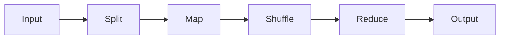

# MapReduce原理与代码实例讲解

作者：禅与计算机程序设计艺术 / Zen and the Art of Computer Programming 

关键词：MapReduce, 分布式计算, 大数据处理, Hadoop, 并行计算

## 1. 背景介绍
### 1.1 问题的由来
在大数据时代，数据量呈现爆炸式增长，传统的单机数据处理方式已经无法满足海量数据的计算需求。如何高效地处理海量数据成为了一个亟待解决的问题。Google公司在2004年提出了MapReduce编程模型，为大规模数据集的并行处理提供了一种全新的思路。
### 1.2 研究现状
MapReduce作为一种分布式计算框架，已经在工业界得到了广泛应用。众多互联网公司如Google、Yahoo、Facebook等都基于MapReduce构建了自己的大数据处理平台。Hadoop作为MapReduce的开源实现，更是成为了大数据领域事实上的标准。学术界对MapReduce的研究也非常活跃，众多改进和优化工作不断涌现。
### 1.3 研究意义
深入理解和掌握MapReduce编程模型，对于从事大数据处理相关工作的程序员、架构师和研究人员来说至关重要。一方面，MapReduce思想启发我们从分布式并行计算的角度来思考问题的解决方案；另一方面，基于MapReduce衍生出的各种大数据处理框架为海量数据的存储和计算提供了基础支撑。
### 1.4 本文结构
本文将从以下几个方面对MapReduce展开讨论：第2节介绍MapReduce的核心概念；第3节剖析MapReduce的工作原理和算法步骤；第4节给出MapReduce的数学模型；第5节通过具体的代码实例演示MapReduce编程；第6节总结MapReduce的实际应用场景；第7节推荐MapReduce相关的学习资源；第8节对MapReduce的研究现状和未来趋势进行总结展望。

## 2. 核心概念与联系
MapReduce是一种面向大规模数据处理的并行计算模型。它借鉴了函数式编程语言中的映射(Map)和归约(Reduce)操作，将大规模计算任务拆分成为一系列的Map和Reduce任务，并在分布式集群上并行执行。

MapReduce的核心概念包括：

- Map：对输入的数据集执行用户自定义的映射函数，将原始数据转化为中间结果形式的键值对。
- Reduce：对Map阶段输出的中间结果按照键进行分组，执行用户自定义的聚合函数，将相同键的值合并产生最终结果。
- Split：将输入数据划分为多个Split，每个Split由一个Map任务处理。Split granularity控制并行度。
- Shuffle：将Map阶段输出的中间结果按照键重新分区，保证相同键的数据会被分配到同一个Reduce任务处理。
- Combiner：在Map端对中间结果先做一次本地聚合，减少需要传输到Reduce端的数据量。
- Partition：控制中间结果键值对如何划分到不同的Reduce任务，默认采用hash分区。

下图展示了MapReduce编程模型的基本流程：



## 3. 核心算法原理 & 具体操作步骤
### 3.1 算法原理概述
MapReduce处理的是以键值对(key-value pair)形式组织的大规模数据集。整个计算过程分为Map阶段和Reduce阶段：

- Map阶段并行处理输入数据，执行用户自定义的map函数，将原始数据映射为中间结果形式的键值对。
- Reduce阶段对中间结果按照key进行分组，执行用户自定义的reduce函数，对相同key的value进行聚合，输出最终结果。

通过将复杂的运算拆解为Map和Reduce两个基本操作，并在分布式集群中大规模并行，MapReduce可以实现对海量数据的高效处理。

### 3.2 算法步骤详解
1. 输入数据被切分(split)成为多个分片，每个分片由一个Map任务处理。分片的多少决定了Map任务的并行度。
2. 对于每个输入分片，执行用户自定义的map函数，将原始记录(key-value pair)转化为中间结果形式的键值对并输出。
3. 通过分区函数将Map输出的中间结果按照key划分到不同的分区(partition)，每个分区对应一个Reduce任务。默认采用hash分区。
4. 在Shuffle阶段，Map端的中间结果被按照分区远程复制到Reduce端。这一过程通过HTTP协议实现。
5. Reduce端在所有Map任务完成后开始执行。每个Reduce任务读入属于自己的分区数据，按key进行排序。
6. 对于每个key，执行用户自定义的reduce函数，将该key对应的所有value聚合产生最终结果。Reduce输出的结果写回到分布式文件系统。
7. 所有Reduce任务完成后，整个MapReduce作业结束。最终结果保存在多个输出文件中。

### 3.3 算法优缺点
MapReduce的优点在于：

1. 良好的可扩展性。当数据量和集群规模增大时，可以方便地增加机器来提升计算能力。
2. 高容错性。当某个任务失败时，MapReduce框架可以自动将其调度到其他节点重新执行，不影响作业的完整性。
3. 适合海量数据的批处理。MapReduce为大规模数据的存储和计算提供了一套完整的解决方案。
4. 编程模型简单。用户只需实现map和reduce两个函数即可完成分布式计算，不用关心底层细节。

MapReduce的缺点包括：

1. 不适合实时计算。MapReduce是以批处理方式工作的，对于实时性要求高的场景并不适用。
2. 不适合迭代计算。对于机器学习等需要迭代优化的算法，MapReduce并不是最佳选择。
3. 编程受限。很多复杂的算法用MapReduce并不容易实现，需要数据转换和多轮MapReduce作业。

### 3.4 算法应用领域
MapReduce在众多领域得到了广泛应用，典型的应用场景包括：

- 搜索引擎中的网页排序、倒排索引构建
- 社交网络的好友推荐、社区发现
- 电商网站的用户行为分析、商品推荐
- 金融领域的风险模型训练、欺诈检测
- 生物信息学中的基因序列比对、新药筛选

总的来说，MapReduce适合数据可以切割、需要批量处理、对实时性要求不高的应用场景。

## 4. 数学模型和公式 & 详细讲解 & 举例说明
### 4.1 数学模型构建
我们可以用以下的数学语言来形式化描述MapReduce编程模型。设输入数据集为$D$，Map函数为$M$，Reduce函数为$R$。

$D$表示为一组键值对的集合：

$$D = \{(k_1, v_1), (k_2, v_2), ..., (k_n,v_n)\}$$

Map函数$M$定义为从$(k,v)$到$(k',v')$的一个映射：

$$M: (k,v) \rightarrow list(k',v')$$

Reduce函数$R$定义为从$(k',list(v'))$到$(k',v'')$的一个映射：

$$R: (k', list(v')) \rightarrow (k', v'')$$

其中$k'$为中间结果的key，$v''$为最终结果的value。

整个MapReduce处理流程可以表示为：

$$MapReduce(D) = \bigcup_{k'} R(k', \{v' | (k',v') \in M(D)\})$$

### 4.2 公式推导过程
我们来推导一下WordCount程序的数学表达式，加深对MapReduce数学模型的理解。WordCount是一个经典的MapReduce示例程序，用于统计文本文件中每个单词出现的次数。

设输入数据集$D$为一组文本行，每行表示为$(line\_no, line\_text)$。

Map函数$M_{wc}$将每行文本切分成单词，输出格式为$(word,1)$，表示该单词出现了1次：

$$M_{wc}: (line\_no, line\_text) \rightarrow list(word, 1)$$

Reduce函数$R_{wc}$对相同单词的计数值求和，得到每个单词的出现总次数：

$$R_{wc}: (word, list(1)) \rightarrow (word, \sum_{i=1}^{n}1)$$

WordCount的MapReduce流程可以表示为：

$$WordCount(D) = \bigcup_{word} R_{wc}(word, \{v | (word,v) \in M_{wc}(D)\})$$

最终输出结果为一组$(word, count)$对，表示每个单词及其出现的总次数。

### 4.3 案例分析与讲解
下面我们以WordCount为例，分析一下其MapReduce计算过程。设输入数据为以下三行文本：

```
(0, "hello world")
(1, "hello hadoop") 
(2, "hadoop mapreduce")
```

Map阶段的输出结果为：

```
(hello, 1)
(world, 1) 
(hello, 1)
(hadoop, 1)
(hadoop, 1) 
(mapreduce, 1)
```

Shuffle阶段将中间结果按照单词进行分组，发送给对应的Reducer：

```
(hello, [1, 1])
(world, [1])
(hadoop, [1, 1])
(mapreduce, [1]) 
```

Reduce阶段对每个单词的计数值求和，得到最终结果：

```
(hello, 2)
(world, 1)
(hadoop, 2) 
(mapreduce, 1)
```

可以看到，WordCount程序利用MapReduce模型，以并行的方式高效完成了单词计数的任务。文本数据集被切分成多个分片并行处理，充分利用了集群的计算资源。

### 4.4 常见问题解答
1. Map和Reduce函数能否接收多个输入？
Map函数只能接收单个键值对作为输入，但Reduce函数可以接收多个具有相同键的值作为输入。
2. Combiner与Reduce有何区别？
Combiner是在Map端对中间结果先做一次本地聚合，其输入输出类型必须与Reduce相同。Combiner可以减少需要传输的数据量，但不影响最终结果。
3. MapReduce支持哪些容错机制？
MapReduce会自动重新执行失败的任务；多个Reducer输出可避免单点失效；Mapper定期向Master汇报心跳信息，异常任务可被重新调度。
4. MapReduce适合处理什么样的数据？
MapReduce适合处理超大规模、无需随机访问、容易切分、数据一致性要求不高的数据集。典型如网页、日志等。

## 5. 项目实践：代码实例和详细解释说明
### 5.1 开发环境搭建
要运行MapReduce程序，需要搭建Hadoop开发环境。步骤如下：

1. 安装JDK，配置JAVA_HOME环境变量。
2. 下载Hadoop发行版，解压到本地目录。
3. 配置Hadoop环境变量，编辑`etc/hadoop/hadoop-env.sh`。
4. 配置`etc/hadoop/core-site.xml`，设置HDFS地址和端口。
5. 配置`etc/hadoop/hdfs-site.xml`，设置副本数、NameNode和DataNode目录等。
6. 配置`etc/hadoop/mapred-site.xml`，设置MapReduce框架为yarn。
7. 配置`etc/hadoop/yarn-site.xml`，设置ResourceManager和NodeManager的参数。
8. 启动Hadoop集群，执行`sbin/start-all.sh`。

### 5.2 源代码详细实现
下面给出WordCount程序的完整代码实现，基于Hadoop 2.x API：

```java
import java.io.IOException;
import java.util.StringTokenizer;
import org.apache.hadoop.conf.Configuration;
import org.apache.hadoop.fs.Path;
import org.apache.hadoop.io.IntWritable;
import org.apache.hadoop.io.Text;
import org.apache.hadoop.mapreduce.Job;
import org.apache.hadoop.mapreduce.Mapper;
import org.apache.hadoop.mapreduce.Reducer;
import org.apache.hadoop.mapreduce.lib.input.FileInputFormat;
import org.apache.hadoop.mapreduce.lib.output.FileOutputFormat;

public class WordCount {
    
  public static class TokenizerMapper extends Mapper<Object, Text, Text, IntWritable> {
    private final static IntWritable one = new IntWritable(1);
    private Text word = new Text();
      
    public void map(Object key, Text value, Context context) throws IOException, InterruptedException {
      StringTokenizer itr = new StringTokenizer(value.toString());
      while